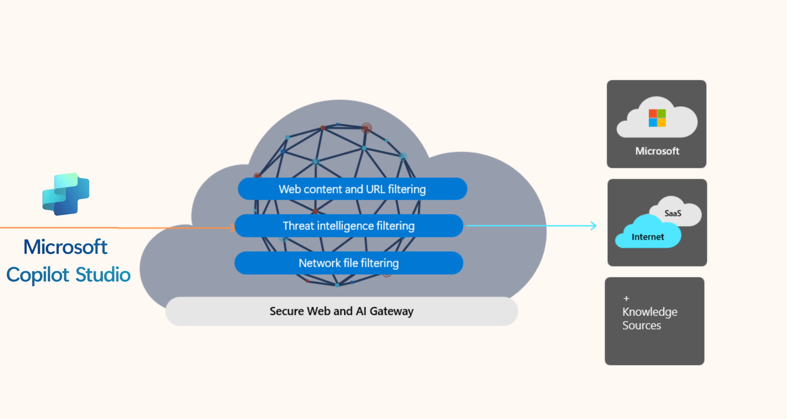

# Learn about Secure Web And AI Gateway for Microsoft Copilot Studio agents (preview)

[!INCLUDE [entra-agent-id-license-note](../includes/entra-agent-id-license-note.md)]

As organizations adopt autonomous and interactive AI agents to perform tasks previously handled by humans, administrators need visibility and control over agent network activity. Global Secure Access for agents provides network security controls for Microsoft Copilot Studio agents, enabling you to apply the same security policies to agents that you use for users.

With Global Secure Access for agents, you can regulate how agents use knowledge, tools, and actions to access external resources. You can apply network security policies including web content filtering, threat intelligence filtering, and network file filtering to agent traffic.

## How network security for Copilot Studio agents works

To enforce network security controls on Copilot Studio agents, you forward agent traffic to Global Secure Access's globally distributed proxy service. You enable traffic forwarding in the Power Platform Admin Center on a per-environment or per-environment-group basis.

Agent traffic forwarding applies to multiple traffic types, including:
- HTTP Node traffic
- Custom connectors
- MCP Server Connector

Once agent traffic is forwarded to Global Secure Access, you can apply security policies to the traffic. The service evaluates agent traffic against your configured security policies, similar to how it evaluates user traffic.

## Security policies for agents

Security policies for agents are configured using the baseline profile in Global Secure Access. The baseline profile applies security policies at the tenant level, ensuring consistent security controls across all agent traffic.

## Next steps

- [Configure network security for Microsoft Copilot Studio agents](how-to-secure-web-ai-gateway-agents.md)
- [Learn about Global Secure Access](overview-what-is-global-secure-access.md)
- [Learn about traffic forwarding profiles](concept-traffic-forwarding.md)