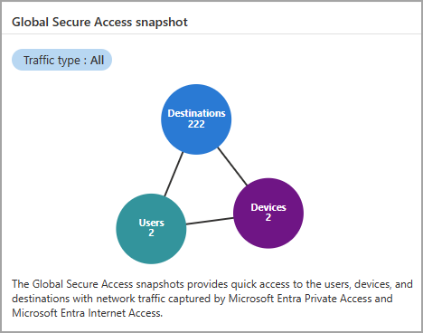
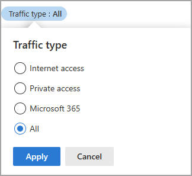
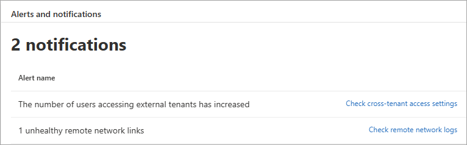
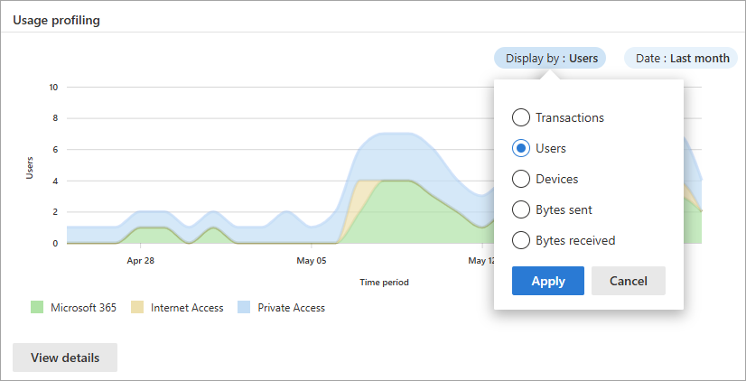
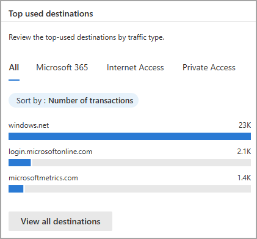
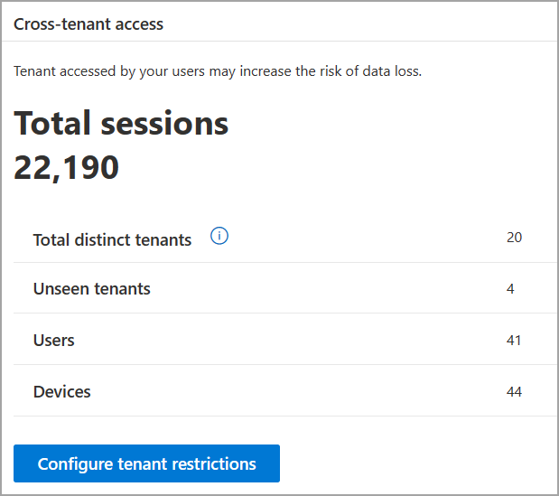
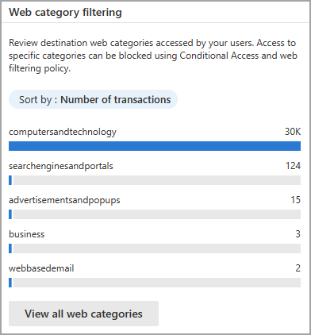
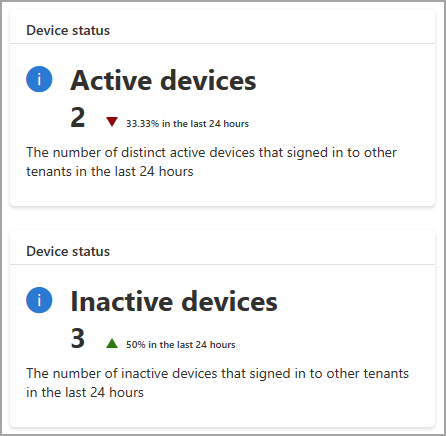
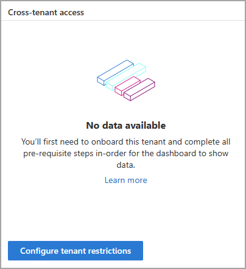

# Global Secure Access dashboard

The Global Secure Access dashboard provides you with visualizations of the network traffic acquired by the Microsoft Entra Private and Microsoft Entra Internet Access services. The dashboard compiles the data from your network configurations, including devices, users, and tenants into several widgets that provide you with answers to the following questions:

- How many devices using the Global Secure Access client are active in my network?
- Was there a recent change to the number of active devices?
- Are there alerts that I should be aware of?
- What are the service usage patterns across the different traffic types?
- What are the most used destinations?
- Which users are accessing sites with threat intelligence the most?
- How many unique users are accessing the network across all my tenants?
- What are the cross-tenant access activity patterns?
- What are the most popular website categories that users are accessing?
- What are the most used private application segments that aren't attributed to an application?

This article describes each of the dashboard widgets and how you can use the data on the dashboard to monitor and improve your network configurations.

## Prerequisites

To view the Global Secure Access dashboard, you must have:

- A **Global Secure Access Administrator** role in Microsoft Entra ID.
- A Microsoft Entra ID P1 license. If needed, you can [purchase licenses or get trial licenses](https://aka.ms/azureadlicense).
- Configured network traffic to be acquired by the service to view data on the dashboard. On the dashboard, select **Get started with the dashboard** for an overview video.

## How to access the dashboard

To access the dashboard:

1. Sign in to the [Microsoft Entra admin center](https://entra.microsoft.com) as a [Global Secure Access Administrator](/azure/active-directory/roles/permissions-reference#global-secure-access-administrator).
1. Browse to **Global Secure Access** > **Dashboard**.
:::image type="content" source="media/concept-traffic-dashboard/traffic-dashboard.png" alt-text="Screenshot of the Microsoft Entra admin center, with the Dashboard navigation link highlighted.":::   

## Global Secure Access snapshot

This widget provides a summary of how many users and devices are using the service and how many applications were secured through the service. 

- **Users**: The number of distinct users seen in the last 24 hours. The data uses the *user principal name (UPN)*.
- **Devices**: The number of distinct devices seen in the last 24 hours. The data uses the *device ID*.
- **Workloads**: The number of distinct destinations seen in the last 24 hours. The data uses fully qualified domain names (FQDNs) and IP addresses.

The **Global Secure Access snapshot** defaults to showing all types of traffic, but you can change the filter to show Internet Access, Private Access, or Microsoft traffic.

## Alerts and notifications (preview)

This widget shows network activity and helps you spot suspicious activities or trends in the network data.

This widget provides the following alerts:

- **Unhealthy remote network**: An unhealthy remote network has one or more device links disconnected.
- **Increased external tenants activity**: The number of users accessing external tenants has increased.
- **Token and device inconsistency**: The original token is used on a different device.
- **Web content blocked**: Access to the website has been blocked.

Select the link next to the alert name to navigate to a related page with additional information.

## Usage profiling (preview)

The **Usage profiling** widget displays usage patterns over a selected period of time.

Select the **Display by** filter to view the following usage categories:

- Transactions
- Users
- Devices
- Bytes sent
- Bytes received

The time period defaults to the previous month, but you can change the time period to the last 24 hours or last week.

Select the **View details** button or select a particular point on the graph to view the usage profile details on the selected data set. Select a date on the usage profile details to view the traffic logs for that date.

## Top used destinations

The top-visited destinations defaults to all types of traffic and sorts by the number of transactions. You can select a different traffic type to narrow down the results or filter by the following options:

- **Transactions**: The destinations with the highest number of transactions, showing the total number of transactions in the last 24 hours. 
- **Users**: The destinations most used by users, showing the number of distinct users (UPN) accessing the destination in the last 24 hours.
- **Devices**: The destinations most used by devices, showing the number of distinct device IDs accessing the destination in the last 24 hours.
- **Bytes sent**: The destinations (IP address) with the highest number of bytes sent, showing the total number of bytes sent in the last 24 hours.
- **Bytes received**: The destinations (IP address) with the highest number of bytes received, showing the total number of bytes received in the last 24 hours.

Change the results to show all traffic or filter by Internet Access, Private Access, or Microsoft traffic.

Select the **View all destinations** button to see more details about the destinations.

## Cross-tenant access

Global Secure Access provides visibility into the number of users and devices that are accessing other tenants. This widget displays the following information:

- **Sign-ins**: The number of sign-ins through Microsoft Entra ID to Microsoft services in the last 24 hours. This widget provides you with information about the activity in your tenant. 
- **Total distinct tenants**: The number of distinct tenant IDs seen in the last 24 hours.
- **Unseen tenants**: The number of distinct tenant IDs that were seen in the last 24 hours, but not in the previous seven days.
- **Users**: The number of distinct user sign-ins to other tenants in the last 24 hours. 
- **Devices**: The number of distinct devices that signed in to other tenants in the last 24 hours.

Select the **Configure tenant restrictions** button to navigate to the **Session management** are of Global Secure Access, where you can check the settings of your tenant restrictions.

## Web category filtering

The **Web category filtering** widget displays the top categories of web content that were blocked or allowed by the service. These categories can be used to determine what sites or categories of sites you might want to block.

The widget defaults to showing blocked and allowed traffic, but you can use the **Blocked** or **Allowed** filter options to view one or the other. Sort the results using the following categories:

- **Transactions**: Shows the total number of transactions in the last 24 hours. 
- **Users**: The number of distinct users (UPN) accessing the destination in the last 24 hours.
- **Devices**: The number of distinct device IDs accessing the destination in the last 24 hours.

Select **View all web categories** to view more details about your network traffic.

## Device status

The **Device status** widgets display the active and inactive devices that you have deployed.

- **Active devices**: The number of distinct device IDs seen in the last 24 hours and the % change during that time.
- **Inactive devices**: The number of distinct device IDs that were seen in the last seven days, but not during the last 24 hours. The % change during the last 24 hours is also displayed.

## Top used cloud applications

The **Top used cloud applications** widget shows the most used cloud applications. By default, the widget shows **All** cloud applications, but you can filter to show only the top used **Generative AI** applications.
:::image type="content" source="media/concept-traffic-dashboard/top-used-cloud-applications.png" alt-text="Screenshot of the Top used cloud applications widget. The All tab and the Generative AI tab are both sorted by the number of transactions.":::   

## Cloud applications status

The **Cloud applications status** widget displays the total number of cloud applications accessed by users and devices. The widget also shows the number of Generative AI applications, and the total number of high-risk applications accessed.
:::image type="content" source="media/concept-traffic-dashboard/total-cloud-widget.png" alt-text="Screenshot of the Cloud applications status widget showing the total cloud applications, the total Generative AI applications, and the total at-risk applications.":::   

## No data available

If your dashboard contains the **No data available** message, you need to onboard your tenant or configure the required settings to get data to appear on the dashboard. If you see this message, review the [Get started](how-to-get-started-with-global-secure-access.md) guide to onboard your tenant.

## Next steps

- [Explore the traffic logs](how-to-view-traffic-logs.md)
- [Access the audit logs](how-to-access-audit-logs.md)