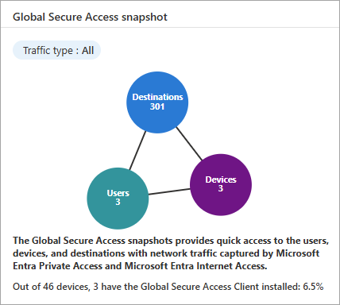
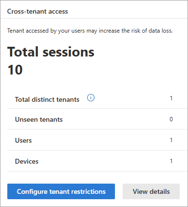

# Global Secure Access (preview) network traffic dashboard

The Global Secure Access (preview) network traffic dashboard provides you with visualizations of the network traffic acquired by the Microsoft Entra Private and Microsoft Entra Internet Access services. The dashboard compiles the data from your network configurations, including devices, users, and tenants into several widgets that provide you with answers to the following questions:

- How many active devices are deployed on my network?
- Was there a recent change to the number of active devices?
- What are the most used applications?
- How many unique users are accessing the network across all my tenants?

This article describes each of the widgets and how you can use the data on the dashboard to monitor and improve your network configurations.

## How to access the dashboard

Viewing the Global Secure Access dashboard requires a Reports Reader role in Microsoft Entra ID. 

To access the dashboard:

1. Sign in to the [Microsoft Entra admin center](https://entra.microsoft.com) as a [Global Secure Access Administrator](/azure/active-directory/roles/permissions-reference#global-secure-access-administrator).
1. Browse to **Global Secure Access (preview)** > **Dashboard**.

    :::image type="content" source="media/concept-traffic-dashboard/traffic-dashboard.png" alt-text="Screenshot of the Private access profile, with the view applications link highlighted." lightbox="media/concept-traffic-dashboard/traffic-dashboard-expanded.png":::

## Global Secure Access snapshot

This widget provides a summary of how many users and devices are using the service and how many applications were secured through the service. 

- **Users**: The number of distinct users seen in the last 24 hours. The data uses the *user principal name (UPN)*.
- **Devices**: The number of distinct devices seen in the last 24 hours. The data uses the *device ID*.
- **Workloads**: The number of distinct destinations seen in the last 24 hours. The data uses fully qualified domain names (FQDNs) and IP addresses.

The **Global Secure Access snapshot** defaults to showing all types of traffic, but you can change the filter to show Internet Access, Private Access, or Microsoft 365 traffic.

## Device status

The **Device status** widgets display the active and inactive devices that you have deployed.

- **Active devices**: The number of distinct device IDs seen in the last 24 hours and the % change during that time.
- **Inactive devices**: The number of distinct device IDs that were seen in the last seven days, but not during the last 24 hours. The % change during the last 24 hours is also displayed.

## Cross-tenant access

Global Secure Access provides visibility into the number of users and devices that are accessing other tenants. This widget displays the following information:

- **Sign-ins**: The number of sign-ins through Microsoft Entra ID to Microsoft 365 in the last 24 hours. This widget provides you with information about the activity in your tenant. 
- **Total distinct tenants**: The number of distinct tenant IDs seen in the last 24 hours.
- **Unseen tenants**: The number of distinct tenant IDs that were seen in the last 24 hours, but not in the previous seven days.
- **Users**: The number of distinct user sign-ins to other tenants in the last 24 hours. 
- **Devices**: The number of distinct devices that signed in to other tenants in the last 24 hours.

Select the **Configure tenant restrictions** button to navigate to the **Session management** are of Global Secure Access, where you can check the settings of your tenant restrictions.

## Top used destinations

The top-visited destinations defaults to all types of traffic and sorts by the number of transactions. You can select a different traffic type to narrow down the results or filter by the following options:

- **Transactions**: Shows the total number of transactions in the last 24 hours. 
- **Users**: The number of distinct users (UPN) accessing the destination in the last 24 hours.
- **Devices**: The number of distinct device IDs accessing the destination in the last 24 hours.

## Web content filtering

The **Web content filtering** widget displays the top categories of web content that were blocked by the service. These categories can be used to determine what sites or categories of sites you may want to block. 

- **Transactions**: Shows the total number of transactions in the last 24 hours. 
- **Users**: The number of distinct users (UPN) accessing the destination in the last 24 hours.
- **Devices**: The number of distinct device IDs accessing the destination in the last 24 hours.

## No data available

If your dashboard contains the **No data available** message, you need to onboard your tenant or configure the the required settings to get data to appear on the dashboard. If you see this message, review the [Get started](how-to-get-started-with-global-secure-access.md) guide to onboard your tenant.

[!INCLUDE [Public preview important note](./includes/public-preview-important-note.md)]

## Next steps

- [Explore the traffic logs](how-to-view-traffic-logs.md)
- [Access the audit logs](how-to-access-audit-logs.md)