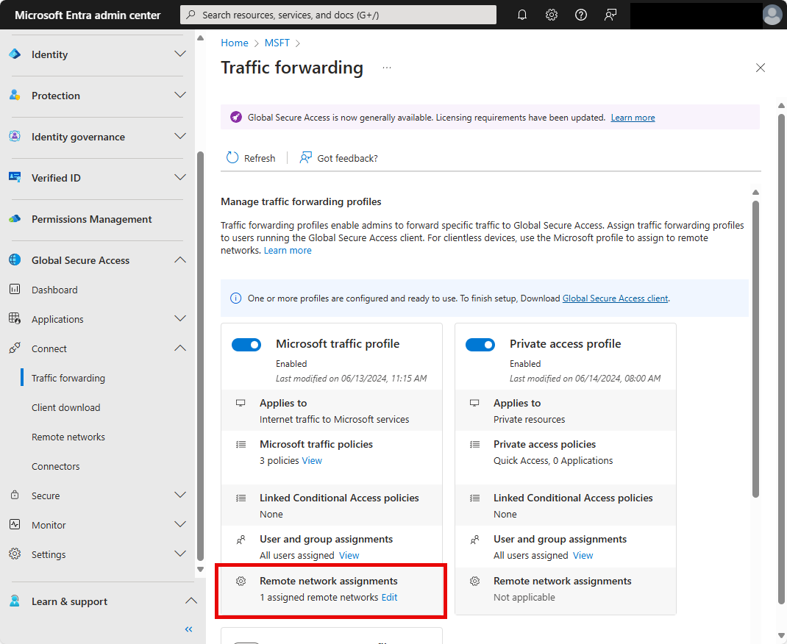

# Assign a remote network to a traffic forwarding profile for Global Secure Access

If you're tunneling your Microsoft traffic through the Global Secure Access service, you can assign remote networks to the traffic forwarding profile. Your end users can access Microsoft resources by connecting to the service from a remote network, such as a branch office location.

There are multiple ways to assign a remote network to the traffic forwarding profile:

- When you create or manage a remote network in the Microsoft Entra admin center
- When you enable or manage the traffic forwarding profile in the Microsoft Entra admin center
- Using the Microsoft Graph API

## Prerequisites 

To assign a remote network to a traffic forwarding profile to, you must have:

- A **Global Secure Access Administrator** role in Microsoft Entra ID. 
- The product requires licensing. For details, see the licensing section of [What is Global Secure Access](overview-what-is-global-secure-access.md). If needed, you can [purchase licenses or get trial licenses](https://aka.ms/azureadlicense).
- To use the Microsoft traffic forwarding profile, a Microsoft 365 E3 license is recommended.

### Known limitations

- At this time, remote networks can only be assigned to the Microsoft traffic forwarding profile.

## Assign the Microsoft traffic profile to a remote network

1. Sign in to the [Microsoft Entra admin center](https://entra.microsoft.com) as a [Global Secure Access Administrator](/azure/active-directory/roles/permissions-reference#global-secure-access-administrator).
1. Browse to **Global Secure Access** > **Connect** > **Remote networks**.
1. Select a remote network. 
1. Select **Traffic profiles**. 
1. Select (or unselect) the checkbox for **Microsoft traffic forwarding profile**. 
1. Select **Save**.


## Assign a remote network to the Microsoft traffic forwarding profile

1. Browse to **Global Secure Access** > **Connect** > **Traffic forwarding**.
1. Select **Add/edit assignments** for **Microsoft traffic profile**. 



### Assign a traffic profile to a remote network using the Microsoft Graph API

Associating a traffic profile to your remote network using the Microsoft Graph API is two-step process. First, you need to get the traffic forwarding profile ID. This ID is unique for all tenants. With the traffic forwarding profile ID, you can assign the traffic forwarding profile with your remote network. 

A traffic forwarding profile can be assigned using Microsoft Graph on the `/beta` endpoint.
 
1. Open a web browser and navigate to **Graph Explorer** at https://aka.ms/ge.
1. Select **GET** as the HTTP method from the dropdown. 
1. Select the API version to **beta**. 
1. Enter the query.
    ```
    GET https://graph.microsoft.com/beta/networkaccess/forwardingprofiles 
    ```
1. Select **Run query**. 
1. Find the ID of the desired traffic forwarding profile. 
1. Select PATCH as the HTTP method from the dropdown. 
1. Enter the query.
    ```
        PATCH https://graph.microsoft.com/beta/networkaccess/branches/d2b05c5-1e2e-4f1d-ba5a-1a678382ef16/forwardingProfiles
        {
            "@odata.context": "#$delta",
            "value":
            [{
                "ID": "00aa00aa-bb11-cc22-dd33-44ee44ee44ee"
            }]
        }
    ```
1. Select **Run query** to update the branch. 


## Next steps
- [List remote networks](how-to-list-remote-networks.md)
