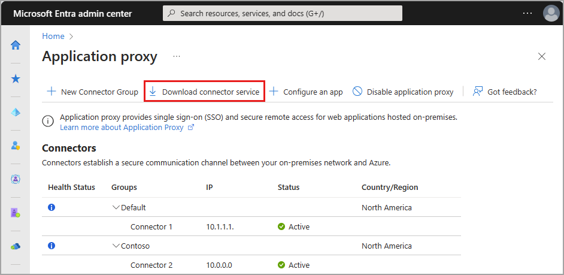
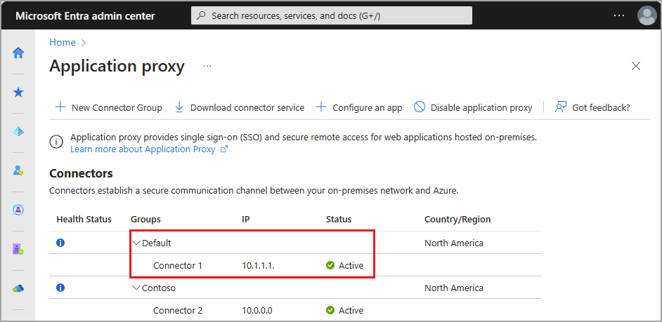
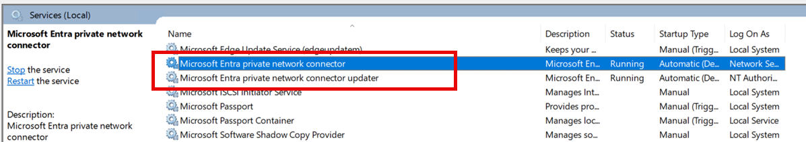

# How to configure private network connectors for Microsoft Entra Private Access and Microsoft Entra application proxy

Connectors are lightweight agents that sit on a server in a private network and facilitate the outbound connection to the Global Secure Access service. Connectors must be installed on a Windows Server that has access to the backend resources and applications. You can organize connectors into connector groups, with each group handling traffic to specific applications. To learn more about connectors, see [Understand Microsoft Entra private network connectors](concept-connectors.md).

## Prerequisites

To add private resources and applications to Microsoft Entra ID you need:

* The product requires a license. To learn more about licensing, see the licensing section of [What is Global Secure Access](overview-what-is-global-secure-access.md). If needed, you can [purchase licenses or get trial licenses](https://aka.ms/azureadlicense). 
* An Application Administrator account.

User identities must be synchronized from an on-premises directory or created directly within your Microsoft Entra tenants. Identity synchronization allows Microsoft Entra ID to pre-authenticate users before granting them access to application proxy published applications and to have the necessary user identifier information to perform single sign-on (SSO).

### Windows server

The Microsoft Entra private network connector requires a server running Windows Server 2012 R2 or later. You'll install the private network connector on the server. This connector server needs to connect to the Microsoft Entra Private Access service or application proxy service and the private resources or applications that you plan to publish.

* For high availability in your environment, we recommend having more than one Windows server.
* The minimum .NET version required for the connector is v4.7.1+.
* For more information, see [private network connectors](../identity/app-proxy/application-proxy-connectors.md#requirements-and-deployment)
* For more information, see [Determine which .NET framework versions are installed](/dotnet/framework/migration-guide/how-to-determine-which-versions-are-installed).

> [!IMPORTANT]
> Note that when using Kerberos Single Sign On (SSO) with Microsoft Application Proxy Service, Disable HTTP 2.0 on Entra private network connector for Windows Server 2019 or later. No need to disable when using Entra Private network connector with Private Access.
>
>  Disable the `HTTP2` protocol support in the `WinHttp` component for *Kerberos Constrained Delegation* to properly work. This is disabled by default in earlier versions of supported operating systems. Adding the following registry key and restarting the server disables it on Windows Server 2019 and later. This is a machine-wide registry key.
>
> ```
> Windows Registry Editor Version 5.00
>
> [HKEY_LOCAL_MACHINE\SOFTWARE\Microsoft\Windows\CurrentVersion\Internet Settings\WinHttp]
> "EnableDefaultHTTP2"=dword:00000000
> ```
>
> The key can be set via PowerShell with the following command:
>
> ```
> Set-ItemProperty 'HKLM:\SOFTWARE\Microsoft\Windows\CurrentVersion\Internet Settings\WinHttp\' -Name EnableDefaultHTTP2 -Value 0
> ```

> [!WARNING]
> If you've deployed Microsoft Entra Password Protection Proxy, do not install Microsoft Entra application proxy and Microsoft Entra Password Protection Proxy together on the same machine. Microsoft Entra application proxy and Microsoft Entra Password Protection Proxy install different versions of the Microsoft Entra Connect Agent Updater service. These different versions are incompatible when installed together on the same machine.

#### Transport Layer Security (TLS) requirements

The Windows connector server must have TLS 1.2 enabled before you install the private network connector.

To enable TLS 1.2:

1. Set registry keys.

   ```
   Windows Registry Editor Version 5.00

   [HKEY_LOCAL_MACHINE\SYSTEM\CurrentControlSet\Control\SecurityProviders\SCHANNEL\Protocols\TLS 1.2]
   [HKEY_LOCAL_MACHINE\SYSTEM\CurrentControlSet\Control\SecurityProviders\SCHANNEL\Protocols\TLS 1.2\Client]
   "DisabledByDefault"=dword:00000000
   "Enabled"=dword:00000001
   [HKEY_LOCAL_MACHINE\SYSTEM\CurrentControlSet\Control\SecurityProviders\SCHANNEL\Protocols\TLS 1.2\Server]
   "DisabledByDefault"=dword:00000000
   "Enabled"=dword:00000001
   [HKEY_LOCAL_MACHINE\SOFTWARE\Microsoft\.NETFramework\v4.0.30319]
   "SchUseStrongCrypto"=dword:00000001
   ```

   You can use the following PowerShell script to enforce TLS 1.2 on your connector server.
   ```powershell
   If (-Not (Test-Path 'HKLM:\SYSTEM\CurrentControlSet\Control\SecurityProviders\SCHANNEL\Protocols\TLS 1.2\Client'))
   {
       New-Item 'HKLM:\SYSTEM\CurrentControlSet\Control\SecurityProviders\SCHANNEL\Protocols\TLS 1.2\Client' -Force | Out-Null
   }
   New-ItemProperty -Path 'HKLM:\SYSTEM\CurrentControlSet\Control\SecurityProviders\SCHANNEL\Protocols\TLS 1.2\Client' -Name 'Enabled' -Value '1' -PropertyType 'DWord' -Force | Out-Null
   New-ItemProperty -Path 'HKLM:\SYSTEM\CurrentControlSet\Control\SecurityProviders\SCHANNEL\Protocols\TLS 1.2\Client' -Name 'DisabledByDefault' -Value '0' -PropertyType 'DWord' -Force | Out-Null
   
   If (-Not (Test-Path 'HKLM:\SYSTEM\CurrentControlSet\Control\SecurityProviders\SCHANNEL\Protocols\TLS 1.2\Server'))
   {
       New-Item 'HKLM:\SYSTEM\CurrentControlSet\Control\SecurityProviders\SCHANNEL\Protocols\TLS 1.2\Server' -Force | Out-Null
   }
   New-ItemProperty -Path 'HKLM:\SYSTEM\CurrentControlSet\Control\SecurityProviders\SCHANNEL\Protocols\TLS 1.2\Server' -Name 'Enabled' -Value '1' -PropertyType 'DWord' -Force | Out-Null
   New-ItemProperty -Path 'HKLM:\SYSTEM\CurrentControlSet\Control\SecurityProviders\SCHANNEL\Protocols\TLS 1.2\Server' -Name 'DisabledByDefault' -Value '0' -PropertyType 'DWord' -Force | Out-Null
   
   If (-Not (Test-Path 'HKLM:\SOFTWARE\Microsoft\.NETFramework\v4.0.30319'))
   {
       New-Item 'HKLM:\SOFTWARE\Microsoft\.NETFramework\v4.0.30319' -Force | Out-Null
   }
   New-ItemProperty -Path 'HKLM:\SOFTWARE\Microsoft\.NETFramework\v4.0.30319' -Name 'SystemDefaultTlsVersions' -Value '1' -PropertyType 'DWord' -Force | Out-Null
   New-ItemProperty -Path 'HKLM:\SOFTWARE\Microsoft\.NETFramework\v4.0.30319' -Name 'SchUseStrongCrypto' -Value '1' -PropertyType 'DWord' -Force | Out-Null
   
   Write-Host 'TLS 1.2 has been enabled. You must restart the Windows Server for the changes to take effect.' -ForegroundColor Cyan
   ```

1. Restart the server.

> [!NOTE]
> Microsoft is updating Azure services to use TLS certificates from a different set of Root Certificate Authorities (CAs). This change is being made because the current CA certificates do not comply with one of the CA/Browser Forum Baseline requirements. For more information, see [Azure TLS certificate changes](/azure/security/fundamentals/tls-certificate-changes).

#### Recommendations for the connector server

- Optimize performance between the connector and the application. Physically locate the connector server close to the application servers. For more information, see [Optimize traffic flow with Microsoft Entra application proxy](../identity/app-proxy/application-proxy-network-topology.md).
- Make sure the connector server and the web application servers are in the same Active Directory domain or span trusting domains. Having the servers in the same domain or trusting domains is a requirement for using single sign-on (SSO) with integrated Windows authentication (IWA) and Kerberos Constrained Delegation (KCD). If the connector server and web application servers are in different Active Directory domains, use resource-based delegation for single sign-on.
- Consider [performance and scalability](concept-connectors.md#performance-and-scalability) of your connector deployment, including [extending the TCP and UDP ephemeral ports](concept-connectors.md#expanding-ephemeral-port-range) on your connector server. See [Understand the Microsoft Entra private network connector](concept-connectors.md) for more information.
- Consider creating a [performance baseline](https://learn.microsoft.com/troubleshoot/windows-server/performance/troubleshoot-performance-problems-in-windows) for your private network connectors.

### Prepare your on-premises environment

Start by enabling communication to Azure data centers to prepare your environment for Microsoft Entra application proxy. If there's a firewall in the path, make sure it's open. An open firewall allows the connector to make HTTPS (TCP) requests to the Application Proxy.

> [!IMPORTANT]
> If you are installing the connector for Azure Government cloud follow the [prerequisites](../identity/hybrid/connect/reference-connect-government-cloud.md#allow-access-to-urls) and [installation steps](/azure/active-directory/hybrid/connect/reference-connect-government-cloud). This requires enabling access to a different set of URLs and an additional parameter to run the installation.

#### Open ports

Open the following ports to **outbound** traffic.

| Port number | How it's used |
| ----------- | ------------------------------------------------------------ |
| 80          | Downloading certificate revocation lists (CRLs) while validating the TLS/SSL certificate |
| 443         | All outbound communication with the Application Proxy service |

If your firewall enforces traffic according to originating users, also open ports 80 and 443 for traffic from Windows services that run as a Network Service.

#### Allow access to URLs

Allow access to the following URLs:

| URL | Port | How it's used |
| --- | --- | --- |
| `*.msappproxy.net` <br> `*.servicebus.windows.net` | 443/HTTPS | Communication between the connector and the Application Proxy cloud service |
| `crl3.digicert.com` <br> `crl4.digicert.com` <br> `ocsp.digicert.com` <br> `crl.microsoft.com` <br> `oneocsp.microsoft.com` <br> `ocsp.msocsp.com`<br> | 80/HTTP   | The connector uses these URLs to verify certificates.        |
| `login.windows.net` <br> `secure.aadcdn.microsoftonline-p.com` <br> `*.microsoftonline.com` <br> `*.microsoftonline-p.com` <br> `*.msauth.net` <br> `*.msauthimages.net` <br> `*.msecnd.net` <br> `*.msftauth.net` <br> `*.msftauthimages.net` <br> `*.phonefactor.net` <br> `enterpriseregistration.windows.net` <br> `management.azure.com` <br> `ctldl.windowsupdate.com` <br> `www.microsoft.com/pkiops` | 443/HTTPS | The connector uses these URLs during and beyond the registration process. |
| `ctldl.windowsupdate.com` <br> `www.microsoft.com/pkiops` | 80/HTTP | The connector uses these URLs during and beyond the registration process. |

You can allow connections to `*.msappproxy.net`, `*.servicebus.windows.net`, and other URLs above if your firewall or proxy lets you configure access rules based on domain suffixes. If not, you need to allow access to the [Azure IP ranges and Service Tags - Public Cloud](https://www.microsoft.com/download/details.aspx?id=56519). The IP ranges are updated each week.

> [!IMPORTANT]
> Avoid all forms of inline inspection and termination on outbound TLS communications between Microsoft Entra private network connectors and Microsoft Entra application proxy Cloud services.

## Install and register a connector

To use Private Access, install a connector on each Windows server you're using for Microsoft Entra Private Access. The connector is an agent that manages the outbound connection from the on-premises application servers to Global Secure Access. You can install a connector on servers that also have other authentication agents installed such as Microsoft Entra Connect.

> [!NOTE]
>The minimum version of connector required for Private Access is **1.5.3417.0**.
>Starting from the version 1.5.3437.0, having the .NET version 4.7.1 or greater is required for successful installation (upgrade).

> [!Note]
>**Deploy Private Network Connector for Your Azure, AWS, and GCP Workloads from respective Marketplaces (Preview)**
> 
> The Private Network Connector is now available on [Azure Marketplace](https://azuremarketplace.microsoft.com/marketplace/apps/microsoftcorporation1687208452115.entraprivatenetworkconnector?tab=overview), [AWS Marketplace](https://aws.amazon.com/marketplace/pp/prodview-cgpbjiaphamuc), and [GCP Marketplace](https://console.cloud.google.com/marketplace/product/ciem-entra/entraprivatenetworkconnector) (in preview), in addition to the [Microsoft Entra admin center](https://entra.microsoft.com). Marketplace offerings allow users to deploy a windows virtual machine with a pre-installed Private Network Connector through a simplified model. The process automates installation and registration, thus improving ease and efficiency.

**To install the connector from Microsoft Entra admin center**:

1. Sign in to the [Microsoft Entra admin center](https://entra.microsoft.com) as an Application Administrator of the directory that uses Application Proxy.

    * For example, if the tenant domain is contoso.com, the admin should be `admin@contoso.com` or any other admin alias on that domain.
1. Select your username in the upper-right corner. Verify you're signed in to a directory that uses Application Proxy. If you need to change directories, select **Switch directory** and choose a directory that uses Application Proxy.
1. Browse to **Global Secure Access** > **Connect** > **Connectors**.
1. Select **Download connector service**.

    
1. Read the Terms of Service. When you're ready, select **Accept terms & Download**.
1. At the bottom of the window, select **Run** to install the connector. An install wizard opens.
1. Follow the instructions in the wizard to install the service. When you're prompted to register the connector with the Application Proxy for your Microsoft Entra tenant, provide your Application Administrator credentials.
    * For Internet Explorer (IE): If IE Enhanced Security Configuration is set to On, you may not see the registration screen. To get access, follow the instructions in the error message. Make sure that Internet Explorer Enhanced Security Configuration is set to Off.

## Things to know

If you've previously installed a connector, reinstall it to get the latest version. When upgrading, uninstall the existing connector and delete any related folders. To see information about previously released versions and what changes they include, see [Application Proxy: Version Release History](/azure/active-directory/app-proxy/application-proxy-release-version-history).

If you choose to have more than one Windows server for your on-premises applications, you need to install and register the connector on each server. You can organize the connectors into connector groups. For more information, see [connector groups](concept-connector-groups.md).

For information about connectors, capacity planning, and how they stay up-to-date, see [Understand Microsoft Entra private network connectors](concept-connectors.md).

> [!NOTE]
> Microsoft Entra Private Access support for multi-geo connectors is currently in PREVIEW. By default, the cloud service instances for your connector are chosen in the same region as your Microsoft Entra tenant (or the closest region to it) even if you have connectors installed in regions different from your default region. Multi-Geo support lets customers optimize traffic flow by assigning connector groups according to their preferred geo locations instead of relying solely on the tenant's geo location.

## Verify the installation and registration

You can use the Global Secure Access portal or your Windows server to confirm that a new connector installed correctly.

For information about troubleshooting application proxy issues, see [Debug application proxy application issues](../identity/app-proxy/application-proxy-debug-apps.md).

### Verify the installation through the Microsoft Entra admin center

To confirm the connector installed and registered correctly:

1. Sign in to the [Microsoft Entra admin center](https://entra.microsoft.com) as an Application Administrator of the directory that uses Application Proxy.
1. Browse to **Global Secure Access** > **Connect** > **Connectors**
    * All of your connectors and connector groups appear on this page.
1. View a connector to verify its details.
    * Expand the connector to view the details if it's not already expanded.
    * An active green label indicates that your connector can connect to the service. However, even though the label is green, a network issue could still block the connector from receiving messages.

    

For more help with installing a connector, see [troubleshoot connectors](troubleshoot-connectors.md).

### Verify the installation through your Windows server

To confirm the connector installed and registered correctly:

1. Select the **Windows** key and enter `services.msc` to open the Windows Services Manager.
1. Check to see if the status for the following services **Running**.
    * *Microsoft Entra private network connector* enables connectivity.
    * *Microsoft Entra private network connector updater* is an automated update service.
    * The updater checks for new versions of the connector and updates the connector as needed.

    

1. If the status for the services isn't **Running**, right-click to select each service and choose **Start**.

## Create connector groups

To create as many connector groups as you want:

1. Browse to **Global Secure Access** > **Connect** > **Connectors**.
1. Select **New connector group**.
1. Give your new connector group a name, then use the dropdown menu to select which connectors belong in this group.
1. Select **Save**.

To learn more about connector groups, see [Understand Microsoft Entra private network connector groups](concept-connector-groups.md).


## Next steps

The next step for getting started with Microsoft Entra Private Access is to configure the Quick Access or Global Secure Access application:

* [Configure Quick Access to your private resources](how-to-configure-quick-access.md)
* [Configure per-app access for Microsoft Entra Private Access](how-to-configure-per-app-access.md)
