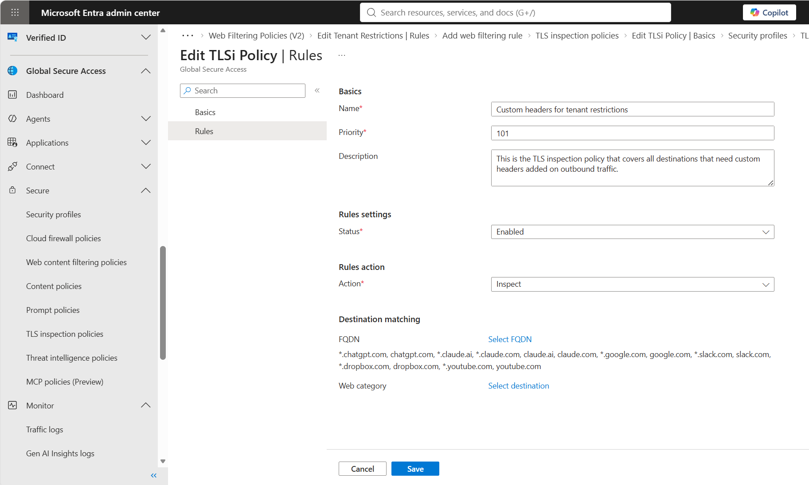
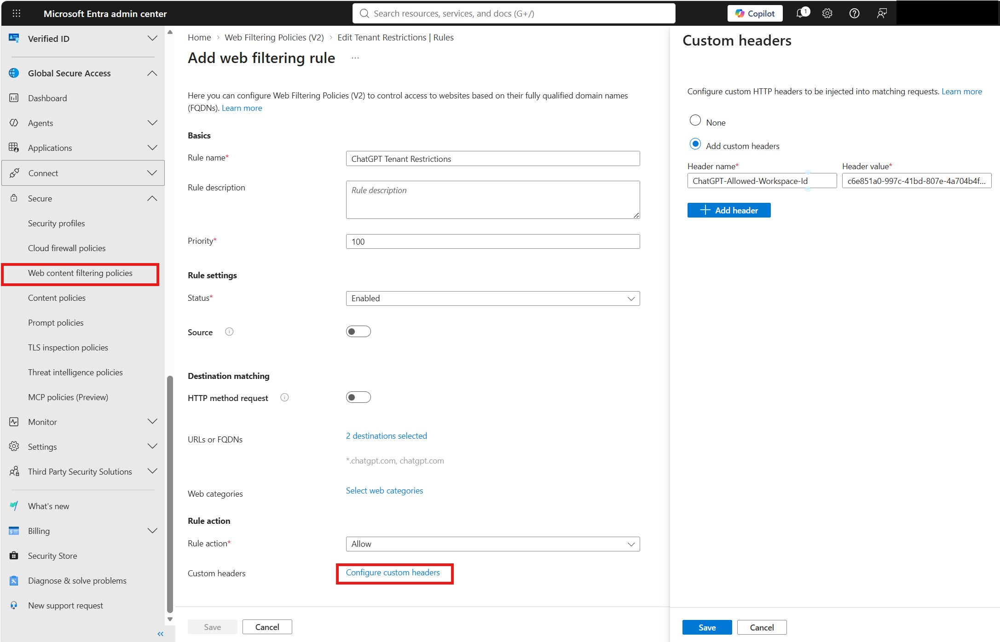

# How to configure custom headers

Custom headers in Global Secure Access (GSA) lets you add custom HTTP headers to outbound web requests for specific destinations. You configure headers as part of a web filtering policy rule, so the headers are added only to traffic that matches the fully qualified domain names (FQDNs) that you select.

The most common use case is tenant restrictions for software as a service (SaaS) applications. Some popular SaaS services understand specific HTTP headers that identifies your organization's approved tenant or workspace in that service. When you add the HTTP header understood by the SaaS provider, the SaaS application allows access to your approved tenant and blocks access to consumer tenants or tenants from other organizations. You can also use header modification to add any custom header that a destination service expects, such as an identifier or policy tag.

> [!IMPORTANT]
> Header modification is currently in preview. This information relates to a prerelease product that might be substantially modified before release. Microsoft makes no warranties, expressed or implied, with respect to the information provided here.

## How it works

When you create a web filtering policy version 2 (v2) rule, you select one or more destination FQDNs and define the custom headers to add. After you link the policy to a security profile, Global Secure Access adds the configured headers into matching outbound requests for users who are assigned that security profile. The destination service reads the header and applies its own tenant restriction or access logic.

Because Global Secure Access adds the headers at the service layer, users can't view, remove, or modify these headers on their devices.

## Prerequisites

- The account that you use to configure web filtering policies has an active [Global Secure Access Administrator](/azure/active-directory/roles/permissions-reference) role assignment.
- Your organization has [Microsoft Entra Internet Access](concept-internet-access.md) onboarded, with internet traffic forwarding enabled.
- The [Global Secure Access client](how-to-install-windows-client.md) is installed on end user devices, or traffic is routed through a remote network or GSA explicit forward proxy.
- TLS inspection is configured and devices that you use for testing this feature trust the TLS root certificate
- You have the tenant or workspace identifier values that each destination service requires for its header. For more information, see [Common services and headers](#common-services-and-headers).

## Review the TLS inspection policy and create it for custom headers if necessary
>[!IMPORTANT]
>TLS inspection is required for all destinations that need custom headers and that enforce TLS (https).

1. Sign in to the [Microsoft Entra Admin Center](https://entra.microsoft.com).
1. Browse to **Global Secure Access** > **Secure** > **TLS inspection policies**.
1. Review the TLSi policies and rules. If you have already defined TLSi policies that apply to your users and cover TLS inspection for destinations to which you plan to add custom headers, no further action is necessary and you can proceed to the next section (create a web filtering policy).
1. To create a rule for custom headers inside an existing TLSi policy, click on **+ Add rule** button on the TLSi policy rules screen and add fully qualified domain names (FQDNs) of destination services that need custom headers. Ensure that the **Rules action** is set to **Inspect**.

    

## Create a web filtering policy

1. Sign in to the [Microsoft Entra Admin Center](https://entra.microsoft.com).
1. Browse to **Global Secure Access** > **Secure** > **Web content filtering policies**.
1. Select **Create policy**. Alternatively, you can add header modification rules to an existing **Web Content Filtering v2 policy**. If you are using an existing policy, skip to the next section.
1. On the **Basics** tab, enter a **Name** for the policy, such as `Custom Headers`. Optionally, enter a **Description**.
1. Select **Next** to go to the **Review** tab, and then select **Create**.

## Add security policy rules with custom headers

After you create the policy, add rules that add HTTP headers to specific destinations. Since header names and values are destination-specific, you can add multiple rules (one rule per destination FQDN) to the same policy.

1. On the **Web Filtering Policies (V2)** page, select the name of the policy that you created.
1. Select **Rules**, and then select **Add rule**.
1. Enter a **Rule name**, such as `ChatGPT Tenant Restrictions`, and set the **Priority**. Keep the **Status** as **Enabled**.
1. Under **Destination matching**, select **Select Destinations**. In the **Destination matching** pane, enter one or more destination **URLs or FQDNs** separated by commas, such as `*.chatgpt.com, chatgpt.com`. Select **Save**.
1. Under **Rule action**, keep the **Rule action** as **Allow**, and then select **Configure custom headers**.
1. In the **Custom headers** pane, select **Add custom headers**. Enter the **Header name** and **Header value** that the destination service requires, such as a header name of `ChatGPT-Allowed-Workspace-Id` and your workspace ID as the value. To add more headers, select **Add header**. Select **Save**.
1. Select **Create rule**.
    
    

1. For each distinct service that requires different headers to be added, create a separate web content filtering policy rule.

## Link the policy to a security profile

To enforce customer headers for users, the security policy must be linked to the security profile. Security profiles are assigned to users through Microsoft Entra Conditional Access. 

1. Browse to **Global Secure Access** > **Secure** > **Security profiles**, and select an existing security profile or create one. If you create a new profile, you will also need a new Conditional Access policy that assigns that profile to users.

1. Select **Link policies** > **Link a policy** > **Existing Web Filtering Policy (V2)**, and select the policy that you created.
   >[!NOTE]
   >You can only link one V2 WFP policy to a security profile.

1. Assign a priority to the linked policy, and save your changes.

After the security profile is delivered through Conditional Access, users who are assigned that profile have the configured headers added into matching traffic. For example, users browsing to ChatGPT have the tenant restriction header added automatically.

> [!NOTE]
> Applying a new security profile can take up to 60-90 minutes because the user must receive a new access token for Internet Access that contains the security profile claim before enforcement begins. Changes to existing security profiles take effect near real-time.

## Common services and headers

Custom headers works with any service that supports header-based tenant restrictions, so the following list isn't exhaustive. The table shows a few common examples, along with the FQDNs to match and the header to add. Many other services support similar headers. Header names, supported values, and the location of the identifier are defined by each service provider and can change. **Always confirm the specific header names and values in the destination service's own documentation.**

| Service | FQDNs | Header name | Header value (where to find it) |
|---|---|---|---|
| ChatGPT | `*.chatgpt.com`, `chatgpt.com` | `ChatGPT-Allowed-Workspace-Id` | The ID of your ChatGPT Enterprise or Team workspace, found in the workspace admin settings. |
| Claude | `claude.ai`, `*.claude.ai`, `claude.com`, `*.claude.com`, `anthropic.com`, `*.anthropic.com`, `api.anthropic.com`, `*.api.anthropic.com` | `anthropic-allowed-org-ids` | The ID of your approved Anthropic organization, found in the Anthropic Console organization settings. |
| GitHub | `github.com`, `*.github.com`, `api.github.com`, `*.api.github.com`, `*.githubcopilot.com`, `.githubcopilot.com` | `sec-GitHub-allowed-enterprise` | The ID (slug) of your approved GitHub enterprise, found in your GitHub enterprise account settings. |
| Google Workspace | `*.google.com` | `X-GoogApps-Allowed-Domains` | A comma-separated list of the domains that you allow, defined in your Google Workspace configuration. |
| Slack | `*.slack.com`, `.slack.com` | `X-Slack-Allowed-Workspaces-Requester` | The ID of your approved Slack workspace or enterprise, found in your Slack organization settings. |
| Dropbox | `*.dropbox.com`, `dropbox.com` | `X-Dropbox-allowed-Team-Ids` | The team ID of your approved Dropbox Business team, found in the Dropbox admin console. |
| YouTube | `*.youtube.com`, `.youtube.com` | `YouTube-Restrict` | `Strict` or `Moderate` to set the YouTube content restriction level. |

> [!IMPORTANT]
> To restrict access to Microsoft Entra tenants, use [universal tenant restrictions](how-to-universal-tenant-restrictions.md) instead of custom headers.

## Related content

- [How to configure Global Secure Access web content filtering](how-to-configure-web-content-filtering.md)
- [Universal tenant restrictions](how-to-universal-tenant-restrictions.md)
- [Learn about the traffic dashboard](concept-traffic-dashboard.md)
