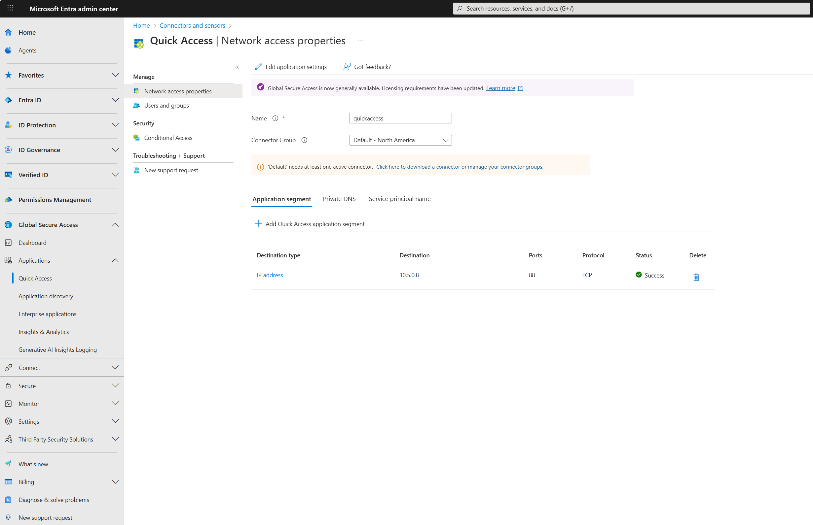

# How to configure Microsoft Entra Private Access for Active Directory Domain Controllers

This guide describes how to configure Microsoft Entra Private Access for Active Directory Domain Controllers (DCs). This capability helps strengthen secure access for on-premises users by enforcing conditional access/MFA to on-premises applications that use Kerberos authentication with the DCs.

## Prerequisites

To configure Microsoft Entra Private Access for Active Directory Domain Controllers, you must have:

- The **Global Secure Access Administrator** role in Microsoft Entra ID.
- The product requires licensing. For details, see the licensing section of [What is Global Secure Access](overview-what-is-global-secure-access.md). If needed, you can [purchase licenses or get trial licenses](https://aka.ms/azureadlicense).
- The client machine is at least Windows 10 and is Microsoft Entra joined or hybrid joined device. The client machine must also have line of sight to the private resources and DC (user is in a corporate network and accessing on-premises resources). User identity used for joining the device and accessing these resources was created in Active Directory (AD) and synced to Microsoft Entra ID using Microsoft Entra Connect.  
- The latest Microsoft Entra Private network connector is installed and has a line of sight to the DC. 
- Open inbound Transmission Control Protocol (TCP) port `1337` in the Windows Firewall on the DCs.
- Identify the Service Principal Names (SPNs) of the private apps you want to protect. You add the SPNs in the policy for Private Access Sensors that are installed on the DCs.
> [!NOTE]
> The SPNs are *case insensitive* and should be an *exact match*. 
- Understand that only one Private Access Sensor is required on a DC in your environment. To test functionality, you don’t need to install sensors on all DCs. To test functionality, install one sensor in `Audit` (report-only) mode. A sensor is installed in `Audit` mode by default.
- As a best practice, we recommend testing this functionality with the private apps first. You can enforce MFA to the DC itself by using its SPN, however, we recommend that you test that at a later stage to avoid any issues of admin lockout.  
- If you have multiple DCs in the sites/domain and would only like to test on one, recommend setting a preferred DC using klist add_bind cmd. In addition, create a firewall rule on Windows Defender to block connections to all other DCs in the site except the test DC. 
- Recommended but optional: Restrict NT Lan Manager (NTLM) v1/v2 and use Kerberos auth in the domain.  

> [!Note]
> Setting the policy Restrict NTLM: NTLM authentication in this domain without performing an impact assessment first might cause service outage for those applications and users still using NTLM authentication.
>
> [Auditing and restricting NTLM usage guide | Microsoft Learn](/previous-versions/windows/it-pro/windows-server-2008-r2-and-2008/jj865674(v=ws.10))
> [Using security policies to restrict NTLM traffic | Microsoft Learn](/previous-versions/windows/it-pro/windows-server-2008-r2-and-2008/jj865668(v=ws.10))

## Configuration steps

Follow these steps to configure Microsoft Entra Private Access for Active Directory Domain Controllers.

### 1. Download and install the Microsoft Entra private network connector

1. Sign in to the [Microsoft Entra admin center](https://entra.microsoft.com).
1. Go to **Global Secure Access** > **Connect** > **Connectors** > **Private Network Connectors**.
1. Download the latest version of the private network connector.
1. Install the connector on a Windows Server that has line of sight to your domain controller.
1. After installation, verify the connector status is **Active** in the Microsoft Entra admin center.

> [!TIP]
> Note the private IP addresses of your connectors (for example, `10.5.0.7`). You need the IPs when configuring the Private Access Sensor policy.

### 2. Create a Global Secure Access application

1. Publish the domain controllers using their IP addresses or Fully Qualified Domain Name (FQDN) to allow the Global Secure Access client to obtain Kerberos tickets.
1. When configuring, add port `88` and select **TCP**.
1. You can configure the port in either a Quick Access or Enterprise Application.

### 3. Add Service Principal Names (SPNs) to Quick Access

1. In your Quick Access application, add the SPNs for the resources you want to secure. The system automatically delivers these SPNs to the Private Access Sensors installed on your domain controllers.

### 4. Assign users and configure Conditional Access

1. Assign the users who are synchronized from Active Directory in the Microsoft Entra application where you configured the domain controllers.
1. Create a Conditional Access policy that requires multifactor authentication (MFA) for these users.

### 5. Enable the Private Access profile

1. In the Microsoft Entra admin center, go to **Global Secure Access** > **Connect** > **Traffic forwarding** > **Private Access Profile**.
1. Enable the Private Access profile.

### 6. Install the Global Secure Access client

1. Download the latest Global Secure Access Windows client from **Global Secure Access** > **Connect** > **Client download** > **Windows 10/11**.
1. Install the client on a Windows 10/11 device that is Microsoft Entra joined or hybrid joined.
1. Ensure the client device has line of sight to the private applications and the domain controller.
1. After installation, pause (disable) the client.

### 7. Install the Private Access Sensor on the domain controller

1. Download the Private Access Sensor for DC at [https://aka.ms/PASensorpPrefresh](https://aka.ms/PASensorpPrefresh).
1. Extract the zip file.
1. Install the sensor by running the `PrivateAccessSensorInstaller` batch file, or install the `PrivateAccessSensor` package followed by the `PrivateAccessSensorPolicyRetreiverInstaller` package.
1. During installation, sign in with a Microsoft Entra ID user when prompted.
1. After installation, verify the sensor status is **Active** in **Global Secure Access** > **Connect** > **Connectors** > **Private access sensor**.

> [!NOTE]
> Installing the sensor creates two JSON policy files (`cloudpolicy` and `localpolicy`) at the sensor installation path.

### 8. Configure Private Access Sensor policy files

1. Confirm that the SPNs configured earlier are present in the `cloudpolicy` file.
1. In the `localpolicy` file, add the private connector IPs to the `SourceIPAllowList` and save.
    - Only Kerberos requests from these connector IPs are allowed; others are blocked.
1. Ensure the **Private Access Sensor** and **PaSensorPolicyRetreiverService** services are running.

> [!IMPORTANT]
> The Private Access Sensor is installed in Audit (report-only) mode by default. To enforce MFA, set the `AuditMode` registry key for `PrivateAccessSensor` from `1` to `0`.

#### Break glass mode

- Private Access Sensor supports a break glass mode to allow all traffic in emergencies.
- Enable break glass mode by setting `"IsBreakGlass": true` in the policy file or changing the `TmpBreakglass` registry key from `0` to `1`.
- Changes take a few minutes to propagate; restarting the sensor isn't required.

### 9. Test Microsoft Entra Private Access for Domain Controllers

1. Keep both the Global Secure Access client and Private Access Sensors turned off.
1. Confirm that the DC FQDNs/IPs configured in the Quick Access app are present in the Global Secure Access client policy.
    - Check via the Global Secure Access system tray icon: **Advanced Diagnostics** > **Traffic Forwarding Profile**.
1. (Optional) Run `nltest` from your client machine to list domain controllers.
1. Run `klist purge` to clear all Kerberos tickets.
1. Use `klist tgt get cifs/SPN` or access the Server Message Block (SMB) share to verify access to the target resource.
1. Turn on both Private Access Sensor services (keep the Global Secure Access client off).
1. Attempt to access the SMB file share; the sensor should block the request.
1. Turn on the Global Secure Access client and try to access the SPN again. You should receive Kerberos tickets, and MFA might be required if your Conditional Access policy enforces it.
1. To verify Kerberos traffic is tunneled through Global Secure Access, use Advanced Diagnostics in the Global Secure Access client.

### 10. Investigation and troubleshooting

- Use **Event Viewer** to review Private Access Sensor logs.
- To collect Private Access Sensor logs, run `PrivateAccessSensorLogsCollector` from the sensor installation path and share the generated zip file with Microsoft support.
- For Global Secure Access client logs:
    1. Right-click the Global Secure Access tray icon.
    2. Select **Advanced Diagnostics** > **Advanced log collection** > **Collect advanced logs**.
    3. Reproduce your issue, then stop log collection and submit the logs to Microsoft.

> [!TIP]
> If you encounter issues, provide screenshots, command outputs, and collected logs to Microsoft support for further assistance.

## Related content
- [Learn about traffic profiles](concept-traffic-forwarding.md)
- [Configure per-app access](how-to-configure-per-app-access.md)