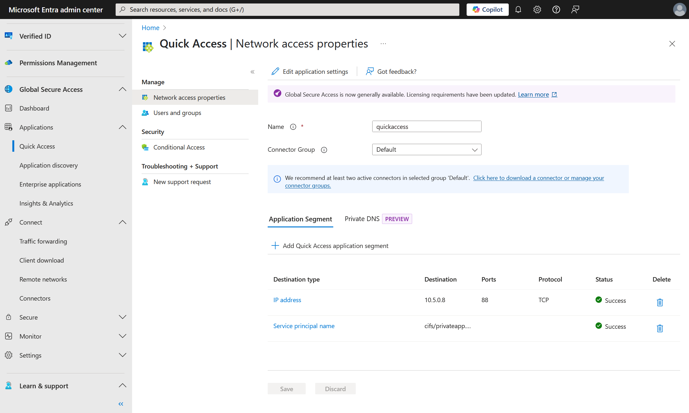
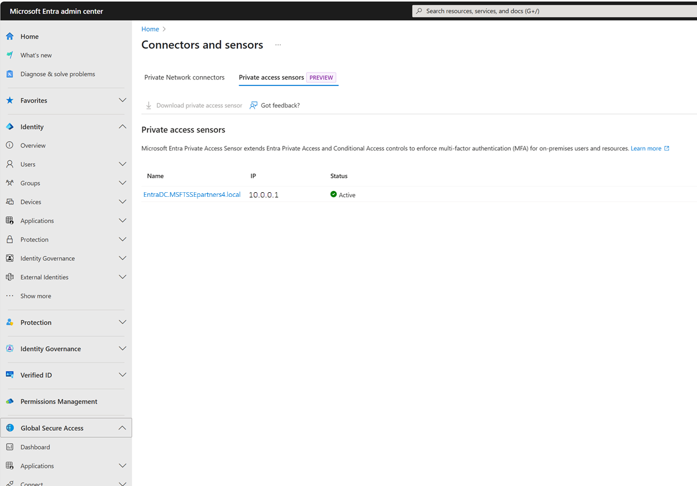
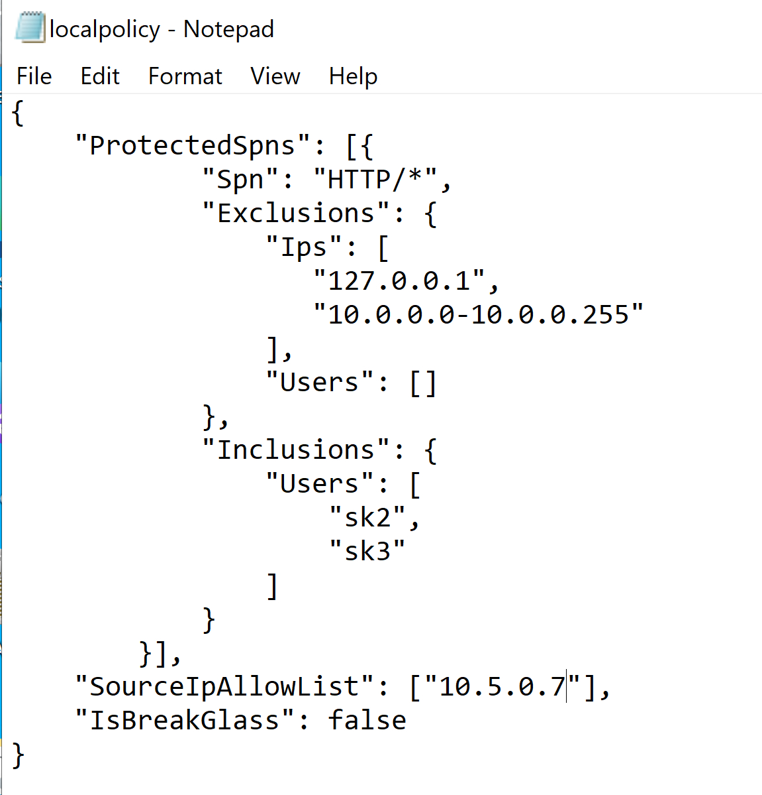

# Configure Microsoft Entra Private Access for Active Directory domain controllers

This guide describes how to configure Microsoft Entra Private Access for Active Directory Domain Controllers (DCs). This capability helps strengthen secure access for on-premises users by enforcing conditional access/MFA to on-premises applications that use Kerberos authentication with the DCs.

## Prerequisites

To configure Microsoft Entra Private Access for Active Directory Domain Controllers, you must have the following:

- The **Global Secure Access Administrator** role in Microsoft Entra ID.
- The product requires licensing. For details, see the licensing section of [What is Global Secure Access](overview-what-is-global-secure-access.md). If needed, you can [purchase licenses or get trial licenses](https://aka.ms/azureadlicense).
- A client machine that runs at least Windows 10 and is Microsoft Entra joined or hybrid joined device. The client machine must also have line of sight to the private resources and DC (user is in a corporate network and accessing on-premises resources). User identity used for joining the device and accessing these resources was created in Active Directory (AD) and synced to Microsoft Entra ID using Microsoft Entra Connect.
- The latest Microsoft Entra Private network connector is installed and has a line of sight to the DC.
- Open inbound Transmission Control Protocol (TCP) port `1337` in the Windows Firewall on the DCs.
- Ensure your firewall or proxy allows outbound connections to the wildcard domain suffix `*.msappproxy.net:443`. Private Access Sensor uses this secure channel to register and fetch policies from Microsoft's Entra cloud service.
- The Service Principal Names (SPNs) of the private apps you want to protect. You add these SPNs in the policy for Private Access Sensors that are installed on the DCs.
> [!NOTE]
> The SPNs are *case insensitive* and should be an *exact match* or a wildcard in the format `<serviceclass>/*` such as `cifs/*`.
- Install the latest Private Access Sensor on the DC. Understand that one Private Access Sensor can be installed on a DC. Silent installation is supported with Private Access Sensor version 2.2.0 or higher, and PowerShell version 5.x.
- To test this functionality, you can install sensors on a few DCs in a site that issue Kerberos tickets for the SPNs you want to protect. A sensor is installed in `Audit` mode by default and you need to change it to `enforce` mode.
- As a best practice, we recommend testing this functionality with the private apps first. You can enforce MFA to the DC itself by using its SPN, however, we recommend that you test that at a later stage to avoid any issues of admin lockout.
- If you use NT LAN Manager (NTLM) v1/v2 in your environment, you might need to restrict NTLM and use Kerberos auth in the domain.
- 

> [!Note]
> Setting the policy Restrict NTLM: NTLM authentication in this domain without performing an impact assessment first might cause service outage for those applications and users still using NTLM authentication.
>
> [Auditing and restricting NTLM usage guide | Microsoft Learn](/previous-versions/windows/it-pro/windows-server-2008-r2-and-2008/jj865674(v=ws.10))
> [Using security policies to restrict NTLM traffic | Microsoft Learn](/previous-versions/windows/it-pro/windows-server-2008-r2-and-2008/jj865668(v=ws.10))


## Configuration steps

Follow these steps to configure Microsoft Entra Private Access for Active Directory Domain Controllers.

### 1. Download and install the Microsoft Entra private network connector

1. Sign in to the [Microsoft Entra admin center](https://entra.microsoft.com).
1. Go to **Global Secure Access** > **Connect** > **Connectors and sensors** > **Private Network Connectors**.
1. Download the latest version of the private network connector.
1. Install the connector on a Windows Server that has line of sight to your domain controller.
1. After installation, verify the connector status is **Active** in the Microsoft Entra admin center.

> [!TIP]
> Note the private IP addresses of your connectors (for example, `10.5.0.7`). You need the IPs when configuring the Private Access Sensor policy.

### 2. Create a Global Secure Access application

Create a new Enterprise Application or use Quick Access to publish the domain controllers using their IP addresses or Fully Qualified Domain Name (FQDN). Publishing the DCs lets the Global Secure Access clients obtain Kerberos tickets. In addition, use Quick Access to configure SPNs. In this example, Quick Access is used to configure both.

1. Sign in to the [Microsoft Entra admin center](https://entra.microsoft.com).
1. Go to **Global Secure Access** > **Applications** > **Quick Access** > **Application segment** then select **Add Quick Access application segment**. Use port `88` and select **TCP**.
1. Next go to **Service principal name** and then select **Add Service principal name** to add the SPNs for the resources you want to secure. The system automatically delivers these SPNs to the Private Access Sensors installed on your domain controllers.

[](media/how-to-configure-domain-controllers/quick-access-settings.png#lightbox)

### 3. Assign users and configure Conditional Access

1. On the application settings page, Quick Access in this example, select **Users and groups**.
1. Select **Add user/group** to assign the users who are synchronized from Active Directory in the Microsoft Entra application where you configured the domain controllers.
1. Create a Conditional Access policy that requires multifactor authentication (MFA) for these users. To learn how to create an MFA policy, see [Building a Conditional Access policy](/entra/identity/conditional-access/concept-conditional-access-policies).

### 4. Enable the Private Access profile

1. Sign in to the [Microsoft Entra admin center](https://entra.microsoft.com).
1. Go to **Global Secure Access** > **Connect** > **Traffic forwarding** > **Private Access Profile**.
1. Enable the Private Access profile.

[](media/how-to-configure-domain-controllers/traffic-forwarding-profile.png#lightbox)

### 5. Install the Global Secure Access client

1. Download the latest Global Secure Access Windows client from **Global Secure Access** > **Connect** > **Client download** > **Windows 10/11**.
1. Install the client on a Windows 10/11 device that is Microsoft Entra joined or hybrid joined.
1. Ensure the client device has line of sight to the private applications and the domain controller.
1. After installation, pause (disable) the client.

### 6. Install the Private Access Sensor on the domain controller

1. Download the Private Access Sensor for DC from Microsoft Entra admin center at **Global Secure Access** > **Connect** > **Connectors and sensors** > **Private access sensors** > **Download private access sensor**.
1. Install the sensor by selecting the Private Access Sensor Installer and following the steps.
1. During installation, sign in with a Microsoft Entra ID user when prompted.
1. After installation, in the Microsoft Entra admin center, go to **Global Secure Access** > **Connect** > **Connectors and sensors** > **Private access sensors** and verify the sensor status is **Active**.

[](media/how-to-configure-domain-controllers/connectors-and-sensors.png#lightbox)

> [!IMPORTANT]
> To upgrade to the Private Access Sensor version 2.1.31, we recommend uninstalling the previous sensor and then installing the new sensor. You can in-place upgrade from the sensor versions 2.1.31 and later.

### 7. Install sensor silently (no interactive authentication)

For enterprise environments deploying sensors across multiple domain controllers, silent installation enables automated deployment without requiring interactive sign-in on each DC. This approach is useful when deploying to servers that don't have a GUI, are in remote locations, or when using deployment automation tools like Group Policy, Microsoft Endpoint Configuration Manager, or scripts. By generating an offline token on a workstation with browser access, you can then register sensors on multiple DCs without needing to authenticate interactively on each server. Silent installation is supported with Private Access Sensor version 2.2.0 or higher, and PowerShell version 5.x.

1. Download sensor to Domain Controller (DC) server and run this cmd in a PowerShell or command window with admin privileges to install quietly.

```cmd
.\PrivateAccessSensor.exe /quiet SKIPREGISTRATION="true"
```
2. Register Sensor

    a. Generate offline token using this PowerShell script. This script should open an interactive browser pop-up to authenticate with your credentials, so we recommend you to do this on a machine with a GUI, internet access, and a browser.

    ```PowerShell
    # Microsoft Private Access / Global Secure Access – Token acquisition script
    # Works silently on any Windows machine with PowerShell 5.x (GUI + browser required)

    if (-not (Get-PSRepository -Name PSGallery -ErrorAction SilentlyContinue)) { Register-PSRepository -Default }
    Set-PSRepository -Name PSGallery -InstallationPolicy Trusted

    if (-not (Get-PackageProvider -Name NuGet -ErrorAction SilentlyContinue)) {
         Install-PackageProvider -Name NuGet -MinimumVersion 2.8.5.201 -Force -Scope CurrentUser
    }

    if (-not (Get-PackageSource -Name "nuget.org" -ProviderName NuGet -ErrorAction SilentlyContinue)) {
         Register-PackageSource -Name "nuget.org" -Location "https://www.nuget.org/api/v2" -ProviderName NuGet -Trusted -Force
    }

    $abstractionsVersion = "6.22.0"
    if (-not (Get-Package Microsoft.IdentityModel.Abstractions -ProviderName NuGet -RequiredVersion $abstractionsVersion -ErrorAction SilentlyContinue)) {
         Install-Package Microsoft.IdentityModel.Abstractions -ProviderName NuGet -RequiredVersion $abstractionsVersion -Force -Scope CurrentUser
    }

    $msalVersion = "4.53.0"
    if (-not (Get-Module -ListAvailable Microsoft.Identity.Client | Where-Object Version -eq $msalVersion)) {
         Install-Module Microsoft.Identity.Client -RequiredVersion $msalVersion -Force -Scope CurrentUser -AllowClobber
    }

    # Load Abstractions DLL
    $pkg = Get-Package Microsoft.IdentityModel.Abstractions -ProviderName NuGet -RequiredVersion $abstractionsVersion
    $folder = if ($pkg.Source -like "*.nupkg") { Split-Path $pkg.Source -Parent } else { $pkg.Source }
    Add-Type -Path (Join-Path $folder "lib\net461\Microsoft.IdentityModel.Abstractions.dll")

    # Load MSAL DLL
    $msal = Get-Module -ListAvailable Microsoft.Identity.Client | Where-Object Version -eq $msalVersion | Select-Object -First 1
    Add-Type -Path (Join-Path $msal.ModuleBase "Microsoft.Identity.Client.dll")

    # -------------------------- Authentication --------------------------
    $connectorAppId             = "55747057-9b5d-4bd4-b387-abf52a8bd489" # This is the standard Application (Principal) ID for Azure AD Application Proxy in Microsoft Entra ID
    $registrationServiceAppIdUri = "https://proxy.cloudwebappproxy.net/registerapp/user_impersonation"

    $scopes = [System.Collections.ObjectModel.Collection[string]]::new()
    $scopes.Add($registrationServiceAppIdUri)

    $app = [Microsoft.Identity.Client.PublicClientApplicationBuilder]::Create($connectorAppId).WithAuthority("https://login.microsoftonline.com/common/oauth2/v2.0/authorize").WithDefaultRedirectUri().Build()

    $authResult = $app.AcquireTokenInteractive($scopes).ExecuteAsync().GetAwaiter().GetResult()

    if ($authResult.AccessToken) {
         $token    = $authResult.AccessToken   
         $tenantId = $authResult.TenantId   
         Write-Host "`nSuccess: Token acquired successfully. You can access the value by typing $token in your PowerShell" -ForegroundColor Green
    }
    else {
         Write-Warning "Authentication failed or no token was returned"
    }
    ```

    You can access the value by typing `$token` and `$tenantId` respectively in your PowerShell. Copy the value of these as plain text and set it manually as `$token` and `$tenantId` respectively in your DC server machine.

    b. On the server machine, convert your `$token` that you copied over to a secure string.

    ```PowerShell
    $SecureToken = $Token | ConvertTo-SecureString -AsPlainText -Force
    ```

    c. Register sensor using the `$SecureToken` created in the last step and the `$tenantId`. The `RegisterConnector.ps1` script should be in `C:\Program Files\Private Access Sensor\bin`.

    ```PowerShell
    .\RegisterConnector.ps1 -modulePath "C:\Program Files\Private Access Sensor\bin" -moduleName "MicrosoftEntraPrivateNetworkConnectorPSModule" -Authenticationmode Token -Token $SecureToken -TenantId $tenantId -Feature PrivateAccess
    ```
If you already have another sensor registered, you may need to run `.\CleanRegistrationCmd.bat` first.

### 8. Configure Private Access Sensor policy files

Installing the sensor creates two JSON policy files (`cloudpolicy` and `localpolicy`) at the sensor installation path. Don't modify the `cloudpolicy` file.

1. Confirm that the SPNs configured earlier are present in the `cloudpolicy` file.
1. In the `localpolicy` file, add the private connector IPs to the `SourceIPAllowList` and save. Only Kerberos requests from these connector IPs are allowed; others are blocked.
1. If you add or update SPNs and/or Connector IPs, it can take a few minutes for changes to take effect. You don't need to restart the sensors.

> [!IMPORTANT]
> The Private Access Sensor is installed in Audit (report-only) mode by default. To enforce MFA, set the `SensorMode` for `PrivateAccessSensor` to `EnforceMode` in **Global Secure Access** > **Connect** > **Connectors and sensors** > **Private access sensors**. It might take a few minutes to update the sensor mode. For Private Access Sensor versions 2.1.31 and later, you can only update this mode from Microsoft Entra Admin Center and not the registry key from the Private Access Sensor.


## Exclusions and inclusions for SPNs

When configuring Service Principal Names (SPNs) in the Private Access Sensor policy, you might have users or machines in your environment that don't have the Global Secure Access client installed. To allow these users or machines to access the specified SPNs after the Private Access Sensor is deployed, you can configure exclusions or inclusions for each SPN from Microsoft Entra Admin Center or in the `localpolicy` file. Any exclusions or inclusions configured from Microsoft Entra Admin Center are present in the `cloudpolicy` file.

> [!NOTE]
> Both `cloudpolicy` and `localpolicy` are evaluated for access.

If you don't define an exclusion for a given SPN, the default behavior blocks all direct access to that SPN except devices with the Global Secure Access client installed.

### Exclusions

Exclusions allow specific users or machines to access configured SPNs without requiring the Global Secure Access client. You can add exclusions by:

- Client IP address
- IP address ranges
- On-premises User Principal Name (UPN) such as `username@domain`. UPN is supported with Private Access Sensor version 2.1.31 or higher and is case insensitive. Username, which is the first part of the UPN, is supported with the earlier sensor versions and can be added in the `localpolicy`file only. We highly recommend using the UPNs instead of usernames. UPNs for on-premises users can be added from Microsoft Entra admin center. These can be UPNs for on-premises users that are synced to Entra or local to Active Directory and not synced to Entra. 

> [!NOTE] 
> UPNs for on-premises users that are local to Active Directory and not synced to Entra can only be added to the `localpolicy` file in Private Access Sensor versions earlier than 2.2.0.

You can configure multiple IP addresses, multiple IP ranges, or both for a single SPN. Similarly, you can exclude multiple usernames for an SPN.

### Inclusions

If you need to allow access for many users, you can instead specify an inclusion list of UPNs for each SPN. When you configure included users for an SPN, only those users are required to have the Global Secure Access client. Users not included in the list can access the SPN without the client.

> [!IMPORTANT]
> An SPN can have either an inclusion list of UPNs or an exclusion list of UPNs, but not both.

### Combining exclusions and inclusions

- You can configure both UPN inclusion and IP exclusion for a given SPN.
- You can configure both UPN exclusion and IP exclusion for a given SPN.
- If a policy match occurs for both UPN inclusion and IP exclusion, access to the SPN is allowed.
- If a policy matches more than one rule (for example, a wildcard), access to the SPN is allowed if it matches at least one exclusion rule.

> [!TIP]
> Use exclusions and inclusions to fine-tune access for users and devices that don't have the Global Secure Access client, ensuring business continuity while maintaining security controls.

Example of how to configure SPN username exclusions and inclusions from Microsoft Entra Admin Center:
>
[](media/how-to-configure-domain-controllers/exclusions-and-inclusions.png#lightbox)

#### Break glass mode

- Private Access Sensor supports a break glass mode to allow all traffic in emergencies.
- To enable break glass mode from Microsoft Entra admin center:
    1. Go to **Global Secure Access** > **Connect** > **Connectors and sensors**.
    1. On the **Private access sensors** tab, select a **Name** from the list of Private access sensors.
    1. From the **Settings**, select **Enable break glass mode**. Changes can take a few minutes to propagate.
- You can also enable break glass mode by changing the `TmpBreakglass` (DWORD) registry key under `HKLM\SOFTWARE\Microsoft\PrivateAccessSensor` from `0` to `1` on the domain controller where the Private Access Sensor is installed. You must restart the sensors to apply updates to the registry key.

### 9. Test Microsoft Entra Private Access for domain controllers

1. Keep both the Global Secure Access client and Private Access Sensors turned off.
1. Confirm that the DC FQDNs/IPs configured in the Quick Access app are present in the Global Secure Access client policy. Check via the Global Secure Access system tray icon: **Advanced Diagnostics** > **Traffic Forwarding Profile**.
1. (Optional) Run `nltest` from your client machine to list domain controllers.
1. Run `klist purge` to clear all Kerberos tickets.
1. Use `klist tgt get cifs/SPN` or access the Server Message Block (SMB) share to verify access to the target resource.
1. Turn on the Private Access Sensor service (keep the Global Secure Access client off).
1. Attempt to access the SMB file share; the sensor should block the request.
1. Turn on the Global Secure Access client and try to access the SPN again. You should receive Kerberos tickets, and MFA might be required if your Conditional Access policy enforces it.
1. To verify Kerberos traffic is tunneled through Global Secure Access, use Advanced Diagnostics in the Global Secure Access client.

### 10. Investigation and troubleshooting

- Use **Event Viewer** from **Application and Service Logs** > **Microsoft** > **Windows** > **Private Access Sensor** to review Private Access Sensor logs.
[](media/how-to-configure-domain-controllers/event-viewer.png#lightbox)
- To collect Private Access Sensor logs, run `PrivateAccessSensorLogsCollector` from the sensor installation path and share the generated zip file with Microsoft support.
- For Global Secure Access client logs:
    1. Right-click the Global Secure Access tray icon.
    2. Select **Advanced Diagnostics** > **Advanced log collection** > **Collect advanced logs**.
    3. Reproduce your issue, then stop log collection and submit the logs to Microsoft support.

> [!TIP]
> If you encounter issues, provide screenshots, command outputs, and collected logs to Microsoft support for further assistance.

## Related content
- [Learn about traffic profiles](concept-traffic-forwarding.md)
- [Configure per-app access](how-to-configure-per-app-access.md)
