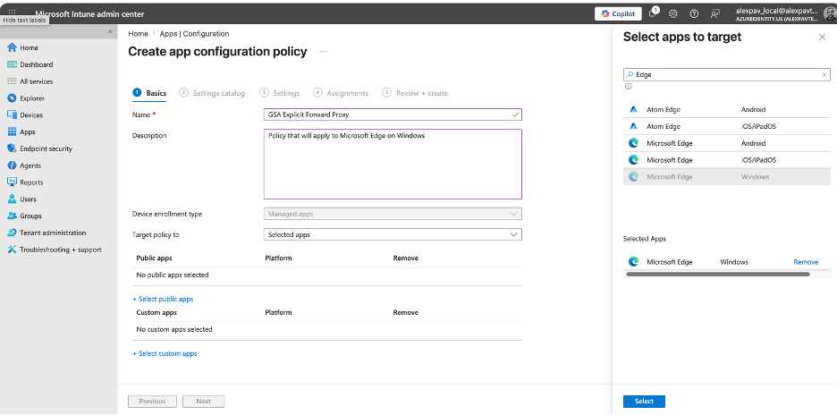
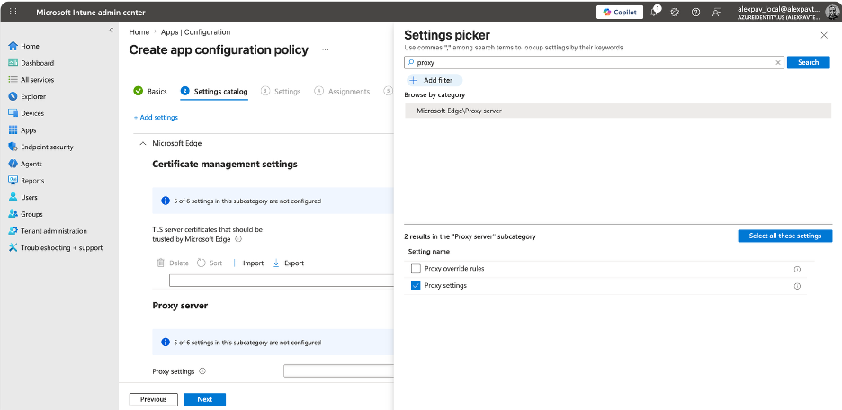
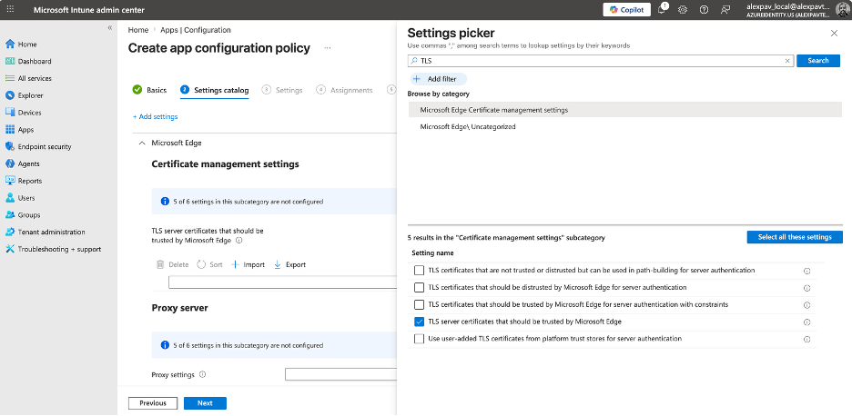
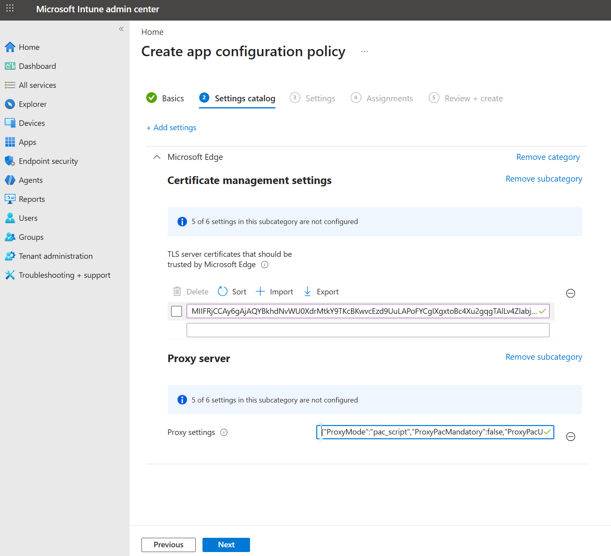
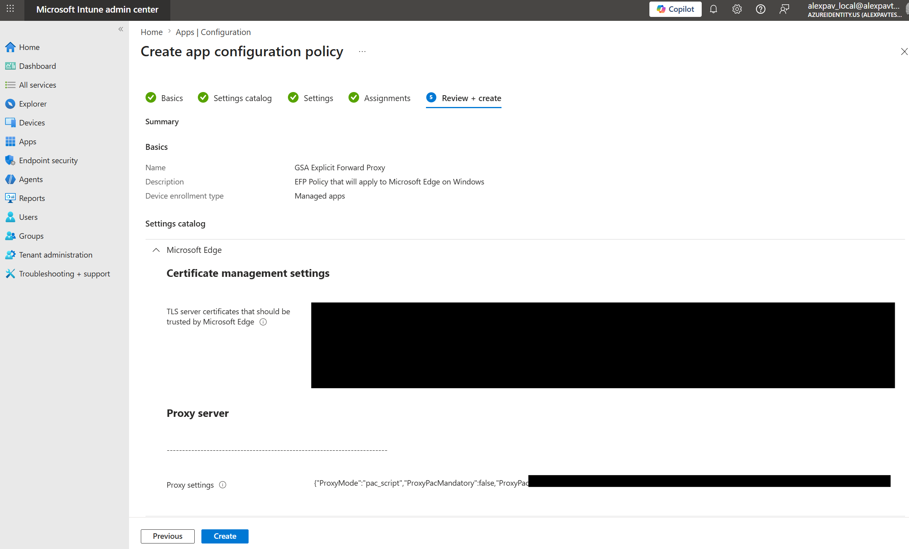
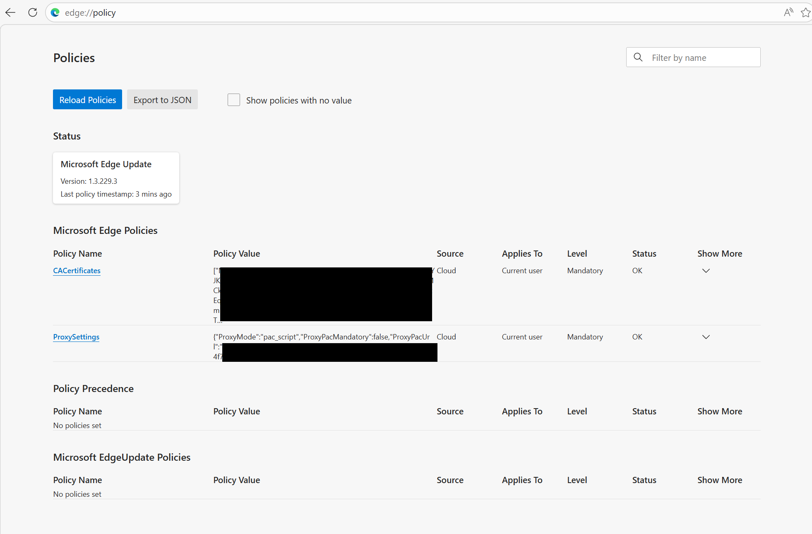

# Configure Microsoft Edge with Global Secure Access Explicit Forward Proxy (preview) by using a Intune Mobile Application Management policy

You can automatically deliver the proxy settings and the automatic Certificate Authority trust settings in Microsoft Edge using the Intune app management policies.

> [!IMPORTANT]
> The Explicit Forward Proxy feature is currently in preview. This information relates to a prerelease product that might be substantially modified before release. Microsoft makes no warranties, expressed or implied, with respect to the information provided here.

## Prerequisites

- Microsoft Entra ID identity with at least the Global Secure Access Administrator Reader role and Intune Administrator role.
- Explicit forward proxy configured in the Microsoft Entra admin center.
- A security group in Microsoft Entra ID with users that should receive explicit forward proxy configuration in Microsoft Edge (for example, Global Secure Access (GSA) Explicit Forward Proxy (EFP) Users).
- Plaintext public key of the Transport Layer Security (TLS) inspection root certificate used when Microsoft Entra Internet Access TLS inspection was configured.

## Configuration

1. Open the [Microsoft Entra admin center](https://entra.microsoft.com).

1. Go to **Global Secure Access** > **Settings** > **Session Management** > **Explicit Forward Proxy**.

1. Copy the PAC file URL from settings page and save it for the Intune app configuration policy you configure next.

1. Open the [Intune admin center](https://intune.microsoft.com).

1. Under **Apps** > **Manage apps**, select **Configuration**.

1. Select **+ Create** > **Managed Apps**:

   1. **Name** = `GSA Explicit Forward Proxy Settings for Edge` (feel free to choose your own name).
   1. **Target policy to**: Selected Apps.

1. Select **+ Select public apps**:

   1. Search for `Edge`.
   1. Select **Microsoft Edge** / **Windows**.
   1. Select **Select**.

   

1. Select **Next** to advance to the Settings Catalog. Then, select **+ Add setting**:

   1. Type `proxy` in the **Search for a setting** bar and select **Search**.
   1. Select **Microsoft Edge** > **Proxy server** in the results.
   1. Check the **Proxy settings** checkbox.

   

   1. Select the search box again, type `TLS`, and select **Search**.
   1. Select **Microsoft Edge Certificate Management settings** in the search results.
   1. Check the **TLS server certificates that should be trusted by Microsoft Edge** checkbox.

   

   1. Close the **Settings** picker (X on the top right) to return to the policy configuration page.

1. Under the **Proxy Server** section, configure proxy settings as follows:

   ```json
   {"ProxyMode":"pac_script","ProxyPacMandatory":false,"ProxyPacUrl":"URL_you_copied_from_the_Entra_portal"}
   ```

1. Convert the TLS inspection root public key (certificate) to a contiguous plain-text string. You can do this either using PowerShell, or with Linux/macOS terminal:

   **Using PowerShell:**

   1. Change directory to where the `.pem` / `.cer` plaintext key is stored.

   1. Confirm that the key is plaintext by running the following command:

      ```powershell
      if ((Get-Content cert.pem -First 1) -match '-----BEGIN') { 'PEM (plain text)' } else { 'DER (binary)' }
      ```

      If the output is `PEM (plain text)`, you can continue. Otherwise, convert the binary encoded file to PEM.

   1. Convert the PEM certificate string to extract only the key, without the line breaks:

      ```powershell
      (Get-Content cert.pem | Where-Object { $_ -notmatch '-----' }) -join ''
      ```

   1. Copy the resulting string from the console output and save it for the next step.

   **Using Linux/macOS terminal:**

   1. Change directory to where the `.pem` / `.cer` plaintext key is stored.

   1. Confirm that the key is plaintext by running the following command:

      ```bash
      head -c 15 cert.pem | grep -q 'BEGIN' && echo 'PEM (plain text)' || echo 'DER (binary)'
      ```

      If the output is `PEM (plain text)`, you can continue. Otherwise, convert the binary encoded file to PEM.

   1. Extract the key from the file, omitting line breaks:

      ```bash
      awk '!/-----/{printf "%s",$0}' cert.pem | tr -d '\r'
      ```

   1. Copy the resulting string from the console output and save it for the next step. Don't copy the trailing `%` if it shows up in the terminal output.

1. Paste the output of the converted, plain-text string without line breaks in the text field of the **Certificate management settings** section of the policy.

   > [!NOTE]
   > Don't use the 'Import' button in this section. Import is intended for bulk configuring settings, where you have multiple certificates that need to be trusted. The Import function of the Intune portal expects a CSV file with a list of plain text contiguous keys, not the PEM/CER file.

1. Your resulting configuration should look similar to the screenshot. Select **Next**.

   

1. Select **Next** again on the **(3) Settings** page.

1. Under **Assignments**, select **Add Groups**, and select the security group in Microsoft Entra ID that contains users of GSA EFP. Then, select **Next**.

1. Your **Review + create** screen should look similar to the screenshot. Select **Create**.

   

## Validation

1. Open Microsoft Edge on a Windows device. Sign in with the Work/School account.

1. Once signed in, navigate to `edge://policy`. You should see the configured policy settings related to GSA EFP:

   

## Limitations

- This method to apply policy only works on Microsoft Edge for Windows.
- If Mobile Device Management (MDM) is configured on the device, and the MDM policy has conflicting Microsoft Edge settings, the Mobile Application Management (MAM) policy isn't applied.
