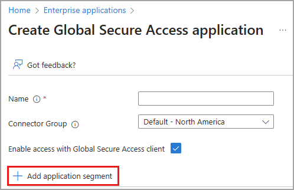
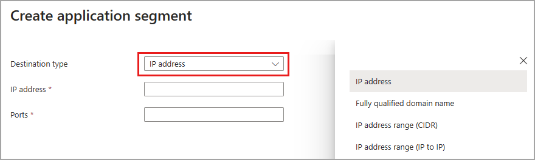
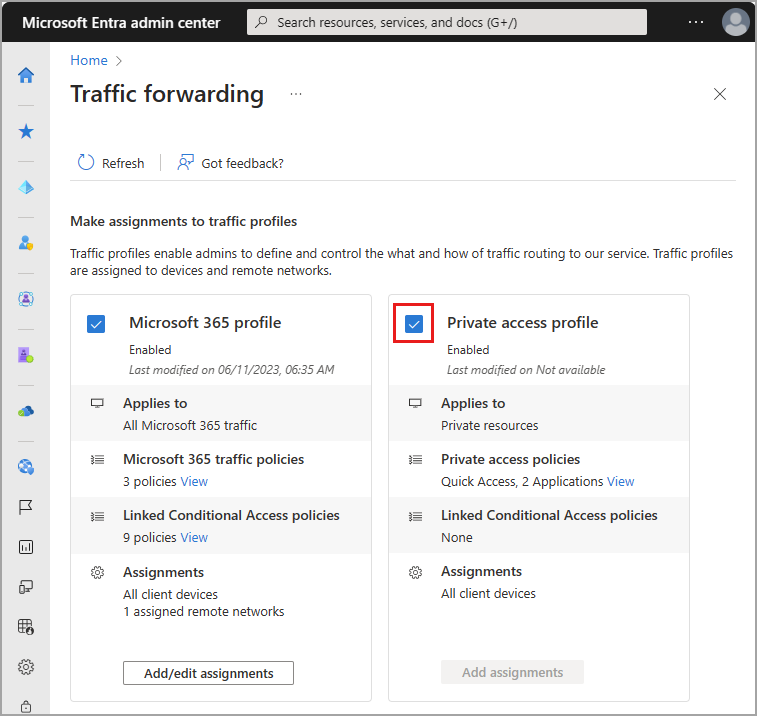

# How to configure per-app access using Global Secure Access applications

Microsoft Entra Private Access provides secure access to your organization's internal resources. You create a Global Secure Access application and specify the internal, private resources that you want to secure. By configuring a Global Secure Access application, you're creating per-app access to your internal resources. Global Secure Access application provides a more detailed ability to manage how the resources are accessed on a per-app basis.

This article describes how to configure per-app access using Global Secure Access applications.

## Prerequisites

To configure a Global Secure Access app, you must have:

- The **Global Secure Access Administrator** and **Application Administrator** roles in Microsoft Entra ID
- The product requires licensing. For details, see the licensing section of [What is Global Secure Access](overview-what-is-global-secure-access.md). If needed, you can [purchase licenses or get trial licenses](https://aka.ms/azureadlicense).

To manage Microsoft Entra private network connector groups, which is required for Global Secure Access apps, you must have:

- An **Application Administrator** role in Microsoft Entra ID
- Microsoft Entra ID P1 or P2 licenses

### Known limitations

- Avoid overlapping app segments between Quick Access and Global Secure Access apps.
- Tunneling traffic to Private Access destinations by IP address is supported only for IP ranges outside of the end-user device local subnet.
- At this time, Private Access traffic can only be acquired with the Global Secure Access Client. Remote networks can't be assigned to the Private access traffic forwarding profile.

## High level steps

Per-App Access is configured by creating a new Global Secure Access app. You create the app, select a connector group, and add network access segments. These settings make up the individual app that you can assign users and groups to.

To configure Per-App Access, you need to have a connector group with at least one active [Microsoft Entra application proxy](/azure/active-directory/app-proxy/application-proxy) connector. This connector group handles the traffic to this new application. With Connectors, you can isolate apps per network and connector.

To summarize, the overall process is as follows:

1. [Create a connector group with at least one active private network connector](#create-a-private-network-connector-group).
    - If you already have a connector group, make sure you're on the latest version.

1. [Create a Global Secure Access app](#create-a-global-secure-access-application).

1. [Assign users and groups to the app](#assign-users-and-groups).

1. [Configure Conditional Access policies](#assign-conditional-access-policies).

1. [Enable Microsoft Entra Private Access](#enable-microsoft-entra-private-access).

## Create a private network connector group

To configure a Global Secure Access app, you must have a connector group with at least one active private network connector.

If you don't already have a connector set up, see [Configure connectors](how-to-configure-connectors.md).

> [!NOTE]
> If you've previously installed a connector, reinstall it to get the latest version. When upgrading, uninstall the existing connector and delete any related folders.
>
> The minimum version of connector required for Private Access is **1.5.3417.0**.

## Create a Global Secure Access application

To create a new app, you provide a name, select a connector group, and then add application segments. App segments include the fully qualified domain names (FQDNs) and IP addresses you want to tunnel through the service. You can complete all three steps at the same time, or you can add them after the initial setup is complete.

### Choose name and connector group

1. Sign in to the [Microsoft Entra admin center](https://entra.microsoft.com) with the appropriate roles. 
1. Browse to **Global Secure Access** > **Applications** > **Enterprise applications**.
1. Select **New application**.

    

1. Enter a name for the app.
1. Select a Connector group from the dropdown menu.
    - Existing connector groups appear in the dropdown menu.
1. Select the **Save** button at the bottom of the page to create your app without adding private resources.

### Add application segment

The **Add application segment** process is where you define the FQDNs and IP addresses that you want to include in the traffic for the Global Secure Access app. You can add sites when you create the app and return to add more or edit them later.

You can add fully qualified domain names (FQDN), IP addresses, and IP address ranges. Within each application segment, you can add multiple ports and port ranges.

1. Sign in to the [Microsoft Entra admin center](https://entra.microsoft.com).
1. Browse to **Global Secure Access** > **Applications** > **Enterprise applications**.
1. Select **New application**.
1. Select **Add application segment**.

    

1. In the **Create application segment** panel that opens, select a **Destination type**.

    

1. Enter the appropriate details for the selected destination type. Depending on what you select, the subsequent fields change accordingly.
    - **IP address**:
        - Internet Protocol version 4 (IPv4) address, such as 192.0.2.1, that identifies a device on the network.
        - Provide the ports that you want to include.
    - **Fully qualified domain name** (including wildcard FQDNs):
        - Domain name that specifies the exact location of a computer or a host in the Domain Name System (DNS).
        - Provide the ports that you want to include.
        - NetBIOS is not supported. For example, use `contoso.local/app1` instead of `contoso/app1.`
    - **IP address range (CIDR)**:
        - Classless Inter-Domain Routing is a way of representing a range of IP addresses in which an IP address is followed by a suffix indicating the number of network bits in the subnet mask.
        - For example 192.0.2.0/24 indicates that the first 24 bits of the IP address represent the network address, while the remaining 8 bits represents the host address.
        - Provide the starting address, network mask, and ports.
    - **IP address range (IP to IP)**:
        - Range of IP addresses from start IP (such as 192.0.2.1) to end IP (such as 192.0.2.10).
        - Provide the IP address start, end, and ports.

1. Enter the ports and select the **Apply** button.
    - Separate multiple ports with a comma.
    - Specify port ranges with a hyphen.
    - Spaces between values are removed when you apply the changes.
    - For example, `400-500, 80, 443`.

    

    The following table provides the most commonly used ports and their associated networking protocols:

    | Port | Protocol |
    | --- | --- |
    | 22 | Secure Shell (SSH) |
    | 80 | Hypertext Transfer Protocol (HTTP) |
    | 443 | Hypertext Transfer Protocol Secure (HTTPS) |
    | 445 | Server Message Block (SMB) file sharing |
    | 3389 | Remote Desktop Protocol (RDP) |

1. Select the **Save** button when you're finished.

> [!NOTE]
> You can add up to 500 application segments to your app.
>
> Do not overlap FQDNs, IP addresses, and IP ranges between your Quick Access app and any Private Access apps.

## Assign users and groups

You need to grant access to the app you created by assigning users and/or groups to the app. For more information, see [Assign users and groups to an application.](/azure/active-directory/manage-apps/assign-user-or-group-access-portal)

1. Sign in to the [Microsoft Entra admin center](https://entra.microsoft.com).
1. Browse to **Global Secure Access** > **Applications** > **Enterprise applications**.
1. Search for and select your application.
1. Select **Users and groups** from the side menu.
1. Add users and groups as needed.

> [!NOTE]
> Users must be directly assigned to the app or to the group assigned to the app. Nested groups are not supported.

## Update application segments

You can add or update the FQDNs and IP addresses included in your app at any time.

1. Sign in to the [Microsoft Entra admin center](https://entra.microsoft.com).
1. Browse to **Global Secure Access** > **Applications** > **Enterprise applications**.
1. Search for and select your application.
1. Select **Network access properties** from the side menu.
    - To add a new FQDN or IP address, select **Add  application segment**.
    - To edit an existing app, select it from the **Destination type** column.

## Enable or disable access with the Global Secure Access Client

You can enable or disable access to the Global Secure Access app using the Global Secure Access Client. This option is selected by default, but can be disabled, so the FQDNs and IP addresses included in the app segments aren't tunneled through the service.

## Assign Conditional Access policies

Conditional Access policies for per-app access are configured at the application level for each app. Conditional Access policies can be created and applied to the application from two places:

- Go to **Global Secure Access** > **Applications** > **Enterprise applications**. Select an application and then select **Conditional Access** from the side menu.
- Go to **Protection** > **Conditional Access** > **Policies**. Select **+ Create new policy**.

For more information, see [Apply Conditional Access policies to Private Access apps](how-to-target-resource-private-access-apps.md).

## Enable Microsoft Entra Private Access

Once you have your app configured, your private resources added, users assigned to the app, you can enable the Private access traffic forwarding profile. You can enable the profile before configuring a Global Secure Access app, but without the app and profile configured, there's no traffic to forward.

1. Sign in to the [Microsoft Entra admin center](https://entra.microsoft.com).
1. Browse to **Global Secure Access** > **Connect** > **Traffic forwarding**.
1. Select the checkbox for **Private access profile**.

## Next steps

The next step for getting started with Microsoft Entra Private Access is to [enable the Private Access traffic forwarding profile](how-to-manage-private-access-profile.md).

For more information about Private Access, see the following articles:

- [Learn about traffic management profiles](concept-traffic-forwarding.md)
- [Manage the Private Access traffic profile](how-to-manage-private-access-profile.md)
- [Apply Conditional Access policies to the Global Secure Access application](how-to-target-resource-private-access-apps.md)
