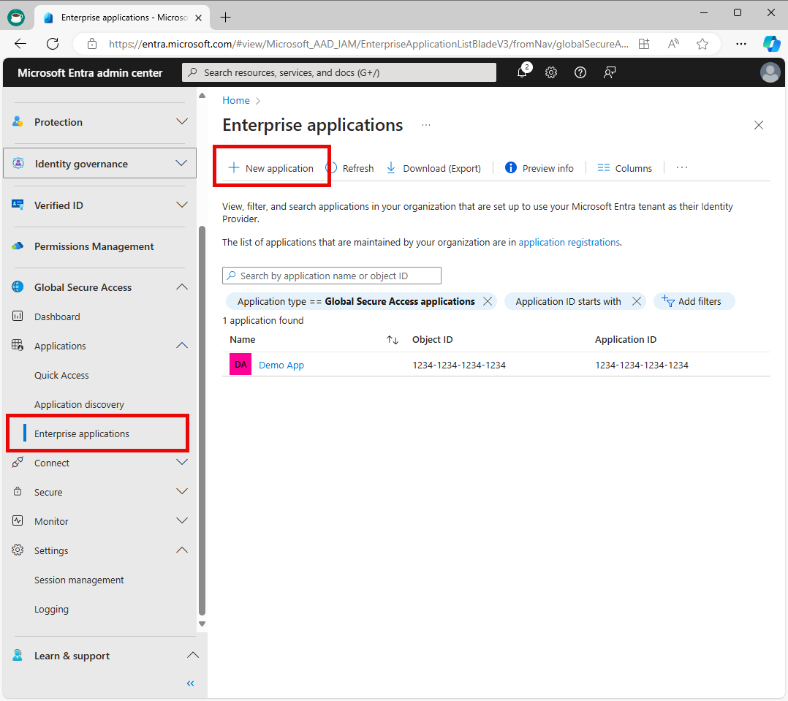

# How to configure per-app access using Global Secure Access applications

Microsoft Entra Private Access provides secure access to your organization's internal resources by enabling you to control and secure access to specific network destinations on your private network. This allows you to provide granular network access based on user needs. To do this, create an Enterprise application and add the application segment that is used by the internal, private resource that you want to secure. Network requests sent from devices running the Global Secure Access client to the application segment you added to your Enterprise application will be acquired and routed to your internal application by the Global Secure Access cloud service without any ability to connect to other resources on your network. By configuring an Enterprise application, you create per-app access to your internal resources. Enterprise applications provide you a segmented, granular ability to manage how your resources are accessed on a per-app basis.

This article describes how to configure per-app access using Enterprise applications.

## Prerequisites

To configure a Global Secure Access Enterprise app, you must have:

- The **Global Secure Access Administrator** and **Application Administrator** roles in Microsoft Entra ID
- The product requires licensing. For details, see the licensing section of [What is Global Secure Access](overview-what-is-global-secure-access.md). If needed, you can [purchase licenses or get trial licenses](https://aka.ms/azureadlicense).

To manage Microsoft Entra private network connector groups, which is required for Global Secure Access apps, you must have:

- An **Application Administrator** role in Microsoft Entra ID
- Microsoft Entra ID P1 or P2 licenses

### Known limitations

[!INCLUDE [known-limitations-include](../includes/known-limitations-include.md)]

## High level steps

Per-App Access is configured by creating a new Global Secure Access app. You create the app, select a connector group, and add network access segments. These settings make up the individual app that you can assign users and groups to.

To configure Per-App Access, you need to have a connector group with at least one active [Microsoft Entra application proxy](/azure/active-directory/app-proxy/application-proxy) connector. This connector group handles the traffic to this new application. With Connectors, you can isolate apps per network and connector.

To summarize, the overall process is as follows:

1. [Create a connector group with at least one active private network connector](#create-a-private-network-connector-group).
    - If you already have a connector group, make sure you're on the latest version.

1. [Create a Global Secure Access app](#create-a-global-secure-access-enterprise-application).

1. [Assign users and groups to the app](#assign-users-and-groups).

1. [Configure Conditional Access policies](#assign-conditional-access-policies).

1. [Enable Microsoft Entra Private Access](#enable-microsoft-entra-private-access).

## Create a private network connector group

To configure a Global Secure Access app, you must have a connector group with at least one active private network connector.

If you don't already have a connector set up, see [Configure connectors](how-to-configure-connectors.md).

> [!NOTE]
> If you've previously installed a connector, reinstall it to get the latest version. When upgrading, uninstall the existing connector and delete any related folders.
>
> The minimum version of connector required for Private Access is **1.5.3417.0**.

## Create a Global Secure Access Enterprise application

To create a new app, you provide a name, select a connector group, and then add application segments. App segments include the fully qualified domain names (FQDNs) and IP addresses you want to tunnel through the service. You can complete all three steps at the same time, or you can add them after the initial setup is complete.

### Choose name and connector group

1. Sign in to the [Microsoft Entra admin center](https://entra.microsoft.com) with the appropriate roles. 
1. Browse to **Global Secure Access** > **Applications** > **Enterprise applications**.
1. Select **New application**.

    

1. Enter a name for the app.
1. Select a Connector group from the dropdown menu.
    > [!IMPORTANT]
    > You must have at least one active connector in order to create an application. To learn more about connectors, see [Understand the Microsoft Entra private network connector](concept-connectors.md).
1. Select the **Save** button at the bottom of the page to create your app without adding private resources.

### Add application segment

An application segment is defined by 3 fields - destination, port, and protocol. If two or more application segments include the same destination, port, and protocol, they are considered to be overlapping. The **Add application segment** process is where you define the FQDNs and IP addresses that you want the Global Secure Access client to route to your target private application. You can add application segments when you create the app and later you can return to add more or edit them.

You can add fully qualified domain names (FQDN), IP addresses, and IP address ranges. Within each application segment, you can add multiple ports and port ranges.

1. Sign in to the [Microsoft Entra admin center](https://entra.microsoft.com).
1. Browse to **Global Secure Access** > **Applications** > **Enterprise applications**.
1. Select **New application**.
1. Select **Add application segment**.
1. In the **Create application segment** panel that opens, select a **Destination type**.
1. Enter the appropriate details for the selected destination type. Depending on what you select, the subsequent fields change accordingly.
    - **IP address**:
        - Internet Protocol version 4 (IPv4) address, such as 192.168.2.1, that identifies a device on the network.
        - Provide the ports that you want to include.
    - **Fully qualified domain name** (including wildcard FQDNs):
        - Domain name that specifies the exact location of a computer or a host in the Domain Name System (DNS).
        - Provide the ports that you want to include.
        - NetBIOS isn't supported. For example, use `contoso.local/app1` instead of `contoso/app1.`
    - **IP address range (CIDR)**:
        - Classless Inter-Domain Routing (CIDR) represents a range of IP addresses where an IP address is followed by a suffix that indicates the number of network bits in the subnet mask.
        - For example, 192.168.2.0/24 indicates that the first 24 bits of the IP address represent the network address, while the remaining 8 bits represents the host address.
        - Provide the starting address, network mask, and ports.
    - **IP address range (IP to IP)**:
        - Range of IP addresses from start IP (such as 192.168.2.1) to end IP (such as 192.168.2.10).
        - Provide the IP address start, end, and ports.

1. Enter the ports and select the **Apply** button.
    - Separate multiple ports with a comma.
    - Specify port ranges with a hyphen.
    - Spaces between values are removed when you apply the changes.
    - For example, `400-500, 80, 443`.

    

    The following table provides the most commonly used ports and their associated networking protocols:

    | Port | Protocol |
    | --- | --- |
    | `22` | `Secure Shell (SSH)` |
    | `80` | `Hypertext Transfer Protocol (HTTP)` |
    | `443` | `Hypertext Transfer Protocol Secure (HTTPS)` |
    | `445` | `Server Message Block (SMB) file sharing` |
    | `3389` | `Remote Desktop Protocol (RDP)` |

1. Select **Save**.

> [!NOTE]
> You can add up to 500 application segments to your app however none of these application segments can have overlapping FQDNs, IP addresses, or IP ranges within or between any Private Access apps. A special exception is allowed for overlapping segments between Private Access apps and Quick Access to allow for VPN replacement. If a segment defined on an Enterprise App (for example 10.1.1.1:3389) overlaps with a segment defined on Quick Access (for example 10.1.1.0/24:3389), then the segment defined on the Enterprise App will be given priority by the GSA service. No traffic from any user to an application segment defined as an Enterprise App will be processed by Quick Access. This means that any user that attempts to RDP to 10.1.1.1 will be evaluated and routed per the Enterprise App configuration, including user assignments and conditional access policies. As a best practice, remove application segments that you define in Enterprise Apps from Quick Access, breaking IP subnets into smaller ranges so that the exclusion is possible.

## Assign users and groups

You need to grant access to the app you created by assigning users and/or groups to the app. For more information, see [Assign users and groups to an application.](/azure/active-directory/manage-apps/assign-user-or-group-access-portal)

1. Sign in to the [Microsoft Entra admin center](https://entra.microsoft.com).
1. Browse to **Global Secure Access** > **Applications** > **Enterprise applications**.
1. Search for and select your application.
1. Select **Users and groups** from the side menu.
1. Add users and groups as needed.

> [!NOTE]
> You must assign users directly assigned to the app or to the group assigned to the app. Nested groups are not supported. Also note that access assignments are not automatically transferred to a newly created Enterprise App even when there is an existing (overlapping) application segment defined in Quick Access. This is important because you can encounter an issue where users that had successfully accessed an app segment through Quick Access will be blocked from access when the app segment is moved to Enterprise Apps until you assign them access specifically to the Enterprise App. Allow 15 minutes for your configuration change to be synchronized with your Global Secure Access clients.

## Update application segments

You can add or update the FQDNs and IP addresses included in your app at any time.

1. Sign in to the [Microsoft Entra admin center](https://entra.microsoft.com).
1. Browse to **Global Secure Access** > **Applications** > **Enterprise applications**.
1. Search for and select your application.
1. Select **Network access properties** from the side menu.
    - To add a new FQDN or IP address, select **Add  application segment**.
    - To edit an existing app, select it from the **Destination type** column.

## Enable or disable access with the Global Secure Access Client

You can enable or disable access to the Global Secure Access app using the Global Secure Access Client. This option is selected by default, but can be disabled, so the FQDNs and IP addresses included in the app segments aren't tunneled through the service.

## Assign Conditional Access policies

Conditional Access policies for per-app access are configured at the application level for each app. Conditional Access policies can be created and applied to the application from two places:

- Go to **Global Secure Access** > **Applications** > **Enterprise applications**. Select an application and then select **Conditional Access** from the side menu.
- Go to **Entra ID** > **Conditional Access** > **Policies**. Select **+ Create new policy**.

For more information, see [Apply Conditional Access policies to Private Access apps](how-to-target-resource-private-access-apps.md).

## Enable Microsoft Entra Private Access

Once you have your app configured, your private resources added, users assigned to the app, you can enable the Private access traffic forwarding profile. You can enable the profile before configuring a Global Secure Access app, but without the app and profile configured, there's no traffic to forward.

1. Sign in to the [Microsoft Entra admin center](https://entra.microsoft.com).
1. Browse to **Global Secure Access** > **Connect** > **Traffic forwarding**.
1. Select the toggle for **Private access profile**.

This diagram demonstrates how Microsoft Entra Private Access works when attempting to use Remote Desktop Protocol to connect to a server on a private network.

:::image type="content" source="media/how-to-configure-per-app-access/private-access-remote-desktop-protocol-network-diagram.png" alt-text="Diagram of Microsoft Entra Private Access working with Remote Desktop Protocol." lightbox="media/how-to-configure-per-app-access/private-access-remote-desktop-protocol-network-diagram.png":::

| Step | Description |
| --- | --- |
| 1 | User initiates RDP session to an FQDN which maps to the target server. The GSA Client intercepts the traffic and tunnels it to the SSE Edge.  |
| 2 | The SSE Edge evaluates policies stored in Microsoft Entra ID such as whether the user is assigned to the application and Conditional Access policies.  |
| 3 | Once the user has been authorized, Microsoft Entra ID issues a token for the Private Access application.  |
| 4 | The traffic is released to continue to the Private Access service along with the application’s access token.  |
| 5 | The Private Access service validates the access token and the connection is brokered to the Private Access backend service.  |
| 6 | The connection is brokered to the Private Network Connector.  |
| 7 | The Private Network Connector performs a DNS query to identify the IP address of the target server. |
| 8 | The DNS service on the private network sends the response. |
| 9 | The Private Network Connector forwards the traffic to the target server. The RDP session is negotiated (including RDP authentication) and is then established.  |

## Next steps

The next step for getting started with Microsoft Entra Private Access is to [enable the Private Access traffic forwarding profile](how-to-manage-private-access-profile.md).

For more information about Private Access, see the following articles:

- [Learn about traffic management profiles](concept-traffic-forwarding.md)
- [Manage the Private Access traffic profile](how-to-manage-private-access-profile.md)
- [Apply Conditional Access policies to the Global Secure Access application](how-to-target-resource-private-access-apps.md)
