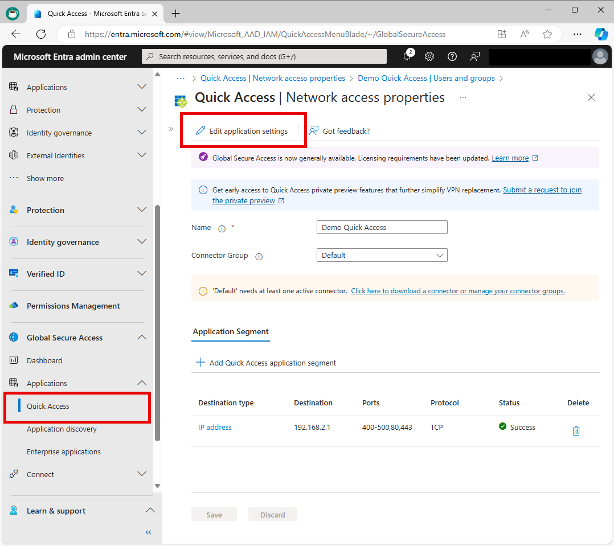

# How to configure Quick Access for Global Secure Access

With Global Secure Access, you can define specific fully qualified domain names (FQDNs) or IP addresses of private resources to include in the traffic for Microsoft Entra Private Access. Your organization's employees can then access the apps and sites that you specify. This article describes how to configure Quick Access for Microsoft Entra Private Access.

## Prerequisites

To configure Quick Access, you must have:

- The **Global Secure Access Administrator** and **Application Administrator** roles in Microsoft Entra ID.
- The product requires licensing. For details, see the licensing section of [What is Global Secure Access](overview-what-is-global-secure-access.md). If needed, you can [purchase licenses or get trial licenses](https://aka.ms/azureadlicense).

To manage Microsoft Entra private network connector groups, which is required for Quick Access, you must have:

- An **Application Administrator** role in Microsoft Entra ID
- Microsoft Entra ID P1 or P2 licenses

### Known limitations
Avoid overlapping app segments between Quick Access and per-app access.

Tunneling traffic to Private Access destinations by IP address is supported only for IP ranges outside of the end-user device local subnet.

At this time, Private access traffic can only be acquired with the Global Secure Access client. Remote networks can't be assigned to the Private Access traffic forwarding profile.

## High level steps

Configuring your Quick Access settings is a major component to utilizing Microsoft Entra Private Access. When you configure Quick Access for the first time, Private Access creates a new enterprise application. The properties of this new app are automatically configured to work with Private Access.

To configure Quick Access, you need to have a connector group with at least one active [Microsoft Entra application proxy](/azure/active-directory/app-proxy/application-proxy) connector. The connector group handles the traffic to this new application. Once you have Quick Access and a private network connector group configured, you need to grant access to the app.

To summarize, the overall process is as follows:

1. [Create a connector group with at least one active private network connector](#create-a-private-network-connector-group).
1. [Configure Quick Access](#configure-quick-access).
1. [Assign users and groups to the app](#assign-users-and-groups).
1. [Configure Conditional Access policies](#link-conditional-access-policies).
1. [Enable the Private access traffic forwarding profile](#enable-microsoft-entra-private-access).

## Create a private network connector group

To configure Quick Access, you must have a connector group with at least one active private network connector.

If you don't already have a connector group set up, see [Configure connectors for Quick Access](how-to-configure-connectors.md).

> [!NOTE]
> If you've previously installed a connector, reinstall it to get the latest version. When upgrading, uninstall the existing connector and delete any related folders.
>
> The minimum version of connector required for Private Access is **1.5.3417.0**.

## Configure Quick Access

On the Quick Access page, you provide a name for the Quick Access app, select a connector group, and add application segments, which include FQDNs and IP addresses. You can complete all three steps at the same time, or you can add the application segments after the initial setup is complete.

### Name and connector group

1. Sign in to the [Microsoft Entra admin center](https://entra.microsoft.com) with the appropriate roles.
1. Browse to **Global Secure Access** > **Applications** > **Quick access**.
1. Enter a name. *We recommend using the name Quick Access*.
1. Select a Connector group from the dropdown menu.
1. Select **Save** to create your "Quick Access" app without FQDNs, IP addresses, and private DNS suffixes.

### Add Quick Access application segment

You define the FQDNs and IP addresses to include when you **Add Quick Access application segment**.  You add these resources when you create or update the Quick Access app.

You can add fully qualified domain names (FQDN), IP addresses, and IP address ranges. Within each application segment, you can add multiple ports and port ranges.

1. Sign in to the [Microsoft Entra admin center](https://entra.microsoft.com).
1. Browse to **Global Secure Access** > **Applications** > **Quick Access**.
1. Select **Add Quick Access application segment**.
1. In the **Create application segment** panel that opens, select a **Destination type**.
1. Enter the appropriate details for the selected destination type. Depending on what you select, the subsequent fields change accordingly.
    - **IP address**:
        - Internet Protocol version 4 (IPv4) address, such as 192.168.2.1, that identifies a device on the network.
        - Provide the ports that you want to include.
    - **Fully qualified domain name** (including wildcard FQDNs):
        - Domain name that specifies the exact location of a computer or a host in the Domain Name System (DNS).
        - Provide the ports to include.
        - NetBIOS isn't supported. For example, use `contoso.local/app1` instead of `contoso/app1`.
    - **IP address range (CIDR)**:
        - Classless Inter-Domain Routing (CIDR) represents a range of IP addresses. An IP address is followed by a suffix indicating the number of network bits in the subnet mask.
        - For example, 192.168.2.0/24 indicates that the first 24 bits of the IP address represent the network address, while the remaining 8 bits represents the host address.
        - Provide the starting address, network mask, and ports.
    - **IP address range (IP to IP)**:
        - Range of IP addresses from start IP (such as 192.168.2.1) to end IP (such as 192.168.2.10).
        - Provide the IP address start, end, and ports.

1. Enter the ports and protocol and select **Apply**.
    - Separate multiple ports with a comma.
    - Specify port ranges with a hyphen.
    - Spaces between values are removed when you apply the changes.
    - For example, `400-500, 80, 443`.

    

    The following table provides the most commonly used ports and their associated networking protocols:

    | Port | Protocol |
    | --- | --- |
    | 22 | Secure Shell (SSH) |
    | 80 | Hypertext Transfer Protocol (HTTP) |
    | 443 | Hypertext Transfer Protocol Secure (HTTPS) |
    | 445 | Server Message Block (SMB) file sharing |
    | 3389 | Remote Desktop Protocol (RDP) |

1. Select **Save** when you're finished.

> [!NOTE]
> You can add up to 500 application segments to your Quick Access app.
>
> Do not overlap FQDNs, IP addresses, and IP ranges between your Quick Access app and any Private Access apps.

### Add private DNS suffixes
Private DNS support for Microsoft Entra Private Access lets you query your own internal DNS servers to resolve IP addresses for internal domain names. Let’s look at an example. Let’s say you have an internal IP range of `10.8.0.0` to `10.8.255.255`. You configure this range in your Quick Access application definition. You want users to access a web application responding on IP `10.8.0.5` when they type
`https://benefits` in their web browser. But you don’t want to configure a FQDN for the application. Using Private DNS, you configure a corresponding DNS Suffix so that the Global Secure Access client knows how to route the request correctly.

Additionally, you can provide a single sign-on (SSO) experience for Kerberos resources by configuring Kerberos Authentication to domain controllers using Private DNS. To learn more about creating an SSO experience, see [Use Kerberos for single sign-on (SSO) to your resources with Microsoft Entra Private Access](how-to-configure-kerberos-sso.md).

Add a DNS suffix to use for private DNS.

1. Select **Private DNS** tab.
1. Select the checkbox to **enable private DNS**.
1. Select **Add DNS suffix**.
1. Enter the DNS suffix and then select **Add**.

## Assign users and groups

When you configure Quick Access, a new enterprise app is created on your behalf. You need to grant access to the Quick Access app you created by assigning users and/or groups to the app. 

You can view the properties from **Quick Access** or navigate to **Enterprise applications** and search for your Quick Access app.

> [!TIP]
> To find an app on the **Enterprise applications** page, clear all filters so that you don't filter out the app you are looking for.

1. Select **Edit application settings** from Quick Access. 

    

1. Select **Users and groups** from the side menu.

1. Add users and groups as needed.
    - For more information, see [Assign users and groups to an application](/azure/active-directory/manage-apps/assign-user-or-group-access-portal).

> [!NOTE]
> Users must be directly assigned to the app or to the group assigned to the app. Nested groups are not supported.

## Link Conditional Access policies

Conditional Access policies can be applied to your Quick Access app. Applying Conditional Access policies provides more options for managing access to applications, sites, and services.

Creating a Conditional Access policy is covered in detail in [How to create a Conditional Access policy for Private Access apps](how-to-target-resource-private-access-apps.md).

## Enable Microsoft Entra Private Access

Once you have your Quick Access app configured, your private resources added, users assigned to the app, you can enable the Private access profile from the **Traffic forwarding** area of Global Secure Access. You can enable the profile before configuring Quick Access, but without the app and profile configured, there's no traffic to forward. To learn how to enable the Private Access traffic forwarding profile, see [How to manage the Private Access traffic forwarding profile](how-to-manage-private-access-profile.md).

## Next steps
- [Learn about traffic profiles](concept-traffic-forwarding.md)
- [Configure per-app access](how-to-configure-per-app-access.md)
