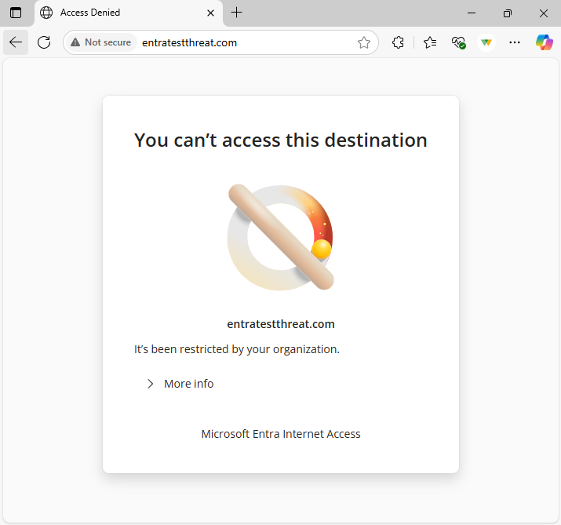

# How to configure Global Secure Access threat intelligence (preview)

Threat intelligence empowers you to protect your users from accessing malicious destinations on the internet, based on real-time data on current threats. 

You can configure a threat intelligence policy to block users from high-severity known malicious internet destinations. In this policy, Microsoft Entra Internet Access blocks traffic based on domain and URL indicators from both Microsoft and third-party threat intelligence providers. With the threat intelligence rule engine, you can also configure allow lists for handling false positives. All of these policies can become context-aware with the Security Profile framework, linking Global Secure Access (GSA) security policies to Conditional Access. 

## Prerequisites

- Administrators who interact with **Global Secure Access** features must have one or more of the following role assignments depending on the tasks they're performing.
   - The [Global Secure Access Administrator role](/azure/active-directory/roles/permissions-reference) role to manage the Global Secure Access features.
   - The [Conditional Access Administrator](/azure/active-directory/roles/permissions-reference#conditional-access-administrator) to create and interact with Conditional Access policies.
- Complete the [Get started with Global Secure Access](how-to-get-started-with-global-secure-access.md) guide.
- [Install the Global Secure Access client](how-to-install-windows-client.md) on end user devices.
- You must disable Domain Name System (DNS) over HTTPS (Secure DNS) to tunnel network traffic. Use the rules of the fully qualified domain names (FQDNs) in the traffic forwarding profile. For more information, see [Configure the DNS client to support DoH](/windows-server/networking/dns/doh-client-support#configure-the-dns-client-to-support-doh).
- Disable built-in DNS client on Chrome and Microsoft Edge.
- IPv6 traffic isn't acquired by the client and is therefore transferred directly to the network. To enable all relevant traffic to be tunneled, set the network adapter properties to [IPv4 preferred](troubleshoot-global-secure-access-client-diagnostics-health-check.md#ipv4-preferred).
- User Datagram Protocol (UDP) traffic (that is, QUIC) isn't supported in the current preview of Internet Access. Most websites support fallback to Transmission Control Protocol (TCP) when QUIC can't be established. For an improved user experience, you can deploy a Windows Firewall rule that blocks outbound UDP 443: 

```powershell 
@New-NetFirewallRule -DisplayName "Block QUIC" -Direction Outbound -Action Block -Protocol UDP  -RemotePort 443
``` 

- (Optional) [Configure Transport Layer Security (TLS) inspection](how-to-transport-layer-security.md) in order for URL indicators to be evaluated against HTTPS traffic.

## High level steps

There are several steps to configuring threat intelligence. Take note of where you need to configure a Conditional Access policy.

1. [Enable internet traffic forwarding.](#enable-internet-traffic-forwarding)
1. [Create a threat intelligence policy.](#create-a-threat-intelligence-policy)
1. [Configure your allow list (optional).](#configure-your-allow-list-optional)
1. [Create a security profile.](#create-a-security-profile-or-configure-the-baseline-profile)
1. [Link the security profile to a Conditional Access policy.](#create-and-link-conditional-access-policy)

## Enable internet traffic forwarding

The first step is to enable the Internet Access traffic forwarding profile. To learn more about the profile and how to enable it, see [How to manage the Internet Access traffic forwarding profile](how-to-manage-internet-access-profile.md).

You can scope the Internet Access profile to specific users and groups. To learn more about user and group assignment, see [How to assign and manage users and groups with traffic forwarding profiles](how-to-manage-users-groups-assignment.md).

## Create a threat intelligence policy

1. Browse to **Global Secure Access** > **Secure** > **Threat Intelligence Policies**.
1. Select **Create policy**.
1. Enter a name and description for the policy and select **Next**.
1. The default action for threat intelligence is "Allow". This means that if traffic doesn't match a rule in the threat intelligence policy, the policy engine will allow the traffic to go to the next security control.
1. Select **Next** and **Review** your new threat intelligence policy.
1. Select **Create**

> [!IMPORTANT]
> This policy is created with a rule blocking access to destinations where high severity threats are detected. Microsoft defines high severity threats as domains or URLs associated with active malware distribution, phishing campaigns, command-and-control (C2) infrastructure, and other threads, identified by Microsoft and third-party threat intelligence feeds with high confidence.

## Configure your allow list (optional)

If you're aware of sites that may be business-critical or are labeled as false positives, you can configure rules that allow these sites. Note the security risks involved with this action, as the internet threat landscape is ever-changing.

1. Under **Global Secure Access** > **Secure** > **Threat Intelligence Policies**, select your chosen threat intelligence policy.
1. Select **Rules**.
1. Select **Add rule**.
1. Enter a name, description, priority, and status for the rule.
1. Edit **Destination FQDNs** and select the list of domains for your allow list. You can enter these FQDNs as comma-separated domains.
1. Select **Add**. 

## Create a security profile or configure the baseline profile

Security profiles are a grouping of security controls like web content filtering and threat intelligence policies. You can assign, or link, security profiles with Microsoft Entra Conditional Access policies. One security profile can contain a policy of each type.

In this step, you create a security profile to group filtering policies like web content filtering and/or threat intelligence. Then you assign, or link, the security profiles with a Conditional Access policy to make them user or context aware.

Since threat intelligence is critical for users' basic security posture, you can alternatively link your threat intelligence policy to the baseline security profile, which applies policy to all users' traffic in your tenant.

> [!NOTE]
> You can only configure threat intelligence policy per security profile. Rule priorities within each security control handle exceptions, and security controls follow the ordering, (1) TLS inspection > (2) Web content filtering > (3) Threat intelligence > (4) File type > (6) Data loss prevention > (7) Third-party

1. Browse to **Global Secure Access** > **Secure** > **Security profiles**.
2. Select **Create profile**.
3. Enter a name and description for the profile and select **Next**.
4. Select **Link a policy** and then select **Existing threat intelligence policy**.
5. Select the threat intelligence policy you already created and select **Add**.
6. Select **Next** to review the security profile and associated policy.
7. Select **Create profile**.
8. Select **Refresh** to view the new profile.

## Create and link Conditional Access policy

Create a Conditional Access policy for end users or groups and deliver your security profile through Conditional Access Session controls. Conditional Access is the delivery mechanism for user and context awareness for Internet Access policies.

1. Browse to **Identity** > **Protection** > **Conditional Access**.
2. Select **Create new policy**.
3. Enter a name and assign a user or group.
4. Select **Target resources** and **All internet resources with Global Secure Access**.
5. Select **Session** > **Use Global Secure Access security profile** and choose a security profile.
6. Select **Select**.
7. In the **Enable policy** section, ensure **On** is selected.
8. Select **Create**.

> [!NOTE]
> Applying a new security profile can take up to 60-90 minutes because security profiles are enforced via access tokens.


## Verify end user policy enforcement

Use a Windows device with the Global Secure Access client installed. Sign in as a user that is assigned the Internet traffic acquisition profile. Test that navigating to malicious websites is blocked as expected.

> [!NOTE]
> After configuring a threat intelligence policy, you may need to [clear your browser's cache](/edge/learning-center/how-to-manage-and-clear-your-cache-and-cookies) to validate policy enforcement.

1. Right-click on the Global Secure Access client icon in the task manager tray and open **Advanced Diagnostics** > **Forwarding profile**. Ensure that the Internet access acquisition rules are present.
1. Navigate to a known malicious site (for example, `entratestthreat.com` or `smartscreentestratings2.net`). Ensure that you're blocked and that the Threat Type field is nonempty in the traffic logs. Traffic logs may take up to 5 minutes to appear in the portal.
1. If blocked by Windows Defender or Smart screen, override and access the site to test the Global Secure Access block message. You can do this by choosing "Continue to the unsafe site (not recommended)" under "More information."
1. To test allow-listing, create a rule in the Threat Intelligence policy to allow access to the site. Within 2 minutes, you should be able to access it. (You may need to clear your browser cache.)
1. Evaluate the rest of the threat feed against your known threat indicators.



> [!CAUTION]
> Testing with real malicious sites should be performed in a sandbox or test environment to protect your device and enterprise.

## Next steps

- [Learn about the traffic dashboard](concept-traffic-dashboard.md)
