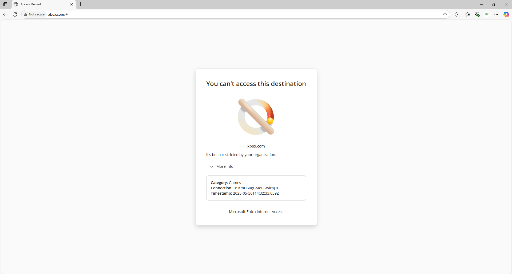
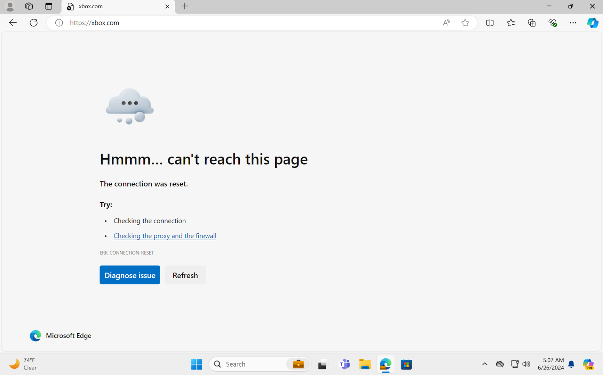

# How to configure Global Secure Access web content filtering

Web content filtering empowers you to implement granular Internet access controls for your organization based on website categorization.

Microsoft Entra Internet Access's first Secure Web Gateway (SWG) features include web content filtering based on domain names. Microsoft integrates granular filtering policies with Microsoft Entra ID and Microsoft Entra Conditional Access, which results in filtering policies that are user-aware, context-aware, and easy to manage. 

The web filtering feature is currently limited to user- and context-aware Fully Qualified Domain Name (FQDN)-based web category filtering and FQDN filtering.

## Prerequisites

- Administrators who interact with **Global Secure Access** features must have one or more of the following role assignments depending on the tasks they're performing.
   - The [Global Secure Access Administrator role](/azure/active-directory/roles/permissions-reference) role to manage the Global Secure Access features.
   - The [Conditional Access Administrator](/azure/active-directory/roles/permissions-reference#conditional-access-administrator) to create and interact with Conditional Access policies.
- Complete the [Get started with Global Secure Access](how-to-get-started-with-global-secure-access.md) guide. 
- [Install the Global Secure Access client](how-to-install-windows-client.md) on end user devices.
- You must disable Domain Name System (DNS) over HTTPS (Secure DNS) to tunnel network traffic. Use the rules of the fully qualified domain names (FQDNs) in the traffic forwarding profile. For more information, see [Configure the DNS client to support DoH](/windows-server/networking/dns/doh-client-support#configure-the-dns-client-to-support-doh).
- Disable built-in DNS client on Chrome and Microsoft Edge.
- IPv6 traffic isn't acquired by the client and is therefore transferred directly to the network. To enable all relevant traffic to be tunneled, set the network adapter properties to [IPv4 preferred](troubleshoot-global-secure-access-client-diagnostics-health-check.md#ipv4-preferred).
- User Datagram Protocol (UDP) traffic (that is, QUIC) isn't supported in the current preview of Internet Access. Most websites support fallback to Transmission Control Protocol (TCP) when QUIC can't be established. For an improved user experience, you can deploy a Windows Firewall rule that blocks outbound UDP 443: `@New-NetFirewallRule -DisplayName "Block QUIC" -Direction Outbound -Action Block -Protocol UDP  -RemotePort 443`. 
 

- Review web content filtering concepts. For more information, see [web content filtering](concept-internet-access.md).

## High level steps

There are several steps to configuring web content filtering. Take note of where you need to configure a Conditional Access policy.

1. [Enable internet traffic forwarding.](#enable-internet-traffic-forwarding)
1. [Create a web content filtering policy.](#create-a-web-content-filtering-policy)
1. [Create a security profile.](#create-a-security-profile)
1. [Link the security profile to a Conditional Access policy.](#create-and-link-conditional-access-policy)
1. [Assign users or groups to the traffic forwarding profile.](#user-and-group-assignments)

## Enable internet traffic forwarding
The first step is to enable the Internet Access traffic forwarding profile. To learn more about the profile and how to enable it, see [How to manage the Internet Access traffic forwarding profile](how-to-manage-internet-access-profile.md).

## Create a web content filtering policy

1. Browse to **Global Secure Access** > **Secure** > **web content filtering policy**.
1. Select **Create policy**.
1. Enter a name and description for the policy and select **Next**.
1. Select **Add rule**.
1. Enter a name, select a [web category](reference-web-content-filtering-categories.md) or a valid FQDN, and then select **Add**.
     - Valid FQDNs in this feature can also include wildcards using the asterisk symbol, *.
1. Select **Next** to review the policy and then select **Create policy**.
> [!IMPORTANT]
> Changes to web content filtering can take up to one hour to deploy.

## Create a security profile

Security profiles are a grouping of filtering policies. You can assign, or link, security profiles with Microsoft Entra Conditional Access policies. One security profile can contain multiple filtering policies. And one security profile can be associated with multiple Conditional Access policies.

In this step, you create a security profile to group filtering policies. Then you assign, or link, the security profiles with a Conditional Access policy to make them user or context aware.

> [!NOTE]
> To learn more about Microsoft Entra Conditional Access policies, see [Building a Conditional Access policy](/azure/active-directory/conditional-access/concept-conditional-access-policies).

1. Browse to **Global Secure Access** > **Secure** > **Security profiles**.
1. Select **Create profile**.
1. Enter a name and description for the policy and select **Next**.
1. Select **Link a policy** and then select **Existing policy**.
1. Select the web content filtering policy you already created and select **Add**.
1. Select **Next** to review the security profile and associated policy.
1. Select **Create a profile**.
1. Select **Refresh** to refresh the profiles page and view the new profile.

## Create and link Conditional Access policy

Create a Conditional Access policy for end users or groups and deliver your security profile through Conditional Access Session controls. Conditional Access is the delivery mechanism for user and context awareness for Internet Access policies. To learn more about session controls, see [Conditional Access: Session](/azure/active-directory/conditional-access/concept-conditional-access-session).

1. Browse to **Identity** > **Protection** > **Conditional Access**.
1. Select **Create new policy**.
1. Enter a name and assign a user or group.
1. Select **Target resources** and **Global Secure Access** from the drop-down menu to set what the policy applies to.
1. Select **Internet traffic** from the drop-down menu to set the traffic profile this policy applies to.
1. Select **Session** > **Use Global Secure Access security profile** and choose a security profile.
1. Select **Select**.
1. In the **Enable policy** section, ensure **On** is selected.
1. Select **Create**.

## Internet Access – web content filtering without transport layer security (TLS) termination  

This example demonstrates the flow of Microsoft Entra Internet Access traffic when you apply web content filtering policies.

The following flow diagram illustrates web content filtering policies blocking or allowing access to internet resources. 

:::image type="content" source="media/how-to-configure-web-content-filtering/internet-access-web-content-filtering-inline.png" alt-text="Diagram shows flow for Universal Conditional Access when targeting internet resources with Global Secure Access and Microsoft apps with Global Secure Access." lightbox="media/how-to-configure-web-content-filtering/internet-access-web-content-filtering-expanded.png":::

|Step|Description|
|-----|-----|
|1|The Global Secure Access client attempts to connect to Microsoft's Security Service Edge solution (Microsoft Security Solution Edge).|
|2|The client redirects to Microsoft Entra ID for authentication and authorization.|
|3|The user and device authenticate. Authentication happens seamlessly when the user has a valid Primary Refresh Token (PRT).|
|4|After the user and device authenticate, Conditional Access (CA) matches on Internet Access CA rules and adds applicable security profiles to the token. It enforces applicable authorization policies.|
|5|Microsoft Entra ID presents the token to Microsoft Security Solution Edge for validation.|
|6|The tunnel establishes between the Global Secure Access client and Microsoft Security Solution Edge.|
|7|Traffic starts being acquired and tunnels through the Internet Access tunnel.|
|8|Microsoft Security Solution Edge evaluates the security policies in the access token in priority order. After it matches on a web content filtering rule, web content filtering policy evaluation stops.|
|9|Microsoft Security Solution Edge enforces the security policies.|
|10|Policy = block results in an error for HTTP traffic or a connection reset exception occurs for HTTPS traffic.|
|11|Policy = allow results in traffic forwarding to the destination.|

> [!NOTE]
> Applying a new security profile can take up to 60-90 minutes due to security profile enforcement with access tokens. The user must receive a new access token with the new security profile id as a claim before it takes effect. Changes to existing security profiles start being enforced much more quickly.

## User and group assignments
You can scope the Internet Access profile to specific users and groups. To learn more about user and group assignment, see [How to assign and manage users and groups with traffic forwarding profiles](how-to-manage-users-groups-assignment.md).

## Verify end user policy enforcement

Use a Windows device with the Global Secure Access client installed. Sign in as a user that is assigned the Internet traffic acquisition profile. Test that navigating to websites is allowed or restricted as expected.

1. Right-click on the Global Secure Access client icon in the task manager tray and open **Advanced Diagnostics** > **Forwarding profile**. Ensure that the Internet access acquisition rules are present. Also, check if the hostname acquisition and flows for the users Internet traffic are being acquired while browsing.

1. Navigate to allowed and blocked sites and check if they behave properly. Browse to **Global Secure Access** > **Monitor** > **Traffic logs** to confirm traffic is blocked or allowed appropriately.

The current blocking experience for all browsers includes a plaintext browser error for HTTP traffic and a "Connection Reset" browser error for HTTPS traffic.

> [!NOTE]
> Configuration changes in the Global Secure Access experience related to web content filtering typically take effect in less than 5 minutes. Configuration changes in Conditional Access related to web content filtering take effect in approximately one hour.

## Next steps

- [Learn about the traffic dashboard](concept-traffic-dashboard.md)
