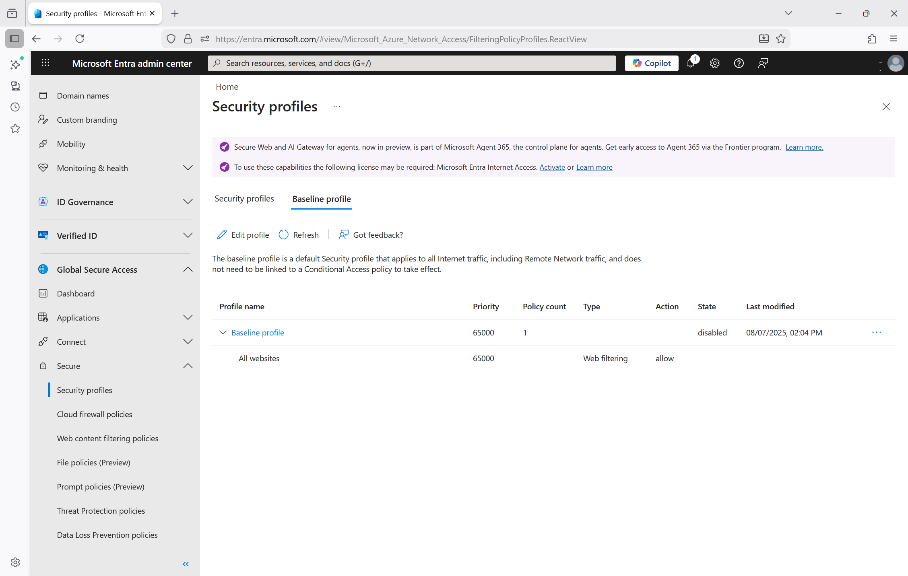
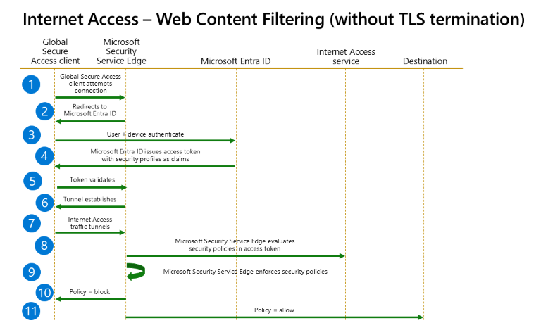

# How to configure Global Secure Access web content filtering - Global Secure Access | Microsoft Learn

## Overview

Web content filtering empowers you to implement granular Internet access controls for your organization based on website categorization.

Microsoft Entra Internet Access's first Secure Web Gateway (SWG) features include web content filtering based on domain names. Microsoft integrates granular filtering policies with Microsoft Entra ID and Microsoft Entra Conditional Access, which results in filtering policies that are user-aware, context-aware, and easy to manage.

The web filtering feature currently supports user- and context-aware Uniform Resource Locator (URL)-based web category filtering, URL filtering, and FQDN filtering.

Additionally, web content filtering supports two optional rule conditions that enable traffic-aware policy enforcement:

- **Source traffic type filtering** — Scope rules to specific traffic types such as Agent, Browser, or Application.
- **HTTP method request filtering** — Block or allow specific HTTP methods such as GET, POST, PUT, PATCH, and DELETE.

Tip

For file type-based filtering (MIME types) and integration with Microsoft Purview for data loss prevention, see [Create a content policy to filter network file content](how-to-network-content-filtering).

## Prerequisites

- Administrators who interact with **Global Secure Access** features must have one or more of the following role assignments depending on the tasks they're performing.

    - The [Global Secure Access Administrator role](/en-us/azure/active-directory/roles/permissions-reference) role to manage the Global Secure Access features.
    - The [Conditional Access Administrator](/en-us/azure/active-directory/roles/permissions-reference#conditional-access-administrator) to create and interact with Conditional Access policies.
- Complete the [Get started with Global Secure Access](quickstart-access-admin-center) guide.
- [Install the Global Secure Access client](how-to-install-windows-client) on end user devices.
- You must disable Domain Name System (DNS) over HTTPS (Secure DNS) to tunnel network traffic. Use the rules of the fully qualified domain names (FQDNs) in the traffic forwarding profile. For more information, see [Configure the DNS client to support DoH](/en-us/windows-server/networking/dns/doh-client-support#configure-the-dns-client-to-support-doh).
- Disable built-in DNS client on Chrome and Microsoft Edge.
- IPv6 traffic isn't acquired by the client and is therefore transferred directly to the network. To enable all relevant traffic to be tunneled, set the network adapter properties to [IPv4 preferred](troubleshoot-global-secure-access-client-diagnostics-health-check#ipv4-preferred).
- User Datagram Protocol (UDP) traffic (that is, QUIC) isn't supported in the current preview of Internet Access. Most websites support fallback to Transmission Control Protocol (TCP) when QUIC can't be established. For an improved user experience, you can deploy a Windows Firewall rule that blocks outbound UDP 443: `New-NetFirewallRule -DisplayName "Block QUIC" -Direction Outbound -Action Block -Protocol UDP -RemotePort 443`.
- TLS inspection must be enabled for HTTPS traffic to enforce source traffic type and HTTP method request rules. Without TLS inspection, only SNI-based WCF rules apply.
- Source traffic type filtering requires client-based Global Secure Access connections. Remote networks are not supported for source traffic type rules.
- Review web content filtering concepts. For more information, see [web content filtering](concept-internet-access).

## High level steps

There are several steps to configuring web content filtering. Take note of where you need to configure a Conditional Access policy.

1. Enable internet traffic forwarding.
2. Create a web content filtering policy.
3. Create a security profile.
4. Link the security profile to a Conditional Access policy.
5. Assign users or groups to the traffic forwarding profile.

## Enable internet traffic forwarding

The first step is to enable the Internet Access traffic forwarding profile. For more information about the profile and how to enable it, see [How to manage the Internet Access traffic forwarding profile](how-to-manage-internet-access-profile).

## Create a web content filtering policy

1. Browse to **Global Secure Access** &gt; **Secure** &gt; **web content filtering policy**.
2. Select **Create policy**.
3. Enter a name and description for the policy and select **Next**.
4. Select **Add rule**.
5. Enter a name, select a [web category](reference-web-content-filtering-categories), a valid URL, or a valid FQDN, and then select **Add**.
    - Valid URLs and FQDNs in this feature can also include wildcards using the asterisk symbol, \*, and can be comma-separated lists.
    - When entering FQDNs, use the domain name only. Don't include protocols (such as `https://`), port numbers, or URL paths. For example, enter `contoso.com` instead of `https://contoso.com:443/path`.
    - To match all subdomains of a domain, use the wildcard format `*.domain.com`. Note that the wildcard `*.domain.com` matches subdomains like `www.domain.com` but doesn't match the root domain `domain.com` itself. To cover both the domain and all its subdomains, include both entries as a comma-separated list (for example, `*.contoso.com,contoso.com`).
    - When entering multiple FQDNs in a comma-separated list, don't include spaces between entries (for example, `contoso.com,fabrikam.com,*.example.com`).
    - Note, the URL filtering Preview supports a maximum of 1,000 URLs per tenant.
6. **(Optional)** Configure the **Source Type (Public Preview)** condition. See [Configure source traffic type filtering](#configure-source-traffic-type-filtering).
7. **(Optional)** Configure the **HTTP Method Request (Public Preview)** condition. See [Configure HTTP method request filtering](#configure-http-method-request-filtering).
8. Select **Next** to review the policy and then select **Create policy**.

## Configure source traffic type filtering (Public Preview)

Source traffic type filtering allows you to scope web content filtering rules to specific types of network traffic. This enables differentiated policy enforcement based on whether traffic originates from an AI agent, a web browser, or an application.

### Supported source traffic types

| Source type | Description |
| --- | --- |
| Agent | Traffic originating from AI agents (for example, Copilot agents, autonomous AI tools) |
| Browser | Traffic originating from web browsers |
| Application | Traffic originating from desktop or mobile applications |
| Unknown | Traffic where the source type cannot be determined |

### How to configure source traffic type

1. In the web content filtering rule configuration, locate the **Source Type (Public Preview)** field.
2. Enable the **Source Type** field to include it in the rule.
3. Select the desired source traffic types to include in the rule.

> [!NOTE]
> Source traffic type filtering is only available for client-based Global Secure Access connections. This capability depends on the Global Secure Access client sending task and processor metadata to classify traffic. Remote networks are not supported for source traffic type rules.

> [!NOTE]
> When a request's traffic type cannot be determined, traffic is classified as "Unknown" and no traffic-type-specific rules match unless the admin explicitly targets "Unknown" in a rule.

### Example: Block AI agents from accessing social networking sites

To prevent AI agents from accessing social networking websites while allowing browser and application traffic:

1. Create a web content filtering policy rule.
2. Select the **SocialNetworking** web category.
3. Enable **Source Type** and select **Agent**.
4. Set the policy action to **Block**.

This configuration blocks AI agent traffic to social networking sites while allowing browser and application users to access the same sites.

## Configure HTTP method request filtering (Public Preview)

HTTP method request filtering allows you to block or allow specific HTTP methods for matching traffic. This enables admins to enforce least-privilege access by restricting write operations while permitting read-only access.

### Supported HTTP methods

| Method | Description |
| --- | --- |
| GET | Retrieve a resource |
| POST | Submit data to a resource |
| PUT | Replace a resource |
| PATCH | Partially update a resource |
| DELETE | Remove a resource |

### How to configure HTTP method request filtering

1. In the web content filtering rule configuration, locate the **HTTP Method Request (Public Preview)** field.
2. Enable the **HTTP Method Request** field to include it in the rule.
3. Select the desired HTTP methods to include in the rule.

> [!IMPORTANT]
> HTTP method enforcement requires TLS inspection for HTTPS traffic. Without TLS inspection, the SWG cannot observe HTTP method headers and only SNI-based WCF rules apply. HTTP (unencrypted) traffic is always inspectable.

### Example: Block AI agent write operations

To prevent AI agents from performing write operations (PUT, PATCH, DELETE) on enterprise resources:

1. Create a web content filtering policy rule.
2. Select the destination URLs, FQDNs, or web categories you want to protect.
3. Enable **Source Type** and select **Agent**.
4. Enable **HTTP Method Request** and select **PUT**, **PATCH**, and **DELETE**.
5. Set the policy action to **Block**.

This configuration blocks AI agent traffic from performing write operations on the specified destinations while allowing GET and other read-only methods.

## Combining source traffic type and HTTP method conditions

Source traffic type and HTTP method request conditions can be used independently or together in a single rule:

- **Source Type only** — Apply a rule to all traffic from a specific source type regardless of HTTP method.
- **HTTP Method Request only** — Apply a rule to specific HTTP methods regardless of traffic source.
- **Both conditions** — Apply a rule only when both the source traffic type AND the HTTP method match.

When both conditions are configured in a rule, a request must match both the specified source traffic type and the specified HTTP method for the rule to apply. Conditions are evaluated using AND logic across attributes.

### Policy evaluation and precedence

Policy evaluation follows existing WCF Policy Framework ordering and precedence rules:

- **Within the same attribute**: OR logic (matching any selected value triggers the condition).
- **Across attributes**: AND logic (all configured conditions must match).
- **Conflicting actions**: When multiple policies match with conflicting actions, the most restrictive wins (Block &gt; Allow).

## Create a security profile

Security profiles are a grouping of filtering policies. You can assign, or link, security profiles with Microsoft Entra Conditional Access policies. One security profile can contain multiple filtering policies. And one security profile can be associated with multiple Conditional Access policies.

In this step, you create a security profile to group filtering policies. Then you assign, or link, the security profiles with a Conditional Access policy to make them user or context aware.

Note

For more information about Microsoft Entra Conditional Access policies, see [Building a Conditional Access policy](/en-us/azure/active-directory/conditional-access/concept-conditional-access-policies).

1. Browse to **Global Secure Access** &gt; **Secure** &gt; **Security profiles**.
2. Select **Create profile**.
3. Enter a name and description for the policy and select **Next**.
4. Select **Link a policy** and then select **Existing policy**.
5. Select the web content filtering policy you already created and select **Add**.
6. Select **Next** to review the security profile and associated policy.
7. Select **Create a profile**.
8. Select **Refresh** to refresh the profiles page and view the new profile.

## Create and link Conditional Access policy

Create a Conditional Access policy for end users or groups and deliver your security profile through Conditional Access Session controls. Conditional Access is the delivery mechanism for user and context awareness for Internet Access policies. For more information about session controls, see [Conditional Access: Session](/en-us/azure/active-directory/conditional-access/concept-conditional-access-session).

1. Sign in to the [Microsoft Entra admin center](https://entra.microsoft.com) as at least a [Conditional Access Administrator](../identity/role-based-access-control/permissions-reference#conditional-access-administrator).
2. Browse to **Entra ID** &gt; **Conditional Access** &gt; **Policies**.
3. Select **New policy**.
4. Give your policy a name. Organizations should create a meaningful standard for the names of their policies.
5. Under **Assignments**, select **Users or workload identities**.
    1. Under **Include**, select **All users**
6. Select **Target resources** and **All internet resources with Global Secure Access**.
7. Select **Session** &gt; **Use Global Secure Access security profile** and choose a security profile.
8. Select **Select**.
9. In the **Enable policy** section, ensure **On** is selected.
10. Select **Create**.

Note

Explicit Forward Proxy (EFP) preview is not currently included in the **All internet resources with Global Secure Access** group. If your users use Explicit Forward Proxy (preview), please follow [How to configure EFP Conditional Access Policies](how-to-configure-conditional-access-policy-for-explicit-forward-proxy)

## Enable web content filtering for remote network traffic

Remote network connectivity allows you to connect branch offices and other remote locations to Global Secure Access without installing the client on individual devices. For more information about remote network connectivity, see [Global Secure Access remote network connectivity](concept-remote-network-connectivity).

You can use the baseline security profile to apply tenant-wide web content filtering policies to all remote network traffic. The baseline profile enforces policies at the lowest priority in the policy stack and applies to all Internet Access traffic routed through the service, making it ideal for securing remote network locations.

> [!IMPORTANT]
> Source traffic type filtering is not supported for remote network traffic. Source traffic type rules require the Global Secure Access client to provide task and processor metadata for traffic classification. Web category, URL, FQDN, and HTTP method rules without source traffic type conditions can still be applied to remote networks via the baseline profile.

# [Microsoft Entra admin center](#tab/microsoft-entra-admin-center)
1. Browse to **Global Secure Access** &gt; **Secure** &gt; **Security profiles** &gt; **Baseline profile**.
2. Select **Link a policy** and then select **Existing policy**.
3. Select the web content filtering policy you want to apply to remote network traffic and select **Add**.
4. The baseline profile automatically applies to all remote network traffic without requiring a Conditional Access policy.

    [](media/how-to-configure-web-content-filtering/baseline-profile-security-profiles.png#lightbox)

Note

The baseline security profile applies to all traffic routed through Global Secure Access, including both client-based and remote network traffic. No Conditional Access policy configuration is required for remote network traffic, as the baseline profile enforces policies by default.

# [Microsoft Graph API](#tab/microsoft-graph-api)
You can also configure the baseline profile programmatically using Microsoft Graph network access APIs. For a complete tutorial, see [Configure Microsoft Entra Internet Access using Microsoft Graph APIs](/en-us/graph/tutorial-entra-internet-access).

1. Open a web browser and navigate to **Graph Explorer** at https://aka.ms/ge.
2. Select **GET** as the HTTP method from the dropdown.
3. Set the API version to **beta**.
4. Enter the following query to retrieve the baseline profile ID: 

    ```
    GET https://graph.microsoft.com/beta/networkaccess/filteringProfiles
    ```
5. Select **Run query** and find the baseline profile ID (priority 65,000).
6. Create a web content filtering policy: 

    ```
    POST https://graph.microsoft.com/beta/networkaccess/filteringPolicies
    Content-type: application/json
    
    {
      "name": "Block Social Media for Remote Networks",
      "policyRules": [
        {
          "@odata.type": "#microsoft.graph.networkaccess.webCategoryFilteringRule",
          "name": "Block Social Media",
          "ruleType": "webCategory",
          "destinations": [
            {
              "@odata.type": "#microsoft.graph.networkaccess.webCategory",
              "name": "SocialNetworking"
            }
          ]
        }
      ],
      "action": "block"
    }
    ```
7. Link the policy to the baseline profile: 

    ```
    POST https://graph.microsoft.com/beta/networkaccess/filteringProfiles/{baseline-profile-id}/policies
    Content-type: application/json
    
    {
      "priority": 100,
      "state": "enabled",
      "@odata.type": "#microsoft.graph.networkaccess.filteringPolicyLink",
      "loggingState": "enabled",
      "policy": {
        "id": "<filtering-policy-id>",
        "@odata.type": "#microsoft.graph.networkaccess.filteringPolicy"
      }
    }
    ```
8. Select **Run query** to link the policy.

---

For more information on applying security policies to remote networks, see [Apply security policies to remote network traffic](how-to-apply-security-policies-remote-network).

## Internet Access flow diagram

This example demonstrates the flow of Microsoft Entra Internet Access traffic when you apply web content filtering policies.

The following flow diagram illustrates web content filtering policies blocking or allowing access to internet resources.

[](media/how-to-configure-web-content-filtering/internet-access-web-content-filtering-expanded.png#lightbox)

| Step | Description |
| --- | --- |
| 1 | The Global Secure Access client attempts to connect to Microsoft's Security Service Edge solution. The client includes task and processor metadata for source traffic type classification. |
| 2 | The client redirects to Microsoft Entra ID for authentication and authorization. |
| 3 | The user and device authenticate. Authentication happens seamlessly when the user has a valid Primary Refresh Token (PRT). |
| 4 | After the user and device authenticate, Conditional Access matches on Internet Access Conditional Access rules and adds applicable security profiles to the token. It enforces applicable authorization policies. |
| 5 | Microsoft Entra ID presents the token to Microsoft Security Service Edge for validation. |
| 6 | The tunnel establishes between the Global Secure Access client and Microsoft Security Service Edge. |
| 7 | Traffic starts being acquired and tunnels through the Internet Access tunnel. |
| 8 | Microsoft Security Service Edge evaluates the security policies in the access token in priority order. It evaluates source traffic type, HTTP method, web category, URL, and FQDN conditions. After it matches on a web content filtering rule, web content filtering policy evaluation stops. |
| 9 | Microsoft Security Service Edge enforces the security policies. |
| 10 | Policy = block results in an error for HTTP traffic or a connection reset exception occurs for HTTPS traffic. |
| 11 | Policy = allow results in traffic forwarding to the destination. |

Note

Applying a new security profile can take up to 60-90 minutes due to security profile enforcement with access tokens. The user must receive a new access token with the new security profile ID as a claim before it takes effect. Changes to existing security profiles start being enforced much more quickly.

## User and group assignments

You can scope the Internet Access profile to specific users and groups. For more information about user and group assignment, see [How to assign and manage users and groups with traffic forwarding profiles](how-to-manage-users-groups-assignment).

## Verify end user policy enforcement

When traffic reaches Microsoft's Secure Service Edge, Microsoft Entra Internet Access performs security controls in two ways. For unencrypted HTTP traffic, it uses the Uniform Resource Locator (URL). For HTTPS traffic encrypted with Transport Layer Security (TLS), it uses the Server Name Indication (SNI).

Use a Windows device with the Global Secure Access client installed. Sign in as a user that is assigned the Internet traffic acquisition profile. Test that navigating to websites is allowed or restricted as expected.

1. Right-click on the Global Secure Access client icon in the task manager tray and open **Advanced Diagnostics** &gt; **Forwarding profile**. Ensure that the Internet access acquisition rules are present. Also, check if the hostname acquisition and flows for the users Internet traffic are being acquired while browsing.
2. Navigate to allowed and blocked sites and check if they behave properly. Browse to **Global Secure Access** &gt; **Monitor** &gt; **Traffic logs** to confirm traffic is blocked or allowed appropriately.
3. To verify source traffic type and HTTP method request rules, generate traffic from different source types (for example, use an AI agent to send a PATCH request to a protected resource) and confirm that the rule enforces correctly in Traffic logs.

The current blocking experience for all browsers includes a plaintext browser error for HTTP traffic and a "Connection Reset" browser error for HTTPS traffic.


Note

Configuration changes in the Global Secure Access experience related to web content filtering typically take effect in less than 5 minutes. Configuration changes in Conditional Access related to web content filtering take effect in approximately one hour.

Note

To expedite Conditional Access configuration changes *for testing*, revoke user sessions in the Microsoft Entra admin center (select **Revoke sessions** on the user's overview page). This forces users to obtain new tokens with updated policies. Learn more about [Continuous Access Evaluation](concept-universal-continuous-access-evaluation).

## Known limitations

- Source traffic type filtering is only supported for client-based Global Secure Access connections. Remote networks do not support source traffic type rules.
- HTTP method request enforcement requires TLS inspection for HTTPS traffic. Without TLS inspection, HTTP method headers are not visible and only SNI-based WCF rules apply.
- When the Global Secure Access client cannot determine task or processor information, traffic is classified as "Unknown."
- Source traffic type classification accuracy depends on the Global Secure Access client's ability to inspect process metadata on the endpoint device.
