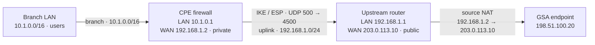
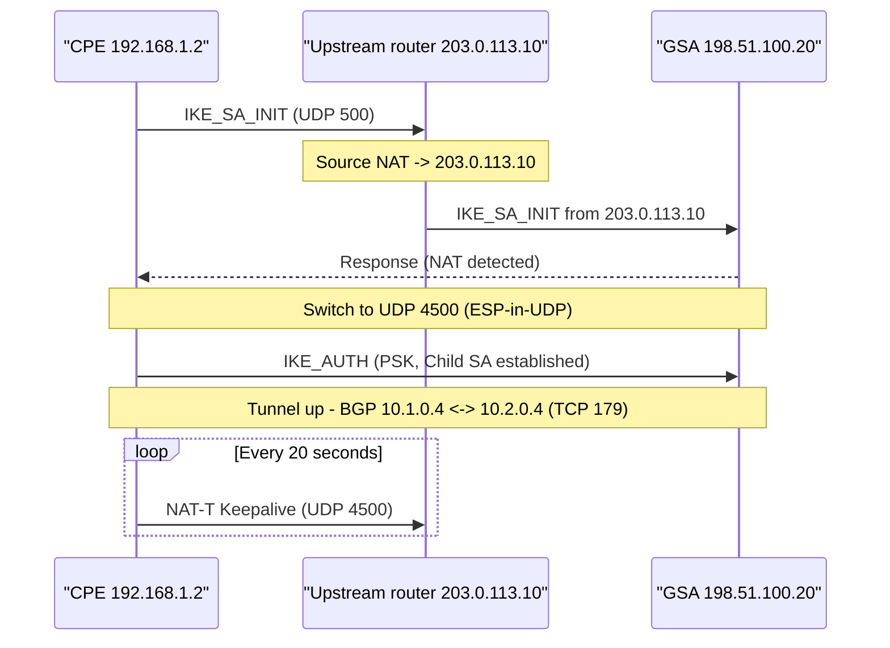

# How to connect a Global Secure Access remote network when your CPE is behind a NAT device

Global Secure Access (GSA) remote networks connect a branch office or site to Microsoft's Security Service Edge over an IPsec tunnel between your customer premises equipment (CPE) - a router or firewall at the site - and the nearest GSA endpoint. GSA operates in **responder** mode, so the CPE always **initiates** the connection.

In the standard topology, the CPE has a public IP address on its WAN interface and dials out to GSA directly. This article covers a common, fully supported variation:

> The CPE sits behind an upstream router that performs Network Address Translation (NAT). As a result, the CPE's WAN interface holds only a *private* IP address, and the *public* IP belongs to the upstream device.

The upstream device might be an ISP-provided modem/router, an SD-WAN edge, a carrier CPE, or another firewall. This works because of **NAT Traversal (NAT-T)**, a standard part of IKEv2. This article explains the concept, shows how the connection is established, and describes how to configure the GSA remote network for this topology.

This article is a companion to [How to create a remote network with Global Secure Access](how-to-create-remote-networks.md). Read that procedure first; this article only calls out what changes when a NAT device sits in front of the CPE.

## Scenario overview

| Element | Value |
| --- | --- |
| CPE role | IPsec **initiator** and BGP peer |
| GSA role | IPsec **responder** and BGP peer |
| CPE WAN interface | **Private** IP address |
| Upstream router | Holds the **public** IP; performs source NAT/PAT; pure IP transit |
| Traffic path | Branch LAN &rarr; CPE &rarr; upstream NAT router &rarr; internet &rarr; GSA endpoint |
| Enabling mechanism | NAT Traversal (NAT-T), UDP 4500 |

The examples throughout this article use the following addresses. All are RFC 5737 (public examples), RFC 1918 (private), or RFC 6996 (private ASN) values.

There are three distinct segments here. The **branch LAN** (`10.1.0.0/16`) sits behind the CPE and is the network advertised to GSA over BGP. The **uplink segment** (`192.168.1.0/24`) is the private handoff between the CPE's WAN interface (`192.168.1.2`) and the upstream router. Beyond the router is the **public** side out to GSA.

The solid path is what the packets physically traverse; the upstream router rewrites the source address along the way. The **IPsec tunnel and the BGP session terminate on the CPE and GSA only** - the upstream router never participates in IPsec or BGP. It simply forwards, and NATs, the outer UDP packets.

## Prerequisites

The CPE must meet the standard GSA remote network requirements: support for IPsec, IKEv2, GCMAES128/192/256 for phase 2, BGP, and route-based VPN with any-to-any (`0.0.0.0/0`) traffic selectors. Review [Remote network valid configurations](reference-remote-network-configurations.md).

Additionally, for this topology:

- The CPE must support and have **NAT-T enabled** (UDP 4500).
- The upstream router must **allow UDP 500 and 4500 outbound** and the corresponding return traffic.
- The upstream router's public IP should be **static**. A dynamic public IP breaks the tunnel whenever it changes and requires reconfiguration.

## NAT Traversal (NAT-T) background

### Why NAT breaks IPsec, and what NAT-T does

An IPsec tunnel uses two protocols on the wire:

- **IKE (Internet Key Exchange)** runs over **UDP port 500** and negotiates the security associations (keys, ciphers, lifetimes).
- **ESP (Encapsulating Security Payload)** carries the encrypted traffic. ESP is **IP protocol 50** - it is *not* a TCP or UDP protocol, so **it has no port numbers**.

A NAT device that performs Port Address Translation (PAT) - which is what most ISP routers do - tracks and de-multiplexes flows by port number. Because ESP has no ports, the NAT device has nothing to build a translation entry on, and the return packet can't be mapped back to the originating device. NAT also rewrites the source IP address, which breaks any peer identification or integrity check that depends on the original address.

NAT-T solves this in three parts:

- **NAT detection.** During the initial IKE exchange (`IKE_SA_INIT`), both peers send `NAT_DETECTION_SOURCE_IP` and `NAT_DETECTION_DESTINATION_IP` payloads - hashes of the IP and port each peer *believes* it's using. If a NAT rewrote the address in transit, the received hash doesn't match, and the peer concludes a NAT is present.
- **Port float and UDP encapsulation.** Once a NAT is detected, both sides move IKE from UDP 500 to **UDP 4500**, and ESP is wrapped in a UDP header - *ESP-in-UDP*, per RFC 3948 - also on UDP 4500. The encrypted payload now carries a port number, so the NAT device can build a normal translation entry and route return traffic correctly.
- **Keepalives.** NAT-T keepalives (a small periodic packet on UDP 4500) keep the NAT translation entry alive so it doesn't age out during idle periods.

### How the connection is established

When the CPE initiates, the upstream router applies source NAT, replacing the CPE's private WAN IP (`192.168.1.2`) with its own public IP (`203.0.113.10`). GSA detects the address mismatch, both peers float to UDP 4500 and encapsulate ESP in UDP, and authentication completes on the pre-shared key rather than the source IP. The route-based tunnel then comes up, and BGP peers over the tunnel on the inner addresses. The upstream router only ever forwards the outer UDP packets - it never sees the tunnel's plaintext, the IKE identity, or the BGP session.

## Device roles

The key architectural point: **the CPE performs both IPsec and BGP; the upstream router performs neither.**

| Device | IPsec role | BGP role | Function |
| --- | --- | --- | --- |
| **CPE (firewall/router)** | Initiator; terminates the IKEv2 route-based tunnel | BGP speaker; advertises on-premises prefixes, learns GSA routes | Encrypts, decrypts, runs the tunnel and dynamic routing |
| **Upstream router** | None | None | Source NAT/PAT and IP forwarding of UDP 500/4500. Pure transit - never sees plaintext, never joins the SA or BGP session |
| **GSA endpoint** | Responder | BGP peer (Microsoft ASN) | Terminates Microsoft's side; applies traffic-forwarding policy |

## Set up the remote network for this scenario

The procedure follows the same steps as the base article. Only the highlighted items differ when the CPE is behind NAT.

### Step 1: Basics

Enter the **Name** and **Region** of the remote network in the Microsoft Entra admin center. No change for this scenario.

### Step 2: Connectivity - the key difference

When you add the device link, GSA identifies the incoming tunnel by the public source IP it observes and requires that the public IP you configure matches what arrives.

> [!IMPORTANT]
> Enter the **upstream router's public IP** (`203.0.113.10`) as the device's public IP - *not* the CPE's private WAN IP (`192.168.1.2`). The address GSA sees after NAT is the upstream router's public address, so that's the value the device link must contain. Entering the CPE's private WAN IP is the most common cause of failure in this topology.

Enter these values in the device link:

| Microsoft Entra admin center field | Example value | Meaning |
| --- | --- | --- |
| **Device IP address** | `203.0.113.10` | The CPE's public IP as GSA observes it - the **upstream router's public IP** in this scenario |
| **Device BGP address** | `10.1.0.4` | The CPE's own BGP address |
| **Device ASN** | `65001` | The CPE's ASN |
| **Local BGP address** | `10.2.0.4` | GSA's own BGP address; entered as the **peer** BGP address on the CPE |

The local and peer BGP addresses are reversed between the two sides:

- **Branch LAN**: `10.1.0.0/16`.
- **CPE**: Local BGP address = `10.1.0.4`, peer BGP address = `10.2.0.4`.
- **GSA (Microsoft Entra)**: Device BGP address (also called peer) = `10.1.0.4`, Local BGP address = `10.2.0.4`.

> [!NOTE]
> **Why the router's public IP but the CPE's BGP address and ASN?** The public IP is an *outer* (transport) attribute - it's what GSA sees on the wire after the router's source NAT, so it must be the router's public address. The BGP address and ASN are *inner* attributes that ride encrypted inside the tunnel, untouched by NAT, so they stay the CPE's own. The upstream router terminates neither the tunnel nor BGP and has no interface on the inner network, so none of its addresses are candidates for the BGP address.

> [!NOTE]
> **Choosing the BGP addresses.** The GSA-side (Local) BGP address is an inner-plane identity the CPE reaches **over the tunnel** via a static route, so it must be a private address that sits outside every prefix the CPE routes on-premises or treats as directly connected. In this topology that means two ranges: the branch LAN (`10.1.0.0/16`) and the uplink segment (`192.168.1.0/24`). If the address overlaps a connected subnet, the CPE tries to reach it on the physical wire (ARP) instead of through the tunnel, and **BGP never establishes even though the IPsec tunnel is up**. The CPE and GSA addresses therefore live in different ranges - here `10.1.0.4` inside your space and `10.2.0.4` outside it. Avoid the reserved values listed in [Remote network valid configurations](reference-remote-network-configurations.md).

### Step 3: Traffic forwarding profile

Associate a traffic forwarding profile with the remote network. To avoid silently dropping traffic at the GSA gateway, associate **both** the Microsoft traffic profile and the Internet Access traffic profile where your licensing permits. No change for this scenario.

### Step 4: View CPE connectivity configuration

Retrieve Microsoft's side of the connection from **View configuration**: Microsoft's public IP endpoint (`198.51.100.20` in this example), its BGP address (`10.2.0.4`), and its ASN. Enter these on the CPE.

### Step 5: Set up the CPE

Configure the CPE in its own management console using Microsoft's values from Step 4. In addition to the standard tunnel and BGP settings, apply the NAT-specific items in the checklist below.

### Configuration checklist

| Area | Setting |
| --- | --- |
| **Public IP in GSA** | The **upstream router's public IP** (`203.0.113.10`). Never the CPE's private WAN IP. |
| **NAT-T on the CPE** | Enabled (auto-detect). If detection is unreliable through the upstream device, force NAT-T. UDP 4500 must be permitted end to end. |
| **Keepalives and DPD** | Enable NAT-T keepalives and Dead Peer Detection so the upstream router's translation entry stays open (GSA can't reinitiate inbound). |
| **Authentication** | The pre-shared key must match GSA exactly. Identify the peer by key/IKE identity, not by IP. |
| **Crypto policy** | Phase 1 and phase 2 algorithms must match the GSA device link (default or custom IKE policy), using GCMAES. |
| **VPN type** | Route-based (virtual tunnel interface) with any-to-any (`0.0.0.0/0`) traffic selectors. |
| **BGP** | ASNs must differ. Local/peer addresses are reversed versus GSA. Add a static route to GSA's BGP address (`10.2.0.4`) over the tunnel interface so the CPE learns advertised routes. |
| **Firewall rules** | Allow UDP 500 and 4500 and TCP 179 for the tunnel and BGP. |
| **Upstream router** | Allow UDP 500/4500; **disable any IPsec/VPN-passthrough ALG**; use a generous UDP session timeout. |
| **MTU / MSS** | Clamp TCP MSS on the tunnel interface to avoid fragmentation. |

## Verify and troubleshoot

**Phase 1 (IKE) fails or GSA never responds.**

- Confirm the public IP in the GSA device link matches the **upstream router's public IP**.
- Confirm the upstream router isn't remapping UDP 500 in a way that breaks detection, and that no IPsec/VPN-passthrough ALG is interfering. If the upstream device mangles the IKE port, port-forwarding UDP 500/4500 through to the CPE resolves it.
- Confirm the pre-shared key and crypto policy match on both ends.

**The tunnel drops when idle.**

- Enable NAT-T keepalives and DPD on the CPE.
- Increase the UDP session timeout on the upstream router so the NAT mapping doesn't age out.

**The tunnel is up but BGP won't establish.**

- Verify the static route to GSA's BGP address (`10.2.0.4`) points over the tunnel interface.
- Verify the two ASNs are different and the local/peer BGP addresses are correctly reversed between the CPE and GSA.

**Large packets or some flows fail intermittently.**

- Clamp TCP MSS and/or lower the tunnel MTU to account for ESP and NAT-T overhead.

**The public IP changes.**

- A changing public IP on the upstream router invalidates the device link. Use a static public IP, or delete and recreate the link with the new address.

## Related content

- [How to create a remote network with Global Secure Access](how-to-create-remote-networks.md)
- [Remote network valid configurations reference](reference-remote-network-configurations.md)
- [How to configure customer premises equipment](how-to-configure-customer-premises-equipment.md)
- [How to manage remote network device links](how-to-manage-remote-network-device-links.md)
