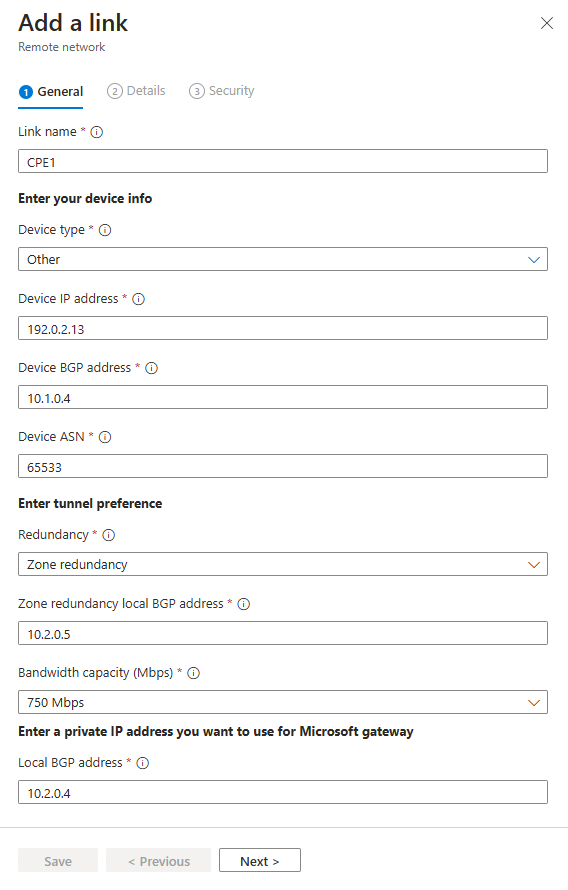
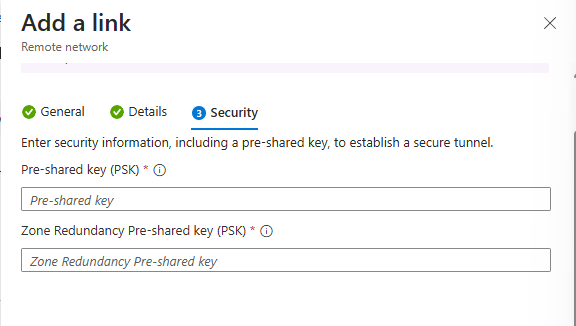

# Create a remote network with a custom IKE policy for Global Secure Access

IPSec tunnel is a bidirectional communication. This article provides the steps to set up the communication channel in Microsoft Entra admin center and the Microsoft Graph API. The other side of the communication is configured on your customer premises equipment (CPE).

## Prerequisites

To create a remote network with a custom IKE policy, you must have:

- A **Global Secure Access Administrator** role in Microsoft Entra ID.
- Received the connectivity information from Global Secure Access onboarding.
- The product requires licensing. For details, see the licensing section of [What is Global Secure Access](overview-what-is-global-secure-access.md). If needed, you can [purchase licenses or get trial licenses](https://aka.ms/azureadlicense).

## How to create a remote network with a custom IKE policy

If you prefer to add custom IKE policy details to your remote network, you can do so when you add the device link to your remote network. You can complete this step in the Microsoft Entra admin center or using the Microsoft Graph API.

### [Microsoft Entra admin center](#tab/microsoft-entra-admin-center)

To create a remote network with a custom IKE policy in the Microsoft Entra admin center:

1. Sign in to the [Microsoft Entra admin center](https://entra.microsoft.com) as a [Global Secure Access Administrator](/azure/active-directory/roles/permissions-reference#global-secure-access-administrator).

1. Browse to **Global Secure Access** > **Devices** > **Remote network**.

1. Select the **Create remote network** button.

    

1. Provide a name and region for your remote network and select the **Next** button.

1. Select the **+ Add a link** button to add the connectivity details of your CPE.

    

### Add a link - General tab

There are several details to enter on the General tab. Pay close attention to the Peer and Local BGP addresses. *The peer and local details are reversed, depending on where the configuration is completed.*



1. Enter the following details:
    - **Link name**: Name of your CPE.
    - **Device type**: Choose a device option from the dropdown list.
    - **IP address**: Public IP address of your device.
    - **Peer BGP address**: Enter the BGP IP address of your CPE.
        - This address is entered as the *local* BGP IP address on the CPE.
    - **Local BGP address**: Enter a BGP IP address that is *not* part of your on-premises network where your CPE resides.
        - For example, if your on-premises network is 10.1.0.0/16, then you can use 10.2.0.4 as your Local BGP address.
        - This address is entered as the *peer* BGP​​ IP address on your CPE.
        - Refer to the [valid BGP addresses](reference-remote-network-configurations.md#valid-bgp-addresses) list for reserved values that can't be used.
    - **Link ASN**: Provide the autonomous system number (ASN) of the CPE.
        - A BGP-enabled connection between two network gateways requires that they have different ASNs.
    - Refer to the [valid ASN values](reference-remote-network-configurations.md#valid-asn) list for reserved values that can't be used.
    - **Redundancy**: Select either *No redundancy* or *Zone redundancy* for your IPSec tunnel.
    - **Zone redundant local BGP address**: This optional field shows up only when you select **Zone redundancy**.
        - Enter a BGP IP address that is *not* part of your on-premises network where your CPE resides *and* is different from **Local BGP address**.
    - **Bandwidth capacity (Mbps)**: Specify tunnel bandwidth. Available options are 250, 500, 750, and 1000 Mbps.
1. Select the **Next** button.

### Add a link - Details tab

> [!IMPORTANT]
> You must specify both a Phase 1 *and* Phase 2 combination on your CPE.

1. **IKEv2** is selected by default. Currently only IKEv2 is supported.

1. Change the **IPSec/IKE policy** to **Custom**.

1. Select your Phase 1 combination details for **Encryption**, **IKEv2 integrity** and **DHGroup**.
    - The combination of details you select must align with the available options listed in the [Remote network valid configurations](reference-remote-network-configurations.md) reference article.

1. Select your Phase 2 combinations for **IPsec encryption**, **IPsec integrity**, **PFS group** and **SA lifetime (seconds)**.
    - The combination of details you select must align with the available options listed in the [Remote network valid configurations](reference-remote-network-configurations.md) reference article.

1. Whether you choose Default or Custom, the IPSec/IKE policy you specify must match the crypto policy on your CPE.

1. Select the **Next** button.

    

### Add a link Security tab

1. Enter the Pre-shared key (PSK). The same secret key must be used on your CPE.
1. Select the **Save** button.



### [Microsoft Graph API](#tab/microsoft-graph-api) 

Remote networks with a custom IKE policy can be created using Microsoft Graph on the `/beta` endpoint.

1. Sign in to [Graph Explorer](https://aka.ms/ge).
1. Select **POST** as the HTTP method from the dropdown.
1. Set the API version to **beta**.
1. Add the following query, then select the **Run query** button.

```http
    POST https://graph.microsoft.com/beta/networkaccess/connectivity/branches
{
    "name": "BranchOffice_CustomIKE",
    "region": "eastUS", 
    "deviceLinks": [
        {
            "name": "custom link",
            "ipAddress": "114.20.4.14",
            "deviceVendor": "ciscoMeraki",
            "tunnelConfiguration": {
                "saLifeTimeSeconds": 300,
                "ipSecEncryption": "gcmAes128",
                "ipSecIntegrity": "gcmAes128",
                "ikeEncryption": "aes128",
                "ikeIntegrity": "sha256",
                "dhGroup": "ecp384",
                "pfsGroup": "ecp384",
                "@odata.type": "#microsoft.graph.networkaccess.tunnelConfigurationIKEv2Custom",
                "preSharedKey": "SHAREDKEY"
            },
            "bgpConfiguration": {
                "localIpAddress": "10.1.1.11",
                "peerIpAddress": "10.6.6.6",
                "asn": 65000
            },
            "redundancyConfiguration": {
                "redundancyTier": "zoneRedundancy",
                "zoneLocalIpAddress": "10.1.1.12"
            },
            "bandwidthCapacityInMbps": "mbps250"
        }
    ]
}
```

---


## Next steps

- [How to manage remote networks](how-to-manage-remote-networks.md)
- [How to manage remote network device links](how-to-manage-remote-network-device-links.md)
