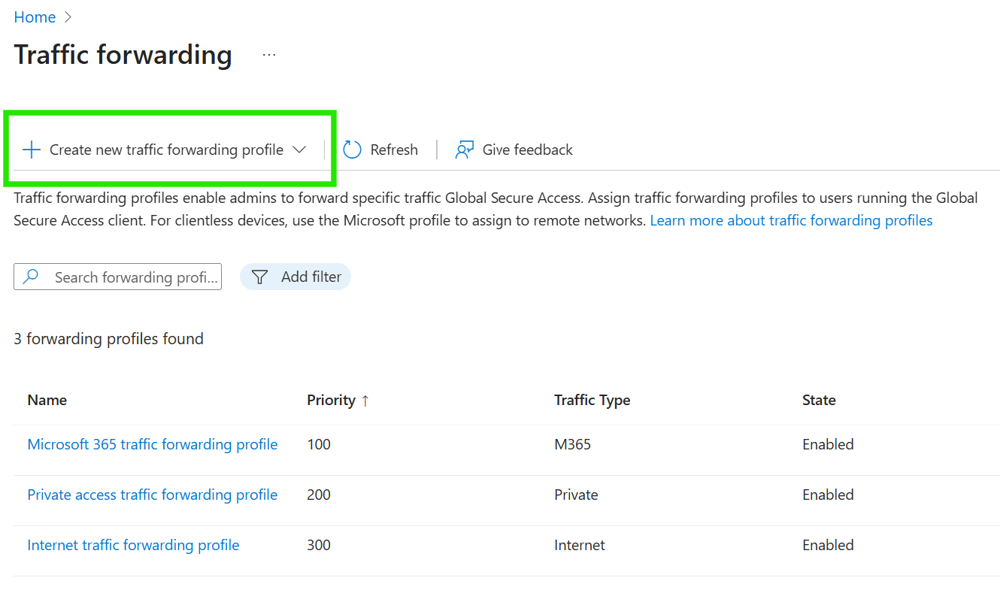
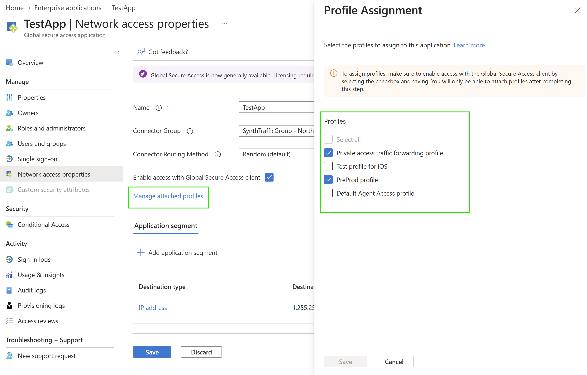

# Create a Private Access traffic forwarding profile

Global Secure Access includes a default traffic forwarding profile for each traffic type. You can create custom Private Access traffic forwarding profiles to:

- Provide different sets of private applications to different users or devices.
- Use separate profiles for desktop and mobile device platforms.
- Roll out Private Access to selected users, groups, or devices.
- Control which profile takes precedence when more than one profile applies.

> [!NOTE]
> Creating custom traffic forwarding profiles is currently in preview. This information relates to a prerelease product that might be substantially modified before release. Microsoft makes no warranties, expressed or implied, with respect to the information provided here. For more information, see the [Microsoft Entra preview terms](https://azure.microsoft.com/support/legal/preview-supplemental-terms/).
> 
> During preview, you can create up to 10 custom Private Access traffic forwarding profiles.

## Prerequisites

To create a Private Access traffic forwarding profile, you must have:

- A [Global Secure Access Administrator](../identity/role-based-access-control/permissions-reference.md#global-secure-access-administrator) role in Microsoft Entra ID.
- An [Application Administrator](../identity/role-based-access-control/permissions-reference.md#application-administrator) role to manage Private Access applications.
- A Microsoft Entra Private Access or Microsoft Entra Suite license. For more information, see the licensing section of [What is Global Secure Access](overview-what-is-global-secure-access.md).
- A tenant onboarded to Global Secure Access.
- The latest Global Secure Access client installed on applicable end-user devices.

## Create a profile

1. Sign in to the [Microsoft Entra admin center](https://entra.microsoft.com) as a Global Secure Access Administrator.
1. Browse to **Global Secure Access** > **Connect** > **Traffic forwarding**.
1. Select **Create new traffic forwarding profile**, and then select **Private access profile**.

   

1. Enter the profile settings:

   - **Profile name**: Enter a unique, descriptive name.
   - **Description**: Describe the users, devices, or applications intended for the profile.
   - **Priority**: Enter a value from 101 through 199. If multiple Private Access profiles apply to the same user and device, only the applicable profile with the highest priority is used.
   - **Status**: Select **Enabled** to make the profile available after you configure its acquisition rules and assignments.

1. Select **Next**, review the settings, and then select **Create**.

The new profile is created without application acquisition rules or assignments. Configure both before using the profile.

## Configure acquisition rules

1. From **Global Secure Access** > **Connect** > **Traffic forwarding**, select the custom profile.
1. Select **Acquisition rules**.
1. Configure **Quick Access** to include or exclude Quick Access destinations.
1. Select the applications link, such as **0 Applications selected**.
1. Select the Private Access applications to include, and then select **Select**.

   

Use **Select all** if most applications should be included, and then remove the applications that you want to exclude.

## Attach an application from its properties

You can also associate a Private Access application with one or more profiles from the application:

1. Browse to **Global Secure Access** > **Applications** > **Enterprise applications**.
1. Select the Private Access application.
1. Select **Network access properties**.
1. Select **Manage attached profiles**.
1. Select one or more traffic forwarding profiles, and then select **Save**.

   

## Configure assignments

After you select the applications for the profile, assign the profile to the intended users, groups, devices, and device platforms. Assignment conditions are evaluated together, and profile priority resolves cases where multiple profiles apply.

For detailed steps, see [Assign users and devices to traffic forwarding profiles](how-to-manage-users-groups-assignment.md).

## Next steps

- [Manage Private Access traffic forwarding profiles](how-to-manage-private-access-profile.md)
- [Delete a Private Access traffic forwarding profile](how-to-delete-traffic-forwarding-profile.md)
- [Assign users and devices to traffic forwarding profiles](how-to-manage-users-groups-assignment.md)
