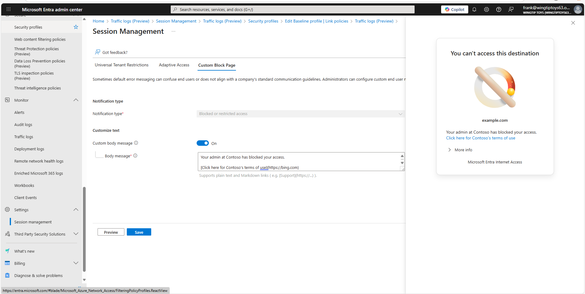

# How to customize Global Secure Access block page (preview)

Use custom block pages to display organization-specific messaging internet access policies block users from accessing websites.

## Prerequisites

- Configure [Transport Layer Security (TLS) inspection](./how-to-transport-layer-security.md).
- Configure [web content filtering](./how-to-configure-web-content-filtering.md) and/or [threat intelligence filtering](./how-to-configure-threat-intelligence.md).
- Ensure you have the [Global Secure Access Administrator role](/azure/active-directory/roles/permissions-reference) or equivalent role in Microsoft Entra ID assigned.

## Overview

The custom block page empowers you to customize the default body of the page from, "It's been restricted by your organization." you configure and preview tailored messaging to coincide with your organization's style guide when internet access policies block a user's request to access an internet resource.

## Configure a custom block page

1. Navigate to **Global Secure Access** > **Settings** > **Session management** > **Custom Block Page**
2. Switch **Custom body message** to **On**.
3. Configure the Customized body message you would prefer. For example, `Your admin at Contoso has blocked your access.`
4. (Optional) Paste one or multiple clickable links via limited markdown language (for example, `[click here](https://bing.com)`).
5. Preview the customized message with the **Preview** button.
6. Select **Save** to save the custom block page.

> [!NOTE]
> A known transient issue in public preview could result in the configuration failing. While the Microsoft team works on a fix, the current mitigation is to reconfigure the custom block page and try again.

## Verify the block page

1. From a device with the Global Secure Access client installed and the Internet Access traffic forwarding profile enabled, attempt to navigate to a site that your policy blocks.
2. Observe the block experience and confirm the custom messaging displays.

## Notes and limitations

- The Custom body message is limited to 1024 Unicode (utf-8) characters.
- Changes to a custom block page might take a few minutes to propagate to active sessions.
- Custom block pages appear for TLS inspected traffic only.
- A known transient issue in public preview could result in the configuration failing. While Microsoft team works on a fix, the current mitigation is to reconfigure the custom block page and try again.
- Ensure any contact information you publish complies with your organization's privacy policies.

## Next steps

- If you need features beyond the preview's capabilities (richer templates, localization, or analytics), collect feedback and request expanded preview access from the product team.
- For guidance on configuring web content filtering, see [Configure web content filtering](./how-to-configure-web-content-filtering.md).
- For guidance on configuring threat intelligence, see [Configure threat intelligence](./how-to-configure-threat-intelligence.md).