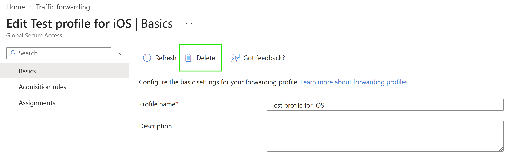

# Delete a Private Access traffic forwarding profile

You can delete a custom Private Access traffic forwarding profile when your organization no longer needs its acquisition rules or assignments.

Default traffic forwarding profiles are created by the service and can't be deleted. Deleted custom profiles can't be restored.

> [!IMPORTANT]
> Before deleting a custom profile, review its application, user, group, device, and device-platform assignments. Move any required configuration to another profile before you delete it.

## Prerequisites

To delete a custom Private Access traffic forwarding profile, you must have:

- A [Global Secure Access Administrator](../identity/role-based-access-control/permissions-reference.md#global-secure-access-administrator) role in Microsoft Entra ID.
- A custom Private Access traffic forwarding profile.

## Delete a custom profile

1. Sign in to the [Microsoft Entra admin center](https://entra.microsoft.com) as a Global Secure Access Administrator.
1. Browse to **Global Secure Access** > **Connect** > **Traffic forwarding**.
1. Select the custom Private Access traffic forwarding profile that you want to delete.
1. Select **Delete** from the command bar.

   

1. Review the confirmation, and then confirm the deletion.

The deleted profile no longer applies to its assigned users or devices.

## Next steps

- [Create a Private Access traffic forwarding profile](how-to-create-traffic-forwarding-profile.md)
- [Manage Private Access traffic forwarding profiles](how-to-manage-private-access-profile.md)
- [Assign users and devices to traffic forwarding profiles](how-to-manage-users-groups-assignment.md)
