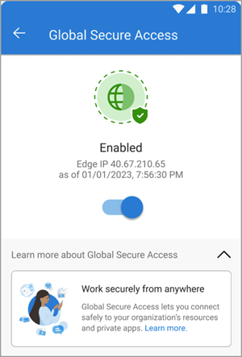

# Global Secure Access Client for Android (preview)

The Global Secure Access Client can be deployed to compliant Android devices using Microsoft Intune and Microsoft Defender for Endpoint on Android. The Android client is built into the Defender for Endpoint Android app, which streamlines how your end users connect to Global Secure Access. The Global Secure Access Android Client makes it easier for your end users to connect to the resources they need without having to manually configure VPN settings on their devices.

This article explains the prerequisites and how to deploy the client onto Android devices.

## Prerequisites

- The preview requires a Microsoft Entra ID P1 license. If needed, you can [purchase licenses or get trial licenses](https://aka.ms/azureadlicense).
- At least one Global Secure Access [traffic forwarding profile](concept-traffic-forwarding.md) must be enabled.
- Device installation permissions on the device are required for installation.
- The Microsoft Defender for Endpoint on Android firewall/proxy must be configured to [enable access to the Microsoft Defender for Endpoint service URLs](/microsoft-365/security/defender-endpoint/configure-environment).
- Android devices must be running Android 10.0 or later.
- Android devices need to be Microsoft Entra registered devices.
  - The Microsoft Authenticator app must be installed on the device if the device isn't managed by your organization.
  - If the device is managed through Intune, the Company Portal app must be installed on the device.
  - Device enrollment is required for Intune device compliance policies to be enforced.

### Known limitations

- Mobile devices running *Android (Go edition)* aren't currently supported.
- Microsoft Defender for Endpoint on Android *on shared devices* isn't currently supported.
- Tunneling IPv6 traffic isn't currently supported.
- Private DNS must be disabled on the device. This setting is usually found in the System > Network and Internet options.
- Running third party endpoint protection products alongside Microsoft Defender for Endpoint might cause performance problems and unpredictable system errors.

## Supported scenarios

Global Secure Access Client for Android supports deployment for the legacy Device Administrator and Android Enterprise scenarios. The following Android Enterprise scenarios are supported:

- Corporate-owned, fully managed user devices
- Corporate-owned devices with a work profile
- Personally-owned devices with a work profile

Third party mobile device management scenarios are also supported. In these scenarios, you need to enable a traffic forwarding profile and configure the app according to the vendor documentation.

## Deploy Microsoft Defender for Endpoint Android

There are several combinations of deployment modes and scenarios for using the Global Secure Access Client for Android.

Once you enable a traffic forwarding profile and configure your network, the Global Secure Access Android Client appears in the Defender app automatically.

### [Device Administrator](#tab/device-administrator)

This legacy enrollment mode allows you to deploy Defender for Endpoint on Android with Microsoft Intune Company Portal - Device Administrator enrolled devices.

The high level process is as follows:

1. Deploy Defender to Intune enrolled Android devices.

1. If Defender is already deployed, [enable at least one traffic forwarding profile](concept-traffic-forwarding.md).

1. [Confirm Global Secure Access appears in the Defender app](#confirm-global-secure-access-appears-in-defender-app).

The detailed process for deploying Defender is as follows:

1. Sign in to the [Microsoft Intune admin center](https://intune.microsoft.com/) as an [Intune Administrator](../identity/role-based-access-control/permissions-reference.md#intune-administrator).
1. Browse to **Apps** > **Android** > **Add** > **Android store app** > **Select**.

    

1. Provide a **Name**, **Description**, and **Publisher**.
1. Enter the following URL in the **Appstore URL** field:
    - `https://play.google.com/store/apps/details?id=com.microsoft.scmx`
1. Leave all other fields as their default values and select **Next**.

    

1. In the **Required** section, select **Add group**, then select the groups to assign the app to and select **Next**.
    - The selected group should consist of your Intune enrolled users.
    - You can edit or add more groups later.

    

1. On the **Review + create** tab, confirm the information is correct and select **Create**.
1. On the new app details page, select **Device install status** and confirm the app is installed.

### [Android Enterprise](#tab/android-enterprise)

Follow these steps to add the Microsoft Defender for Endpoint app into your managed Google Play store.

The high level process is as follows:

1. Deploy Defender on Android Enterprise enrolled devices.

1. [Enable at least one traffic forwarding profile](concept-traffic-forwarding.md).

1. [Confirm Global Secure Access appears in the Microsoft Defender for Endpoint app](#confirm-global-secure-access-appears-in-defender-app).

The detailed process for deploying to the Google Play store is as follows:

1. Sign in to the [Microsoft Intune admin center](https://intune.microsoft.com/) as an [Intune Administrator](../identity/role-based-access-control/permissions-reference.md#intune-administrator).
1. Browse to **Apps** > **Android** > **Add** > **Managed Google Play app** > **Select**.

    

1. On the managed Google Play page, search for **Microsoft Defender** and select it from the search results.
1. On the details page for Microsoft Defender, select the **Select** button.
1. Select the **Sync** button in the upper-left corner. This step syncs Defender with your apps list.

    

1. Select the **Refresh** button on the Android apps screen so Microsoft Defender for Endpoint appears in the list.
1. Select **Microsoft Defender** from the app list and browse to **Properties** > **Assignments** > **Edit**.

    

1. In the **Required** section, select **Add group**, then select the groups to assign the app to and select **Next**.
1. Select **Review + save** and once the details are confirmed, select **Save**.

    

After you assign a group, the app is automatically installed in the *work profile* during the next sync of the device via the Company Portal app. Proceed to the next section to confirm the app is installed.

---

## Confirm Global Secure Access appears in Defender app

Because of how the Android client is integrated with Defender for Endpoint, it's helpful to understand the end user experience. After onboarding to Global Secure Access - by enabling a traffic forwarding profile - the client appears in the Defender dashboard.

Tap on the tile on the dashboard to view the details of the client. When enabled and working properly, the client displays an "Enabled" message. The date and time for when the client connected to Global Secure Access also appears.

To disable the client - so no traffic is forwarded through the service - tap the toggle. The date and time when the client was disabled appears.

If the client is unable to connect, a toggle appears to disable the service. Users can come back later to try enabling the client.

## Troubleshooting

The following common scenarios can occur when deploying the Global Secure Access Android Client to Defender for Endpoint on Android:

- The Global Secure Access tile doesn't appear after onboarding the tenant to the service. Restart the Defender app.
- When attempting to access a Private Access application, the connection might time out after a successful interactive sign-in. Reloading the application through a web browser refresh should resolve the issue.

## Related content

- [About Microsoft Defender for Endpoint on Android](/microsoft-365/security/defender-endpoint/microsoft-defender-endpoint-android)
- [Deploy Microsoft Defender for Endpoint on Android with Microsoft Intune](/microsoft-365/security/defender-endpoint/android-intune)
- [Learn about managed Google Play apps and Android Enterprise devices with Intune](/mem/intune/apps/apps-add-android-for-work)