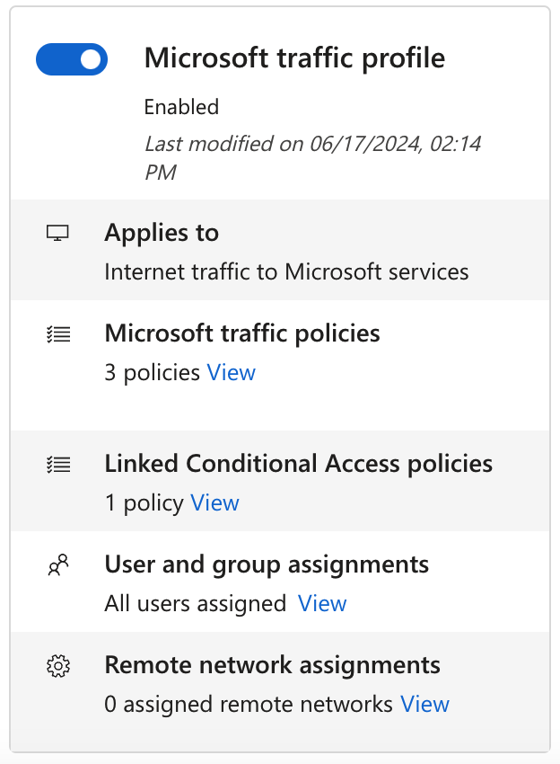

# How to enable and manage the Microsoft traffic forwarding profile

With the Microsoft profile enabled, Microsoft Entra Internet Access acquires the traffic going to Microsoft services. The **Microsoft** profile manages the following policy groups:

- Exchange Online
- SharePoint Online and Microsoft OneDrive
- Microsoft Teams
- Microsoft 365 Common and Office Online

## Prerequisites

To enable the Microsoft traffic forwarding profile for your tenant, you must have:

- A [Global Secure Access Administrator](../identity/role-based-access-control/permissions-reference.md#global-secure-access-administrator) role in Microsoft Entra ID to enable traffic profiles.
- A [Conditional Access Administrator](../identity/role-based-access-control/permissions-reference.md#conditional-access-administrator)  role to create and interact with Conditional Access policies.
- The product requires licensing. For details, see the licensing section of [What is Global Secure Access](overview-what-is-global-secure-access.md). If needed, you can [purchase licenses or get trial licenses](https://aka.ms/azureadlicense).

### Known limitations

[!INCLUDE [known-limitations-include](../includes/known-limitations-include.md)]

## Enable the Microsoft traffic profile

1. Sign in to the [Microsoft Entra admin center](https://entra.microsoft.com) as a [Global Secure Access Administrator](/azure/active-directory/roles/permissions-reference#global-secure-access-administrator).
1. Browse to **Global Secure Access** > **Connect** > **Traffic forwarding**.
1. Enable the **Microsoft traffic profile**.
    Microsoft traffic starts forwarding from all client devices to Microsoft's Security Service Edge (SSE) proxy, where you can configure advanced security features specific to Microsoft traffic.

    :::image type="content" source="media/how-to-manage-microsoft-profile/microsoft-traffic-profile.png" alt-text="Screenshot of the traffic forwarding page with the Microsoft access profile enabled." lightbox="media/how-to-manage-microsoft-profile/microsoft-traffic-profile-expanded.png":::

## Microsoft traffic policies

To manage the details included in the Microsoft traffic forwarding policy, select the **View** link for **Microsoft traffic policies**.

:::image type="content" source="media/how-to-manage-microsoft-profile/microsoft-traffic-policies.png" alt-text="Screenshot of the Microsoft access profile, with the view applications link highlighted.":::

The policy groups are listed, with a checkbox to indicate if the policy group is enabled. Expand a policy group to view all of the IPs and FQDNs included in the group.

The policy groups include the following details:

- **Destination type**: FQDN or IP subnet
- **Destination**: The details of the FQDN or IP subnet
- **Ports**: TCP or UDP ports that are combined with the IP addresses to form the network endpoint
- **Protocol**: TCP (Transmission Control Protocol) or UDP (User Datagram Protocol)
- **Action**: Forward or Bypass

You can configure the traffic acquisition rules to bypass traffic acquisition. If you do, the users are still able to access resources; however, the Global Secure Access service doesn't process the traffic. You can bypass traffic to a specific FQDN or IP address, an entire policy group within the profile, or the entire Microsoft profile itself. If you only need to forward some of the Microsoft resources within a policy group, enable the group then change the **Action** in the details accordingly.

> [!IMPORTANT]
> When a rule is set to Bypass in the Microsoft traffic profile, the Internet Access traffic profile will not acquire this traffic. Even with the Internet Access profile enabled, the bypassed traffic will skip Global Secure Access acquisition and use that client's network routing path to egress to the Internet. Traffic available for acquisition in the Microsoft traffic profile can be only acquired in the Microsoft traffic profile.

The following example shows setting the `*.sharepoint.com` FQDN to **Bypass** so the traffic isn't forwarded to the service.

If the Global Secure Access client isn't able to connect to the service (for example due to an authorization or Conditional Access failure), the service *bypasses* the traffic. Traffic is sent direct-and-local instead of being blocked. In this scenario, you can create a Conditional Access policy for the [compliant network check](how-to-compliant-network.md), to block traffic if the client isn't able to connect to the service.

## Linked Conditional Access policies

[Conditional Access policies](../identity/conditional-access/overview.md) are created and applied to the traffic forwarding profile in the Conditional Access area of Microsoft Entra ID. For example, you can create a policy that requires compliant devices when users are establishing the network connection for services in the Microsoft traffic profile.

If you see "None" in the **Linked Conditional Access policies** section, there isn't a Conditional Access policy linked to the traffic forwarding profile. To create a Conditional Access policy, see [Universal Conditional Access through Global Secure Access](how-to-target-resource-microsoft-profile.md).

### Edit an existing Conditional Access policy

If the traffic forwarding profile has a linked Conditional Access policy, you can view and edit that policy.

1. Select the **View** link for **Linked Conditional Access policies**.

    

1. Select a policy from the list. The details of the policy open in Conditional Access.

    

## Microsoft traffic profile remote network assignments

Traffic profiles can be assigned to remote networks, so that the network traffic is forwarded to Global Secure Access without having to install the client on end user devices. As long as the device is behind the customer premises equipment (CPE), the client isn't required. You must create a remote network before you can add it to the profile. For more information, see [How to create remote networks](how-to-create-remote-networks.md).

**To assign a remote network to the Microsoft profile**:

1. Sign in to the [Microsoft Entra admin center](https://entra.microsoft.com/) as a [Global Secure Access Administrator](/azure/active-directory/roles/permissions-reference#global-secure-access-administrator).
1. Browse to **Global Secure Access** > **Connect** > **Traffic forwarding**.
1. From the **Remove network assignments** section, select the **View** link for the profile.
1. Select a remote network from the list and select **Add**.

## User and group assignments
You can scope the Microsoft profile to specific users and groups instead of applying the traffic profile to all users. To learn more about user and group assignment, see [How to assign and manage users and groups with traffic forwarding profiles](how-to-manage-users-groups-assignment.md).

## Next steps

The next step for getting started with Microsoft traffic profile is to [install and configure the Global Secure Access Client on end-user devices](how-to-install-windows-client.md)

For more information about traffic forwarding, see the following article:

- [Learn about traffic forwarding profiles](concept-traffic-forwarding.md)
- [Learn about the Microsoft traffic forwarding profile](concept-traffic-forwarding.md)
