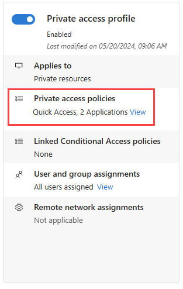

# How to manage the Private Access traffic forwarding profile

The Private Access traffic forwarding profile routes traffic to your private network through the Global Secure Access Client. Enabling this traffic forwarding profile allows remote workers to connect to internal resources without a VPN. With the features of Microsoft Entra Private Access, you can control which private resources to tunnel through the service and apply Conditional Access policies to secure access to those services. Once your configurations are in place, you can view and manage all of those configurations from one place.

## Prerequisites

To enable the Private Access forwarding profile for your tenant, you must have:

- A [Global Secure Access Administrator](../identity/role-based-access-control/permissions-reference.md#global-secure-access-administrator) role in Microsoft Entra ID.
   - A [Conditional Access Administrator](../identity/role-based-access-control/permissions-reference.md#conditional-access-administrator)  role to create and interact with Conditional Access policies.
- The product requires licensing. For details, see the licensing section of [What is Global Secure Access](overview-what-is-global-secure-access.md). If needed, you can [purchase licenses or get trial licenses](https://aka.ms/azureadlicense).

### Known limitations

- At this time, Private Access traffic can only be acquired with the Global Secure Access Client. Private Access traffic can't be acquired from remote networks.
- Tunneling traffic to Private Access destinations by IP address is supported only for IP ranges outside of the end-user device local subnet. 
- You must disable DNS over HTTPS (Secure DNS) to tunnel network traffic based on the rules of the fully qualified domain names (FQDNs) in the traffic forwarding profile. 

## Enable the Private Access traffic forwarding profile

1. Sign in to the [Microsoft Entra admin center](https://entra.microsoft.com) as a [Global Secure Access Administrator](../identity/role-based-access-control/permissions-reference.md#global-secure-access-administrator).
1. Browse to **Global Secure Access** > **Connect** > **Traffic forwarding**.
1. Select the checkbox for **Private Access profile**.

## Private Access policies

To enable the Private Access traffic forwarding profile, we recommend you first configure Quick Access. Quick Access includes the IP addresses, IP ranges, and fully qualified domain names (FQDNs) for the private resources you want to include in the policy. For more information, see [Configure Quick Access](how-to-configure-quick-access.md).

You can also configure per-app access to your private resources by creating a Private Access app. Similar to Quick Access, you create a new Enterprise app, which can then be assigned to the Private Access traffic forwarding profile. Quick Access contains the main group of private resources you always want to route through the service. Private Access apps can be enabled and disabled as needed without impacting the FQDNs and IP addresses included in Quick Access.

To manage the details included in the Private Access traffic forwarding policy, select the **View** link for **Private Access policies**. 

Details of your Quick Access and enterprise apps for Private Access are displayed. Select the link for the application to view the details from the Enterprise applications area of Microsoft Entra ID.

## Linked Conditional Access policies

Conditional Access policies for Private Access are configured at the application level for each app. Conditional Access policies can be created and applied to the application from two places:

- Go to **Global Secure Access** > **Applications** > **Enterprise applications**. Select an application and then select **Conditional Access** from the side menu.
- Go to **Protection** > **Conditional Access** > **Policies**. Select **+ Create new policy**.

For more information, see [Apply Conditional Access policies to Private Access apps](how-to-target-resource-private-access-apps.md).

## User and group assignments
You can scope the Private Access profile to specific users and groups. The users and groups must be assigned to both the Private Access apps and the traffic forwarding profile.

To learn more about user and group assignment, see [How to assign and manage users and groups with traffic forwarding profiles](how-to-manage-users-groups-assignment.md).

## Next steps

The next step for getting started with Microsoft Entra Internet Access is to [install and configure the Global Secure Access Client on end-user devices](how-to-install-windows-client.md).

For more information about Private Access, see the following articles:
- [Learn about traffic forwarding](concept-traffic-forwarding.md)
- [Configure Quick Access](how-to-configure-quick-access.md)
