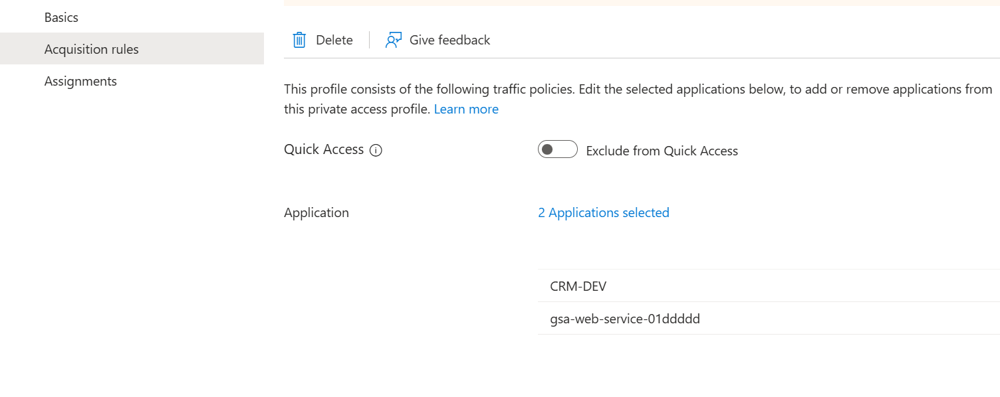
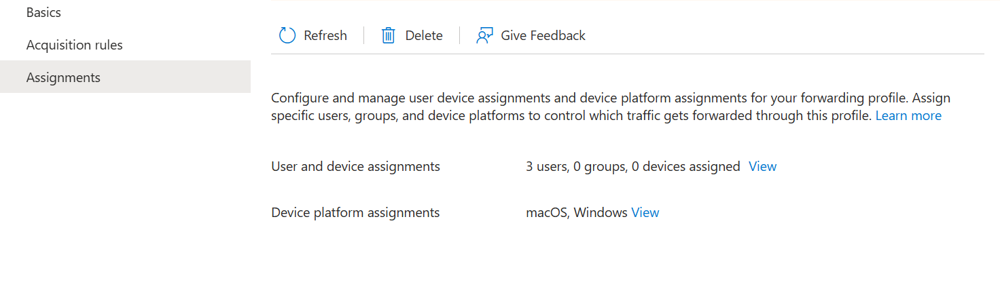

# Manage Private Access traffic forwarding profiles

## Overview

Private Access traffic forwarding profiles route traffic from the Global Secure Access client to private resources. Enabling this traffic forwarding profile allows remote workers to connect to internal resources without a VPN. With the features of Microsoft Entra Private Access, you can control which private resources to tunnel through the service and apply Conditional Access policies to secure access to those services. You can use the default Private Access profile or create custom profiles with different applications, assignments, device platforms, priorities, and status.

Multiple profiles let you provide different private application access to internal and external users, desktop and mobile devices, or other groups with distinct access requirements.

## Prerequisites

To manage Private Access traffic forwarding profiles, you must have:

- A [Global Secure Access Administrator](../identity/role-based-access-control/permissions-reference.md#global-secure-access-administrator) role in Microsoft Entra ID.
- An [Application Administrator](../identity/role-based-access-control/permissions-reference.md#application-administrator) role to manage Private Access applications.
- A [Conditional Access Administrator](../identity/role-based-access-control/permissions-reference.md#conditional-access-administrator) role to create and manage Conditional Access policies.
- Microsoft Entra Private Access or Microsoft Entra Suite licensing. For more information, see the licensing section of [What is Global Secure Access](overview-what-is-global-secure-access.md).

### Known limitations

[!INCLUDE [known-limitations-include](../includes/known-limitations-include.md)]

During preview:

- You can create up to 10 custom Private Access traffic forwarding profiles.
- A Private Access application must be included in the default Private Access profile before it can be selected for a custom profile.

## View Private Access profiles

1. Sign in to the [Microsoft Entra admin center](https://entra.microsoft.com) as a Global Secure Access Administrator.
1. Browse to **Global Secure Access** > **Connect** > **Traffic forwarding**.

The page displays the system-created profiles and any custom profiles. Select a profile name to manage its **Basics**, **Acquisition rules**, and **Assignments**.

To add a custom profile, see [Create a Private Access traffic forwarding profile](how-to-create-traffic-forwarding-profile.md).

## Manage profile settings

Select **Basics** to update the custom profile's name, description, priority, or status.

Priority determines which profile is effective if multiple Private Access profiles apply to the same user and device. Only the applicable profile with the highest priority is used by the client.

## Manage acquisition rules

Acquisition rules determine which private resources are included in a profile.

1. Select the Private Access profile.
1. Select **Acquisition rules**.
1. Configure whether the profile includes Quick Access.
1. Select the applications link to add or remove Private Access applications.

   

Use **Select all** to include all available applications, and then remove the applications that shouldn't be part of the profile.

### Associate an application with multiple profiles

You can also manage profile associations from the Private Access application:

1. Browse to **Global Secure Access** > **Applications** > **Enterprise applications**.
1. Select the application, and then select **Network access properties**.
1. Select **Manage attached profiles**.
1. Select one or more profiles, and then select **Save**.

An application can be associated with multiple Private Access traffic forwarding profiles.

## Manage profile assignments

Select **Assignments** to configure:

- **User and device assignments**: Assign no users or devices, all users and devices, or selected users, groups, and devices.
- **Device platform assignments**: Select the device platforms that receive the profile.

   

The two assignment conditions are evaluated together. For example, if a profile is assigned to selected users and the Android platform, only Android devices used by those selected users receive the profile.

For detailed steps and assignment examples, see [Assign users and devices to traffic forwarding profiles](how-to-manage-users-groups-assignment.md).

## Linked Conditional Access policies

Conditional Access policies for Private Access are configured at the application level. You can create and apply a Conditional Access policy from either location:

- Browse to **Global Secure Access** > **Applications** > **Enterprise applications**. Select an application, and then select **Conditional Access**.
- Browse to **Entra ID** > **Conditional Access** > **Policies**, and then select **New policy**.

For more information, see [Apply Conditional Access policies to Private Access applications](how-to-target-resource-private-access-apps.md).

## Delete a custom profile

Custom Private Access profiles can be deleted. The system-created default profile can't be deleted. Deleted custom profiles can't be restored.

For detailed steps, see [Delete a Private Access traffic forwarding profile](how-to-delete-traffic-forwarding-profile.md).

## Next steps

- [Create a Private Access traffic forwarding profile](how-to-create-traffic-forwarding-profile.md)
- [Delete a Private Access traffic forwarding profile](how-to-delete-traffic-forwarding-profile.md)
- [Assign users and devices to traffic forwarding profiles](how-to-manage-users-groups-assignment.md)
- [Configure Quick Access](how-to-configure-quick-access.md)
- [Install and configure the Global Secure Access client](how-to-install-windows-client.md)
