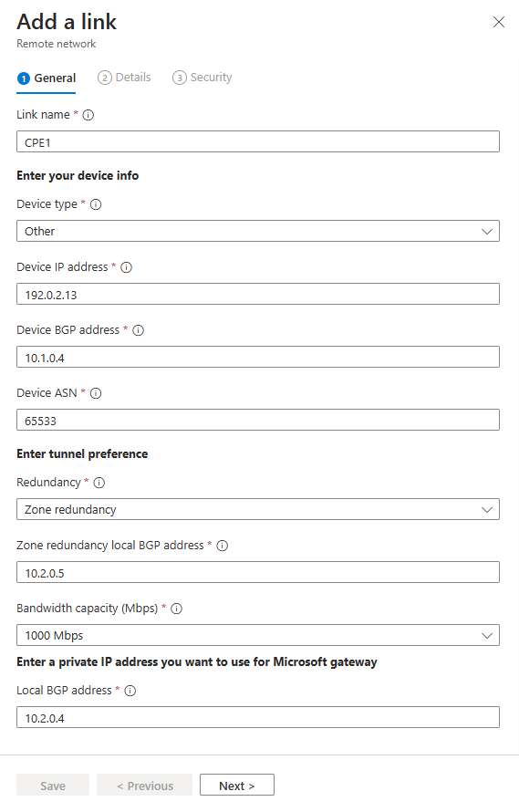

# Add and delete remote networks device links

Customer premises equipment, such as routers, are added to the remote network. You can create device links when you create a new remote network or add them after the remote network is created. This article explains how to add and delete device links for remote networks for Global Secure Access.

## Prerequisites

To configure remote networks, you must have: 

- A **Global Secure Access Administrator** role in Microsoft Entra ID.
- Created a remote network.
- The product requires licensing. For details, see the licensing section of [What is Global Secure Access](overview-what-is-global-secure-access.md). If needed, you can [purchase licenses or get trial licenses](https://aka.ms/azureadlicense).

## Add a device link

You can add a device link from the Microsoft Entra admin center or using the Microsoft Graph API.

### [Microsoft Entra admin center](#tab/microsoft-entra-admin-center)

You can add a device link to a remote network at any time.

1. Sign in to the [Microsoft Entra admin center](https://entra.microsoft.com) as a [Global Secure Access Administrator](/azure/active-directory/roles/permissions-reference#global-secure-access-administrator).

1. Browse to **Global Secure Access** > **Devices** > **Remote network**.

1. Select a remote network from the list.

    

1. Select **Links** from the menu.

1. Select the **+ Add a link** button.

    

### Add a link - General tab

There are several details to enter on the General tab. Pay close attention to the Peer and Local Border Gateway Protocol (BGP) addresses. *The peer and local details are reversed, depending on where the configuration is completed.*



1. Enter the following details.
    - **Link name**: Name of your Customer Premises Equipment (CPE).
    - **Device type**: Choose a device option from the dropdown list.
    - **IP address**: Public IP address of your device.
    - **Peer BGP address**: Enter the BGP IP address of your CPE.
        - This address is entered as the *local* BGP IP address on the CPE.
    - **Local BGP address**: Enter a BGP IP address that isn't* part of your on-premises network where your CPE resides.
        - For example, if your on-premises network is 10.1.0.0/16, then you can use 10.2.0.4 as your Local BGP address.
        - This address is entered as the *peer* BGP​​ IP address on your CPE.
    - **Link ASN**: Provide the autonomous system number (ASN) of the CPE.
        - A BGP-enabled connection between two network gateways requires that they have different Autonomous System Number (ASN).
        - For more information, see the **Valid ASNs** section of the [Remote network configurations](reference-remote-network-configurations.md#valid-asn) article.
    - **Redundancy**: Select either *No redundancy* or *Zone redundancy* for your IPSec tunnel.
    - **Zone redundant local BGP address**: This optional field shows up only when you select **Zone redundancy**.
        - Enter a BGP IP address that isn't* part of your on-premises network where your CPE resides and is different from the **Local BGP address**.
    - **Bandwidth capacity (Mbps)**: Specify tunnel bandwidth. Available options are 250, 500, 750, and 1,000 Mbps.
1. Select the **Next** button.

### Add a link - Details tab

The **Details** tab is where you establish the bidirectional communication channel between Global Secure Access and your CPE. Configure your IPSec/IKE policy and select the **Next** button.


- **IKEv2** is selected by default. Currently only IKEv2 is supported.
- The IPSec/IKE policy is set to **Default** but you can change to **Custom**.
- If you choose the custom IPSec/IKE policy, first review the [How to create remote network with custom Internet Key Exchange (IKE) policy](how-to-create-remote-network-custom-ike-policy.md) article.
- If you select **Custom**, you must use a combination of settings that are supported by Global Secure Access. The valid configurations you can use are mapped out in the [Remote network valid configurations](reference-remote-network-configurations.md) reference article.
- Whether you choose **Default** or **Custom**, the IPSec/IKE policy you specify must match the policy you enter on your CPE.

### Add a link - Security tab

1. Enter the Preshared key (PSK). The same secret key must be used on your CPE.
1. Select the **Save** button.

    

### [Microsoft Graph API](#tab/microsoft-graph-api)

Remote networks with a custom IKE policy can be created using Microsoft Graph on the `/beta` endpoint.

1. Sign in to the [Graph Explorer](https://aka.ms/ge).
1. Select `POST` as the HTTP method from the dropdown.
1. Set the API version to beta.
1. Run the following query to get a list of your remote networks and their details.

    ```http
    GET https://graph.microsoft.com/beta/networkaccess/connectivity/branches
    ```

1. Run the following query to get the device link details.

    ```http
    POST https://graph.microsoft.com/beta/networkaccess/connectivity/branches/BRANCH_ID/deviceLinks
    ```

Sample response:

```http
{
   "name": "CPE2",
   "ipAddress": "100.1.1.56",
    "BandwidthCapacityInMbps": "Mbps250",
    "bgpConfiguration": {
        "LocalIpAddress": "10.1.1.28",
        "PeerIpAddress": "10.1.1.28",
        "asn": 5555
    },
    "tunnelConfiguration": {
        "@odata.type": "#microsoft.graph.networkaccess.tunnelConfigurationIKEv2Default",
        "preSharedKey": "secret.ppk"
    },
    "redundancyConfiguration": {
    "redundancyTier": "zoneRedundancy",
    "zoneLocalIpAddress": "1.1.1.12"
    },
    "deviceVendor": "citrix"
}
```

---

## How to delete device links

You can delete device links through the Microsoft Entra admin center and using the Microsoft Graph API.

### [Microsoft Entra admin center](#tab/microsoft-entra-admin-center)

1. Sign in to the [Microsoft Entra admin center](https://entra.microsoft.com) as a [Global Secure Access Administrator](/azure/active-directory/roles/permissions-reference#global-secure-access-administrator).

1. Browse to **Global Secure Access** > **Devices** > **Remote network**. Device links appear in the **Links** column on the list of remote networks.

1. Select the device link from the **Links** column to access the device link details page.

1. Select the **Delete** icon for the device link you need to delete. A confirmation dialog appears. Select **Delete** to confirm the deletion.

    

### [Microsoft Graph API](#tab/microsoft-graph-api)

1. Sign in to [Graph Explorer](https://aka.ms/ge).
1. Select `DELETE` as the HTTP method from the dropdown.
1. Set the API version to beta.
1. Enter the following query.

    ```http
    DELETE https://graph.microsoft.com/beta/networkaccess/connectivity/branches/BRANCH_ID/deviceLinks/LINK_ID
    
    ```

---


