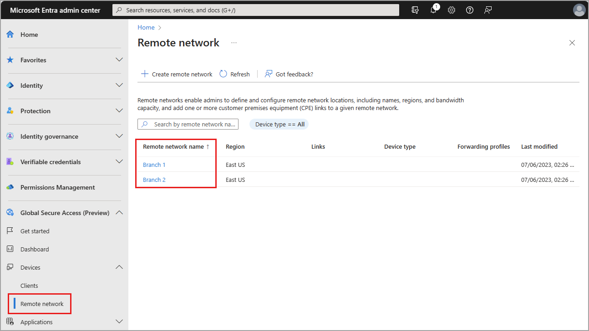
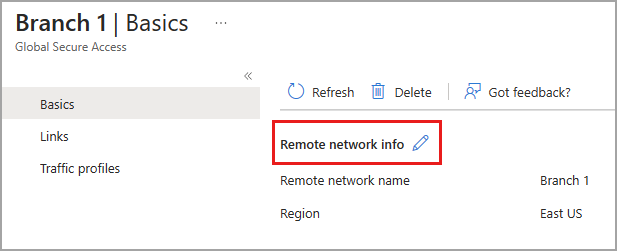
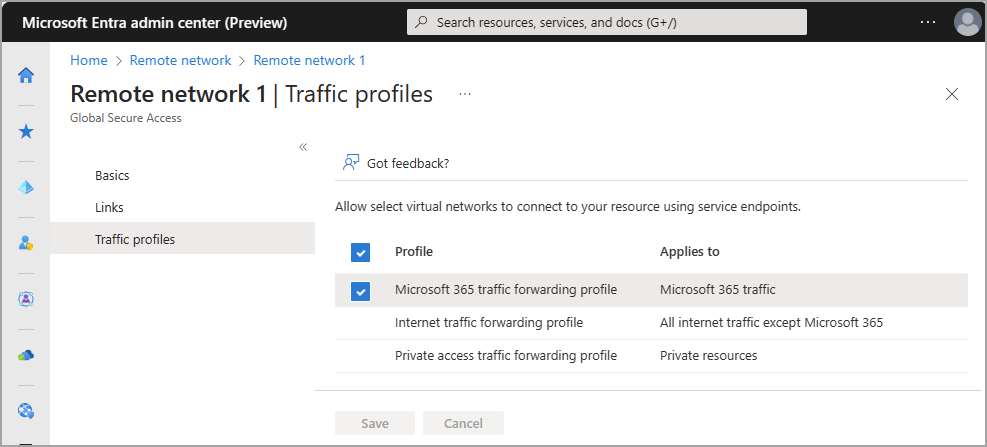
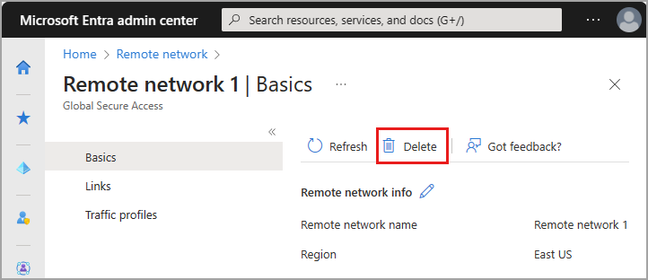

# Manage remote networks

Remote networks connect your users in remote locations to Global Secure Access. Adding, updating, and removing remote networks from your environment are likely common tasks for many organizations. 

This article explains how to manage your existing remote networks for Global Secure Access.

## Prerequisites

- A **Global Secure Access Administrator** role in Microsoft Entra ID.
- The product requires licensing. For details, see the licensing section of [What is Global Secure Access](overview-what-is-global-secure-access.md). If needed, you can [purchase licenses or get trial licenses](https://aka.ms/azureadlicense).
- To use the Microsoft traffic forwarding profile, a Microsoft 365 E3 license is recommended.

### Known limitations

- At this time, remote networks can only be assigned to the Microsoft traffic forwarding profile.

## Update remote networks

You can update remote networks in the Microsoft Entra admin center or using the Microsoft Graph API.

### [Microsoft Entra admin center](#tab/microsoft-entra-admin-center)

To update the details of your remote networks:

1. Sign in to the [Microsoft Entra admin center](https://entra.microsoft.com) as a [Global Secure Access Administrator](/azure/active-directory/roles/permissions-reference#global-secure-access-administrator).
1. Browse to **Global Secure Access** > **Devices** > **Remote networks**.
1. Select the remote network you need to update.

    

There are three sections with details you can edit. **Basics**, **Links**, and **Traffic profiles**.

#### Basics

The basics page provides a way to delete a selected remote network. You change the name of a remote network after you create it. Select the pencil icon to edit the name of the remote network.



#### Links

Add a new device link or delete an existing device link from this page. You can't edit the details of a device link after it was created. Select the trash can icon to delete a remote network device link.


#### Traffic profiles

From this page, you can enable or disable the available traffic forwarding profile. At this time, only the Microsoft access profile can be applied to remote networks.



You can also assign a remote network to the Microsoft traffic forwarding profile from **Traffic forwarding** area of Global Secure Access. Browse to **Connect** > **Traffic forwarding** and select the **Add/edit assignments** button for the traffic profile. For more information, see [Global Secure Access traffic forwarding](concept-traffic-forwarding.md).

### [Microsoft Graph API](#tab/microsoft-graph-api)

To edit the details of a remote network:

1. Sign in to [Graph Explorer](https://aka.ms/ge).
1. Select **PATCH** as the HTTP method from the dropdown.
1. Select the API version to **BETA**.
1. Enter the query.

```http
    PATCH https://graph.microsoft.com/beta/networkaccess/connectivity/branches/8d2b05c5-1e2e-4f1d-ba5a-1a678382ef16
    {
        "@odata.context": "#$delta",
        "name": "ContosoRemoteNetwork2"
    }
``` 

1. Select **Run query** to update the remote network.

---

## Delete a remote network

You can delete remote networks in the Microsoft Entra admin center or using the Microsoft Graph API.

### [Microsoft Entra admin center](#tab/microsoft-entra-admin-center)

1. Sign in to the Microsoft Entra admin center at [https://entra.microsoft.com](https://entra.microsoft.com).
1. Browse to **Global Secure Access** > **Devices** > **Remote networks**.
1. Select the remote network you need to delete.
1. Select the **Delete** button.
1. Select **Delete** from the confirmation message.



### [Microsoft Graph API](#tab/microsoft-graph-api)

1. Sign in to [Graph Explorer](https://aka.ms/ge).
1. Select **PATCH** as the HTTP method from the dropdown.
1. Select the API version to **beta**.
1. Enter the query.

 ```http
    DELETE https://graph.microsoft.com/beta/networkaccess/connectivity/branches/97e2a6ea-c6c4-4bbe-83ca-add9b18b1c6b 
```

1. Select **Run query** to delete the remote network.

---


## Next steps

- [List remote networks](how-to-list-remote-networks.md)
- [Manage remote network device links](how-to-manage-remote-network-device-links.md)
