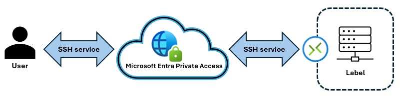

# Use SSH to administer remote servers 

Secure Shell (SSH) is widely recognized across the IT industry as a critical service for system administrators. It provides a secure and encrypted method to access and manage remote systems over unsecured networks.
IT administrators rely on SSH to perform essential tasks securely, including the configuration, deployment, and maintenance of servers and applications in an organization’s infrastructure.
 
In this guide and [in this video](https://youtu.be/lpgl08z7dzE), you learn how to configure and establish an SSH connection using Microsoft Entra Private Access to enhance security in your remote access workflows.

## Establish SSH connections with Microsoft Entra Private Access

Microsoft Entra Private Access enhances the security and efficiency of SSH management traffic by providing a secure, identity-centric Zero Trust Network Access (ZTNA) solution by allowing IT administrators to establish SSH connections to remote servers securely. 

   

## Prerequisites

Ensure you meet the following prerequisites.

* **Licensing** - Learn about licensing for [Microsoft Global Secure Access](overview-what-is-global-secure-access.md)
  * Learn more about [Microsoft Entra plans and pricing](https://aka.ms/azureadlicense)
  * See, [Global Secure Access client for Windows](how-to-install-windows-client.md)
* **A remote server with SSH** enabled
* **Microsoft Global Secure Access private network connector** with network connectivity to the resource
  * Learn how to [configure connectors](how-to-configure-connectors.md)
* **A device with the Global Secure Access client**
* **Private Access profile** enabled
  * See [Global Secure Access traffic forwarding profiles](concept-traffic-forwarding.md)
* **[Global Secure Access Administrator role](/azure/active-directory/roles/permissions-reference)** for administrators
  * Learn about [built-in roles](reference-role-based-permissions.md)

## Configure SSH traffic acquisition and secure with Conditional Access policies

To create the Enterprise Application:

1. In [Microsoft Entra admin center](https://entra.microsoft.com), browse to **Global Secure Access**.
2. Select **Applications**, then select **Enterprise application**.
3. Select **New application**. 
4. Type a name for the SSH enterprise application.
5. The **Create application segment** panel appears.
6. To application segments to acquire SSH traffic, select **Destination type** and add the IPs or subnets that provide a connection to your remote server. 
7. Configure **Port** to acquire traffic destined for port **22**. 
8. For **Protocol**, select **TCP**. 
0. Select **Save**.

Assign users and groups to the application. Only users assigned to the enterprise application will have the ability to connect to it over the designated application segment(s).

1. In the Microsoft Entra admin center, browse to **Global Secure Access**.
2. Select **Applications**, then select **Enterprise application**.
3. Select the SSE enterprise application you created and then select **Users and groups**.
4. Add users and groups that require access.
5. If desired, create [Microsoft Entra Conditional Access](../identity/conditional-access/overview.md) policy to increase application security. For more information, see [Apply Conditional Access policies to Private Access apps](how-to-target-resource-private-access-apps.md).
6. Confirm you can access the SSH services from the client device.  

### Configuration checklist

Use the following checklist to help confirm configuration.

* Ensure the server is running and accessible by the SSH port.
* Confirm the correct host firewall configuration.
  * Find guidance in [OpenSSH Server configuration for Windows](/windows-server/administration/OpenSSH/openssh-server-configuration).
* Confirm the application segment has downloaded to the Global Secure Access client.
  *  Right-click the **Global Secure Access** client icon in the Windows taskbar.
  * Select **Advanced Diagnostics** > **Forwarding profile** > **Private Access**.
  * Verify the application appears in the access profile.

## Connection failure

If the connection fails, use the following checklist.

* Verify the server IP address and port number. 
* Confirm the SSH port is allowed from a Private Connector server. 
* Isolate firewall rules that might block SSH traffic. 
* Validate the Global Secure Access client captures traffic. 
* Verify users are assigned to the application. 

## Next steps

* View video walk-through [Management traffic for SSH based server administration using Private Access](https://youtu.be/lpgl08z7dzE)
* [Learn about Private Access](concept-private-access.md)
* [How to configure connectors for Private Access](how-to-configure-connectors.md)
* [How to configure per-app access using GSA apps](how-to-configure-per-app-access.md)
