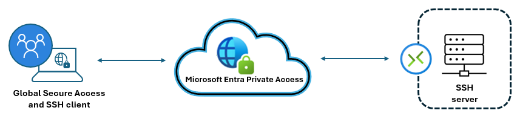

# Management for SSH-based server administration

It's widely recognized by the IT industry that IT administrators use Secure Shell (SSH) as a critical service to enable security while managing configuration, deployment, and maintenance of servers and applications in an organization's infrastructure. SSH is a secure way to access and manage devices over an unsecured network. SSH encryption protocols, ensure the integrity and confidentiality of administrative tasks and remote system interactions, which are pivotal to maintain operational efficiency and reduce potential security risks. 

In this guide learn to configure and establish an SSH connection using Microsoft Entra Private Access for enhanced security. Organizations use Private Access to modernize user access to private apps and resources.

You can [learn more about Private Access](concept-private-access.md).

## Establish SSH connections with Private Access

Microsoft Entra Private Access enhances the security and efficiency of SSH management traffic by providing a secure, identity-centric Zero Trust Network Access (ZTNA) solution by It allowing IT administrators to establish SSH connections to remote servers securely. 

   

## Prerequisites

Ensure you meet the following prerequisites.

* **Licensing** - Learn about licensing and the products that make up [Microsoft Global Secure Access](overview-what-is-global-secure-access.md)
  * Learn more about [Microsoft Entra plans and pricing](https://aka.ms/azureadlicense)
* **A remote server with SSH** enabled
* **GSA private connector** with network connectivity to the resource
  * Learn how to [configure connectors](how-to-configure-connectors.md)
* **A device with the GSA client** on Microsoft Entra joined, or Microsoft Entra hybrid joined
* **Private Access profile** enabled
  * See [GSA traffic forwarding profiles](concept-traffic-forwarding.md)
* **[Global Secure Access Administrator role](/azure/active-directory/roles/permissions-reference)** for admins
  * Learn about [built-in roles](reference-role-based-permissions.md)

## Configure Private Access

Use the following instructions to create the application.

1. Browse to **Global Secure Access**.
2. Select **Applications**, then select **Enterprise application**.
3. Select **New application**. 
4. Type a name.
5. The **Create application segment** panel appears.
6. Select a **Destination type**. 
7. Add needed IPs or subnets. 
8. For **Port**, select **22**. 
9. For **Protocol**, select **TCP**. 
10. (Optional) Add application segments. 
11. Select **Save**.

Assign users and groups to the application.

1. Browse to **Global Secure Access**.
2. Select **Applications**, then select **Enterprise application**.
3. Locate the application you created.
4. Select **Users and groups**.
5. Add users and groups that require access.

Create [Microsoft Entra Conditional Access](/identity/conditional-access/overview) policy for the application and configure policies for app access at the application level. You can create and apply policy in two places: 

1. Browse to **Global Secure Access**.
2. Select **Applications**, then select **Enterprise application**.
3. Select an application.
4. Select **Conditional Access**.
5. Go to Protection.
6. Select **Conditional Access**, then select **Policies**.
7. Select **+ Create new policy**.

For more information, see [Apply Conditional Access policies to Private Access apps](how-to-target-resource-private-access-apps.md). 

## Global Secure Access client review and testing

In this section find links to guidance to install and configure the Microsoft Global Secure Access [client](concept-clients.md) on user devices.  

To install on operating systems, see [Windows](how-to-install-windows-client.md) and [macOS](how-to-install-macos-client.md).  

### Configuration checklist

Use the following checklist to help confirm configuration.

* Ensure the server is running and accessible by the SSH port.
* Confirm correct host firewall configuration.
  * For guidance, see [OpenSSH Server configuration for Windows](/windows-server/administration/OpenSSH/openssh-server-configuration).
* On the Windows taskbar right-click the **Global Secure Access** client
  * Select **Advanced Diagnostics** > **Forwarding profile** > **Private Access**.
* Validate the application appears in the access profile.
* From the client device, access the SSH services.  

## Connection failure

If the connection fails, use the following checklist.

* Verify the server IP address and port number. 
* Confirm the SSH port is allowed from a Private Connector server. 
* Isolate firewall rules that might block SSH traffic. 
* Validate the GSA client captures traffic. 
* Verify users are assigned to the application. 

## Next steps

* [Learn about Private Access](concept-private-access.md)
* [How to configure connectors for Private Access](how-to-configure-connectors.md)
* [How to configure per-app access using GSA apps](how-to-configure-per-app-access.md)
