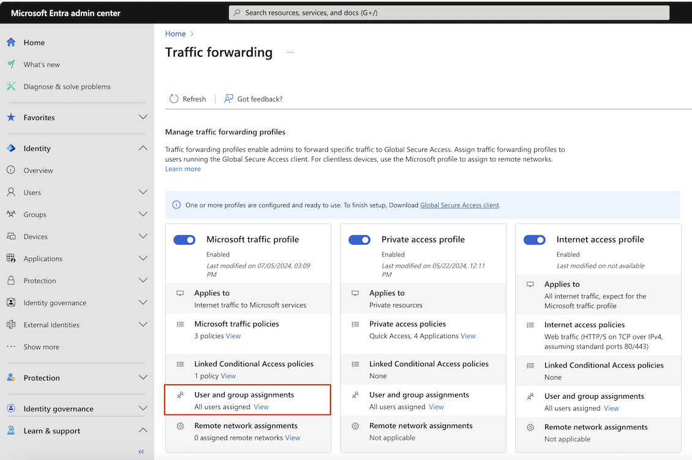
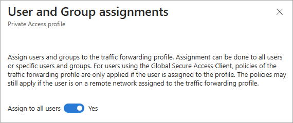

# How to assign users and groups to traffic forwarding profiles

With the Global Secure Access traffic forwarding features, you can assign specific users and groups to a traffic forwarding profile. User or group assignment limits the scope of the traffic forwarding profile so you have a mechanism to roll out the profile safely and at a controlled pace.

This article describes how to assign specific users and groups to a traffic forwarding profile.

## Prerequisites

To assign a traffic forwarding profile to specific users and groups, you must have:

- A [Global Secure Access Administrator](../identity/role-based-access-control/permissions-reference.md#global-secure-access-administrator) role in Microsoft Entra ID to view the traffic forwarding profile.
- An [Application Administrator](../identity/role-based-access-control/permissions-reference.md#application-administrator) role to assign the traffic profile to the selected users and groups.
- The product requires licensing. For details, see the licensing section of [What is Global Secure Access](overview-what-is-global-secure-access.md). If needed, you can [purchase licenses or get trial licenses](https://aka.ms/azureadlicense).
- The minimum required Global Secure Access client version is 1.7.376.0. Clients below this version won't receive the traffic forwarding profile when assigned to the user.

## Assign a traffic forwarding profile to specific users and groups

If you already enabled a traffic forwarding profile, the traffic profile is assigned to all users by default. If you haven't yet enabled a traffic forwarding profile, when you enable it the traffic is assigned to zero users. The **User and group assignments** setting lets you roll out the feature in a controlled manner to a specific set of users.

The screenshot illustrates the setting. The Microsoft profile is disabled and is assigned to zero users and groups. The Private Access and Internet Access profiles are enabled and are assigned to all users.

:::image type="content" source="media/how-to-manage-users-groups-assignment/traffic-profile-user-assignment-comparison.png" alt-text="Screenshot of the traffic forwarding page with user assignments highlighted." lightbox="media/how-to-manage-users-groups-assignment/traffic-profile-user-assignment-comparison-expanded.png":::

You can configure the user and group assignments before or after enabling the traffic profile. You must enable the traffic profile to acquire and forward any traffic. For more information, see [About traffic forwarding profiles](concept-traffic-forwarding.md).

### How to assign users and group to a traffic profile

1. Sign in to the [Microsoft Entra admin center](https://entra.microsoft.com) as a [Global Secure Access Administrator](../identity/role-based-access-control/permissions-reference.md#global-secure-access-administrator)  AND [Application Administrator](../identity/role-based-access-control/permissions-reference.md#application-administrator).

1. Browse to **Global Secure Access** > **Connect** > **Traffic forwarding**.

1. Select the **View** link in the **User and group assignments** section.

    

1. Select the **0 Users, 0 Groups assigned** link.

    

1. Select **Add user/group**.

    

1. Select the **None selected** link, select the users and/or groups from the list, and select the **Select** button.
    - The **All** list groups users and groups together. Select either the **Users** or **Groups** tab to narrow the list.
    - You can also use the Search box to find the user or group directly.

    

1. Select the **Assign** button.

### Change existing user and group assignments

The process to change the user and group assignments for a traffic profile that's already enabled is very similar except for the following steps.

1. When you select the **View** link in the **User and group assignments** section, you need to change the **Assign to all users** setting to **No.**

    

1. Review the confirmation message, and select the **OK** button.

    

1. Continue with the steps in the previous section.

### Automatic assignment through user attributes

You can create and assign a dynamic group of users to the profile who satisfy specific criteria. To learn more about automatic assignment using user attributes, see [Create or update a dynamic group in Microsoft Entra ID](../identity/users/groups-create-rule.md).

## Assign the traffic profile to all users

Once you assign a traffic forwarding profile to a specific user or group, you can quickly change the setting to scope the traffic profile to all users. If you change it back again to a specific group, any users and groups initially assigned to that traffic forwarding profile are retained so you don't need to add them again. 

1. Browse to **Global Secure Access** > **Connect** > **Traffic forwarding**.

1. Select the **View** link in the **user and group assignments** section.

1. Change the **Assign to all users** toggle to **Yes**, review the confirmation message, and select the **OK** button.

    

1. Select the **Done** button.

### Revert all users assignment back to a specific user or group

You can revert the assignment of all users to a traffic profile. When you toggle off the assignment for all users, you revert to the users and groups that were assigned when you toggled it on.

1. Browse to **Global Secure Access** > **Connect** > **Traffic forwarding**.

1. Select the **View** link in the **user and group assignments** section.

1. Change the **Assign to all users** toggle to **No**, review the confirmation message, and select the **OK** button.

1. Select **Done**. 

## Notes on user identity and group assignment

Review the following notes to better understand the user and group assignment capabilities.

- Traffic profiles are fetched on behalf of the Microsoft Entra user logged into the device​, not the user logged into the client​. 
- If there's no Microsoft Entra user logged in, the traffic profile is fetched only if it's assigned to all users. For example, if you log into the device as a local admin you're part of the all users.
- Multiple users logging into the same device simultaneously isn't supported.
- Group-based assignment is supported for Security groups and Microsoft 365 groups whose `SecurityEnabled` setting is set to `True`.
- Nested group memberships aren't supported. A user must be a direct member of the group assigned to the profile. 

## Next steps

- [Learn about Global Secure Access clients](concept-clients.md)
