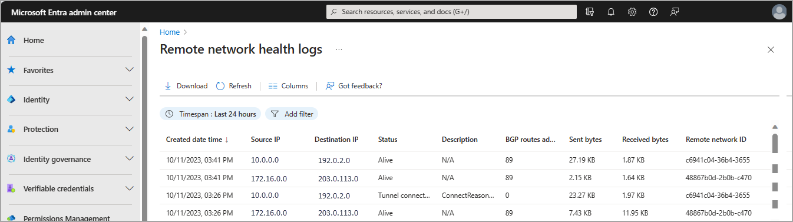
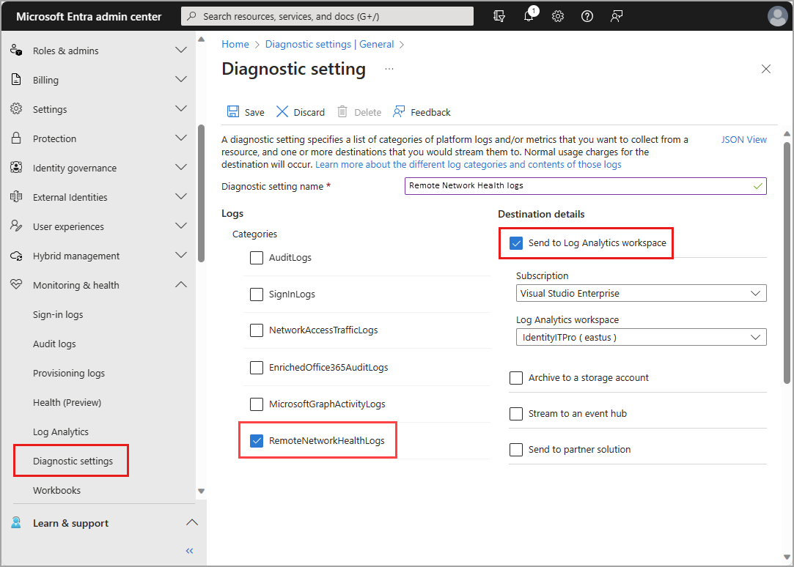

# What are remote network health logs?

Remote networks, such as a branch office, rely on customer premises equipment (CPE) to connect users in those locations to the online resources and services they need. Users expect that CPE to function so they can do their work. To keep everyone connected, you need to ensure the health of the IPSec tunnel and the Border Gateway Protocol (BGP) route advertisement. This long-running tunnel and routing information are the keys to your remote network health.

This article describes several methods for accessing and analyzing the remote network health logs.

- Access logs in the Microsoft Entra admin center or the Microsoft Graph API
- Export logs to Log Analytics or a Security Information and Events Management (SIEM) tool
- Analyze logs using an Azure Workbook for Microsoft Entra
- Download logs for long-term storage

## Prerequisites

To view the remote network health logs in the Microsoft Entra admin center, you need:

- One of the following roles: [Global Secure Access Administrator](../identity/role-based-access-control/permissions-reference.md#global-secure-access-administrator), or [Security Administrator](../identity/role-based-access-control/permissions-reference.md#security-administrator).
- The product requires licensing. For details, see the licensing section of [What is Global Secure Access](overview-what-is-global-secure-access.md). If needed, you can [purchase licenses or get trial licenses](https://aka.ms/azureadlicense).
- Separate roles are required for accessing the logs with the Microsoft Graph API and integrating with Log Analytics and Azure Workbooks.

## View the logs

To view the **Remote network health logs**, you can use either the Microsoft Entra admin center or the Microsoft Graph API.

### [Microsoft Entra admin center](#tab/microsoft-entra-admin-center) 

To view Remote network health logs in Microsoft Entra admin center:

1. Sign in to the [Microsoft Entra admin center](https://entra.microsoft.com) as at least a [Global Secure Access Administrator](../identity/role-based-access-control/permissions-reference.md#global-secure-access-administrator).
1. Browse to **Global Secure Access** > **Monitor** > **Remote network health logs**.

    

### [Microsoft Graph API](#tab/microsoft-graph-api)

Global Secure Access remote network health logs can be viewed and managed using Microsoft Graph on the `/beta` endpoint.

You need one of the following permissions to access the logs with the Microsoft Graph API:

- Directory.ReadWrite.All
- NetworkAccess.Read.All
- NetworkAccess.ReadWrite.All
- NetworkAccess-Reports.Read.All

To access remote network health logs with Microsoft Graph API:

1. Sign in to [Graph Explorer](https://aka.ms/ge).
1. Select GET as the HTTP method.
1. Select BETA as the API version.
1. Run the following query:

```http
GET https://graph.microsoft.com/beta/networkAccess/logs/remotenetworks
```

**Response (truncated):**

```json
{
  "@odata.context": "https://graph.microsoft.com/beta/$metadata#networkAccess/logs/remoteNetworks",
  "@odata.nextLink": "https://graph.microsoft.com/beta/networkAccess/logs/remotenetworks?$skiptoken=a0850fa33aecaf5fc7240fdd13929d25cc2ffbaa9e985c2fd3787a9283ba28c0",
  "@microsoft.graph.tips": "Use $select to choose only the properties your app needs, as this can lead to performance improvements. For example: GET networkAccess/logs/remoteNetworks?$select=bgpRoutesAdvertisedCount,createdDateTime",
  "value": [
    {
     "id": "00001111-aaaa-2222-bbbb-3333cccc4444",
     "remoteNetworkId": "00aa00aa-bb11-cc22-dd33-44ee44ee44ee",
     "createdDateTime": "2024-05-09T20:53:48.3925141Z",
     "sourceIp": "20.x.x.x",
     "destinationIp": "20.x.x.x",
     "description": null,
     "bgpRoutesAdvertisedCount": 0,
     "status": "remoteNetworkAlive",
     "sentBytes": 74156,
     "receivedBytes": 76554
     },
     {
     "id": "11112222-bbbb-3333-cccc-4444dddd5555",
     "remoteNetworkId": "11bb11bb-cc22-dd33-ee44-55ff55ff55ff",
     "createdDateTime": "2024-05-09T20:54:55.1969876Z",
     "sourceIp": "16.x.x.x",
     "destinationIp": "20.x.x.x",
     "description": null,
     "bgpRoutesAdvertisedCount": 25,
     "status": "remoteNetworkAlive",
     "sentBytes": 573962,
     "receivedBytes": 365794
     }
  ]
}
```

---

## Configure diagnostic settings to export logs

Integrating logs with a SIEM tool like Log Analytics is configured through diagnostic settings in Microsoft Entra ID. This process is covered in detail in the [Configure Microsoft Entra diagnostic settings for activity logs](../identity/monitoring-health/howto-configure-diagnostic-settings.md) article.

To configure diagnostic settings, you need:

- [Security Administrator](../identity/role-based-access-control/permissions-reference.md#security-administrator) access.
- A [Log Analytics workspace](/azure/azure-monitor/logs/quick-create-workspace).

The basic steps to configure diagnostic settings are as follows:

1. Sign in to the [Microsoft Entra admin center](https://entra.microsoft.com) as at least a [Security Administrator](../identity/role-based-access-control/permissions-reference.md#security-administrator).

1. Browse to **Entra ID** > **Monitoring & health** > **Diagnostic settings**. 

1. Any existing diagnostic settings appear in the table. Select **edit settings** to change an existing setting, or select **Add diagnostic setting** to create a new setting.

1. Provide a name.

1. Select the `RemoteNetworkHealthLogs` (and any other logs) you want to include.

    

1. Select the destinations you want to send the logs to.

1. Select the subscription and the destination from the dropdown menus that appear.

1. Select the **Save** button.

> [!NOTE]
> It might take up to three days for the logs to start appearing in the destination.

Once your logs are routed to Log Analytics, you can take advantage of the following features:

- Create alert rules to get notified for things like a BGP tunnel failure.
    - For more information, see [Create an alert rule](/azure/azure-monitor/alerts/alerts-create-activity-log-alert-rule).
- Visualize the data with an Azure Workbook for Microsoft Entra (covered in the next section).
- Integrate logs with Microsoft Sentinel for security analytics and threat intelligence.
    - For more information, follow the [Onboard Microsoft Sentinel](/azure/sentinel/quickstart-onboard) Quickstart.

## Analyze logs with a Workbook

[Azure Workbooks for Microsoft Entra](../identity/monitoring-health/overview-workbooks.md) provide a visual representation of your data. Once you've configured a Log Analytics workspace and diagnostic settings to integrate your logs with Log Analytics, you can use a Workbook to analyze the data through these powerful tools.

Check out these helpful resources for workbooks:

- [Create an Azure workbook](/azure/azure-monitor/visualize/workbooks-create-workbook)
- [How to use Identity Workbooks](../identity/monitoring-health/howto-use-workbooks.md) 
- [Create a workbook alert](/azure/azure-monitor/alerts/tutorial-log-alert)

## Download logs

A **Download** button is available on all logs, both within Global Secure Access and Microsoft Entra Monitoring and health. You can download logs as a JSON or CSV file. For more information, see [How to download logs](../identity/monitoring-health/howto-download-logs.md).

To narrow down the results of the logs, select **Add filter**. You can filter by:

- Description
- Remote network ID
- Source IP
- Destination IP
- BGP routes advertised count

The following table describes each of the fields in the Remote network health logs.

| Name | Description |
| -- | -- |
| Created date time | Time of original event generation |
| Source IP Address | The IP address of the CPE.</br> The Source IP/Destination IP address pair is unique for each IPsec tunnel. |
| Destination IP Address | The IP address of the Microsoft Entra gateway.</br> The Source IP/Destination IP address pair is unique for each IPsec tunnel. |
| Status | **Tunnel connected:** This event is generated when an IPsec tunnel is successfully established.</br> **Tunnel disconnected:** This event is generated when an IPsec tunnel is disconnected.</br> **BGP connected:** This event is generated when a BGP connectivity is successfully established.</br> **BGP disconnected:** This event is generated when a BGP connectivity goes down.</br> **Remote network alive:** This periodic statistic is generated every 15 minutes for all the active tunnels. |
| Description | Optional description of the event. |
| BGP Routes Advertised Count | Optional count of BGP routes advertised over the IPsec tunnel.</br> This value is 0 for Tunnel connected, Tunnel disconnected, BGP connected, and BGP disconnected events. |
| Sent Bytes | Optional number of bytes sent from source to destination over a tunnel during the last 15 minutes.</br> This value is 0 for Tunnel connected, Tunnel disconnected, BGP connected, and BGP disconnected events. |
| Received Bytes | Optional number of bytes received by source from destination over a tunnel during the last 15 minutes.</br> This value is 0 for Tunnel connected, Tunnel disconnected, BGP connected, and BGP disconnected events. |
| Remote network ID | ID of the remote network the tunnel is associated with. |

## Next steps

- [Enable enriched Microsoft 365 logs](how-to-view-enriched-logs.md)
- [Explore Global Secure Access traffic logs (preview)](how-to-view-traffic-logs.md)