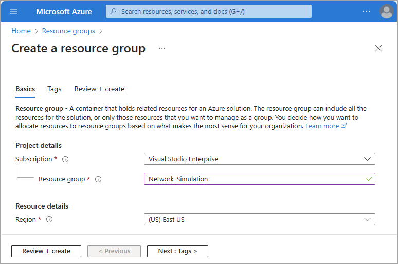
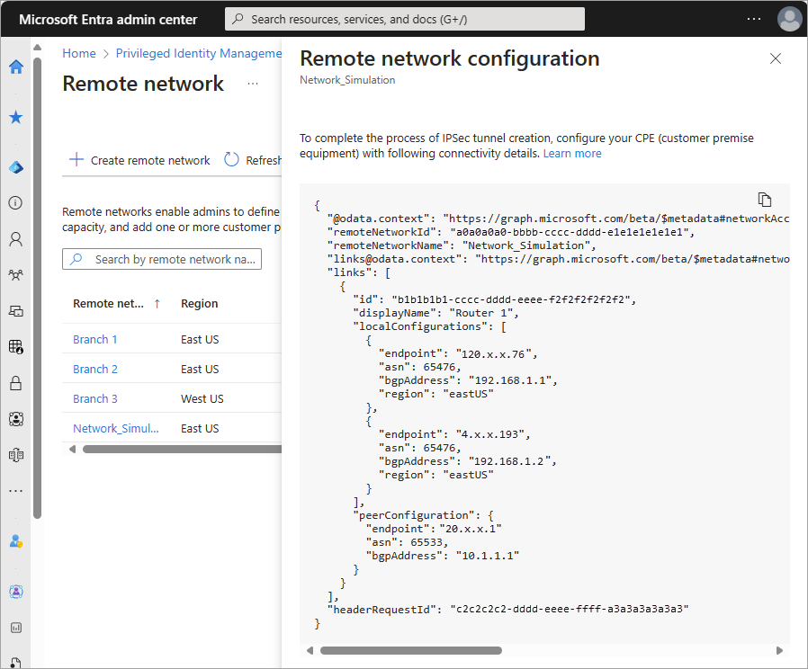

# Simulate remote network connectivity using Azure VNG

Organizations might want to extend the capabilities of Microsoft Entra Internet Access to entire networks not just individual devices they can [install the Global Secure Access Client](how-to-install-windows-client.md) on. This article shows how to extend these capabilities to an Azure virtual network hosted in the cloud. Similar principles might be applied to a customer's on-premises network equipment.

## Prerequisites

To complete the steps in this process, you must have the following prerequisites in place:

- An Azure subscription and permission to create resources in the [Azure portal](https://portal.azure.com).
- A basic understanding of [site-to-site VPN connections](/azure/vpn-gateway/tutorial-site-to-site-portal).
- A Microsoft Entra tenant with the [Global Secure Access Administrator](/azure/active-directory/roles/permissions-reference#global-secure-access-administrator) role assigned.

## Components of the virtual network

Building this functionality out in Azure provides organizations the ability to understand how Microsoft Entra Internet Access works in a more broad implementation. The resources we create in Azure correspond to on-premises concepts in the following ways:

:::image type="content" source="media/how-to-simulate-remote-network/simulate-remote-network.png" alt-text="Diagram showing a virtual network in Azure connected to Microsoft Entra Internet Access simulating a customer's network." lightbox="media/how-to-simulate-remote-network/simulate-remote-network.png":::

| Azure resource | Traditional on-premises component |
| --- | --- |
| **[Virtual network](#create-a-virtual-network)** | Your on-premises IP address space |
| **[Virtual network gateway](#create-a-virtual-network-gateway)** | Your on-premises router, sometimes referred to as customer premises equipment (CPE) |
| **[Local network gateway](#create-local-network-gateway)** | The Microsoft gateway that your router (Azure virtual network gateway) creates an IPsec tunnel to |
| **[Connection](#create-site-to-site-s2s-vpn-connection)** | IPsec VPN tunnel created between the virtual network gateway and local network gateway |
| **[Virtual machine](#verify-connectivity)** | Client devices on your on-premises network |

In this document, we use the following default values. Feel free to configure these settings according to your own requirements.

- **Subscription:** Visual Studio Enterprise
- **Resource group name:** Network_Simulation
- **Region:** East US

## High-level steps

The steps to simulate remote network connectivity with Azure virtual networks are completed in the Azure portal and the Microsoft Entra admin center. It might be helpful to have multiple tabs open so you can switch between them easily.

Before creating your virtual resources, you need a resource group and virtual network to use throughout the following sections. If you already have a test resource group and virtual network configured, you can start at step #3.

1. [Create a resource group](#create-a-resource-group) (Azure portal)
1. [Create a virtual network](#create-a-virtual-network) (Azure portal)
1. [Create a virtual network gateway](#create-a-virtual-network-gateway) (Azure portal)
1. [Create a remote network with device links](#create-a-remote-network) (Microsoft Entra admin center)
1. [Create local network gateway](#create-local-network-gateway) (Azure portal)
1. [Create site-to-site (S2S) VPN connection](#create-site-to-site-s2s-vpn-connection) (Azure portal)
1. [Verify connectivity](#verify-connectivity) (Both)

## Create a resource group

Create a resource group to contain all of the necessary resources.

1. Sign in to the [Azure portal](https://portal.azure.com) with permission to create resources.
1. Browse to **Resource groups**.
1. Select **Create**.
1. Select your **Subscription**, **Region**, and provide a name for your **Resource group**.
1. Select **Review + create**.
1. Confirm your details, then select **Create**.

## Create a virtual network

Create a virtual network inside your new resource group.

1. From the Azure portal, browse to **Virtual Networks**.
1. Select **Create**.
1. Select the **Resource group** you just created.
1. Provide your network with a **Virtual network Name**.
1. Leave the default values for the other fields.
1. Select **Review + create**.
1. Select **Create**.

## Create a virtual network gateway

Create a virtual network gateway inside your new resource group.

1. From the Azure portal, browse to **Virtual network gateways**.
1. Select **Create**.
1. Provide your virtual network gateway with a **Name** and select the appropriate region.
1. Select the **Virtual network** created in the previous section.

      :::image type="content" source="media/how-to-simulate-remote-network/create-azure-virtual-network-gateway.png" alt-text="Screenshot of the Azure portal showing configuration settings for a virtual network gateway." lightbox="media/how-to-simulate-remote-network/create-azure-virtual-network-gateway-expanded.png":::

1. Create a **Public IP address** and provide it with descriptive name.
   - **OPTIONAL**: If you want a secondary IPsec tunnel, under the **SECOND PUBLIC IP ADDRESS** section, create another public IP address and give it a name. If you create a second IPsec tunnel, you need to create two device links in the [Create a remote network](#create-a-remote-network) step.
   - Set the **Enable active-active mode** to **Disabled** if you don't need a second public IP address.
   - The sample in this article uses a single IPsec tunnel.
1. Select an **Availability zone**.
1. Set **Configure BGP** to **Enabled**.
1. Set the **Autonomous system number (ASN)** to an appropriate value. Refer to the [valid ASN values](reference-remote-network-configurations.md#valid-asn) list for reserved values that can't be used.

      :::image type="content" source="media/how-to-simulate-remote-network/create-azure-virtual-network-gateway-IP-addresses.png" alt-text="Screenshot of the IP address fields for creating a virtual network gateway.":::

1. Leave all other settings to their defaults or blank.
1. Select **Review + create**. Confirm your settings.
1. Select **Create**.

> [!NOTE]
> The virtual network gateway might take several minutes to deploy and create. You can start the next section while it's being created, but you need the public IP addresses of your virtual network gateway to complete the next step.

To view these IP addresses, browse to the **Configuration** page of your virtual network gateway after it deploys.

## Create a remote network

The process for creating a remote network is completed in the Microsoft Entra admin center. There are two sets of tabs where you enter the information.

:::image type="content" source="media/how-to-simulate-remote-network/remote-network-tabs.png" alt-text="Screenshot of the two sets of tabs used in the process.":::

The following steps provide the basic information needed to create a remote network with Global Secure Access. This process is covered in greater detail in two separate articles. There are several details that can be easily mixed up, so review the following articles for more information:

- [How to create a remote network](how-to-create-remote-networks.md)
- [How to manage remote network device links](how-to-manage-remote-network-device-links.md)

### Zone redundancy

Before you create your remote network for Global Secure Access, take a moment to review the two options about redundancy. Remote networks can be created with or without redundancy. You can add redundancy in two ways:

- Choose **Zone redundancy** while creating a device link in the Microsoft Entra admin center.
    - In this scenario, we create another gateway for you in a different availability zone within the same datacenter **Region** you picked while creating your remote network.
    - In this scenario, you need just one public IP address on your virtual network gateway.
    - Two IPSec tunnels are created from the same public IP address of your router to different Microsoft gateways in different availability zones.
- Create a secondary public IP address in the Azure portal and create two device links with different public IP addresses in the Microsoft Entra admin center.
    - You can choose **No redundancy** then when adding device links to your remote network in the Microsoft Entra admin center.
    - In this scenario, you need primary and secondary public IP addresses on your virtual network gateway.

### Create the remote network and add device links

For this article, we choose the zone redundancy path.

> [!TIP]
> Local BGP address must be a private IP address that is outside the address space of the virtual network associated with your virtual network gateway. For example, if the address space of your virtual network is 10.1.0.0/16, then you can use 10.2.0.0 as your Local BGP address.
>
>Refer to the [**valid BGP addresses**](reference-remote-network-configurations.md#valid-bgp-addresses) list for reserved values that can't be used.

1. Sign in to the [Microsoft Entra admin center](https://entra.microsoft.com) as a [Global Secure Access Administrator](/azure/active-directory/roles/permissions-reference#global-secure-access-administrator).
1. Browse to **Global Secure Access** > **Connect** > **Remote networks**.
1. Select the **Create remote network** button and provide the following details on the **Basics** tab:
    - **Name**
    - **Region**

:::image type="content" source="media/how-to-simulate-remote-network/create-basics-tab.png" alt-text="Screenshot of the basics tab for creating a remote network.":::

4. On the Connectivity tab, select **Add a link**.
1. On the **Add a link - General** tab, enter the following details:
    - **Link name**: Name of your Customer Premises Equipment (CPE).
    - **Device type**: Choose a device option from the dropdown list.
    - **Device IP address**: Public IP address of your CPE (customer premise equipment) device.
    - **Device BGP address**: Enter the BGP IP address of your CPE.
        - This address is entered as the *local* BGP IP address on the CPE.
    - **Device ASN**: Provide the autonomous system number (ASN) of the CPE.
        - A BGP-enabled connection between two network gateways requires that they have different ASNs.
        - For more information, see the **Valid ASNs** section of the [Remote network configurations](reference-remote-network-configurations.md#valid-asn) article.
    - **Redundancy**: Select either *No redundancy* or *Zone redundancy* for your IPSec tunnel.
    - **Zone redundancy local BGP address**: This optional field shows up only when you select **Zone redundancy**.
        - Enter a BGP IP address that *isn't* part of your on-premises network where your CPE resides and is different from the **Device BGP address**.
    - **Bandwidth capacity (Mbps)**: Specify tunnel bandwidth. Available options are 250, 500, 750, and 1,000 Mbps.
    - **Local BGP address**: Enter a BGP IP address that *isn't* part of your on-premises network where your CPE resides.
        - For example, if your on-premises network is 10.1.0.0/16, then you can use 10.2.0.4 as your Local BGP address.
        - This address is entered as the *peer* BGP​​ IP address on your CPE.
        - Refer to the [valid BGP addresses](reference-remote-network-configurations.md#valid-bgp-addresses) list for reserved values that can't be used.

    :::image type="content" source="media/how-to-simulate-remote-network/virtual-network-device-link-details.png" alt-text="Screenshot of the Add a link - General tab with examples in each field.":::

1. On the **Add a link - Details** tab leave the default values selected, unless you made a different selection previously, and select the **Next** button.
1. On the **Add a link - Security** tab, enter the Pre-shared key (PSK) and select the **Save** button. You return to the main **Create a remote network** set of tabs.
1. On the **Traffic profiles** tab, select the appropriate traffic forwarding profile.
1. Select the **Review + Create** button.
1. If everything looks correct, select the **Create remote network** button.

### View connectivity configuration

After you create a remote network and add a device link, the configuration details are available in the Microsoft Entra admin center. You need several details from this configuration to complete the next step.

1. Browse to **Global Secure Access** > **Connect** > **Remote networks**.
1. In the last column on the right in the table, select **View configuration** for the remote network you created. The configuration is shown as a JSON blob.
1. Locate and save Microsoft's public IP address `endpoint`, `asn`, and `bgpAddress` from the pane that opens.
  
    - These details are used to set up your connectivity in next step.
    - For more information about viewing these details, see [Configure customer premises equipment](how-to-configure-customer-premises-equipment.md).

    

The following diagram connects the key details of these configuration details to their correlating role in the simulated remote network. A text description of the diagram follows the image.

:::image type="content" source="media/how-to-simulate-remote-network/simulate-remote-networks-diagram.png" alt-text="Diagram of the remote network configurations and where the details correlate to the network." lightbox="media/how-to-simulate-remote-network/simulate-remote-networks-diagram-expanded.png":::

The center of the diagram depicts a resource group that contains a virtual machine connected to a virtual network. A virtual network gateway then connects to the local network gateway through a site-to-site redundant VPN connection.

A screenshot of the connectivity details has two sections highlighted. The first highlighted section under `localConfigurations` contains the details of the Global Secure Access gateway, which is your local network gateway.

**Local Network Gateway 1**
- Public IP address/endpoint: 120.x.x.76
- ASN: 65476
- BGP IP address/bgpAddress: 192.168.1.1

**Local Network Gateway 2**
- Public IP address/endpoint: 4.x.x.193
- ASN: 65476
- BGP IP address/bgpAddress: 192.168.1.2

The second highlighted section under `peerConfiguration` contains the details of the virtual network gateway, which is your local router equipment.

**Virtual Network Gateway**
- Public IP address/endpoint: 20.x.x.1
- ASN: 65533
- BGP IP address/bgpAddress: 10.1.1.1

Another callout points to the virtual network you created in your resource group. The address space for the virtual network is 10.2.0.0/16. The Local BGP address and Peer BGP address can't be in the same address space.

## Create local network gateway

This step is completed in the Azure portal. Several details from the previous step are needed to complete this step.

If you selected **No redundancy** while creating device links in the Microsoft Entra admin center, you need to create just one local network gateway.

If you selected **Zone redundancy**, then you need to create two local network gateways. You have two sets of `endpoint`, `asn` and `bgpAddress` in `localConfigurations` for the device links. This information is provided in **View Configuration** details for that remote network in the Microsoft Entra admin center.

1. From the Azure portal, browse to **Local network gateways**.
1. Select **Create**.
1. Select the **Resource group** created previously.
1. Select the appropriate region.
1. Provide your local network gateway with a **Name**.
1. For **Endpoint**, select **IP address**, then provide the `endpoint` IP address provided in the Microsoft Entra admin center.
1. Select **Next: Advanced**.
1. Set **Configure BGP** to **Yes**.
1. Enter the **Autonomous system number (ASN)** from the `localConfigurations` section of the **View configuration** details.
    - Refer to the **Local network gateway** section of the graphic in the [View connectivity configuration](#view-connectivity-configuration) section. 
1. Enter the **BGP peer IP address** from the `localConfigurations` section of the **View configuration** details.

      :::image type="content" source="media/how-to-simulate-remote-network/create-azure-local-network-gateway-bgp.png" alt-text="Screenshot of the ASN and BGP fields in the local network gateway process.":::

1. Select **Review + create** and confirm your settings.
1. Select **Create**.

If you used zone redundancy, repeat these steps to create another local network gateway with second set of values.

Navigate to the **Configurations** to review the details of your local network gateway.

:::image type="content" source="media/how-to-simulate-remote-network/local-network-gateway-configuration.png" alt-text="Screenshot of the Azure portal showing configuration settings for a local network gateway.":::

## Create Site-to-site (S2S) VPN connection

This step is completed in the Azure portal. You need to create two connections here if you created a second gateway, one for your primary and secondary gateways. For this step, keep all settings set to the default value unless noted.

1. From the Azure portal, browse to **Connections**.
1. Select **Create**.
1. Select the **Resource group** created previously.
1. Under **Connection type**, select **Site-to-site (IPsec)**.
1. Provide a **Name** for the connection, and select the appropriate **Region**.
1. Select **Next: Settings**.
1. Select your **Virtual network gateway** and **Local network gateway** created previously.
1. Enter the same **Shared key (PSK)** that you entered while creating the device link in previous step.
1. Check the box for **Enable BGP**.
1. Select **Review + create**. Confirm your settings.
1. Select **Create**.

Repeat these steps to create another connection with second local network gateway.

:::image type="content" source="media/how-to-simulate-remote-network/create-site-to-site-connection.png" alt-text="Screenshot of the Azure portal showing configuration settings for a site-to-site connection." lightbox="media/how-to-simulate-remote-network/create-site-to-site-connection.png":::

## Verify connectivity

To verify connectivity, you need to simulate the traffic flow. One method is to create a virtual machine (VM) to initiate the traffic.

### Simulate traffic with a virtual machine

This step creates a VM and initiates traffic to Microsoft services. Leave all settings set to the default value unless noted.

1. From the Azure portal, browse to **Virtual machines**.
1. Select **Create** > **Azure virtual machine**.
1. Select the **Resource group** created previously.
1. Provide a **Virtual machine name**.
1. Select the Image you want to use, for this example we choose **Windows 11 Pro, version 22H2 - x64 Gen2**
1. Select **Run with Azure Spot discount** for this test.
1. Provide a **Username** and **Password** for your VM.
1. Confirm that you have an eligible Windows 10/11 license with multitenant hosting rights at the bottom of the page.
1. Move to the **Networking** tab.
1. Select the **Virtual network** created previously.
1. Move to the **Management** tab
1. Check the box **Login with Microsoft Entra ID**.
1. Select **Review + create**. Confirm your settings.
1. Select **Create**.

You might choose to lock down remote access to the network security group to only a specific network or IP.

### Verify connectivity status

After you create the remote networks and connections in the previous steps, it might take a few minutes for the connection to be established. From the Azure portal, you can validate that the VPN tunnel is connected and that BGP peering is successful.

1. In the Azure portal, browse to the **virtual network gateway** created earlier and select **Connections**.
1. Each of the connections should show a **Status** of **Connected** once the configuration is applied and successful.
1. Browse to **BGP peers** under the **Monitoring** section to confirm that BGP peering is successful. Look for the peer addresses provided by Microsoft. Once configuration is applied and successful, the **Status** should show **Connected**.

:::image type="content" source="media/how-to-simulate-remote-network/verify-connectivity.png" alt-text="Screenshot showing how to find the connection status for your virtual network gateway." lightbox="media/how-to-simulate-remote-network/verify-connectivity.png" :::

You can use the virtual machine you created to validate that traffic is flowing to Microsoft services. Browsing to resources in SharePoint or Exchange Online should result in traffic on your virtual network gateway. This traffic can be seen by browsing to [Metrics on the virtual network gateway](/azure/vpn-gateway/monitor-vpn-gateway#analyzing-metrics) or by [Configuring packet capture for VPN gateways](/azure/vpn-gateway/packet-capture).

> [!TIP]
> If you're using this article for testing Microsoft Entra Internet Access, clean up all related Azure resources by deleting the new resource group after you're done.

## Next steps

- [Tutorial: Create a site-to-site VPN connection in the Azure portal](/azure/vpn-gateway/tutorial-site-to-site-portal)
