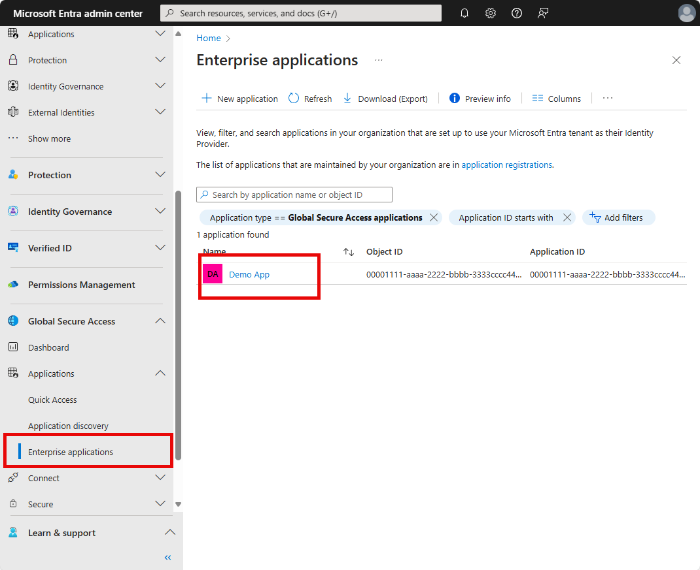

# Apply Conditional Access policies to Private Access apps

Applying Conditional Access policies to your Microsoft Entra Private Access apps is a powerful way to enforce security policies for your internal, private resources. You can apply Conditional Access policies to your Quick Access and Private Access apps from Global Secure Access.

This article describes how to apply Conditional Access policies to your Quick Access and Private Access apps.

## Prerequisites

* Administrators who interact with **Global Secure Access** features must have one or more of the following role assignments depending on the tasks they're performing.
   * The [Global Secure Access Administrator role](/azure/active-directory/roles/permissions-reference) role to manage the Global Secure Access features.
   * The [Conditional Access Administrator](/azure/active-directory/roles/permissions-reference#conditional-access-administrator) to create and interact with Conditional Access policies.
* You need to have configured Quick Access or Private Access.
* The product requires licensing. For details, see the licensing section of [What is Global Secure Access](overview-what-is-global-secure-access.md). If needed, you can [purchase licenses or get trial licenses](https://aka.ms/azureadlicense).

### Known limitations

[!INCLUDE [known-limitations-include](../includes/known-limitations-include.md)]

## Conditional Access and Global Secure Access

You can create a Conditional Access policy for your Quick Access or Private Access apps from Global Secure Access. Starting the process from Global Secure Access automatically adds the selected app as the **Target resource** for the policy. All you need to do is configure the policy settings.

1. Sign in to the [Microsoft Entra admin center](https://entra.microsoft.com) as at least a [Conditional Access Administrator](/azure/active-directory/roles/permissions-reference#conditional-access-administrator).
1. Browse to **Global Secure Access** > **Applications** > **Enterprise applications.**
1. Select an application from the list.

    

1. Select **Conditional Access** from the side menu. Any existing Conditional Access policies appear in a list. 
1. Select **New policy**. The selected app appears in the **Target resources** details.
1. Configure the conditions, access controls, and assign users and groups as needed.

You can also apply Conditional Access policies to a group of applications based on custom attributes. To learn more, go to [Filter for applications in Conditional Access policy](/azure/active-directory/conditional-access/concept-filter-for-applications).

### Assignments and Access controls example

Adjust the following policy details to create a Conditional Access policy requiring multifactor authentication, device compliance, or a Microsoft Entra hybrid joined device for your Quick Access application. The user assignments ensure that your organization's emergency access or break-glass accounts are excluded from the policy.

1. Under **Assignments**, select **Users**:
   1. Under **Include**, select **All users**.
   1. Under **Exclude**, select **Users and groups** and choose your organization's [emergency access or break-glass accounts](#user-exclusions).  
1. Under **Access controls** > **Grant**:
   1. Select **Require multifactor authentication**, **Require device to be marked as compliant**, and **Require Microsoft Entra hybrid joined device**
1. Confirm your settings and set **Enable policy** to **Report-only**.
   
After administrators confirm the policy settings using [report-only mode](/azure/active-directory/conditional-access/howto-conditional-access-insights-reporting), an administrator can move the **Enable policy** toggle from **Report-only** to **On**.

### User exclusions

[!INCLUDE [entra-policy-exclude-user](../includes/entra-policy-exclude-user.md)]

## Next steps

- [Enable the Private Access traffic forwarding profile](how-to-manage-private-access-profile.md)
- [Enable source IP restoration](how-to-source-ip-restoration.md)
