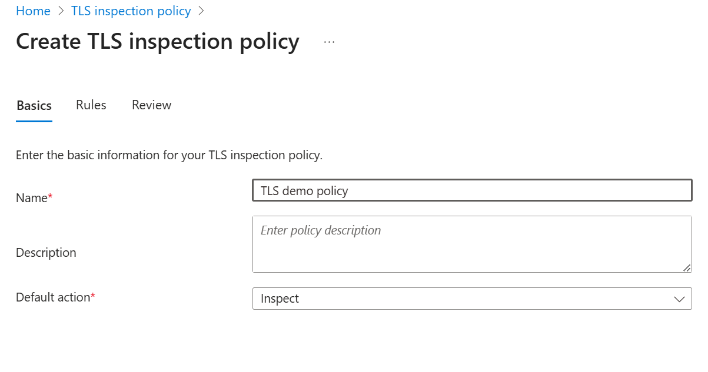
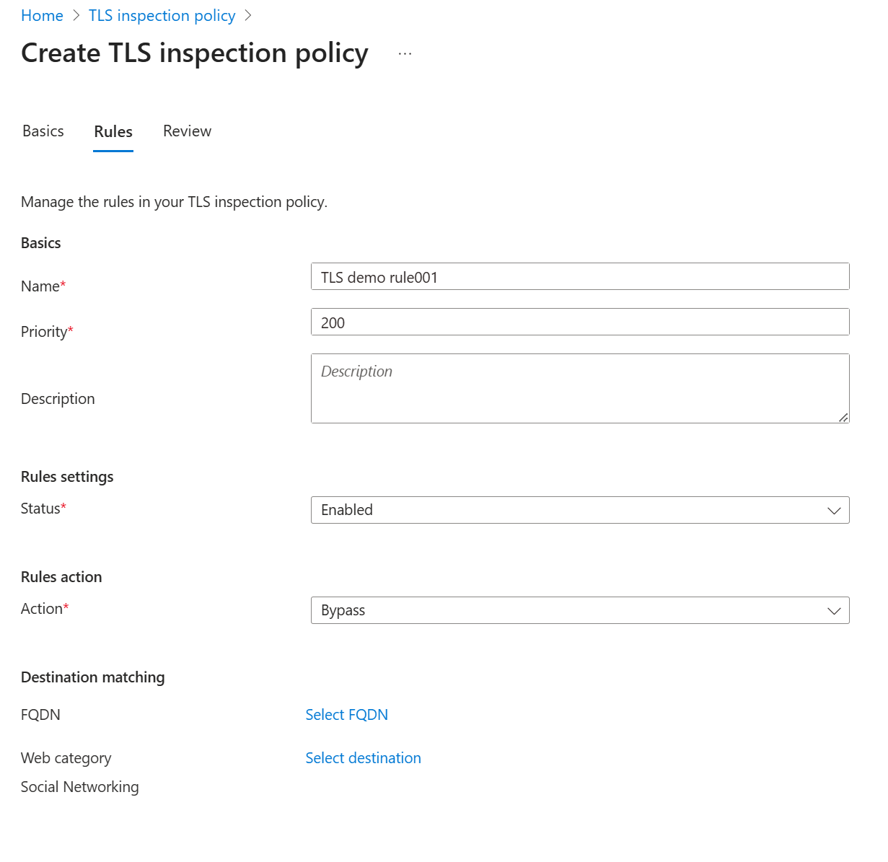
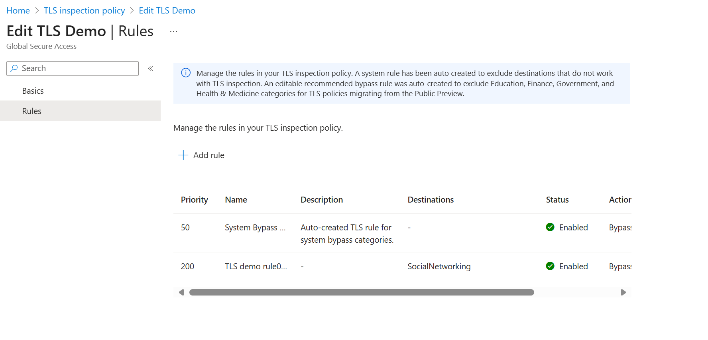

# Configure Transport Layer Security inspection (Preview)
Transport Layer Security (TLS) inspection in Microsoft Entra Internet Access lets you decrypt and inspect encrypted traffic at service edge locations. This feature lets Global Secure Access apply advanced security controls like threat detection, content filtering, and granular access policies. These access policies help protect against threats that might be hidden in encrypted communications.

> [!IMPORTANT]
> The Transport Layer Security inspection feature is currently in PREVIEW.   
> This information relates to a prerelease product that might be substantially modified before release. Microsoft makes no warranties, expressed or implied, with respect to the information provided here.   
> While in preview, don't use TLS inspection in production environments.    
 
This article explains how to create a context-aware Transport Layer Security inspection policy and assign it to users in your organization.

## Prerequisites   
To complete the steps in this process, you must have the following prerequisites in place:      
- Completed TLS inspection settings with an active enabled certificate authority. Follow <> to  sign the Certificate Signing Request (CSR) and generate an intermediate certificate for TLS inspection. For testing scenarios, you can also use a self-signed root certificate created with OpenSSL.   
- Test devices or virtual machines running Windows that are either Microsoft Entra joined or hybrid joined to your organization's Microsoft Entra ID.  
- A trial license for Microsoft Entra Internet Access.  
- [Global Secure Access prerequisites](how-to-configure-web-content-filtering.md) 

## Create a context-aware TLS inspection policy
To create a context-aware Transport Layer Security inspection policy and assign it to users in your organization, complete the following steps:
### Step 1: Global Secure Access admin: create a TLS inspection policy
To create a TLS inspection policy:
1. In the Microsoft Entra admin center, go to **Secure** > **TLS inspection policies** > **Create policy**

The  **Default action" specifies what to do if there are no rules matched. By default, it is set as "Inspect".
1. Select **Next** > **Add rule** brings you to the rules page. You may define a custom rule by specifying a FQDN or select a category.

1. **Save**>**Next**>**Submit** to complete the policy configuration. Note a system rule has been auto created to exclude destinations that do not work with TLS inspection. An editable recommended bypass rule was auto-created to exclude Education, Finance, Government, and Health & Medicine categories for TLS policies migrating from the Public Preview. 
1. Select a policy >**Edit**>**Rules**To review rules created including the pre-created rules.
 
### Step 2: Global Secure Access admin: link the TLS inspection policy to a security profile
Link the TLS inspection policy to a security profile. 

Before you enable TLS inspection on user traffic, make sure your organization has established and communicated an appropriate Terms of Use (ToU) for end users. This step helps maintain transparency and supports compliance with privacy and consent requirements.

You can link the TLS policy to a security profile in two ways:
#### Option 1: Link the TLS policy to the baseline profile for all users   
With this method, the baseline profile policy is evaluated last and applies to all user traffic.   
1. In the Microsoft Entra admin center, navigate to **Secure** > **Security profiles**.   
1. Switch to the **Baseline profile** tab.
1. Select **Edit profile**.
1. In the **Link policies** view, select **+ Link a policy** > **Existing TLS inspection policy**.
1. In the Link a TLS inspection policy view, choose a TLS policy and assign it a priority.   
1. Select **Add**.   
:::image type="content" source="media/how-to-transport-layer-security/security-profile-baseline.png" alt-text="Screenshot of the Edit Baseline profile screen showing a list of policy names and their priorities.":::   

#### Option 2: Link the TLS policy to a security profile for specific users or groups
Alternatively, add a TLS policy to a security profile and link it to a [Conditional Access policy](how-to-configure-web-content-filtering.md#create-and-link-conditional-access-policy) for a specific user or group.
:::image type="content" source="media/how-to-transport-layer-security/conditional-access-group-assignment.png" alt-text="Screenshot of the new Conditional Access policy form with all fields completed with sample information.":::   

### Step 4: Test the configuration

Ensure your devices trust the root certificate used to break and inspect TLS traffic. You can use Intune to [deploy the trusted certificate](/intune/intune-service/protect/certificates-trusted-root#to-create-a-trusted-certificate-profile) to your managed Windows devices.

To test the configuration:

1. Make sure the end user device has the root certificate installed in the Trusted Root Certification Authorities folder.
:::image type="content" source="media/how-to-transport-layer-security/trusted-store.png" alt-text="Screenshot of the Trusted Root Certification Authorities folder.":::   

1. Set up the Global Secure Access client:
    - Disable secure DNS and built-in DNS.  
    - Block QUIC traffic from your device. QUIC isn't supported in Microsoft Entra Internet Access. Most websites support fallback to TCP when QUIC can't be established. For an improved user experience, deploy a Windows Firewall rule that blocks outbound UDP 443: `@New-NetFirewallRule -DisplayName "Block QUIC" -Direction Outbound -Action Block -Protocol UDP -RemotePort 443`.   
    - Make sure Internet Access Traffic Forwarding is enabled.   
1. Open a browser on a client device and test various websites. Inspect the certificate information and confirm the Global Secure Access certificate.
:::image type="content" source="media/how-to-transport-layer-security/certificate-viewer.png" alt-text="Screenshot of the Certificate Viewer with the Global Secure Access certificate highlighted.":::    

## Disable TLS inspection
To disable TLS inspection:
1. Remove the policy link from the security profile:   
    1. Browse to **Global Secure Access** > **Secure** > **Security profiles**.   
    1. Switch to the **Baseline profile** tab.   
    1. Select **Edit profile**.   
    1. Select the **Link policies** view.
    1. Select the **Delete** icon for the policy you're disabling.
    1. Select **Delete** to confirm.
1. Remove the TLS inspection policy:
    1. Browse to **Global Secure Access** > **Secure** > **TLS inspection policies**.
    1. Select **Actions**.
    1. Select **Delete**.   
1. Remove the TLS inspection policy certificate:
    1. Switch to the **TLS inspection settings** tab.
    1. Select **Actions**.
    1. Select **Delete**.      

## Related content
* [Create a TLS certificates using ADCS](scripts/powershell-active-directory-certificate-service.md)
* [Create a TLS certificate using OpenSSL](scripts/powershell-open-secure-sockets-layer.md) 
* [What is Transport Layer Security inspection?](concept-transport-layer-security.md)
* [Frequently asked questions for Transport Layer Security inspection](faq-transport-layer-security.yml)
