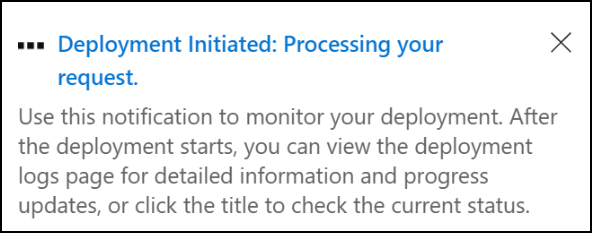

# How to use the Global Secure Access deployment logs (preview)

Deployment logs provide visibility into the status and progress of configuration changes made in Global Secure Access. Unlike other logging features, deployment logs focus specifically on tracking configuration updates. For example, forwarding profile redistributions and remote network changes. Deployment logs provide detailed insights into the deployment status and success across the global network. These logs help administrators track and troubleshoot deployment updates, such as forwarding profile redistributions and remote network updates, across the global network. 

This article describes how to view and analyze deployment logs, configure diagnostic settings, and understand log fields. 

## Prerequisites 

- A **Global Secure Access Administrator** or **Security Administrator** role in Microsoft Entra ID.
- The product requires licensing. For details, see the licensing section of [What is Global Secure Access](overview-what-is-global-secure-access.md). If needed, you can [purchase licenses or get trial licenses](https://aka.ms/azureadlicense).

## How to access the deployment logs 

You can view deployment logs using the Microsoft Entra admin center.

To access deployment logs: 
1. Sign in to the [Microsoft Entra admin center](https://entra.microsoft.com) as at least a [Global Secure Access Administrator](/azure/active-directory/roles/permissions-reference).
1. Navigate to **Global Secure Access** > **Monitor** > **Deployment logs**.
1. Use filters to narrow results based on activity type, status, or other fields.

> [!NOTE]
> Deployment logs can also be accessed when a change is made to the configuration of Global Secure Access. A notification shows up at the top right corner of the page when making a configuration change. Select the notification to see the progress of the deployment.
> 

### Filter options

To filter the deployment logs to a specific detail, select **Add filter** and then enter the detail for the filter. For example, to look at all the logs for remote network activity, select the activity and then select **Remote Network** and then select **Apply**.

## Supported scenarios 

The Global Secure Access configuration activities included in deployment logs are:
- Remote network 
- Filtering Profile 
- Audit Logs Settings 
- Cross Tenant Access Settings 
- Conditional Access Settings 
- IP Forwarding Options 
- Forwarding Profile 

## Deployment log fields

The following table describes the fields available in the deployment logs:

| Name            | Description                                                                 |
|-----------------|-----------------------------------------------------------------------------|
| **Date**        | The timestamp when the event occurred.                                      |
| **Activity**    | The type of configuration change (for example, Redistribute Forwarding Profile).   |
| **Status**      | The outcome of the deployment (for example, Deployment Successful, Deployment Failed). |
| **Initiated By**| The account or admin who initiated the change.                              |
| **Type**        | The category of the configuration change (for example, forwardingProfile, remoteNetwork). |
| **Request ID**  | A unique identifier for tracking the deployment.                            |
| **Error Messages** | Specific error messages for failed deployments.                          |

## Related content
- [Learn about the traffic dashboard](concept-traffic-dashboard.md)
- [View the audit logs for Global Secure Access](how-to-access-audit-logs.md)
- [View the enriched Microsoft 365 logs](how-to-view-enriched-logs.md)
