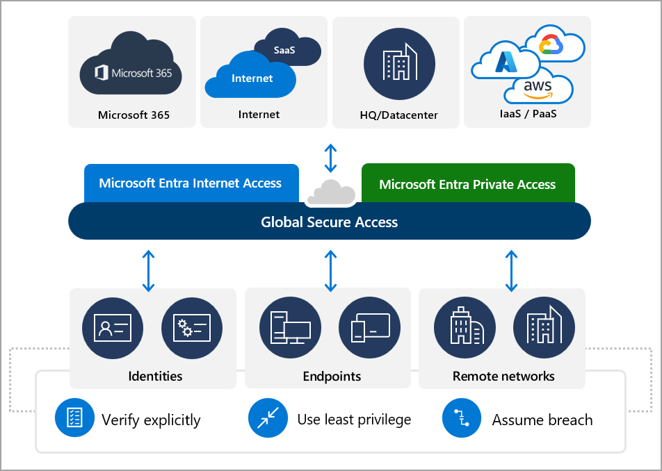

# What is Global Secure Access?

> [!IMPORTANT]
> Some features of Global Secure Access are currently in PREVIEW.
> See the [Product Terms](https://aka.ms/EntraPreviewsTermsOfUse) for legal terms that apply to features that are in beta, preview, or otherwise not yet released into general availability.

The way people work changed. Instead of working in traditional offices, people now work from nearly anywhere. With applications and data moving to the cloud, an identity-aware, cloud-delivered network perimeter for the modern workforce is needed. This new network security category is called Security Service Edge (SSE).

Microsoft Entra Internet Access and Microsoft Entra Private Access comprise Microsoft's Security Service Edge (SSE) solution. Global Secure Access is the unifying term used for both Microsoft Entra Internet Access and Microsoft Entra Private Access. Global Secure Access is the unified location in the Microsoft Entra admin center. Global Secure Access is built upon the core principles of Zero Trust to use least privilege, verify explicitly, and assume breach.

## Microsoft's Security Service Edge (SSE) solution

Microsoft Entra Internet Access and Microsoft Entra Private Access - coupled with Microsoft Defender for Cloud Apps, our SaaS-security focused Cloud Access Security Broker (CASB) - are uniquely built as a solution that converges network, identity, and endpoint access controls so you can secure access to any app or resource, from anywhere. With the addition of these Global Secure Access products, Microsoft Entra ID simplifies access policy management and enables access orchestration for employees, business partners, and digital workloads. You can continuously monitor and adjust user access in real time if permissions or risk level changes.

The Global Secure Access features streamline the roll-out and management of the access control capabilities with a unified portal. These features are delivered from Microsoft's Wide Area Network, spanning 140+ regions and 190+ network edge locations. This private network, which is one of the largest in the world, enables organizations to optimally connect users and devices to public and private resources seamlessly and securely. For a list of the current points of presence, see [Global Secure Access points of presence article](reference-points-of-presence.md).

## Microsoft Entra Internet Access

Microsoft Entra Internet Access secures access to Microsoft services, SaaS, and public internet apps while protecting users, devices, and data against internet threats. Best-in-class security and visibility, along with fast and seamless access to Microsoft 365 apps. Secure access to public internet apps through the identity-centric, device-aware, cloud-delivered Secure Web Gateway (SWG) of Microsoft Entra Internet Access.

### Key features

- Acquire network traffic from the desktop client or from a remote network, such as a branch location. Deploy side-by-side with non-Microsoft SSE solutions. User aware public internet traffic forwarding profile. Pre-populated Microsoft 365 traffic forwarding profile. 
- Leverage rich context awareness (user, device, location, risk, and compliance policy) while applying network security policies through integration with Conditional Access. Protect user access to the public internet while using Microsoft's cloud-delivered, identity-aware SWG solution. 
- Enable web content filtering to regulate access to internet destinations based on their web-content categories and/or FQDN-domain names. 
- Apply universal Conditional Access policies for all internet destinations, even if not federated with Microsoft Entra ID, through integration with Conditional Access session controls. 
- Prevent stolen tokens from being replayed with the compliant network check for your tenant (built into Conditional Access). Avoid the need to hairpin users, while compromising productivity to achieve location-based security checks. Also prevent SSE bypass for SaaS applications.   
- Apply universal tenant restrictions to prevent data exfiltration to unauthorized foreign tenants or personal accounts.
- Restore original user Source IP in Conditional Access policies, Identity Protection scores/risk assessment and Entra ID sign-in logs. 
- Detailed network traffic logs (including enforced policy details). Dashboards such as relationship maps between users, devices and endpoints, cross tenant access undergoing in your enterprise, as well as top network destination in use 

## Microsoft Entra Private Access

Microsoft Entra Private Access provides your users - whether in an office or working remotely - secured access to your private, corporate resources. Microsoft Entra Private Access builds on the capabilities of Microsoft Entra application proxy and extends access to any private resource, port, and protocol.

Remote users connect to private apps across hybrid and multicloud environments, private networks, and data centers from any device and network without requiring a VPN. The service offers per-app adaptive access based on Conditional Access policies, for more granular security than a VPN.

### Key features

- Zero Trust based access to a range of IP addresses and/or Fully Qualified Domain Names (FQDNs) without requiring a legacy VPN. This feature is known as Quick Access.
- Per-app access for Transmission Control Protocol (TCP) and User Datagram Protocol (UDP) applications.
- Modernize legacy app authentication with deep Conditional Access integration.
- Provide a seamless end-user experience by acquiring network traffic from the desktop client and deploying side-by-side with your existing non-Microsoft SSE solutions.

## Licensing overview 
Microsoft Entra Internet Access and Microsoft Entra Private Access are now generally available. Use of internet access features require a Microsoft Entra Internet Access license and use of private access features require a Microsoft Entra Private Access license. Both licenses are available as part of the Microsoft Entra Suite. To learn more about licensing costs and the Microsoft Entra Suite, see [Microsoft Entra Plans & Pricing](https://www.microsoft.com/security/business/microsoft-entra-pricing). To learn more about purchasing individual license, see the Microsoft Entra Suite standalone products tab of the licensing page. Use of the Microsoft traffic profile is included with the Secure Access Essentials license, which will soon be included in the Microsoft 365 E3 license. 

Prerequisite to use Microsoft Entra Private Access, Microsoft Entra Internet Access and Secure Access Essentials is Microsoft Entra ID P1 or Microsoft Entra ID P2.

**Remote Network licensing**

While we are still determining the licensing model for remote networks, we want to provide you with the most up-to-date guidance and recommendations to ensure optimal performance for your Microsoft traffic deployment. Microsoft recommends a 250 Mbps bandwidth for Microsoft traffic of 1250 users. In cases of usage exceeding the recommended limits, additional charges may apply. To learn more about remote networks, see [How to create a remote network with Global Secure Access](how-to-create-remote-networks.md).

## Next steps

- [Get started with Global Secure Access](how-to-get-started-with-global-secure-access.md)
- [Stay in the loop with the latest Microsoft Entra ID updates](https://techcommunity.microsoft.com/t5/microsoft-entra-azure-ad-blog/bg-p/Identity)
