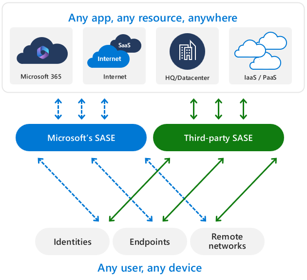

# Microsoft's SASE partner ecosystem overview

Microsoft's Secure Access Service Edge (SASE) partner ecosystem is designed to provide organizations with a robust and flexible security framework. Microsoft collaborates with leading security vendors to ensure that its SASE solution can seamlessly integrate with various non-Microsoft products. This integration allows organizations to use their existing security investments while enhancing their overall security posture. In this overview, you'll explore the different types of partner integrations and coexistence offerings available, helping you to make informed decisions about how to best secure your network infrastructure.

Microsoft's Secure Access Service Edge (SASE) solution supports non-Microsoft integrations that provide you with flexibility to secure access to your resources with both Microsoft and non-Microsoft solutions. The goal of these integrations is twofold: ensure that non-Microsoft solutions work well with Microsoft's SASE solution, and enhance the experience for IT administrators and end users.

 

We work with our partners to deliver the following categories:

- **Partner integration offerings**: these integrations provide a comprehensive solution that deeply and seamlessly embeds advanced partner capabilities directly inside Microsoft's SASE solution, all within the same interface.
- **Partner coexistence offerings**: these integrations aim to optimize your experience as you deploy Microsoft's SASE solution along with your existing security stacks. 
- **Connectivity**: partners that demonstrate interoperability between their connectivity capabilities and Microsoft's Security Service Edge (SASE) solution.
- **Partner service offerings**: Partners that provide implementation services.

## Partner integration offerings (Preview)

The available partner integrations are:

- [Netscope](concept-netskope-integration.md)

## Partner coexistence offerings

The following partners provide coexistence with Microsoft Entra Internet Access and Microsoft Entra Private Access. These side-by-side deployment guides allow you to configure which type of traffic you want to direct to Microsoft's Security Service Edge solution or the partner solution. 

You can choose to direct different types of traffic based on your network needs. Options include:
- Microsoft traffic
- Internet traffic
- Private network traffic

The partners that are demonstrated to provide coexistence include:
- [Cisco](concept-cisco-coexistence.md)
- [Netskope](concept-netskope-coexistence.md)
- [Palo Alto Networks](concept-palo-alto-coexistence.md)
- [Zscaler](concept-zscaler-coexistence.md)

### Connectivity
A core component of Microsoft’s Security Service Edge (SSE) solution, Microsoft Entra Internet Access, now integrates seamlessly with various SD-WAN and connectivity providers, enabling optimal connections between Microsoft’s identity-centric SSE and third-party network infrastructure. By linking with SD-WAN and connectivity hardware or virtual machines (VMs), organizations can enhance their preferred network solutions with Microsoft’s SSE solution from one place for a streamlined experience.
The following partners offer automated integrations with Microsoft’s SSE solution, allowing customers to securely expand their networks with minimal effort:

| Partner         | Integration Guide | Description    |
|----------------|-------------------|----------------|
| Aviatrix       | Link TBD          | Description TBD|
| Teridion       | Link TBD          | Description TBD|
| Versa Networks | Link TBD          | Description TBD|

For organizations seeking customization according to their unique network architecture, Microsoft offers templatized integrations with the following partners:

| Partner       | Integration Guide                                                                 | Description |
|---------------|-----------------------------------------------------------------------------------|-------------|
| HPE Aruba     | [Integration Guide](https://www.arubanetworks.com/techdocs/sdwan-PDFs/integrations/int_Microsoft-SSE-EC-IPSec_latest.pdf) | Integration with HPE Aruba's SD-WAN solution. |
| Cisco Catalyst| [Integration Guide](https://www.cisco.com/site/us/en/solutions/networking/sdwan/index.html) | Integration with Cisco Catalyst's SD-WAN solution. |
| Cisco Meraki  | [Integration Guide](https://meraki.cisco.com/)                                    | Integration with Cisco Meraki's SD-WAN solution. |

## Partner service offerings

Microsoft partners with many service partners. To learn more, see [Find a Microsoft services partner](how-to-find-microsoft-services-partners.md).