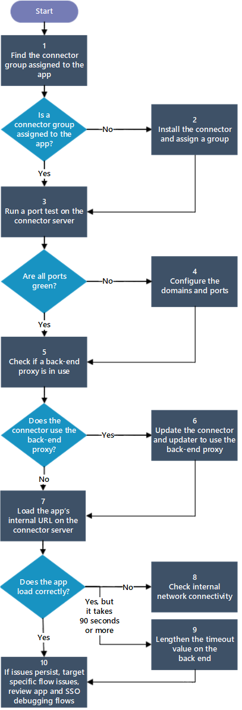
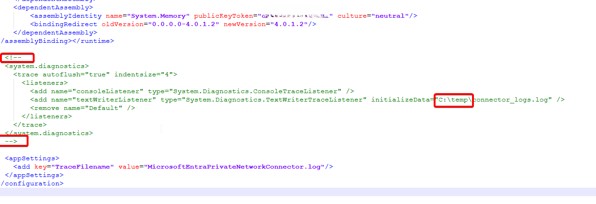
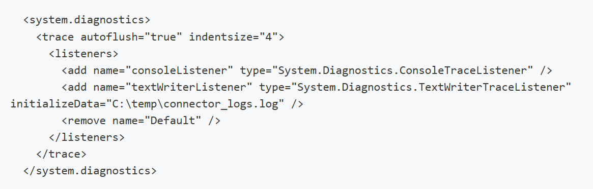

# Troubleshoot problems installing the private network connector

Microsoft Entra private network connector is an internal domain component that uses outbound connections to establish the connectivity from the cloud available endpoint to the internal domain. The connector is used by both Microsoft Entra Private Access and Microsoft Entra application proxy. This article describes how to troubleshoot issues with connector installation and subsequent functionality.

## General problem areas with connector installation

When the installation of a connector fails, the root cause is usually one of the following areas. **As a precursor to any troubleshooting, be sure to reboot the connector.**

- **Connectivity** – to complete a successful installation, the new connector needs to register and establish future trust properties. Trust is established by connecting to the Microsoft Entra application proxy cloud service.
- **Trust Establishment** – the new connector creates a self-signed cert and registers to the cloud service.
- **Authentication of the admin** – during installation, the user must provide admin credentials to complete the connector installation.

> [!NOTE]
> The connector installation logs can be found in the `%TEMP%` folder and can help provide additional information on what is causing an installation failure.

## Use the Connector Diagnostics tool to identity connector installation and network problems

The connector diagnostics tool is an exe command-line application that is included in the connector package. This tool is designed to diagnose common connector setup and runtime errors to identify installation or network problems. Currently, the tool supports the following checks:

- Certificate validity
- Ports 80/443 accessibility
- Outbound proxy configuration
- CRL accessibility
- Connector service running
- Backend service endpoint accessibility

The tool also provides additional information, such as certificate details (if the cert is valid), tenant and connector ID, and TLS versions. To ensure that no checks are missed due to network or intermittent issues, the tool contains retries and prints out exception messages for any connectivity failures.

**How to get the tool:** The connector diagnostics tool is available in the connector installation package starting version 1.5.4287.0. Previous versions don't contain the tool. A new connector installation is needed to get the tool if you are using the previous version. 

**How to use the tool:** After verifying successful installation, the tool can be found in the connector installation folder, located by default in C:/Program Files/Microsoft Entra Private Network Connector. Double click the application "ConnectorDiagnosticsTool" to launch the tool. 


Sample Output:


## Verify connectivity to the cloud application proxy service and Microsoft sign in page

**Objective:** Verify that the connector machine can connect to the application proxy registration endpoint and the Microsoft sign-in page.

1.  On the connector server, run a port test by using [telnet](/windows-server/administration/windows-commands/telnet) or other port testing tool to verify that ports 443 and 80 are open.

2.  Verify that the Firewall or backend proxy has access to the required domains and ports see, [configure connectors](how-to-configure-connectors.md).

3.  Open a browser tab and enter: `https://login.microsoftonline.com`. Make sure you can sign in.

## Verify machine and backend component certificate support

**Objective:** Verify that the connector machine, backend proxy, and firewall support the certificate the connector created. Also, verify the certificate is valid.

>[!NOTE]
>The connector tries to create a `SHA512` cert that supports Transport Layer Security (TLS) 1.2. If the machine or the backend firewall and proxy does not support TLS 1.2, the installation fails.

**Review the prerequisites required:**

1.  Verify the machine supports Transport Layer Security (TLS) 1.2 – All Windows versions after 2012 R2 should support TLS 1.2. If your connector machine is from a version of 2012 R2 or prior, make sure that the [required updates](https://support.microsoft.com/help/2973337/sha512-is-disabled-in-windows-when-you-use-tls-1.2) are installed.

2.  Contact your network admin and ask to verify that the backend proxy and firewall don't block `SHA512` outgoing traffic.

**To verify the client certificate:**

Verify the thumbprint of the current client certificate. The certificate store can be found in `%ProgramData%\microsoft\Microsoft AAD private network connector\Config\TrustSettings.xml`.

```
<?xml version="1.0" encoding="utf-8"?>
<ConnectorTrustSettingsFile xmlns:xsd="http://www.w3.org/2001/XMLSchema" xmlns:xsi="http://www.w3.org/2001/XMLSchema-instance">
  <CloudProxyTrust>
    <Thumbprint>4905CC64B2D81BBED60962ECC5DCF63F643CCD55</Thumbprint>
    <IsInUserStore>false</IsInUserStore>
  </CloudProxyTrust>
</ConnectorTrustSettingsFile>
```

The possible **IsInUserStore** values are **true** and **false**. A value of **true** means the certificate is automatically renewed and stored in the personal container in the user certificate store of the Network Service. A value of **false** means the client certificate is created during the installation or registration `Register-MicrosoftEntraPrivateNetworkConnector` initiates. The certificate is stored in the personal container in the certificate store of the local machine.

If the value is **true**, follow these steps to verify the certificate:
1. Download [PsTools.zip](/sysinternals/downloads/pstools).
2. Extract [PsExec](/sysinternals/downloads/psexec) from the package and run **psexec -i -u "nt authority\network service" cmd.exe** from an elevated command prompt.
3. Run **certmgr.msc** in the newly appeared command prompt.
4. In the management console, expand the Personal container and select on Certificates.
5. Locate the certificate issued for **connectorregistrationca.msappproxy.net**.

If the value is **false**, follow these steps to verify the certificate:
1. Run **certlm.msc**.
2. In the management console, expand the Personal container and select on Certificates.
3. Locate the certificate issued for **connectorregistrationca.msappproxy.net**.    

**To renew the client certificate:**

If a connector isn't connected to the service for several months, its certificates could be outdated. The failure of the certificate renewal leads to an expired certificate. The expired certificate causes the connector service to stop working. The event 1000 is recorded in the admin log of the connector:

`Connector re-registration failed: The Connector trust certificate expired. Run the PowerShell cmdlet Register-MicrosoftEntraPrivateNetworkConnector on the computer on which the Connector is running to re-register your Connector.`

In this case, uninstall and reinstall the connector to trigger registration or you can run the following PowerShell commands:

```
Import-module MicrosoftEntraPrivateNetworkConnectorPSModule
Register-MicrosoftEntraPrivateNetworkConnector
```

To learn more about the `Register-MicrosoftEntraPrivateNetworkConnector` command, see [Create an unattended installation script for the Microsoft Entra private network connector](how-to-register-connector-powershell.md).

## Verify admin is used to install the connector

**Objective:** Verify that the user who tries to install the connector is an administrator with correct credentials. Currently, the user must be at least an Application Administrator for the installation to succeed.

**To verify the credentials are correct:**

Connect to `https://login.microsoftonline.com` and use the same credentials. Make sure the sign in is successful. Check the user role, go to **Microsoft Entra ID** -&gt; **Users and Groups** -&gt; **All Users**. 

Select your user account, then **Directory Role** in the resulting menu. Verify that the selected role is **Application Administrator**. If you're unable to access any of the pages along these steps, you don't have the required role.

>[!NOTE]
>You should be prompted for your administrator credentials during connector installation via a pop-up. If you don't receive a pop-up, ensure that your browser settings enable pop-ups and JavaScript is enabled. During the next installation attempt, you'll be prompted to add sites to Trusted sites. After the sites are added to Trusted sites, re-run installation.

## Connector errors

If registration fails during the connector wizard installation, there are two ways to view the reason for the failure. Either look in the event log under `Windows Logs\Application (filter by Source = "Microsoft Entra private network connector"` , or run the following Windows PowerShell command:

```powershell
Get-EventLog application –source "Microsoft Entra private network connector" –EntryType "Error" –Newest 1
```

Once you find the connector error from the event log, use this table of common errors to resolve the problem:

| Error | Recommended steps |
| ----- | ----------------- |
| `Connector registration failed: Make sure you enabled application proxy in the Azure Management Portal and that you entered your Active Directory user name and password correctly. Error: 'One or more errors occurred.'` | If you closed the registration window without signing in to Microsoft Entra ID, run the connector wizard again and register the connector. <br><br> If the registration window opens and then immediately closes without allowing you to sign in, you get the error. The error occurs when there's a networking error on your system. Make sure you can connect from a browser to a public website and that the ports are open as specified in [configure connectors](how-to-configure-connectors.md). |
| `Clear error is presented in the registration window. Cannot proceed` | If you see the error and then the window closes, you entered the wrong username or password. Try again. |
| `Connector registration failed: Make sure you enabled application proxy in the Azure Management Portal and that you entered your Active Directory user name and password correctly. Error: 'AADSTS50059: No tenant-identifying information found in either the request or implied by any provided credentials and search by service principal URI has failed.` | You're trying to sign in using a Microsoft Account and not a domain that is part of the organization ID of the directory you're trying to access. The admin must be part of the same domain name as the tenant domain. For example, if the Microsoft Entra domain is `contoso.com`, the admin should be `admin@contoso.com`. |
| `Failed to retrieve the current execution policy for running PowerShell scripts.` | If the connector installation fails, check to make sure that PowerShell execution policy isn't disabled. <br><br>1. Open the Group Policy Editor.<br>2. Go to **Computer Configuration** > **Administrative Templates** > **Windows Components** > **Windows PowerShell** and double-click **Turn on Script Execution**.<br>3. The execution policy can be set to either **Not Configured** or **Enabled**. If set to **Enabled**, make sure that under Options, the Execution Policy is set to either **Allow local scripts and remote signed scripts** or to **Allow all scripts**. |
| `Connector failed to download the configuration.` | The connector’s client certificate, which is used for authentication, expired. The issue occurs if you have the connector installed behind a proxy. In this case, the connector can't access the internet and isn't able to provide applications to remote users. Renew trust manually using the `Register-MicrosoftEntraPrivateNetworkConnector` cmdlet in Windows PowerShell. If your connector is behind a proxy, it's necessary to grant internet access to the connector accounts `network services` and `local system`. Granting access is accomplished by granting access to the proxy or bypassing the proxy. |
| `Connector registration failed: Make sure you are an Application Administrator of your Active Directory to register the connector. Error: 'The registration request was denied.'` | The alias you're trying to sign in with isn't an admin on this domain. Your connector is always installed for the directory that owns the user’s domain. Make sure that the admin account you're trying to sign in with has at least Application Administrator permissions to the Microsoft Entra tenant. |
| `The connector was unable to connect to the service due to networking issues. The connector tried to access the following URL.` | The connector is unable to connect to the application proxy cloud service. The issue happens if you have a firewall rule blocking the connection. Allow access to the correct ports and URLs listed in [configure connectors](how-to-configure-connectors.md). |


## Flowchart for connector issues

This flowchart walks you through the steps for debugging some of the more common connector issues. For details about each step, see the table following the flowchart.



| Step | Action | Description |
|---------|---------|---------|
|1 | Find the connector group assigned to the app | You probably have a connector installed on multiple servers, in which case the connectors should be assigned to a connector group. To learn more about connector groups, see [Understand Microsoft Entra private network connector groups](concept-connector-groups.md).|
|2 | Install the connector and assign a group | If you don't have a connector installed, see [configure connectors](how-to-configure-connectors.md)).<br></br> If the connector isn't assigned to a group, see [Assign the connector to a group](concept-connector-groups.md).<br></br>If the application isn't assigned to a connector group, see [Assign the application to a connector group](concept-connector-groups.md#assign-applications-to-your-connector-groups).|
|3 | Run a port test on the connector server | On the connector server, run a port test by using [telnet](/windows-server/administration/windows-commands/telnet) or other port testing tool to check if ports are configured correctly. To learn more, see [configure connectors](how-to-configure-connectors.md).|
|4 | Configure the domains and ports | [Configure connectors](how-to-configure-connectors.md) for the connector. Certain ports must be open and URLs that your server must be able to access. For more information, see [configure connectors](how-to-configure-connectors.md). |
|5 | Check if a back-end proxy is in use | Check to see if the connectors are using back-end proxy servers or bypassing them. For details, see [Troubleshoot connector proxy problems and service connectivity issues](../identity/app-proxy/application-proxy-configure-connectors-with-proxy-servers.md). |
|6 | Update the connector and updater settings with the back-end proxy information | If a back-end proxy is in use, make sure the connector is using the same proxy. For details about troubleshooting and configuring connectors to work with proxy servers, see [Work with existing on-premises proxy servers](../identity/app-proxy/application-proxy-configure-connectors-with-proxy-servers.md). |
|7 | Load the app's internal URL on the connector server | On the connector server, load the app's internal URL. |
|8 | Check internal network connectivity | There's a connectivity issue in your internal network that this debugging flow is unable to diagnose. The application must be accessible internally for the connectors to work. You can enable and view connector event logs as described in [private network connectors](concept-connectors.md#under-the-hood). |
|9 | Lengthen the time-out value on the back end | In the **Additional Settings** for your application, change the **Backend Application Timeout** setting to **Long**. See [Add an on-premises app to Microsoft Entra ID](../identity/app-proxy/application-proxy-add-on-premises-application.md). |
|10 | If issues persist, debug applications. | [Debug application proxy application issues](../identity/app-proxy/application-proxy-debug-apps.md). |

## Troubleshooting connector functionality
If connector installation and registration are successful but you are unable to access private resources, check the following.

- **Cloud Service connectivity failures**: Your connector might be having problems connecting to the Entra Private Access cloud service. While the connector's status on the Microsoft Entra admin center might show as Active, the connector might still have problems connecting to the cloud service endpoints. Check with your networking team to see if there are failed connectivity attempts from the connector IP.
- **Failed to validate chain of certificate error**: This error appears in the connector advanced logging when the certificate chain for a Global Secure Access service certificate such as *.msappproxy.net fails to be validated. Often this occurs when there is a proxy server configured on MicrosoftEntraPrivateNetworkConnectorService.exe.config but there is not also a system proxy server configured. You can set the system proxy using netsh winhttp set proxy address:port.
- **TLS inspection is configured**: TLS inspection is not supported on Private Network connector traffic. Attempting to perform TLS inspection on this traffic interferes with the connector's ability to connect to the Global Secure Access service and therefore interferes with its ability to service Private Access requests. Ensure the network devices allowing Internet access to your private network connector don't perform TLS inspection.
- **Proxy server exists between connector and resource**: The connector requires line of sight connectivity to the resource and cannot function if there is a proxy server between the connector and the resource. To confirm, test connectivity from the connector to the resource you've defined in your Global Secure Access application, such as file share or RDP server, to ensure the connector can access the resource. If you cannot connect to the resource from the connector server, you will need to resolve the network connectivity issue between the connector and the resource which may include relocating the connector to a network location with line of sight access to the resource.

### Enable advanced connector logging
If you can connect to the resource from the server but not from the Global Secure Access client, there may be other issues with the connector. To investigate, enable advanced connector logging. To do this, edit the file MicrosoftEntraPrivateNetworkConnectorService.exe.config located in the connector installation folder (by default, C:\Program Files\Microsoft Entra private network connector). Locate the below section in the file, remove the comment line indicators that lead and trail this section, and confirm that the referenced folder exists. 



The file contents should look as follows:



After you have enabled logging, attempt to access the resource from the Global Secure Access client in order to reproduce the error. Then, review the log file for errors.


## Frequently asked questions
**Why is my connector still using an older version and not auto-upgraded to latest version?**

This may be due to either the updater service not working correctly or if there are no new updates available that the service can install.

The updater service is healthy if it’s running and there are no errors recorded in the event log (Applications and Services logs -> Microsoft -> Microsoft Entra private network -> Updater -> Admin). 

> [!IMPORTANT]
> Only major versions are released for auto-upgrade. We recommend updating your connector manually only if it's necessary. For example, you cannot wait for a major release, because you must fix a known problem or you want to use a new feature. For more information on new releases, the type of the release (download, auto-upgrade), bug fixes and new features see, [Microsoft Entra private network connector: Version release history](reference-version-history.md).

To manually upgrade a connector:

- Download the latest version of the connector. (Find it in the Microsoft Entra admin center at **Global Secure Access** > **Connect** > **Connectors**)
- The installer restarts the Microsoft Entra private network connector services. In some cases, a reboot of the server might be required if the installer cannot replace all files. Therefore we recommend closing all applications (that is, Event Viewer) before you start the upgrade.
- Run the installer. The upgrade process is quick and does not require providing any credentials and the connector is not re-registered.
    
**Can private network connector services run in a different user context than the default?**

No, this scenario isn't supported. The default settings are:
- Microsoft Entra private network connector - WAPCSvc - Network Service
- Microsoft Entra private network connector Updater - WAPCUpdaterSvc - NT Authority\System
    
**Can a guest user with an active administrator role assignment register the connector for the (guest) tenant?**

No, currently, this isn't possible. The registration attempt is always made on the user's home tenant.

**My back-end application is hosted on multiple web servers and requires user session persistence (stickiness). How can I achieve session persistence?**

For recommendations, see [High availability and load balancing of your private network connectors and applications](../identity/app-proxy//application-proxy-high-availability-load-balancing.md).
    
**Is TLS termination (TLS/HTTPS inspection or acceleration) on traffic from the connector servers to Azure supported?**

The private network connector performs certificate-based authentication to Azure. TLS Termination (TLS/HTTPS inspection or acceleration) breaks this authentication method and isn't supported. Traffic from the connector to Azure must bypass any devices that are performing TLS Termination.  

**Is TLS 1.2 required for all connections?**

Yes. To provide the best-in-class encryption to our customers, the application proxy service limits access to only TLS 1.2 protocols. These changes were gradually rolled out and effective since August 31, 2019. Make sure that all your client-server and browser-server combinations are updated to use TLS 1.2 to maintain connection to application proxy service. These include clients your users are using to access applications published through application proxy. See Preparing for [TLS 1.2 in Office 365](/purview/prepare-tls-1.2-in-office-365) for useful references and resources.
    
**Can I place a forward proxy device between the connector server(s) and the back-end application server?**

This scenario is supported starting from the connector version 1.5.1526.0 for Microsoft Entra application proxy, but is not supported for Microsoft Entra Private Access. See [Work with existing on-premises proxy servers](../identity/app-proxy/application-proxy-configure-connectors-with-proxy-servers.md) for information about this support for App Proxy.
    
**Should I create a dedicated account to register the connector with Microsoft Entra application proxy?**

There's no reason to create a dedicated account. Any account with the Application Administrator role works. The credentials entered during installation aren't used after the registration process. Instead, a certificate is issued to the connector, which is used for authentication from that point on.

**How can I monitor the performance of the Microsoft Entra private network connector?**

There are Performance Monitor counters that are installed along with the connector. To view them:  
    
1. Select **Start**, type "Perfmon", and press ENTER.
2. Select **Performance Monitor** and click the green **+** icon.
3. Add the **Microsoft Entra private network connector** counters you want to monitor.
    
**Does the Microsoft Entra private network connector have to be on the same subnet as the resource?**

The connector isn't required to be on the same subnet. However, it needs name resolution (DNS, hosts file) to the resource and the necessary network connectivity (routing to the resource, ports open on the resource, and so on). For recommendations, see [Network topology considerations when using Microsoft Entra application proxy](../identity/app-proxy/application-proxy-network-topology.md).
    
**Why is the connector still showing in Microsoft Entra admin center after I uninstalled the connector from the Server?**

When a connector is running, it remains active as it connects to the service. Uninstalled or unused connectors are tagged as inactive and are removed after 10 days of inactivity from the Microsoft Entra admin center. There is no way to remove the Inactive connector manually from the Microsoft Entra admin center.

## Next steps
- [Understand Microsoft Entra private network connectors](concept-connectors.md)
