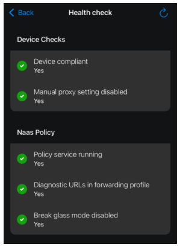
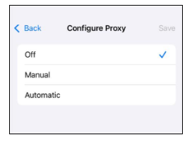
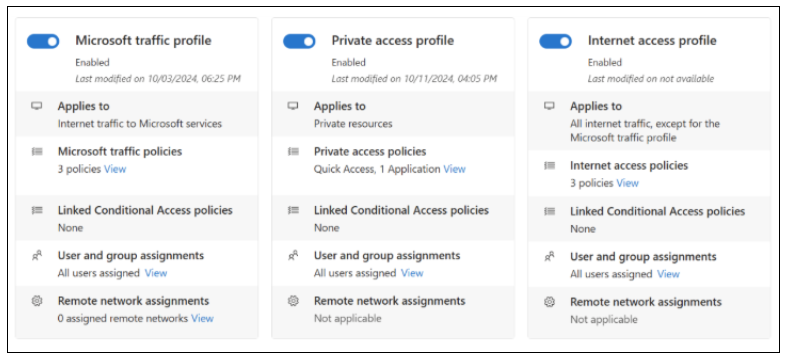

# Troubleshoot the Global Secure Access client for iOS with Health check utility

This article's troubleshooting guidance is for the [Global Secure Access](/entra/global-secure-access/overview-what-is-global-secure-access) iOS client, using the health check utility in [Microsoft Defender](/office365/servicedescriptions/microsoft-365-service-descriptions/microsoft-365-tenantlevel-services-licensing-guidance/microsoft-defender-service-description). 

The Global Secure Access mobile client health check utility helps you understand if a device can communicate with the Global Secure Access service and tunnel traffic. The health check has a single view for device compliance, local network configuration, and policy service readiness signals. When required conditions are met, the health check utility reports a healthy state and traffic forwarding functions as expected.  

## Run the health check

Review the Global Secure Access client health check on an iOS device.

1. On the device, navigate to **Microsoft Defender**. 
2. Select **Global Secure Access**. 
3. Select **Troubleshooting**. 
4. Select **Advanced Diagnostics**. 
5. Select **Health check**.  

In the healthy state in health check, green check marks appear under **Device Checks** and  network-as-as-service **(Naas) Policy**. 

   

When the **X** symbol appears, the state is unhealthy and troubleshooting is recommended. After you complete a fix for a failed result, refresh the health check utility to view updated results. Use the information in the following sections to learn about specific remediation scenarios.  

   > [!NOTE]
   > If attempts fail to fix the results, contact [Microsoft Support](/services-hub/unified/support/contact-support). 

## Health check: device compliance

If your organization uses [Microsoft Intune](/intune/intune-service/fundamentals/what-is-intune) to define device compliance policies, and [Microsoft Entra Conditional Access](/entra/identity/conditional-access/) policies to enforce  the requirement to use Global Secure Access applications, the device will fail this test if it does not meet compliance criteria. 

To remediate device compliant errors:

1. Go to **Settings**.
2. Select **General**.
3. Select **VPN & Device Management**.
4. Confirm the user is signed into the correct work account on the device. 
5. Update the device operating (OS) system to the current version.
6. On the device, review failed compliance rules, for instance OS version, passcode, jailbreak detection, etc.  

### Enrolled devices

In the [Microsoft Intune admin center](https://intune.microsoft.com/), confirm the following criteria:

* Device enrollment
  * If not, [enroll the device in Intune](/intune/intune-service/fundamentals/deployment-guide-enrollment)
* Device compliance
  * If not, remediate the issue
  * See the following steps for more

1. On the client device, open the **Company Portal** app.
2. Ensure the device status is **Compliant**. 

   > [!NOTE]
   > After changes are made, it can take up to 30 minutes for the status to update. 

3. When health check tests indicate a healthy state, attempt to connect to the resource.
4. After remediation, restart the Global Secure Access client: Toggle it **Off** and **On** in Microsoft Defender.

### Bring-your-own-device scenarios

Use the following checklist for bring-your-own-device (BYOD).

Ensure the Microsoft Authenticator, or Company Portal apps, are installed on the client device. Device enrollment isn't required. 

In Microsoft Defender: 

1. Confirm the user signed in to the corporate account. 
2. Navigate to **Global Secure Access**.
3. Confirm that Global Secure Access is **Enabled**.
4. Navigate to **Global Secure Access**, then select **Services**.
5. Confirm required traffic profiles are connected. 

   > [!NOTE]
   > After remediation, restart the Global Secure Access client: Toggle it **Off** and **On** in Microsoft Defender.

You can learn to [monitor results of your Intune device-compliance policies](/intune/intune-service/protect/compliance-policy-monitor).

### Manual proxy setting disabled

Manual proxy on iOS interferes with Global Secure Access traffic routing. For instance, The **Manual proxy setting disabled** label in the health check is red, or set to **No**. Or you might be unable to access resources. To clear this health check error, disable the manual proxy setting. 

1. On the device, go to **Settings**, select **Wi-Fi**. 
2. Next to the active network, select the **info** icon (**i**). 
3. Scroll down to HTTP Proxy, and select **Configure Proxy**. 
4. Select **Off** or **Automatic**, if required by the environment for proxy autoconfiguration (PAC).

   

   > [!NOTE]
   > Avoid static or manual proxy settings when using the Global Secure Access client. After making changes, disconnect the device from Wi-Fi and reconnect Wi-Fi. 

On Apple Platform Deployment, you can learn more about [VPN Proxy device management settings for Apple devices](https://support.apple.com/guide/deployment/vpn-proxy-settings-depb78836926/web).

### NaaS policy: running policy service

If the Global Secure Access policy service isn't running or didn't initialize on the iOS device, the health check fails. To troubleshoot this error: 

1. On the client device, in Microsoft Defender, navigate to **Global Secure Access**.
2. Confirm the service is **Enabled**.
3. Confirm the user is signed in to the  work or school account.

To ensure the VPN is disabled:

1. On the iOS device, go to **Settings**.
2. Select **General**.
3. Select **VPN & Device Management**.
4. Confirm the VPN is set to **Not Connected**. 
5. Navigate to Settings.
6. Select Battery.
7. Ensure **Lower Power Mode** is disabled.
8. To confirm no background app restrictions, go to **Settings**. 
9. Select **General**.
10. Select **Background App Refresh**.
11. Confirm cellular data is turned on.

   > [!NOTE]
   > After remediation, restart the Global Secure Access client: Toggle it **Off** and **On** in Microsoft Defender, or you can restart the device.

## Diagnostic URLs in the forwarding profile

The following test checks that the configuration contains a URL to probe service health, for channels activated in the forwarding profile.

### Break-glass mode disabled

Break-glass mode prevents the Global Secure Access client from tunneling network traffic to the Global Secure Access cloud service. In this mode, traffic profiles in the Global Secure Access portal are unchecked, and the Global Secure Access client isn't expected to tunnel any traffic. 

**Enable traffic**

Enable the client to acquire traffic and tunnel traffic to the Global Secure Access service.

1. Sign in to the [Microsoft Entra admin center](https://entra.microsoft.com) as a [Global Secure Access Administrator](/entra/identity/role-based-access-control/permissions-reference). 
2. Browse to **Global Secure Access**
3. Select **Connect**.
4. Select **Traffic forwarding**. 
5. Enable at least one traffic profile. 
6. In about an hour, Global Secure Access receives the updated forwarding proifle.

   

   > [!NOTE]
   >  In addition to health check status indicators, iOS devices can return a generic **Something went wrong** error, for device registration problems. To resolve, update the device to the latest version of iOS. Then, navigate to **Microsoft Defender**, then **Global Secure Access**. Toggle the Global Secure Access client **Off** then **On**.

## Next steps

* Go to [Global Secure Access documentation](/entra/global-secure-access/) to learn about getting started, remote networks, access, monitoring, and more
* Learn to set up and deploy the [Global Secure Access client app on iOS and iPadOS devices](/entra/global-secure-access/how-to-install-ios-client)
* You can troubleshoot the [Global Secure Access mobile client for Android and iOS using the advanced diagnostics utility](/entra/global-secure-access/troubleshoot-global-secure-access-mobile-client-advanced-diagnostics)

