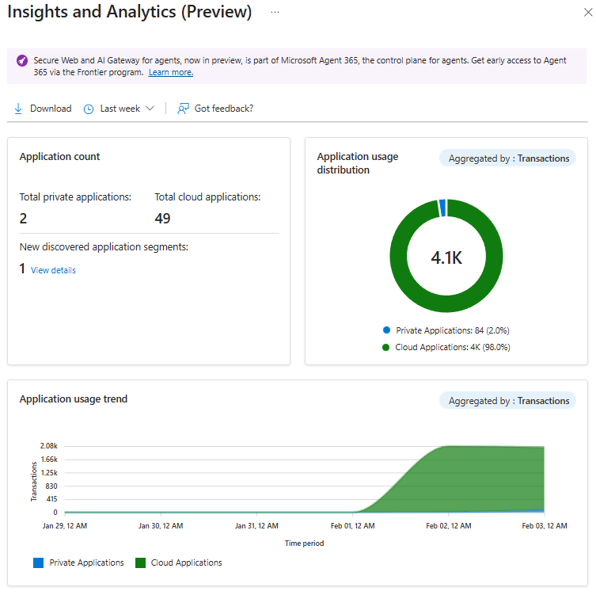
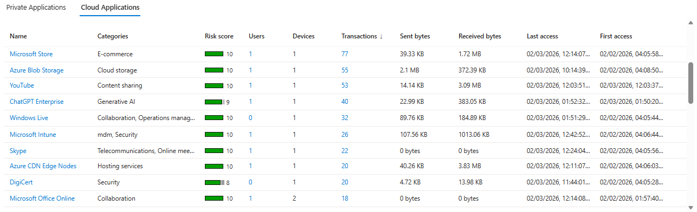
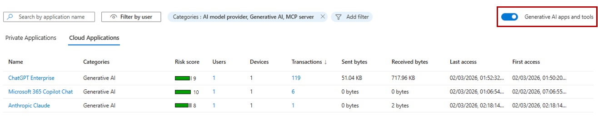

# Tutorial: Discover applications and shadow IT

Application usage analytics gives IT admins actionable insights into their organization's app use by analyzing traffic patterns, data usage, and which users access which applications. Admins can use these analytics to identify shadow IT, generative AI apps, and potential security or compliance risks. Usage analytics helps organizations increase visibility, improve their security posture, and optimize app use across their environment.

In this tutorial, you learn how to:
> [!div class="checklist"]
> - Generate internet network traffic to populate analytics data.
> - Review cloud application analytics and usage insights.
> - Identify generative AI applications and shadow IT in your organization.

## Key concepts

### What is shadow IT?

Shadow IT refers to applications and services that are used by employees without the IT department's knowledge or approval. This use creates risk such as the following examples.

| Risk category | Examples | Why it matters |
|---|---|---|
| Data loss | Uploading files to personal cloud storage | Sensitive data leaves corporate control. |
| Compliance | Using apps that don't meet regulatory requirements | Health Insurance Portability and Accountability Act (HIPAA) and Sarbanes-Oxley Act violations. |
| Security | Apps with poor security practices | Credential theft and malware delivery. |
| Licensing | Duplicate tools across teams | Wasted IT budget. |

#### Shadow AI: The new frontier

Generative AI tools (ChatGPT, Claude, Gemini, and others) present unique challenges:

- Employees might paste sensitive data into prompts.
- Confidential information might be used to train AI models.
- Organizations lose visibility into AI-assisted decisions.
- AI is susceptible to prompt injection and jailbreaking.

#### Risk scores explained

Microsoft evaluates each discovered application and assigns a risk score based on:

- **General factors:** Popularity, data sovereignty, and company information availability.
- **Security factors:** Encryption, multifactor authentication support, audit logs, and penetration testing.
- **Compliance factors:** SOC 2, ISO 27001, and HIPAA certification.
- **Legal factors:** Data ownership, Microsoft Software License Terms, and data retention policies.

## Sample walkthrough videos

The following video demonstrates how to identify shadow AI with application discovery.

> [!VIDEO https://www.youtube.com/embed/l8M7KFPXMe8]

## Step 1: Generate internet traffic

For this exercise to produce useful data, open a browser on your test device (with the Global Secure Access client installed) and go to several of your favorite websites. *Be sure to browse to some AI websites* too. Some examples of AI websites include:

- `copilot.microsoft.com`
- `chatgpt.com`
- `claude.ai`
- `ai.google`

## Step 2: Review cloud application analytics

### View summarized information

1. From the Microsoft Entra admin center, browse to **Global Secure Access** > **Applications** > **Insights & Analytics**.
1. Review the information that appears on the widgets.

    The dashboard displays three key widgets.
    
    | Widget | Description |
    |---|---|
    | Application count | Shows total cloud applications, total private applications, and newly discovered segments. |
    | Application usage distribution | Shows usage by type (cloud versus private), aggregated by transactions, bytes sent, or bytes received. |
    | Application usage trend | Shows usage over time, aggregated by transactions, users, devices, or bytes. |
    
    

### Investigate discovered applications

Cloud application analytics give admins visibility into the cloud applications that their organization uses, including generative AI applications. These insights help identify shadow IT and assess security and compliance risks.

1. Review the list of discovered cloud applications with the following details:

   - **Name**
   - **Categories**
   - **Risk score**
   - **Users**
   - **Sent bytes**
   - **Received bytes**

1. Optionally, select the column titles to reorder the lists. You can see the apps with the lowest risk score, the apps with the highest user counts, and more.

   

### View app details and risk factors

1. Select the **Name** link for an application.
1. The Microsoft Entra App Gallery opens and shows:
   - **Overall Risk Score**.
   - **General**, **Security**, **Compliance**, and **Legal** tabs, which show risk factor details.

## Step 3: Identify generative AI applications

> [!NOTE]
> Cloud application analytics can help you identify generative AI applications that are used in your organization. These apps are often referred to as "shadow AI." Analytics can help you to assess and manage potential risks.

1. Browse to **Global Secure Access** > **Applications** > **Insights & Analytics** > **Cloud Applications**.
1. Enable the **Generative AI apps and tools** toggle.

   

1. Review the filtered list that shows only generative AI applications accessed by users.
1. Evaluate each application's risk score and usage patterns.

## What you learned

In this tutorial, you accomplished the following tasks:

- **Discovered shadow IT in your organization:** You now have visibility into cloud applications that are being used, even apps that aren't sanctioned by IT.
- **Identified shadow AI applications:** You can use the generative AI filter to help you quickly find AI tools that might pose data leakage risks.
- **Understood application risk scoring:** You can prioritize remediation efforts based on risk scores across general, security, compliance, and legal factors.
- **Analyzed usage patterns:** You can see which apps have the most users, data transfer, or transactions to understand true business impact.

### From discovery to action

After you discover shadow IT or shadow AI, you can take actions to mitigate risks.

```
┌────────────────┐     ┌────────────────┐     ┌────────────────┐
│    Discover    │ →→→ │     Assess     │ →→→ │      Act       │
├────────────────┤     ├────────────────┤     ├────────────────┤
│ • View all     │     │ • Review risk  │     │ • Sanction app.│
│   discovered   │     │   scores.      │     │ • Block app.   │
│   apps.        │     │ • Check        │     │ • Apply file   │
│ • Filter by    │     │   compliance.  │     │   controls.    │
│   AI apps.     │     │ • Review user  │     │ • Monitor      │
│ • Sort by      │     │   count.       │     │   ongoing.     │
│   usage.       │     │ • Analyze data │     │ • Add to app   │
│                │     │    transfer.   │     │   governance.  │
└────────────────┘     └────────────────┘     └────────────────┘
```

#### Integration points

- Export data to Microsoft Defender for Cloud Apps for deeper investigation.
- Use discovered apps to inform web content filtering policies.
- Combine with content policies to prevent data upload to risky apps.
- Feed insights into security awareness training programs.

## Next step

> [!div class="nextstepaction"]
> [Tutorial: Configure content policies](tutorial-internet-access-content-policies.md)
