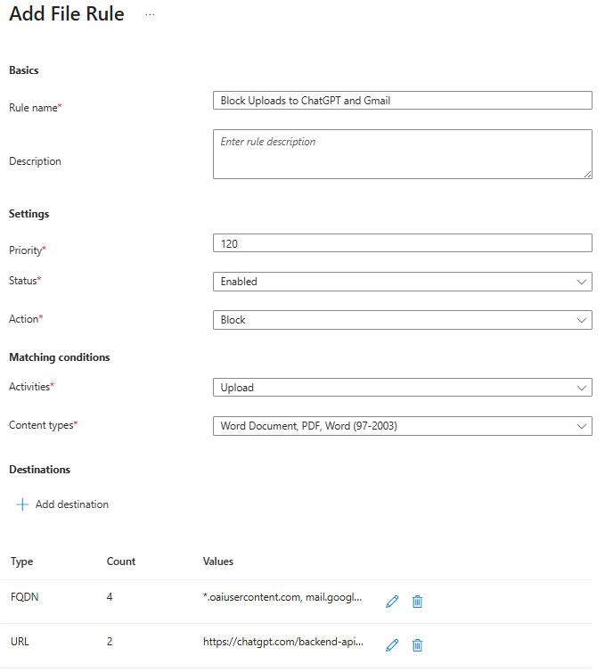
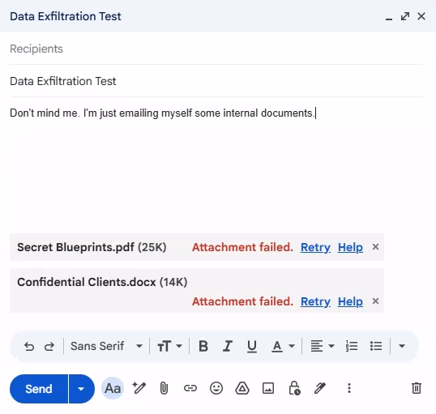

# Tutorial: Configure content policies

Network content filtering in Microsoft Entra Internet Access allows administrators to use content policies to prevent the transport of specific file types over the network. This feature helps protect sensitive data by blocking uploads and downloads of certain file formats (such as .doc, .docx, .pdf, .zip) to and from web applications like ChatGPT, Gmail, file sharing apps, and more. It can also use Purview to scan files and apply network-level policies based on document sensitivity labels.

In this tutorial, you learn how to:
> [!div class="checklist"]
> - Create a content policy to block specific file types from being uploaded
> - Link the content policy to a security profile
> - Verify that file upload blocking works as expected

## Key concepts

> [!TIP]
> **Why are content policies critical?**
>
> Content policies address a key data exfiltration vector: users intentionally or accidentally uploading sensitive files to unauthorized destinations.
>
> | Threat Scenario | Example | Content Policy Solution |
> |---|---|---|
> | **Shadow AI data leakage** | Employee pastes confidential contract into ChatGPT | Block document uploads to `*.oaiusercontent.com` |
> | **Personal email exfiltration** | Employee emails customer database to personal Gmail | Block uploads to `mail.google.com` |
> | **Unauthorized cloud storage** | Employee syncs work files to personal Dropbox | Block uploads to `*.dropbox.com` |
> | **Insider threat** | Malicious employee downloads sensitive files before leaving | Block downloads of specific file types |
>
> **How content policies work with TLS inspection:**
>
> ```
> User attempts upload     GSA Client      SSE with TLS Inspection     Destination
>         │                    │                     │                      │
>         │  Upload file.pdf   │                     │                      │
>         ├───────────────────>│                     │                      │
>         │                    │  Tunnel traffic     │                      │
>         │                    ├────────────────────>│                      │
>         │                    │                     │  Decrypt & Inspect   │
>         │                    │                     │  ┌───────────────┐   │
>         │                    │                     │  │ File type: PDF│   │
>         │                    │                     │  │ Action: Upload│   │
>         │                    │                     │  │ Dest: chatgpt │   │
>         │                    │                     │  │ → BLOCK       │   │
>         │                    │                     │  └───────────────┘   │
>         │    Block message   │                     │                      │
>         │<───────────────────┤                     │                      │
> ```
>
> **Important:** Content policies require TLS inspection to be enabled. Without decrypting the traffic, the SSE can't detect file types within encrypted uploads.

## Sample walkthrough videos

The following video demonstrates how to configure a content policy:

> [!VIDEO https://www.youtube.com/embed/PnK3XS-Eokw]

## Step 1: Create a content policy

1. From the Microsoft Entra admin center, browse to **Global Secure Access** > **Secure** > **Content policies**.
1. Select **Create policy**.
1. Enter a **name** and **description** for the policy. Select **Next**.
1. Select **Add rule**.
1. Enter the following:
   - **Rule name:** `Block uploads to ChatGPT and Gmail`
   - **Description:** Enter a description (optional)
   - **Priority:** `120`
   - **Status:** Enabled
   - **Action:** Block
   - **Activities:** Check the box for **Upload**
   - **Content types:** Check the boxes for **Word (97-2003)**, **Word Document**, and **PDF**.
1. Select **Add destination** and click **FQDN** and enter the following FQDNs.
   - `*.oaiusercontent.com`
   - `mail.google.com`
   - `clients6.google.com`
   - `*.clients6.google.com`
1. Select **Add**
1. Select **Add destination** and click **URL** and enter the following URLs.
   - `https://chatgpt.com/backend-api/files`
   - `https://chatgpt.com/backend-api/files/process_upload_stream`
1. Select **Add**

   

> [!NOTE]
> Apps might use multiple URLs and FQDNs under the hood when you interact with them. In this example, ChatGPT uses `*.oaiusercontent.com` and Gmail uses `mail.google.com`. If you aren't seeing content policies applied, check with dev tools to confirm which URLs and FQDNs the app is using.

10. Select **Save**.
11. Select **Next**, then select **Create**.

## Step 2: Link the policy to a security profile

1. Once the policy is created, browse to **Global Secure Access** > **Secure** > **Security profiles**.
1. Select the existing security profile from a previous tutorial.
1. Go to the **Link policies** blade.
1. Select **Link a policy**, then select **Existing Content policy**.
1. Choose the content policy you just created and select **Add**.

> [!NOTE]
> Verify that the security profile is assigned to a Conditional Access policy.

## Step 3: Verify file upload and download blocking

1. On your test device, open a browser and navigate to `www.chatgpt.com` and sign in with an account of your choice.
1. Attempt to upload a PDF or Word document to ChatGPT and verify the upload fails.
1. Navigate to `mail.google.com` and sign in with a Google account.
1. Attempt to upload a PDF or Word document to Gmail and verify the upload fails.

   

## Known limitations

> [!WARNING]
> Refer to [official documentation](/entra/global-secure-access/how-to-network-content-filtering#known-limitations) for the list of known limitations.

## What you learned

In this tutorial, you accomplished the following:

1. **Created a content policy to prevent data exfiltration** - You blocked specific document types from being uploaded to AI tools and personal email, addressing a key data loss vector.
1. **Understood FQDN discovery for apps** - You learned that web applications often use multiple backend URLs (like `*.oaiusercontent.com` for ChatGPT).
1. **Linked content policies to security profiles** - Content policies follow the same security profile model, allowing you to target specific users via Conditional Access.
1. **Combined multiple security controls** - This tutorial demonstrates how content policies work alongside web content filtering, TLS inspection, and threat intelligence as part of a comprehensive security strategy.

### Identifying application FQDNs

When configuring content policies, you need to know the actual FQDNs used by applications. Here's how to discover them:

1. **Browser Developer Tools (F12)**
   - Open the **Network** tab.
   - Upload a file to the target app.
   - Look for POST requests with file content.

### Combining with application discovery

Use the application discovery feature to identify which apps are being used, then create targeted content policies:

```
1. Discover shadow AI apps
        ↓
2. Assess risk scores
        ↓
3. Decision: Block entirely OR allow with content restrictions
        ↓
4. Create content policy if allowing with restrictions
```

**Best practices:**

- Start with blocking uploads to high-risk AI apps (or all AI apps with authorized exceptions).
- Consider blocking both **Upload** and **Download** for maximum protection.
- Test policies with a pilot group before broad deployment.
- Communicate changes to users to avoid confusion.

## Next steps

For more information, see the following resources:

- [What is Global Secure Access?](overview-what-is-global-secure-access.md)
- [Tutorial: Get started with Microsoft Entra Internet Access labs](tutorial-internet-access-introduction.md)
