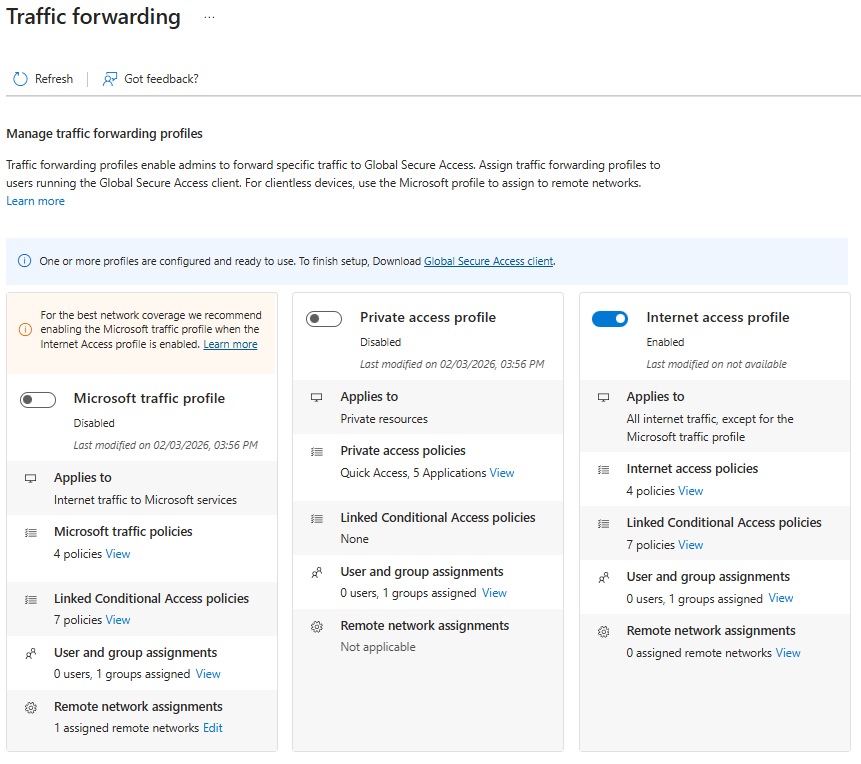
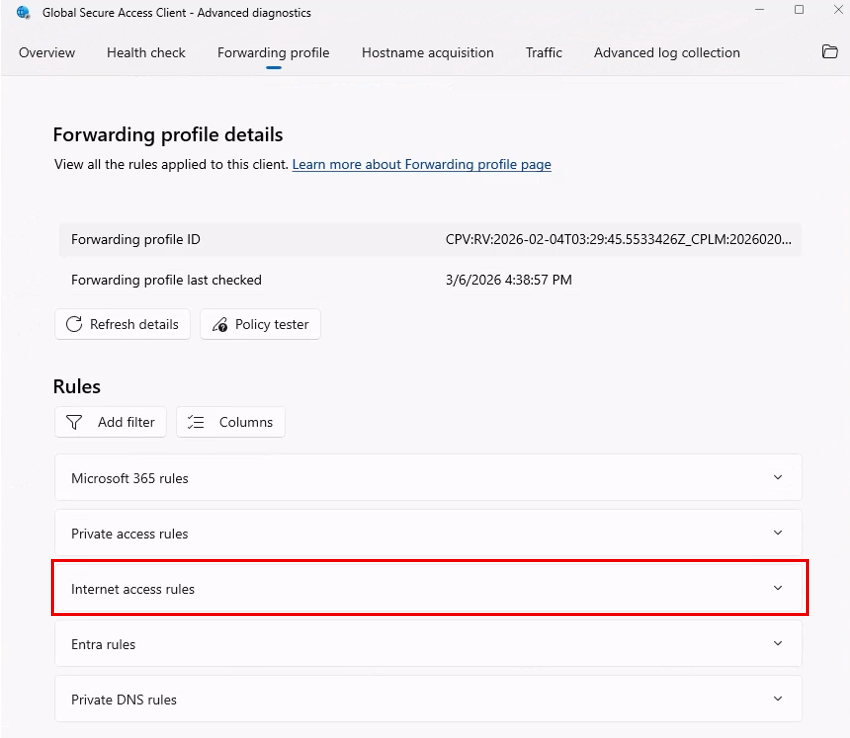

# Tutorial: Enable Internet Access traffic forwarding

The Microsoft Entra Internet Access traffic forwarding profile routes internet traffic through the Global Secure Access (GSA) client. Enabling this traffic forwarding profile allows workers to connect to the internet in a controlled and secure way. Internet Access allows organizations to discover and monitor all internet sites accessed by your users. As an administrator, you can control access to these internet sites through various policies like web content filtering policies, file scan policies, and more.

In this tutorial, you learn how to:
> [!div class="checklist"]
> - Enable the Internet Access traffic forwarding profile.
> - Assign users and groups to the profile.
> - Install the GSA client on a Windows machine.
> - Verify that the traffic forwarding profile is configured.

## Key concepts

Traffic forwarding profiles are the mechanism that tells the GSA client which traffic to capture and route through Microsoft security service edge (SSE). There are three profiles;

| Profile | Traffic type | Purpose |
|---------|--------------|----------|
| Microsoft traffic | Microsoft 365 services | Optimized routing for Microsoft 365 and tenant restrictions |
| Private Access | Internal corporate resources | Zero Trust replacement for virtual private network |
| Internet Access | All other internet traffic | Web filtering, threat protection, and Transport Layer Security (TLS) inspection |

When you enable the Internet Access profile, the GSA client intercepts outbound internet requests and tunnels them to the Microsoft SSE proxy before they reach their destination.

## Step 1: Enable the Internet Access traffic forwarding profile

1. Sign in to the [Microsoft Entra admin center](https://entra.microsoft.com/) as a Global Secure Access administrator.
1. Browse to **Global Secure Access** > **Connect** > **Traffic forwarding**.
1. Enable **Internet access profile** by selecting the checkbox.

> [!NOTE]
>
> When you enable the Internet Access forwarding profile, you should also enable **Microsoft traffic forwarding profile** for optimal routing of Microsoft traffic. You can tunnel Microsoft traffic by selecting the **Microsoft traffic profile** toggle on the same page. Microsoft traffic is never routed through the Internet Access tunnel, so you can also leave the **Microsoft traffic** box cleared if you want.

## Step 2: Assign users and groups

The Internet Access profile must be assigned to users before it takes effect. You can assign it to all users or scope it to specific users and groups for a phased rollout or proof-of-concept testing.

1. On the **Traffic forwarding** page, locate the **Internet access profile** section.
1. Under **User and group assignments**, select **View**.
1. Under **Assigned**, select **0 users, 0 groups assigned**.
1. Select **Add user/group**.
1. Search for and select the users or groups that you want to include.
1. Select **Assign**.

Internet traffic is now forwarded from client devices to the Microsoft SSE proxy for users who have the GSA client installed and are assigned to the traffic forwarding profile.

With the Internet Access traffic profile enabled and assigned to users, the GSA client begins intercepting web traffic bound for the internet. Instead of sending traffic directly to its destination, the GSA client forwards the traffic to the GSA service where security profiles are enforced. Only if the traffic is allowed does the GSA service then forward the traffic to its intended destination.

## Step 3: Install the GSA client

1. Download the GSA client for Windows 11 from one of the following links. You can also use the [sample PowerShell script](scripts/powershell-windows-client-install-proof-of-concept.md).
   - For standard Windows 11 machines, use `https://aka.ms/GlobalSecureAccess-Windows`.
   - For ARM-based Windows 11 machines, use `https://aka.ms/GlobalSecureAccess-WindowsOnArm`.
1. Select the downloaded file and complete the wizard to install the GSA client.
1. After installation is complete, verify that the GSA client icon appears in the Windows system tray.

   

## Step 4: Verify results

1. Right-click the GSA icon in the Windows system tray and select **Advanced Diagnostics**.
1. Select **Forwarding profile**.
1. Verify that the internet access rules are present.

   

1. Optionally, review the **Health check** tab results.

The GSA client automatically checks for updates to traffic-forwarding profile changes every five minutes. You can see the date and time of the last check next to the **Forwarding profile last checked** field on the **Forwarding profile** tab. If you don't see the results that you want, wait five minutes and then select **Refresh**.

> [!NOTE]
>
> If you expand the rule set for Internet Access, you can see a long list of rules, most of which are `bypass` rules. These bypass rules are primarily Microsoft traffic destinations. They ensure that Microsoft traffic isn't tunneled via the Internet Access tunnel. Instead, this traffic must be tunneled via the Microsoft traffic profile, which is specially optimized for Microsoft traffic. At the end of the internet rules, you see `0.0.0.0-255.255.255.255` targeting TCP 80 and 443. This catchall rule tunnels the rest of the internet-bound traffic that isn't explicitly bypassed.

## What you learned

In this exercise, you accomplished the following tasks:

- **Enabled the Internet Access traffic forwarding profile**: You learned that this profile activates the GSA client's ability to tunnel internet-bound traffic to the Microsoft SSE.
- **Understood traffic flow**: You learned that internet traffic now flows from the user device, to the GSA client, to the Microsoft SSE proxy, and finally to the internet destination.
- **Scoped the deployment**: You learned that by assigning specific users and groups, you can implement a phased rollout strategy.

With the traffic forwarding profile enabled, you now have a foundation to apply security policies (web filtering, TLS inspection, and threat intelligence) to internet traffic. Without this step, traffic bypasses the GSA service and no policies can be enforced.

## Next step

> [!div class="nextstepaction"]
> [Configure web content filtering](tutorial-internet-access-web-content-filtering.md)
