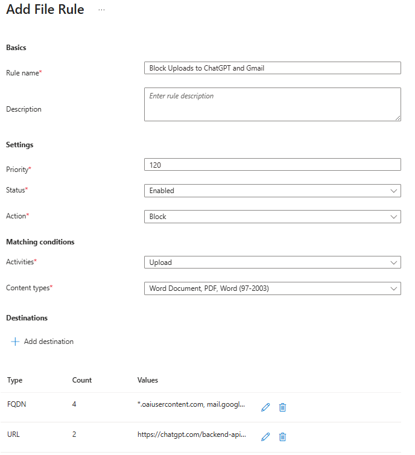

# Tutorial: Configure file control policies

Network file policies in Microsoft Entra Internet Access allow administrators to prevent the transport of specific file types over the network. This feature helps protect sensitive data by blocking uploads and downloads of certain file formats (such as .doc, .docx, .pdf, and .zip) to and from web applications like ChatGPT, Gmail, and file sharing apps. It can also use Purview to scan files and apply network-level policies based on document sensitivity labels.

In this tutorial, you learn how to:
> [!div class="checklist"]
> - Create a file policy to block specific file types from being uploaded.
> - Link the file policy to a security profile.
> - Verify that file upload blocking works as expected.

## Key concepts

### Why are file controls critical?

File controls address a key data exfiltration vector. Users who intentionally or accidentally upload sensitive files to unauthorized destinations.

| Threat scenario | Example | File control solution |
|---|---|---|
| Shadow AI data leakage | Employee pastes confidential contract into ChatGPT. | Block document uploads to `*.oaiusercontent.com`. |
| Personal email exfiltration | Employee emails customer database to personal Gmail. | Block uploads to `mail.google.com`. |
| Unauthorized cloud storage | Employee syncs work files to personal Dropbox. | Block uploads to `*.dropbox.com`. |
| Insider threat | Malicious employee downloads sensitive files before leaving. | Block downloads of specific file types. |

### How file controls work with TLS inspection

 ```
 User attempts upload     GSA client      SSE with TLS inspection     Destination
         │                    │                     │                      │
         │  Upload file.pdf   │                     │                      │
         ├───────────────────>│                     │                      │
         │                    │  Tunnel traffic     │                      │
         │                    ├────────────────────>│                      │
         │                    │                     │  Decrypt & inspect   │
         │                    │                     │  ┌───────────────┐   │
         │                    │                     │  │ File type: PDF│   │
         │                    │                     │  │ Action: Upload│   │
         │                    │                     │  │ Dest: chatgpt │   │
         │                    │                     │  │ → BLOCK       │   │
         │                    │                     │  └───────────────┘   │
         │    Block message   │                     │                      │
         │<───────────────────┤                     │                      │
 ```

File controls require Transport Layer Security (TLS) inspection to be enabled. The security service edge (SSE) can't detect file types within encrypted uploads unless the traffic is decrypted.

## Sample walkthrough videos

The following video demonstrates how to configure a file policy.

> [!VIDEO https://www.youtube.com/embed/PnK3XS-Eokw]

## Step 1: Create a file policy

1. From the Microsoft Entra admin center, browse to **Global Secure Access** > **Secure** > **File policies**.
1. Select **Create policy**.
1. Enter a name and description for the policy. Select **Next**.
1. Select **Add rule**.
1. Enter the following information:

   - **Rule name:** Enter **Block uploads to ChatGPT and Gmail**.
   - **Description:** Enter a description (optional).
   - **Priority:** Select **120**.
   - **Status:** Select **Enabled**.
   - **Action:** Select **Block**.
   - **Activities:** Select the checkbox for **Upload**.
   - **Content types:** Select the checkboxes for **Word (97-2003)**, **Word Document**, and **PDF**.
1. Select **Add destination**, select **FQDN**, and then enter the following fully qualified domain names (FQDNs):

   - `*.oaiusercontent.com`
   - `mail.google.com`
   - `clients6.google.com`
   - `*.clients6.google.com`
1. Select **Add**.
1. Select **Add destination**, and then select **URL** and enter the following URLs:

   - `https://chatgpt.com/backend-api/files`
   - `https://chatgpt.com/backend-api/files/process_upload_stream`

1. Select **Add**.

   

    > [!NOTE]
    > Apps might use multiple URLs and FQDNs under the hood when you interact with them. In this example, ChatGPT uses `*.oaiusercontent.com` and Gmail uses `mail.google.com`. If you aren't seeing file policies applied, check with dev tools to confirm which URLs and FQDNs the app is using.

1. Select **Save**.
1. Select **Next**, and then select **Create**.

## Step 2: Link the policy to a security profile

1. After the policy is created, browse to **Global Secure Access** > **Secure** > **Security profiles**.
1. Select the existing security profile from a previous tutorial.
1. Go to the **Link policies** pane.
1. Select **Link a policy**, and then select **Existing file policy**.
1. Select the file policy that you created and select **Add**.

> [!NOTE]
> Verify that the security profile is assigned to a Microsoft Entra Conditional Access policy.

## Step 3: Verify file upload and download blocking

1. On your test device, open a browser, go to `www.chatgpt.com`, and sign in with an account of your choice.
1. Attempt to upload a PDF or Word document to ChatGPT, and verify that the upload fails.
1. Go to `mail.google.com`, and sign in with a Google account.
1. Attempt to upload a PDF or Word document to Gmail, and verify that the upload fails.

   

## Known limitations

Refer to [official documentation](/entra/global-secure-access/how-to-network-content-filtering#known-limitations) for the list of known limitations.

## What you learned

In this tutorial, you accomplished the following tasks:

- **Created a file policy to prevent data exfiltration**: You blocked specific document types from being uploaded to AI tools and personal email, which addresses a key data loss vector.
- **Understood FQDN discovery for apps**: You learned that web applications often use multiple back-end URLs, like `*.oaiusercontent.com` for ChatGPT.
- **Linked file policies to security profiles**: You learned that file policies follow the same security profile model, which you can use to target specific users via Conditional Access.
- **Combined multiple security controls**: You learned that this tutorial demonstrates how file controls work alongside web content filtering, TLS inspection, and threat intelligence as part of a comprehensive security strategy.

### Identify application FQDNs

When you configure file controls, you need to know the actual FQDNs that are used by applications.

To discover them, select **F12** to open the browser developer tools:

1. Open the **Network** tab.
1. Upload a file to the target app.
1. Look for `POST` requests with file content.

### Combine with application discovery

Use the application discovery feature to identify which apps are being used, and then create targeted file policies.

```
1. Discover shadow AI apps.
        ↓
2. Assess risk scores.
        ↓
3. Decision: Block entirely OR allow with file restrictions.
        ↓
4. Create file policy if allowing with restrictions.
```

### Best practices

- Start by blocking uploads to high-risk AI apps (or all AI apps with authorized exceptions).
- Consider blocking both uploads and downloads for maximum protection.
- Test policies with a pilot group before broad deployment.
- Communicate changes to users to avoid confusion.

## Related content

For more information, see the following resources:

- [What is Global Secure Access?](overview-what-is-global-secure-access.md)
- [Tutorial: Get started with Microsoft Entra Internet Access labs](tutorial-internet-access-introduction.md)
