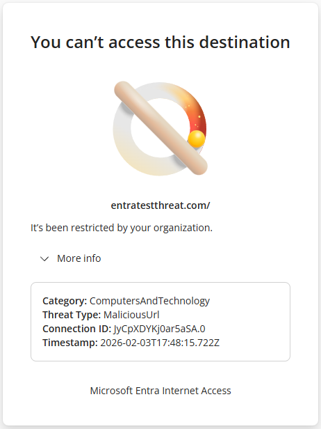

# Tutorial: Configure threat intelligence policies

Microsoft defines high-severity threats as domains or URLs that are associated with threats like active malware distribution, phishing campaigns, and command-and-control (C2) infrastructure. Microsoft and non-Microsoft threat intelligence feeds identify these threats with high confidence. By configuring threat intelligence, you can automatically block these known malicious web destinations.

In this tutorial, you learn how to:
> [!div class="checklist"]
> - Create a threat intelligence policy to block known malicious sites.
> - Configure an allow list for false positives or business-critical sites.
> - Link a threat intelligence policy to a security profile.
> - Verify user policy enforcement.

## Key concepts

### What is threat intelligence?

Threat intelligence is curated data about known malicious domains, URLs, and IP addresses. This list is continuously updated as Microsoft aggregates intelligence from multiple sources like the ones in the following table.

| Source | Description |
|--------|-------------|
| Microsoft Defender Threat Intelligence | Data from Microsoft security products that protect billions of endpoints. |
| Microsoft Security Research | Findings from Microsoft dedicated threat research teams. |
| Non-Microsoft feeds | Intelligence from trusted security vendors and CERTs. |
| Community intelligence | Shared indicators from the global security community. |

Here are some examples of threats that are blocked. For the full list, see [Global Secure Access threat intelligence threat types](/entra/global-secure-access/reference-threat-intelligence-threat-types).

- **MaliciousUrl**: URLs that serve malware.
- **Phishing**: Indicators that relate to a phishing campaign.
- **C2**: Command-and-control node of a botnet.
- **Malware**: Indicators that describe a malicious file or files.
- **CryptoMining**: Traffic that involves crypto mining or resource abuse.

### How threat intelligence differs from web content filtering

- Web content filtering blocks by category (such as gambling or adult content).
- Threat intelligence blocks known bad actors regardless of category.
- A legitimate-looking news site that was compromised is blocked by threat intelligence, not web content filtering.
- If Transport Layer Security (TLS) inspection isn't enabled, threat intelligence can't protect against malicious URLs. The remaining detection types are still detected and blocked.

## Objective

In this tutorial, you create a threat intelligence policy to block known malicious sites. You optionally configure an allow list for false positives or business-critical sites. You then link the policy to a security profile and verify user policy enforcement.

## Sample walkthrough videos

The following video demonstrates how to configure a threat intelligence policy.

> [!VIDEO https://www.youtube.com/embed/RBYb6ydXZ1A]

The following video demonstrates how to test a threat intelligence policy.

> [!VIDEO https://www.youtube.com/embed/fNL-3ZwDSaQ]

## Step 1: Create a threat intelligence policy

1. From the Microsoft Entra admin center, browse to **Global Secure Access** > **Secure** > **Threat intelligence policies**.
1. Select **Create policy**.
1. Enter a name and description for the policy, and then select **Next**.
1. Keep **Default Action** as **Allow**.

   > [!NOTE]
   > The default action for threat intelligence is **Allow**. If traffic doesn't match a rule in the threat intelligence policy (that is, no threat is detected), the policy engine allows the traffic. Another policy type might still evaluate and block the traffic, such as web content filtering.

1. Select **Next** and review your new threat intelligence policy.
1. Select **Create**.

## Step 2: Configure your allow list (optional)

If you're aware of sites that might be business-critical or are labeled as false positives, you can configure rules that allow these sites.

> [!WARNING]
> Bypassing a domain from threat intelligence is risky. Only do it if you're sure that the destination is safe.

1. Under **Global Secure Access** > **Secure** > **Threat intelligence policies**, select your chosen threat intelligence policy.
1. Select **Rules**.
1. Select **Add rule**.
1. Enter a name, description, priority, and status for the rule.
1. Edit **Destination FQDNs**, and select the list of domains for your allow list.

   You can enter these fully qualified domain names (FQDNs) as comma-separated domains.

1. Select **Add**.

## Step 3: Link threat intelligence policy to security profile

1. Browse to **Global Secure Access** > **Secure** > **Security profiles**.
1. Select the security profile that you created in the TLS inspection tutorial.
1. Go to the **Link policies** pane.
1. Select **Link a policy**, and then select **Existing threat intelligence policy**.
1. Select the threat intelligence policy that you created, and then select **Add**.

Verify that the security profile is assigned to a Microsoft Entra Conditional Access policy.

## Step 4: Verify policy enforcement

> [!NOTE]
> After you configure a threat intelligence policy, you might need to clear your browser cache to verify policy enforcement.

1. To test, go to one of the following sites:

   - `entratestthreat.com`
   - `smartscreentestratings2.net`

   The previous examples are test sites to validate whether security policies work. They're benign and safe to use.

1. Verify that access to the site is blocked. Expand **More info** and verify that the threat type is **MaliciousUrl**.

   

1. You can also view the traffic logs and review the **Threat Type** field.

If Windows Defender or SmartScreen blocks you, override and access the site to test the Global Secure Access block message. To do this step, under **More information**, select **Continue to the unsafe site (not recommended)**. Only perform this step in a lab or proof-of-concept environment, not in production.

## What you learned

In this tutorial, you accomplished the following tasks:

- **Enabled automated threat protection:** Your organization is now protected against thousands of known malicious sites without manually maintaining block lists. Microsoft continuously updates this threat list based on its intelligence signals.
- **Understood the "default allow" model:** Threat intelligence policies only block traffic that matches a known threat. Other policies evaluate all the other traffic that passes through.
- **Configured exception rules:** You learned how to bypass specific domains if needed for business reasons, although you should do this step sparingly.
- **Observed threat type classification:** The block page shows the specific threat type, like MaliciousUrl, phishing, and C2. This information helps you understand why traffic was blocked.

### Defense-in-depth strategy

```
┌─────────────────────────────────────────────────────────┐
│                 Security Layers                         │
├─────────────────────────────────────────────────────────┤
│ Layer 1: Web content filtering                          │
│   • Blocks unwanted categories like gambling or adult.  │
├─────────────────────────────────────────────────────────┤
│ Layer 2: Threat intelligence                            │
│   • Blocks known malicious destinations.                │
├─────────────────────────────────────────────────────────┤
│ Layer 3: File controls                                  │
│   • Prevents data exfiltration via file uploads.        │
├─────────────────────────────────────────────────────────┤
│ Layer 4: Microsoft Defender for Endpoint                │
│   • Is the last line of defense on the endpoint.        │
└─────────────────────────────────────────────────────────┘
```

#### Why multiple layers?

- Threat intelligence is reactive. It only knows about threats that were discovered.
- New malware and phishing sites are created constantly.
- Each layer catches threats that the others might miss.

## Next step

> [!div class="nextstepaction"]
> [Configure application discovery](tutorial-internet-access-application-discovery.md)
