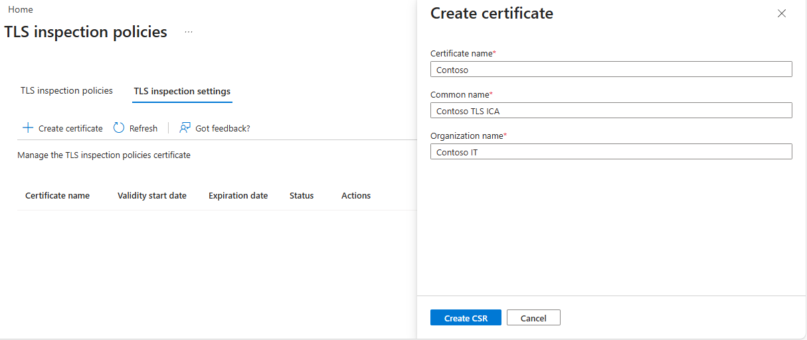
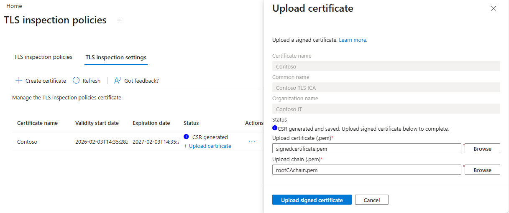
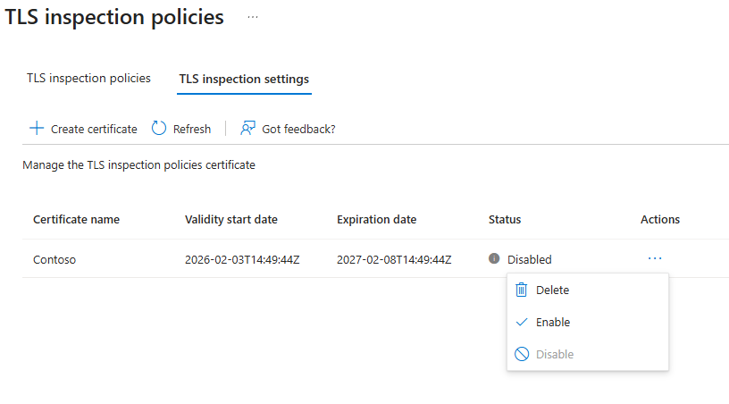
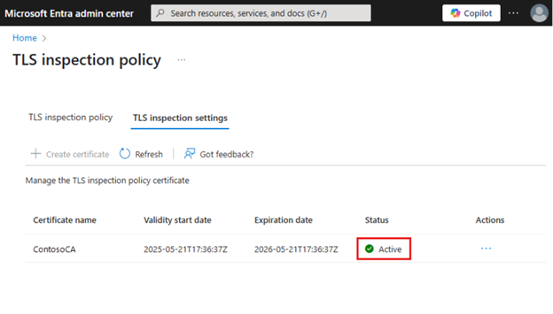
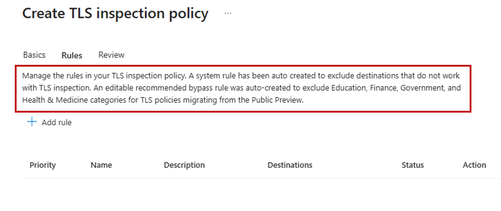
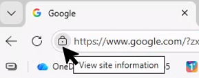
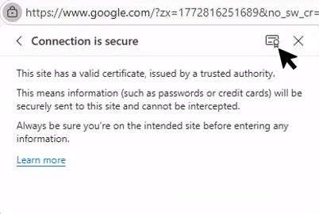
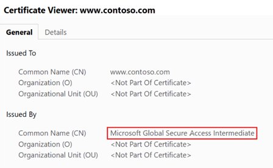

# Tutorial: Enable TLS inspection

Transport Layer Security (TLS) inspection in Microsoft Entra Internet Access lets you decrypt and inspect encrypted traffic at service edge locations. This feature lets Global Secure Access apply advanced security controls like threat detection, more granular web content filtering, and additional content controls. TLS inspection also enables GSA to provide a custom, user-friendly error message such as when a user is blocked due to web content filtering.

In this tutorial, you learn how to:
> [!div class="checklist"]
> - Create the TLS temination certificate for TLS inspection.
> - Create and configure a TLS inspection policy.
> - Link the TLS inspection policy to a security profile.
> - Assign the security profile via Conditional Access.
> - Verify TLS inspection on the client.

## Key concepts

> [!TIP]
> **Why is TLS inspection necessary?**
>
> Over 95% of web traffic today is encrypted with HTTPS/TLS. Without TLS inspection, security tools can only see:
>
> - Destination IP address.
> - SNI (Server Name Indication) - the FQDN from the TLS handshake.
>
> With TLS inspection enabled, security tools can see:
>
> - Full URL paths (for example, `/images`, `/downloads/malware.exe`).
> - Request and response content.
> - File uploads and downloads.
> - Web page content for categorization.
>
> **How does TLS inspection work?**
>
> The flow of traffic is as follows:
>
> 1. Client establishes TLS connection to SSE.
> 1. SSE establishes separate TLS connection to destination.
> 1. SSE decrypts, inspects, and re-encrypts traffic.
> 1. Client sees a certificate signed by your enterprise CA.
> 1. If allowed by policy, SSE forwards the traffic to the original destination server.
>
> > ```Example:
> User → GSA Client → SSE Proxy → Destination Server
>                          │
>                    [TLS Terminated]
>                    [Content Inspected]
>                    [Re-encrypted with Enterprise CA cert]
>                    [Forwarded to destination]
> ```

## Objective

In this tutorial, you create and enable a TLS inspection policy. You keep the system-generated bypass rules at their default values. You then verify that TLS inspection is occurring as expected.

## Sample walkthrough videos

The following video demonstrates how to configure TLS inspection:

> [!VIDEO https://www.youtube.com/embed/sn9sF1FRPzI]

The following video demonstrates additional TLS inspection configuration:

> [!VIDEO https://www.youtube.com/embed/0XDsnn94Y1I]

The following video demonstrates how to verify TLS inspection:

> [!VIDEO https://www.youtube.com/embed/KDFLLct7xfo]

### Step 1: Create a TLS termination CA certificate

Creating a TLS termination CA certificate involves generating a Certificate Signing Request (CSR), signing it, and uploading the signed certificate.  The TLS termination CA certificate is used to issue short-lived leaf certificates for the web site being accessed. 

#### Step 1.1: Generate a CSR

To create a CSR and upload the signed certificate for TLS termination:

1. Sign in to the Microsoft Entra admin center as a **Global Secure Access Administrator**.
1. Browse to **Global Secure Access** > **Secure** > **TLS inspection policies**.
1. Switch to the **TLS inspection settings** tab.
1. Select **+ Create certificate**. This step starts with generating a Certificate Sign Request (CSR).
1. In the **Create certificate** pane, fill in the following fields:
   - **Certificate name:** This name appears in the certificate hierarchy when viewed in a browser. It must be unique, contain no spaces, and be no more than 12 characters long. You can't reuse previous names.
   - **Common name (CN):** Common name, for example, `Contoso TLS ICA`, that identifies the intermediate certificate.
   - **Organizational Unit (OU):** Organization name, for example, `Contoso IT`.
1. Select **Create CSR**. This step creates a `.csr` file and saves it to your default download folder.

   

#### Step 1.2: Sign the CSR

Sign the CSR using your self-signed certificate or PKI service.

- **Option 1:** [Public documentation steps using OpenSSL](how-to-transport-layer-security-settings.md#test-with-a-self-signed-root-certificate-authority-using-openssl)

   > [!NOTE]
   > If you're unfamiliar with using OpenSSL, reference the sample walkthrough videos if you get stuck.

   > [!NOTE]
   > You can download OpenSSL for Windows from <https://slproweb.com/products/Win32OpenSSL.html>. This is a third-party site. Verify the integrity of downloaded binaries before use.

- **Option 2:** [Sample PowerShell script using ADCS](scripts/powershell-active-directory-certificate-service.md)

If you create your own certificate without using the provided samples, make sure **Server Auth** is in Extended Key Usage and `certificate authority (CA)=true`, `keyCertSign`, `cRLSign`, and `basicConstraints=critical,CA:TRUE` in Basic Extension. Save the signed certificate in `.pem` format.

#### Step 1.3: Upload the signed certificate for TLS termination

Once you have your certificate and chain `.pem` files, upload the signed certificate for TLS termination:

1. Select **+Upload certificate**.
1. In the **Upload certificate** form, upload the `signedcertificate.pem` and `rootCAchain.pem` files.
1. Select **Upload signed certificate**.

   

1. Next to the certificate, select the ellipsis (three dots) under the **Actions** column, then select **Enable**.

   

1. After you enable the certificate, the status changes from **Enrolling** to **Active**. This might take a few minutes.

   

### Step 2: Create a TLS inspection policy

To create a TLS inspection policy:

1. In the Microsoft Entra admin center, browse to **Secure** > **TLS inspection policies**.
1. Select **Create policy**.
1. Enter a name and a description (optional), then set the **Action** to **Inspect**.
1. Select **Next**.

   > [!NOTE]
   > By setting the **Default action** to **Inspect**, all traffic is TLS inspected unless it matches a bypass rule that you or the system generates. When you create a TLS inspection policy, the system automatically generates two rules. The first is a system rule that automatically bypasses destinations Microsoft knows are incompatible with TLS inspection. The second is a recommended bypass list that bypasses TLS inspection for specific categories that users might consider sensitive or private. You can edit this rule later.
   >
   > You can view the system-generated rules *after* you create the TLS inspection policy by selecting **Edit** on the policy.
   >
   > 

1. Select **Next**.
1. Select **Submit**.

### Step 3: Link the TLS inspection policy to a security profile

1. Browse to **Global Secure Access** > **Secure** > **Security profiles**.
1. Select **Create profile**.
1. Enter a name and description for the policy and select **Next**.
1. Select **Link a policy** and then select **Existing TLS inspection policies**.
1. Select the TLS inspection policy you created and select **Add**.
1. Select **Next**.
1. Select **Create a profile**.

### Step 4: Assign the security profile via Conditional Access

1. Browse to **Entra ID** > **Conditional Access**.
1. Select **Create new policy**.
1. Enter a name and assign a user or group.
1. Select **Target resources**, then select **All internet resources with Global Secure Access**.
1. Select **Session** > **Use Global Secure Access security profile** and choose the security profile created in Step 3.
1. Select **Select**.
1. In the **Enable policy** section, ensure **On** is selected.
1. Select **Create**.

> [!NOTE]
> It might take up to an hour for the security profile to take effect once assigned via Conditional Access.

### Step 5: Verify TLS inspection on the client

To verify TLS inspection is occurring properly:

1. Make sure the end user device has the `rootCAchain.pem` file installed in the **Trusted Root Certification Authorities** folder.
   - On Windows 11, open **Manage user certificates**.
   - Select **Trusted Root Certification Authorities** then right-click **Certificates**.
   - Select **Import** (might be located under **All Tasks**).
   - Follow the import wizard to select and import the `rootCAchain.pem` file.
1. Open a browser on a client device and test various websites such as `www.google.com`. Inspect the certificate information and confirm the Global Secure Access certificate.

   > [!NOTE]
   > Microsoft traffic bypasses the Internet Access tunnel, which means TLS inspection isn't applied to most Microsoft applications. Be sure to browse to a non-Microsoft website before verifying TLS inspection is configured properly.

   To check the certificate on Edge browser:

   1. Select the lock icon next to the web URL.

      

   1. Select **Connection is secure**.
   1. Select the certificate icon.

      

   1. Verify the common name says **Microsoft Global Secure Access Intermediate**.

      

## What you learned

In this exercise, you accomplished the following:
1. **Created a certificate hierarchy** - You generated a Certificate Signing Request (CSR), signed it with a Root CA, and uploaded both certificates to GSA. This establishes the trust chain needed for TLS inspection.
1. **Understood bypass rules** - Some destinations are incompatible with TLS inspection (certificate pinning, mutual TLS) or are privacy-sensitive (banking, healthcare). The system automatically bypasses some destinations by default.
1. **Created a security profile with Conditional Access** - Unlike the baseline profile (which applies to everyone), this security profile uses Conditional Access to target specific users, allowing for phased rollouts.
1. **Distributed the Root CA certificate** - For clients to trust the re-encrypted traffic, they need the Root CA certificate in their trusted store.

**Deep Dive - The certificate chain**
```Example:
 ┌─────────────────────────────┐
 │     Your Root CA            │  ← Deployed to client trusted store
 │   (rootCAchain.pem)         │
 └─────────────┬───────────────┘
               │
               ▼ Signs
 ┌─────────────────────────────┐
 │  GSA Intermediate CA        │  ← Uploaded to GSA (signed certificate)
 │  (signedcertificate.pem)    │
 └─────────────┬───────────────┘
               │
               ▼ Signs (dynamically)
 ┌─────────────────────────────┐
 │   Leaf Certificates         │  ← Generated on-the-fly for each site
 │   (www.google.com, etc.)    │
 └─────────────────────────────┘
 ```

**Security considerations:**
- Protect your Root CA private key - if compromised, attackers could forge certificates.
- Consider using a dedicated CA for TLS inspection, not your production PKI (common industry guidance).
- Audit bypass rules regularly to ensure sensitive sites remain protected.

**What's next:** With TLS inspection enabled, you can now create URL-based filtering rules (not just FQDN) and provide custom block messages to users.

## Next steps

> [!div class="nextstepaction"]
> [Tutorial: Configure URL filtering](tutorial-internet-access-url-filtering.md)
