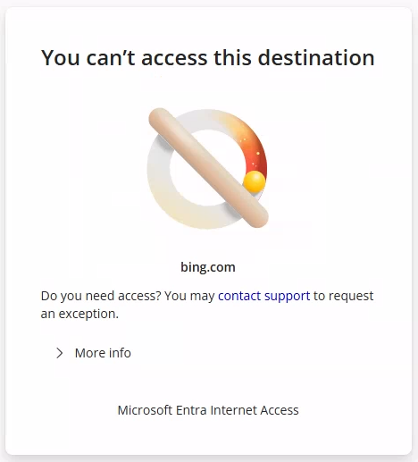

# Tutorial: Configure URL filtering and custom block pages

URL filtering is an advanced type of web content filtering based on a full or partial URL. Unlike filtering based on fully qualified domain names (FQDNs) which are visible in the traffic header, URL filtering requires Transport Layer Security (TLS) inspection to see the specific destination that a user is attempting to access. For example, `www.bing.com` is visible without TLS inspection but `www.bing.com/images` isn't. URL filtering provides fine-grained web content filtering and enhances the accuracy of web content filtering by category.

In this tutorial, you learn how to:
> [!div class="checklist"]
> - Configure web content filtering policies to allow or block specific URLs.
> - Link web content filtering policies to a security profile.
> - Configure a custom error message for blocked sites.
> - Validate that websites are allowed or blocked as expected.

## Prerequisites

Complete the tutorial [Configure TLS inspection](tutorial-internet-access-tls-inspection.md). TLS inspection is a prerequisite for URL filtering.

## Key concepts

Understanding the difference between FQDN and URL filtering is critical for effective policy design.

| Aspect | FQDN filtering | URL filtering |
|--------|----------------|---------------|
| Requires TLS inspection | No | Yes |
| Visibility | Domain only | Full path |
| Example match | `www.youtube.com` | `www.youtube.com/shorts` |
| Use case | Block or allow entire sites | Block or allow specific sites |
| Granularity | Coarse | Fine-grained |

## Objective

This tutorial builds on the previous tutorials. In the FQDN filtering tutorial, you blocked access to Bing and received an error that isn't user-friendly. In the TLS inspection tutorial, you enabled TLS inspection, which is a prerequisite for URL filtering. In this tutorial, you:

- Granularly allow specific Bing URLs while leaving others blocked to demonstrate fine-grained web content filtering (granular allow list).
- Create a policy to block a specific URL, `www.youtube.com/shorts`, while leaving the rest of the domain space allowed (granular block list).
- Configure a customized error message that users see when they're blocked.

## Sample walkthrough videos

The following video demonstrates how to configure URL filtering.

> [!VIDEO https://www.youtube.com/embed/AQ-b-FDC9D8]

The following video demonstrates how to configure custom error pages.

> [!VIDEO https://www.youtube.com/embed/DhS-_1xKJ0w]

The following video demonstrates the user experience of URL filtering.

> [!VIDEO https://www.youtube.com/embed/-DtZnedK-kY]

## Step 1: Create web content filtering policies

### Create a policy to block YouTube Shorts

1. From the Microsoft Entra admin center, browse to **Global Secure Access** > **Secure** > **Web content filtering policies**.
1. Select **Create policy**.
   - **Name**: Select **Block YouTube Shorts**.
   - **Action**: Select **Block**.
1. Select **Next**.
1. Select **Add rule**.
   - **Name**: Select **YouTube Shorts**.
   - **Destination type**: Select **fqdn**.
   - **Destination**: Select `www.youtube.com/shorts,youtube.com/shorts`.
1. Select **Add**.
1. Select **Next**, and then select **Create policy**.

### Create a policy to allow Bing Maps

1. Select **Create policy**.
   - **Name**: Select **Allow Bing Maps**.
   - **Action**: Select **Allow**.
1. Select **Next**.
1. Select **Add rule**.
   - **Name**: Select **Bing Maps**.
   - **Destination type**: Select **url**.
   - **Destination**: Select `*.bing.com/maps,bing.com/maps`.
1. Select **Add**.
1. Select **Next**, and then select **Create policy**.

## Step 2: Link web content filtering policies to a security profile

1. Browse to the **Security Profiles** pane.
1. Select the security profile from the TLS inspection tutorial (not the baseline security profile), and then select the **Link policies** pane.
1. Select **Link a policy**, and then select **Existing web filtering policy**.
1. Under **Policy name**, select **Block YouTube Shorts**, and give it a priority of **200**. The state should be **Enabled**. Select **Add**.
1. Select **Link a policy**, and then select **Existing web filtering policy** again.
1. Under **Policy name**, select **Allow Bing Maps**, and give it a priority of **150**. The state should be **Enabled**. Select **Add**.
1. Select **Next**.
1. Select **Create a profile**.

> [!NOTE]
> Verify that the security profile is assigned to a Microsoft Entra Conditional Access policy.

## Step 3: Configure custom error message

1. Browse to **Global Secure Access** > **Settings** > **Session management**.
1. Select the **Custom Block Page** tab.
1. Set **Custom body message** to **On**.
1. Enter a custom body message, and select **Save**.

You can use limited Markdown in your custom body message. For example, you might include a support link, such as `Need access? [Contact support](https://support.contoso.com) to request an exception.`

## Step 4: Verify URL filtering and custom error

> [!NOTE]
> Newly created security profiles can take up to an hour to take effect. If you linked the new rules to an existing security profile that was already assigned to your user via Conditional Access, it should take effect in a few minutes.

1. On your test device, open a browser and go to `www.bing.com`. Verify that you're blocked and that the custom error message is displayed.

   

1. Go to `www.bing.com`. Verify that access is still blocked from the FQDN filtering tutorial.
1. Go to `www.bing.com/maps`. Verify that access is allowed.
1. Go to `www.youtube.com`. Verify that access is allowed.
1. Go to `www.youtube.com/shorts`. Verify that access is blocked.

### Policy evaluation order

In this tutorial's example, the policy evaluation works in the following way:

```
User navigates to bing.com:

1. Custom Security Profile (assigned via Conditional Access)
   └─ Allow Bing Maps (priority 100) → Does NOT match bing.com → Continue...
2. Baseline Profile (priority 65000)
   └─ Block Bing → Matches bing.com → BLOCK ✗

User navigates to bing.com/maps

1. Custom Security Profile (assigned via Conditional Access)
   └─ Allow Bing Maps (priority 100) → Matches bing.com/maps → ALLOW ✓

User navigates to youtube.com (homepage):

1. Custom Security Profile (assigned via Conditional Access)
   └─ Block YouTube Shorts (priority 100) → Does NOT match youtube.com/shorts → Continue...
2. Baseline Profile (priority 65000)
   └─ No YouTube rules → ALLOW ✓

User navigates to youtube.com/shorts:

1. Custom Security Profile (assigned via Conditional Access)
   └─ Block YouTube Shorts (priority 100) → Matches youtube.com/shorts → BLOCK ✗
```

This example demonstrates how URL filtering enables selective blocking or allowing.

## What you learned

In this tutorial, you accomplished the following tasks:

- **Implemented fine-grained URL filtering:** You blocked YouTube Shorts while allowing the rest of YouTube. This action demonstrates how URL filtering enables precise control over web destinations.
- **Created exception rules:** You allowed Bing Maps while Bing itself remains blocked by the baseline profile. This action shows how to layer policies for nuanced access control.
- **Configured custom block messages:** Your users now see a helpful error page instead of a generic "connection reset" message. This action improves user experience and reduces helpdesk tickets.
- **Understood policy precedence:** Your lower-priority numbers are evaluated first, which allows custom profiles to create exceptions to baseline rules.

### Why URL filtering requires TLS inspection

```
Without TLS inspection:              With TLS inspection:
┌───────────────────┐             ┌───────────────────┐
│ TLS Handshake     │             │ Decrypted Traffic │
│                   │             │                   │
│ SNI: youtube.com  │  ← Visible  │ GET /shorts/abc   │  ← Now visible!
│                   │             │ Host: youtube.com │
│ [Encrypted data]  │  ← Hidden   │ Cookie: ...       │
│                   │             │ User-Agent: ...   │
└───────────────────┘             └───────────────────┘
```

The path (`/shorts`) is part of the HTTP request, which is inside the encrypted TLS tunnel. Only by terminating TLS can the proxy see and filter based on the full URL.

## Next step

> [!div class="nextstepaction"]
> [Configure threat intelligence policies](tutorial-internet-access-threat-intelligence.md)
