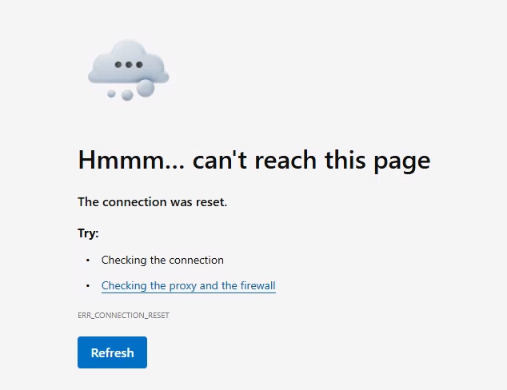

# Tutorial: Configure web content filtering with the baseline profile

Microsoft Entra Internet Access provides web content filtering to control access to websites based on their domain names (FQDNs) or web categories such as gambling, social media, or malware. Policies are assigned to security profiles, which can then be applied to all users via the baseline profile or to specific users via Conditional Access. This layered approach allows organizations to enforce broad protections while still enabling granular exceptions for specific groups.

In this tutorial, you learn how to:
> [!div class="checklist"]
> - Create a web content filtering policy that blocks gambling websites and a specific domain.
> - Link the filtering policy to the baseline security profile.
> - Validate that blocked websites can't be accessed.
> - View blocked traffic in the traffic log.

## Key concepts

> [!TIP]
> **Security Profiles** are containers that hold one or more filtering policies. They're delivered through user-aware Conditional Access policies. For example, to block all AI websites except `m365.cloud.microsoft` (Enterprise Copilot) for a specific group of users:
>
> ```Example:
> "Security Profile for Sales Department"   <---- the security profile
>     Allow m365.cloud.microsoft at priority 100      <---- higher priority filtering policy (evaluated first)
>     Block Artificial Intelligence at priority 200   <---- lower priority filtering policy
> ```
>
> **Policy Priority** determines the order of evaluation:
>
> - **100 = highest priority** (evaluated first).
> - **65,000 = lowest priority** (evaluated last).
> - This follows **traditional firewall logic** where lower numbers = higher precedence.
> - **Best practice:** Add spacing of ~100 between priorities for future flexibility.
>
> **Multi-Profile Processing:**
> When multiple Conditional Access policies match a user's traffic, **all matching security profiles are processed** in priority order of the security profiles themselves.

> [!NOTE]
> The **Baseline security profile** has special behavior:
>
> - It applies to **all Internet Access traffic** routed through the service.
> - It doesn't require linking to a Conditional Access policy.
> - It acts as a **"catch-all" policy** at the lowest priority (65,000).
> - It **always executes**, even when a Conditional Access policy matches another security profile.
>
> **Example scenario:**
>
> ```Example:
> User "Angie" matches a Conditional Access policy → Custom Security Profile (priority 100)
>    ↓
> All policies in Custom Security Profile are evaluated
>    ↓
> Baseline Profile (priority 65000) ALSO executes ← Always runs as catch-all
> ```
>
> This means you can create organization-wide protections in the baseline profile while still allowing higher-priority custom profiles to create exceptions for specific groups. Higher priority security profiles still take precedence over the baseline security profile if there are conflicting rules between the two profiles.

## Objective

In this tutorial, you create a web content filtering policy that blocks access to gambling websites and the Bing search engine. You assign the policy to the baseline security profile and verify the websites are blocked as expected.

### Step 1: Create a web filtering policy

Configure a web content filtering policy that blocks gambling websites and Bing.

1. In the **Microsoft Entra admin center**, go to **Global Secure Access** > **Secure** > **Web content filtering policies** > **Create policy**.
1. Provide the following details:
   - **Name**: "Baseline Blocked Websites"
   - **Description**: Add a description.
   - **Action**: Block
1. Select **Next**.
1. On **Policy Rules**, select **Add Rule**.
1. In the **Add Rule** dialog box, provide the following details:
   - **Name**: "Block Gambling"
   - **Destination type:** webCategory
   - **Search**: Search for and select **Gambling**.
1. Select **Add**.
1. Select **Add Rule** again.
1. In the **Add Rule** dialog box, provide the following details:
   - **Name**: "Block Bing"
   - **Destination type:** fqdn
   - **Destination**: `www.bing.com,bing.com`
1. Select **Add**.
1. Select **Next**.
1. Select **Create policy**.

> [!NOTE]
> This tutorial only configures **FQDN** and **webCategory** web content filtering. URL filtering requires TLS inspection. Both TLS inspection and URL filtering are covered in later tutorials.

### Step 2: Link the web content filtering policy to the baseline security profile

> [!NOTE]
> The baseline security profile applies to any internet traffic tunneled through GSA. It has the lowest priority (65000), which means any other security profile that targets a specific set of users or groups takes precedence over the baseline profile.

1. In the **Microsoft Entra admin center**, go to **Global Secure Access** > **Secure** > **Security profiles**.
1. Select the **Baseline profile** tab.
1. Select the **Link policies** page.
1. Select **Link a policy**, then select **Existing web filtering policy**.
   - In the **Link a policy** dialog box, under **Policy name**, select **Baseline Blocked Websites**.
   - **Priority**: 100
   - **State**: Enabled
1. Select **Add**.
1. On **Link policies**, confirm **Baseline Blocked Websites** is listed.

### Step 3: Validate Bing and gambling websites are blocked

1. Sign in to the device with the Global Secure Access (GSA) client.
1. Open a browser and attempt to navigate to `www.bing.com` and `www.gambling.com`.

   > [!NOTE]
   > It can take up to 20 minutes for the policy to apply to your client device.

1. Verify that the webpages don't load.

   

> [!NOTE]
> This isn't a user-friendly error message. This is because you haven't enabled TLS inspection, which provides a customizable block message and unlocks additional security capabilities. You'll see a more user-friendly error message in the TLS inspection tutorial.

### Step 4: View activity in the traffic log

1. In the **Microsoft Entra admin center** > **Global Secure Access** > **Monitor**, select **Traffic logs**. If needed, select **Add filter**. Filter on **User principal name** contains *testuser* and **Action** set to *Block*.
1. Review the entries for your target websites that show traffic as blocked. There might be a delay of up to 20 minutes for entries to appear in the log.

## What you learned

In this exercise, you accomplished the following:

1. **Created a web content filtering policy** - You defined rules using both FQDN-based blocking (specific domains) and category-based blocking (gambling as a web category).
1. **Understood the baseline profile** - The baseline profile applies to all internet traffic tunneled through GSA, making it ideal for organization-wide protections.
1. **Linked policies to security profiles** - You learned that policies must be linked to a security profile. Security profiles must be linked to Conditional Access policies to be assigned to users and take effect. However, the baseline security profile (used in this tutorial) does not require Conditional Access and applies to all internet traffic. 
1. **Observed the "connection reset" error** - Without TLS inspection, GSA can only drop the connection, resulting in a generic browser error rather than a helpful message.

**Deep Dive - Why the "Connection Reset" error?**

When TLS inspection is **not** enabled, the SSE can see:
- The destination IP address.
- The SNI (Server Name Indication) in the TLS handshake (this reveals the FQDN like `www.bing.com`).

But it **can't** see:
- The full URL path (like `www.google.com/images` or `www.google.com/maps`).
- The HTTP request/response content.

Because the SSE can't inject content into an encrypted stream, it can only terminate the connection, resulting in a "connection reset" error. In the next tutorial, you enable TLS inspection to unlock richer capabilities including custom block pages.

## Next steps

> [!div class="nextstepaction"]
> [Tutorial: Enable TLS inspection](tutorial-internet-access-tls-inspection.md)
