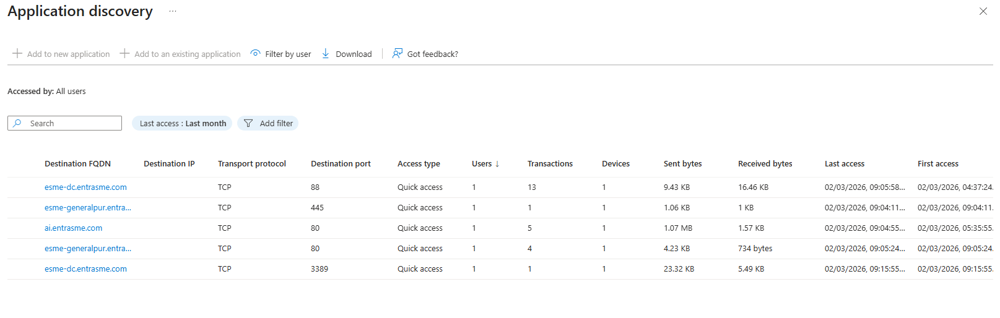
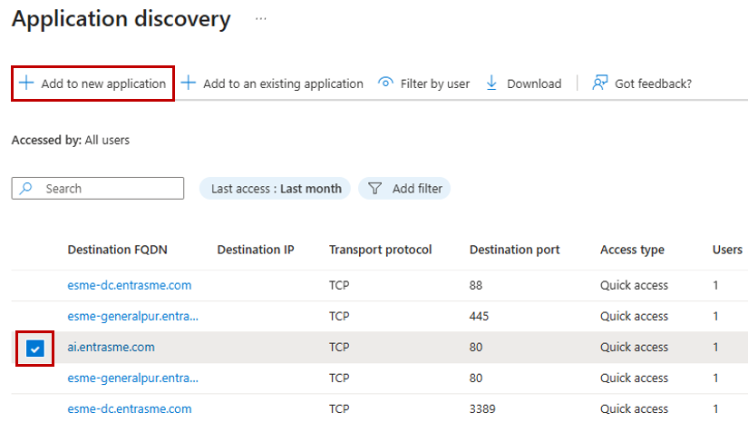
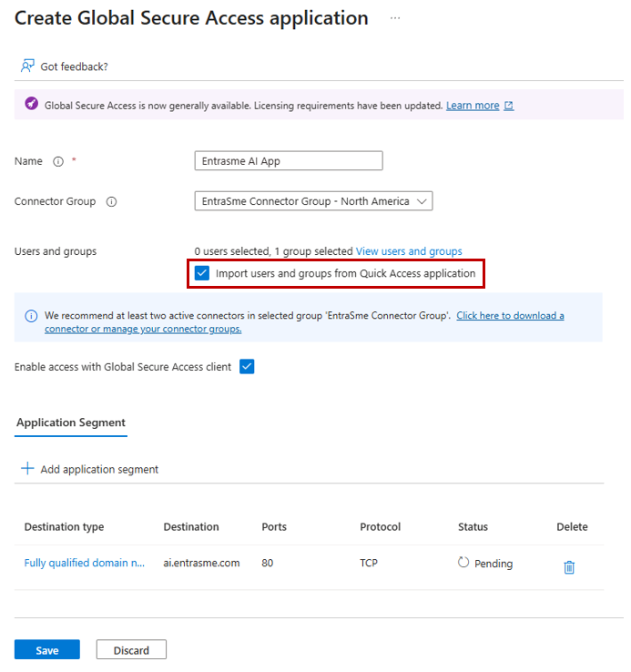

# Tutorial: Per-app access segmentation

With Quick Access, you can quickly onboard to Private Access by publishing wide IP ranges and wildcard FQDNs, similar to traditional VPN solutions. However, for better security, you should transition from Quick Access to per-application segmentation. This approach allows you to set user assignments per application and target specific applications with Conditional Access policies, following the principle of least privilege.

This tutorial walks through using Application Discovery to identify which application segments users access through Quick Access. You then create enterprise applications either from the app discovery table or manually, assign users and groups, and configure Conditional Access policies for granular control.

In this tutorial, you learn how to:
> [!div class="checklist"]
> - Review Application Discovery data to identify traffic patterns.
> - Create an enterprise application from Application Discovery.
> - Create an enterprise application manually.
> - Assign users and groups to the enterprise application.
> - Configure Conditional Access policies for granular control.
> - Verify per-app access through the Global Secure Access client.

## Prerequisites

- One or more users have been accessing private resources through Quick Access for at least 10-15 minutes to generate discovery data.

## Key concepts

> [!TIP]
> **From broad access to least privilege**
>
> Application Discovery helps administrators see which applications users access through Quick Access. By identifying usage patterns, you can create private applications with precise segmentation, ensuring users only get the access they need.
>
> This tutorial highlights the architectural turning point in Private Access adoption.
>
> - **Quick Access** is broad and migration-friendly.
> - **Per-app enterprise applications** are precise and security-focused.
> - **Application Discovery** makes the transition easy by reporting exactly who (users, devices) has been accessing what (FQDNs, IP addresses, ports, protocols).
>
> Why this is important:
>
> 1. You reduce lateral movement risk by limiting app scope.
> 1. You can apply Conditional Access to specific apps.
> 1. You can migrate app segments in phases instead of a "big bang" cutover.
>
> When an enterprise application network segment overlaps Quick Access, the enterprise application takes precedence for that resource. This enforces explicit assignment and prevents accidental overexposure.

## Kerberos SSO and Private Access

Though not in the scope of this tutorial, many organizations have Kerberos applications. At a high level, you enable Kerberos SSO by publishing your domain controllers (specific ports like 88 and 389) as an enterprise app and enabling private DNS resolution for domain controller discoverability. Once configured, clients can reach domain controllers to acquire Kerberos tickets. For more information, see [Configure Kerberos SSO](how-to-configure-kerberos-sso.md).

### Step 1: Review Application Discovery data

Application Discovery shows all application segments in Quick Access that users accessed via the Global Secure Access client in the last 30 days.

1. From the Microsoft Entra admin center, browse to **Global Secure Access** > **Applications** > **Application discovery**.
1. Review the list of discovered application segments.

   

1. Select a **Destination FQDN** or **Destination IP** to view more details.
1. Review the **Usage** tab to see a graph of users, transactions, devices, or bytes over time.
1. Select the **Users** tab to see which users accessed the application segment.

> [!TIP]
> Use the list of users to inform decisions about which users and groups to assign to the enterprise application once you create it.

### Step 2: Create an enterprise application from Application Discovery

Use Application Discovery to create a new enterprise application based on discovered application segments.

1. From the **Application discovery** list, select one or more application segments that correspond to an application you want to create (check the box next to the app).

   > [!NOTE]
   > **Application segment examples:**
   >
   > - **Single segment application**: A file server like `filesrv.contoso.com`, TCP, 445.
   > - **Multi-segment application**: Active Directory services spanning multiple ports and protocols on `dc1.contoso.com` and `dc2.contoso.com` (for example, configuring [Kerberos SSO for Private Access](how-to-configure-kerberos-sso.md)).

1. Select **Add to new application**.

   

1. In the **Create Global Secure Access application** screen:
   - Enter a **Name** for the application.
   - Select the appropriate **Connector Group**.
   - Assign users or groups to the application.
1. Select **Save**.

> [!NOTE]
> You can optionally check the box **Import users and groups from Quick Access application**. This option imports all users and groups assigned to the Quick Access app and assigns them to the new enterprise app. If you leave this unchecked, the application is created with no users or groups assigned. The admin must assign users as an extra step.
>
> 

> [!NOTE]
> Discovered application segments persist in the Application Discovery table until a user signs in to the new enterprise application and accesses the resource.

### Step 3: Create an enterprise application manually

You can also create an enterprise application manually without using Application Discovery.

#### Step 3.1: Create an enterprise application

1. Browse to **Global Secure Access** > **Applications** > **Enterprise applications**.
1. Select **New application**.
1. Enter a **Name** for the application (for example, "Internal Web Portal").
1. Select a **Connector group** from the dropdown menu.
1. Select **Add application segment**.
1. Select a **Destination type**.
1. Enter the **Ports** (separate multiple ports with commas, use hyphens for ranges, for example, `80, 443, 8080-8090`).
1. Select the **Protocol** (TCP, UDP, or both).
1. Select **Apply**, then select **Save**.

> [!NOTE]
> When an enterprise application's segment overlaps with Quick Access, the enterprise application takes precedence—including its assignment scope. For example, if Quick Access is assigned to the entire organization with a full network range, but an admin creates an enterprise application segment targeting a specific IP or port and assigns it only to an admin group, users not assigned to that enterprise application lose access, even though they're assigned to Quick Access which has an overlapping network segment.

#### Step 3.2: Assign users and groups

You must grant access to the enterprise application by assigning users or groups.

1. Browse to **Global Secure Access** > **Applications** > **Enterprise applications**.
1. Search for and select your application.
1. Select **Users and groups** from the side menu.
1. Select **Add user/group**.
1. Search for and select the users or groups who need access.
1. Select **Assign**.

### Step 4: Configure Conditional Access policies

Conditional Access policies for per-app access are configured at the application level.

1. Browse to **Global Secure Access** > **Applications** > **Enterprise applications**.
1. Select your application.
1. Select **Conditional Access** from the side menu.
1. Select **New policy**.
1. Configure the policy:
   - **Name**: Enter a descriptive name (for example, "Require MFA for Internal Portal").
   - **Users**: Select the users or groups or `All users`.
   - **Target resources**: Select the Private Access Enterprise application you created.
   - **Conditions**: Configure as needed (for example, device platforms, locations).
   - **Grant**: Select controls like **Require multifactor authentication** or **Require device to be marked as compliant**.
   - **Session (optional):** If you want an interactive MFA prompt and don't want MFA satisfied by the claim in the token, you can configure a **Sign-in frequency**.
1. Set **Enable policy** to **On**.
1. Select **Create**.

For more information, see [Apply Conditional Access policies to Private Access apps](how-to-target-resource-private-access-apps.md).

### Step 5: Verify per-app access

1. On your test device, right-click the **Global Secure Access** icon in the system tray.
1. Select **Advanced diagnostics**.
1. Select the **Traffic** tab, then select **Start collecting**.
1. Attempt to access the private application you configured.
1. Verify you can access the application successfully.
1. Verify the Conditional Access policy is applied.
1. Review the network traffic capture in **Advanced diagnostics** to confirm traffic is being tunneled through **Global Secure Access** (**Action** = **Tunnel**).

## What you learned

In this exercise, you accomplished the following:

1. **Used Application Discovery for segmentation planning** - Identified real traffic patterns before publishing apps.
1. **Created per-app enterprise applications** - Created enterprise applications for internal resources with explicit network segments.
1. **Controlled access through app assignments and Conditional Access** - Enforced per-app assignment and applied identity-driven Conditional Access policy to specific on-premises applications.
1. **Validated tunneled app behavior** - Confirmed that segmented resources are properly acquired and tunneled by the **Global Secure Access client**.

This is where Private Access shifts from VPN replacement to Zero Trust access control. In the next tutorial, you optimize user experience by allowing eligible app traffic to stay local when users are on trusted corporate networks.

## Next steps

> [!div class="nextstepaction"]
> [Configure Intelligent Local Access](tutorial-private-access-intelligent-local-access.md)
