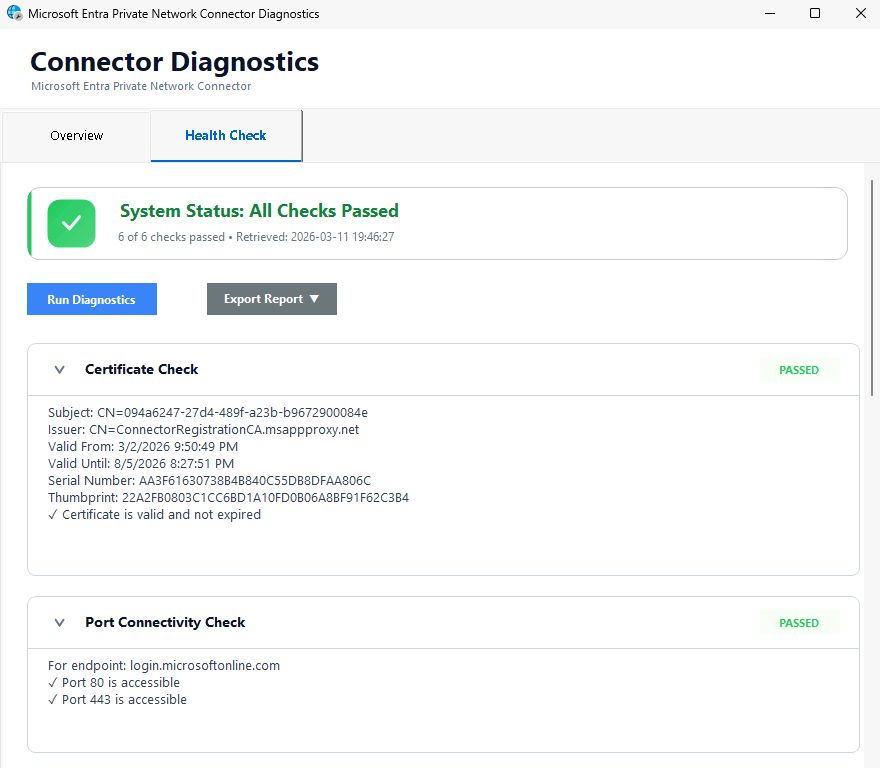
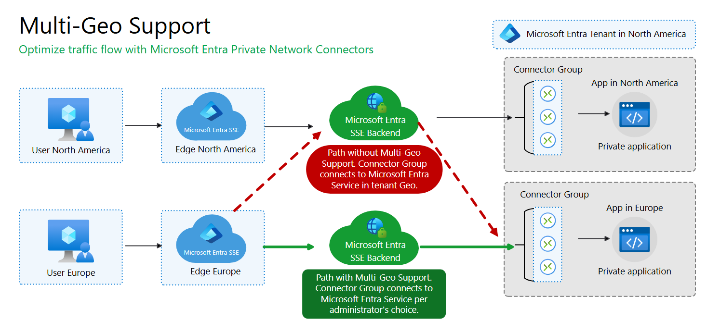

# Tutorial: Set up the Private Network Connector

This tutorial establishes the foundation for the remaining Private Access tutorials by confirming your prerequisite setup, installing the Private Network Connector on a server, validating registration in the portal, and moving the connector into a dedicated connector group.

In this tutorial, you learn how to:
> [!div class="checklist"]
> - Confirm environment and prerequisites
> - Install Private Network Connector software on the server
> - Verify connector registration in the Microsoft Entra admin center
> - Create a new connector group
> - Move the connector out of the default group

## Sample walkthrough video

This video covers most steps across the Private Access tutorials including connector installation, configuration of Quick Access, Private DNS, app segmentation, and client connectivity.

> [!VIDEO https://www.youtube.com/embed/MfcZ3zQhF-4]

## Background

Before enabling Microsoft Entra Private Access policies, you should validate your test environment and deploy at least one Private Network Connector. The connector is the outbound bridge between Microsoft's service edge and your internal resources.

## Key concepts

> [!TIP]
>
> **Why connector setup matters:** The Private Network Connector enables secure access to private resources without exposing inbound ports.
>
> - Connector servers initiate outbound connections to Microsoft.
> - Connector groups let you control routing and segment applications by environment.
> - Using a dedicated Connector group helps prevent unintended connectivity problems while simplifying future app segmentation and troubleshooting.

### Step 1: Confirm environment and prerequisites

1. Validate your server meets the [minimum requirements](how-to-configure-connectors.md#windows-server) such as .NET and TLS versions.
1. Confirm the server can access the [required outbound URLs](how-to-configure-connectors.md#allow-access-to-urls) on ports 80 and 443.
1. Confirm your connector server can reach the target private resource (for example, a file share or internal web app) and can resolve DNS for the target resource.

> [!IMPORTANT]
>
> You need both components before proceeding: (1) a connector server and (2) at least one private resource that the connector server can reach.

### Step 2: Install Private Network Connector software

1. Sign in to the [Microsoft Entra admin center](https://entra.microsoft.com/) as a **Global Secure Access Administrator**.
1. Browse to **Global Secure Access** > **Connect** > **Connectors and sensors**.
1. Select **Download connector service**.
1. Copy the downloaded package to your connector server (if you didn't download it directly).
1. On the connector server, run the installer with local administrator privileges.
1. Complete sign-in when prompted using an account with the Global Admin role.

> [!NOTE]
> 
> You only need Global Admin to register the first Private Network Connector in a tenant. Subsequent connector registrations can be done with the Application Admin role.

7. Wait for installation and registration to complete.
8. Run the Connector Diagnostics to verify proper connectivity and function.
   - Default location is `C:/Program Files/Microsoft Entra Private Network Connector/ConnectorDiagnosticsTool.exe`.

### Step 3: Verify connector registration in the Microsoft Entra admin center

1. Return to **Global Secure Access** > **Connect** > **Connectors and sensors**.
1. Confirm your newly installed connector appears in the connector list.
1. Verify connector health/status shows as **Active**.
1. Open the connector details and confirm key metadata such as:
   - Machine Name
   - External IP
   - Version

> [!NOTE]
>
> Newly registered connectors typically become visible in the portal within a couple of minutes but can take up to 10 minutes. Refresh the page if the connector doesn't appear immediately.

### Step 4: Create a new connector group

1. In **Global Secure Access** > **Connect** > **Connectors and sensors**, select **New Connector Group**.
1. Enter a name such as `PA-Tutorial-Connectors`.
1. Open the **Connectors** menu and check the box for the connector you just installed.
1. Select the appropriate Country/Region.
1. Select **Save**.

> [!TIP]
>
> You've now moved your new connector out of the default group. Newly added connector servers are always initially added to the default group. For this reason, it's best practice to *not* use it for application traffic. Newly added servers would immediately start serving traffic requests but might not have line of sight to the resource.

> [!NOTE]
> 
> Private Network Connectors support multi-geo configuration which allows traffic to be routed using the Microsoft Entra SSE backend that is regionally closer to the application. If you do not specify a Country/Region for the connector group it will use the tenant default which could impact network performance. Note that Quick Access does not support multi-geo and is always routed to the same regional backend as the tenant.
>
> 

## What you learned

In this exercise, you accomplished the following:

- **Validated your Private Access foundation** - You confirmed server/resource prerequisites.
- **Installed and registered a Private Network Connector** - You established the path for private app access without opening any inbound ports to your network.
- **Verified connector health in the Microsoft Entra admin center** - You confirmed the service can manage and monitor your connector.
- **Implemented connector group organization** - You created a custom connector group and moved the connector out of the Default connector group.

Connector readiness is a hard dependency for successful private resource access in all remaining tutorials.

## Next steps

> [!div class="nextstepaction"]
> [Enable Private Access traffic forwarding](tutorial-private-access-enable-traffic-forwarding.md)
