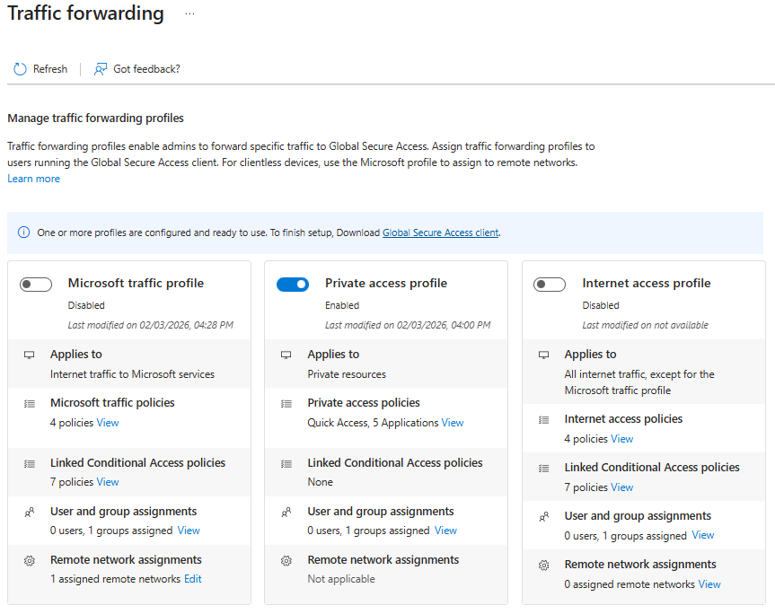
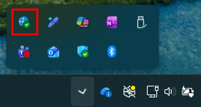
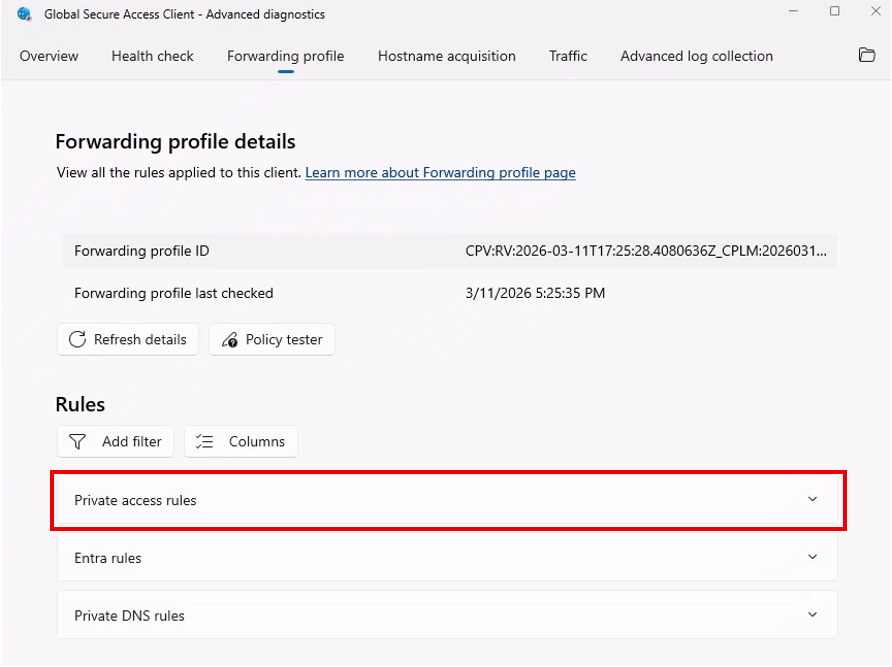

# Tutorial: Enable Private Access traffic forwarding

The Private Access traffic forwarding profile enables the Global Secure Access client to tunnel traffic to Microsoft's globally distributed cloud services which then broker a connection via Private Network Connectors. Enabling this traffic forwarding profile allows workers to securely access on-premises and private resources without a traditional VPN and can enforce Microsoft Entra ID-native access controls for both remote users and users who are in the office. With the features of Microsoft Entra Private Access, you can control which private resources can be accessed and provide Zero Trust Network Access (ZTNA) to your internal applications.

In this tutorial, you:

> [!div class="checklist"]
> - Enable the Private Access traffic forwarding profile
> - Assign users and groups to the profile
> - Install the GSA client on a Windows machine
> - Verify the Private Access profile is successfully configured

## Key concepts

> [!TIP]
> **Traffic forwarding profiles** tell the Global Secure Access client which traffic should be captured and sent to the service edge.
>
> For Private Access, this means:
> - Traffic destined for configured private applications can be tunneled through Microsoft's service.
> - Access decisions are based on user/app assignments in Microsoft Entra ID rather than broad network-level trust.
> - You can phase rollout by assigning specific users or groups.
>
> Enabling the forwarding profile alone doesn't grant access to every private resource. The resource's network destination still needs to be configured (Quick Access or enterprise application) and users must be assigned.

### Step 1: Enable the Private Access traffic forwarding profile

1. Sign in to the [Microsoft Entra admin center](https://entra.microsoft.com/) as a **Global Secure Access Administrator**.
1. Browse to **Global Secure Access > Connect > Traffic forwarding**.
1. Enable the **Private Access profile** by selecting the checkbox.

### Step 2: Assign users and groups

1. On the **Traffic forwarding** page, locate the **Private access profile** section.
1. Under **User and group assignments**, select **View**.
1. Under **Assigned**, select **0 users, 0 groups assigned**.
1. Select **Add user/group**.
1. Search for and select the users or groups you want to include.
1. Select **Assign**.

> [!NOTE]
> For POC testing, consider creating a dedicated security group containing only your test users. 



> [!NOTE]
> With the Private Access profile enabled and assigned to users, the GSA client can capture traffic for configured private destinations. Traffic is evaluated by Global Secure Access policies and then brokered through the Private Network Connector to the target internal resource. However, at this point there are no apps configured with network segments so nothing happens. Configure your first app in the next tutorial.

### Step 3: Install the GSA client

1. Download the GSA client for Windows 11 from one of these links OR using this [sample PowerShell script](scripts/powershell-windows-client-install-proof-of-concept.md).
   - For standard Windows 11 machines use `https://aka.ms/GlobalSecureAccess-Windows`
   - For ARM-based Windows 11 machines use `https://aka.ms/GlobalSecureAccess-WindowsOnArm`
1. Run the downloaded installer and complete the setup wizard.
1. Verify the GSA client icon appears in the Windows system tray.



> [!NOTE]
> If you installed the client without using the [sample PowerShell script](scripts/powershell-windows-client-install-proof-of-concept.md) and you plan to test MFA on an RDP connection, be sure to increase the `TimeoutTcpDirectConnection` value in your device's registry to at least 60 seconds to avoid timeout errors. If you wish to do so manually you can run the following:
> ```
> function Test-IsAdmin {
>   $id = [Security.Principal.WindowsIdentity]::GetCurrent()
>   $pr = New-Object Security.Principal.WindowsPrincipal($id)
>   return $pr.IsInRole([Security.Principal.WindowsBuiltInRole]::Administrator)
> }
> if (-not (Test-IsAdmin)) {
>   Write-Host "This script must be run as Administrator." -ForegroundColor Red
>   exit 1
> }
>
> $key   = "HKLM:\Software\Microsoft\Terminal Server Client"
> $name  = "TimeoutTcpDirectConnection"
> $value = 60
>
> if (-not (Test-Path $key)) {
>    New-Item -Path $key -Force | Out-Null
> }
>
> Set-ItemProperty -Path $key -Name $name -Value $value -Type DWord
> Write-Host "Set $key\$name = $value" -ForegroundColor Green
> ```

### Step 4: Verify results (Private Access checks)

1. Right-click the GSA tray icon and select **Advanced Diagnostics**.
1. Open **Forwarding profile**.
1. Confirm the **Private access** profile is present for the signed-in user.

   

   > [!TIP]
   > Since no applications with network segments are configured yet, the rules in the Private Access profile are empty. This is expected until private resources are configured in later tutorials.

1. Optionally review the **Health check** tab and confirm there are no critical client connectivity issues.

> [!TIP]
> The GSA client automatically checks for traffic forwarding profile updates every 5 minutes. You can see the latest check time in the **Forwarding profile** tab. If recent changes aren't shown yet, wait a few minutes and refresh.

## What you learned

In this exercise, you accomplished the following:

- **Enabled the Private Access forwarding profile** - This activated the client path for private-resource traffic.
- **Scoped who receives the profile** - You learned how to assign users/groups for controlled rollout.
- **Installed and validated the GSA client** - You confirmed the client can receive Private Access forwarding configuration.

With the Private Access forwarding profile enabled, client traffic to private apps will be tunneled securely to its destination.

## Next steps

> [!div class="nextstepaction"]
> [Configure Quick Access for VPN replacement](tutorial-private-access-vpn-replacement.md)
