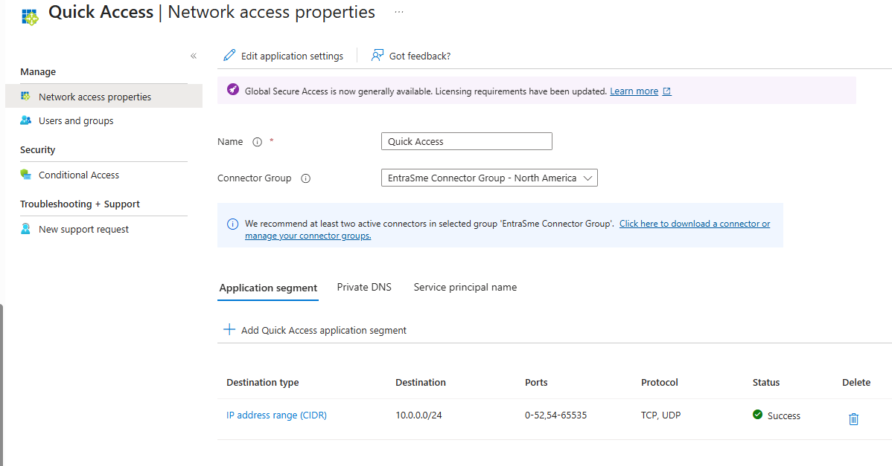
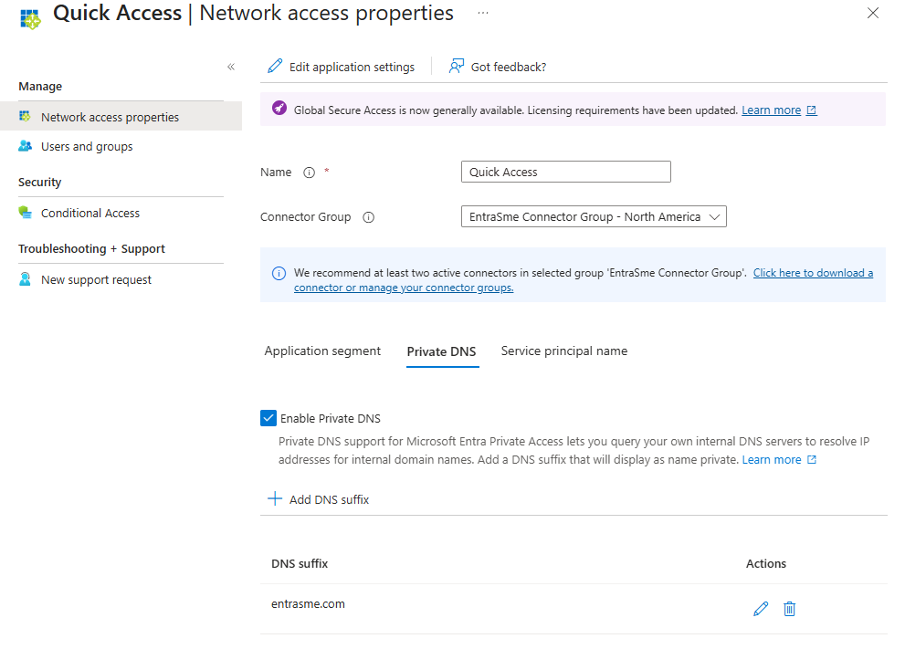
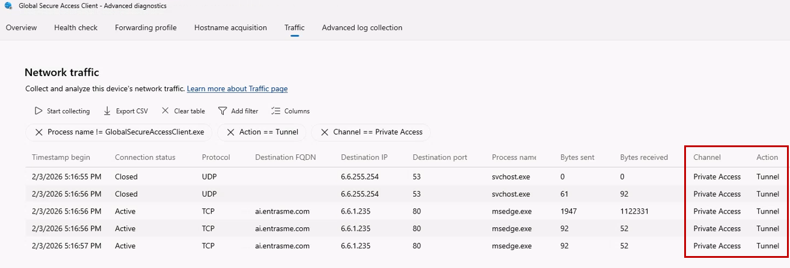

# Tutorial: VPN replacement with Quick Access

Microsoft Entra Private Access provides a modern alternative to traditional VPN solutions. Quick Access allows you to configure Private Access to provide equivalent access to what a VPN normally provides. If you are currently using a VPN and want a seamless way to transition off of VPN, Quick Access is a great place to start. Quick Access also will feed traffic telemetry into the Application Discovery report, providing insights into who is accessing what resources. This is very useful if you don't have an up-to-date inventory of all your on-premises resources. 

In this tutorial, you learn how to:
> [!div class="checklist"]
> - Configure Quick Access for VPN-like connectivity
> - Add private DNS suffixes
> - Assign users and groups to the Quick Access app
> - Verify remote access through the Global Secure Access client

## Key concepts

> [!TIP]
> **Quick Access** is the fastest way to onboard to Private Access because it is intended to publish broad network segments (IP ranges/FQDN patterns) instead of individually modeled apps. Captured traffic can then be populated in the Application discovery report and can easily be transferred to an individual enterprise app. This will be covered in detail in the next tutorial **Per-app access segmentation**.
>
> Why teams start here:
> - Faster migration from legacy VPN because access remains the same as the VPN.
> - Useful interim step before moving to least-privilege per-app segmentation.
>
> How traffic flows at a high level:
> `User Device → GSA Client → Microsoft Service Edge → Private Network Connector → Internal Resource`
>
> Private DNS suffixes ensure only relevant private name resolution is redirected, avoiding unnecessary tunneling of public DNS traffic.

## Objective

In this tutorial, you configure Quick Access to provide broad network access to on-premises resources by adding network subnets, configuring private DNS, and assigning users and groups.

> [!NOTE]
> If you don't want to publish an entire network segment (for example, you're not replacing a VPN), you can jump ahead to [Step 3 in Tutorial: Segment access with per-app assignments](tutorial-private-access-app-segmentation.md#step-3-create-an-enterprise-application-manually).

## Prerequisites

- Network subnets where on-premises resources are located (for example, `10.0.0.0/16` or `10.1.2.0/24,10.1.3.0/24`)
- Private Network Connector with access to these IP ranges

## Task steps

1. Configure Quick Access
1. Add private DNS suffixes
1. Assign users and groups
1. Verify remote access

### Step 1: Configure Quick Access

1. Sign in to the [Microsoft Entra admin center](https://entra.microsoft.com).
1. Browse to **Global Secure Access** > **Applications** > **Quick access**.
1. Enter a **name** for the Quick Access app such as `Quick Access`.
1. Select the **Connector group** created in the connector setup tutorial from the dropdown menu.
1. Select **Save** to create your Quick Access app without any network segments configured yet.
1. Navigate to **Quick Access** > **Network access properties**.
1. Select **Create application segment** and enter the following:
    - **Destination type:** Select **IP address range (CIDR)**
    - **Starting address:** Enter the network starting address (for example, `10.0.0.0`)
    - **Network mask:** Enter the CIDR of your network (for example, `/24`)
    - **Ports:** `0-52,54-65535`
    - **Protocol:** Select the checkboxes for **TCP** and **UDP**

   > [!NOTE]
   > All ports are included for tunneling except port 53, which is for DNS. Private DNS is configured later to tunnel only the DNS traffic that's needed.

1. Select **Apply**.

   

1. Select **Save**.

### Step 2: Add private DNS suffixes

Add DNS suffixes to use for private DNS. These should include all DNS suffixes required for on-premises access, most notably the Active Directory forest name.

1. In the Quick Access app under **Network access properties**, select the **Private DNS** tab.
1. Select the **Enable Private DNS** checkbox.
1. Select **Add DNS suffix**.
1. Enter one or more DNS suffixes, then select **Add**.

   

   > [!TIP]
   >
   > Once Private DNS is configured, any DNS queries for a fully qualified domain name (FQDN) that ends with the matching suffixes from client devices are sent to the DNS proxy at a GSA edge for resolution. If a cached result is available, DNS responses are returned to the clients. Otherwise, the DNS proxy forwards the request to the Connector, which sends the DNS query to its DNS server for resolution. The Connector then passes the responses back to the edge, which returns the query to the client. The GSA client then assigns a synthetic IP address, and returns it back to the application. The synthetic IP is used to steer the application traffic to GSA edges.
   >
   > For a deeper dive to understand how Private DNS works, refer to [Learn about private DNS for Quick Access and per-app access](/entra/global-secure-access/concept-private-name-resolution).

1. Select **Save**.

### Step 3: Assign users and groups

When you configure Quick Access, a new enterprise app is created on your behalf. Grant access to the Quick Access app by assigning users and/or groups to the app.

1. From the Quick Access app, select **Users and groups**.
1. Select **Add user/group**.
1. Assign one or more users or groups to the app, then select **Assign**.

> [!NOTE]
> Users must be directly assigned to the app or to the group assigned to the app. Nested groups aren't supported.

> [!TIP]
> Conditional Access policies can be applied to the Quick Access app. Keep in mind that this will include DNS queries if Private DNS is configured. This is generally safe but you should avoid requiring MFA with a sign-in frequency on Quick Access to avoid unanticipated MFA prompts triggered by DNS queries.

### Step 4: Verify remote access

Once you have your Quick Access app configured, your private resources added, and users assigned to the app, you can attempt to access a private resource. Examples include internal websites, SMB file shares, or RDP access to internal servers. To verify the traffic is being tunneled, do the following:

1. Right-click the **Global Secure Access** icon in your system tray.
1. Select **Advanced diagnostics**, then either select **Yes** or sign in with local admin credentials.
1. Select the **Traffic** tab.
1. Select **Start collecting**.

   > [!NOTE]
   > This begins a network capture so you can see which traffic is being tunneled versus bypassed.

1. Attempt to access your internal application.
1. Verify you can access the app successfully.
1. In **Advanced diagnostics**, select **Stop collecting**.
1. Review the network traffic capture to confirm the traffic is being tunneled through **Global Secure Access**.

   

> [!TIP]
> You can modify the filters in the **Network traffic** tab. There are also several default filters to consider. For example, if you want to see all traffic to identify if the GSA client is bypassing (not tunneling) specific traffic, clear the default filter `Action == Tunnel`.

## Troubleshooting tips

If accessing your app fails, check the following:

1. **Verify traffic forwarding profile assignment**: Ensure your user is assigned to the Private Access traffic forwarding profile.
1. **Verify Quick Access app assignment**: Ensure your user is assigned to the Quick Access app.
1. **Confirm network segment is received**: In **Advanced diagnostics**, select the **Forwarding profile** tab. Expand the **Private access rules** and verify your network segment is populated. The client automatically pulls the latest ruleset every 5 minutes.
1. **Check Connector server access**: Verify that the Connector machine has access to the service you want to publish and that it can resolve the DNS names.

For more information on troubleshooting, refer to [Troubleshoot app access issues with Global Secure Access](/entra/global-secure-access/troubleshoot-app-access).

## What you learned

In this exercise, you accomplished the following:

- **Configured Quick Access for broad network connectivity** - You published a private network segment in the Quick Access app and configured an IP range segment.
- **Set up Private DNS behavior** - You configured specific DNS suffixes so private name resolution works for internal resources.
- **Assigned users to the generated enterprise app** - You controlled who can use the Quick Access configuration.
- **Validated tunnel behavior on the client** - You confirmed traffic flow using Advanced Diagnostics.

Quick Access helps you transition users off VPN quickly while keeping operational continuity. Treat Quick Access as a migration bridge. Move high-value apps to per-app segmentation for stronger least-privilege control and app-specific Conditional Access.

## Next steps

> [!div class="nextstepaction"]
> [Configure per-app access segmentation](tutorial-private-access-app-segmentation.md)
